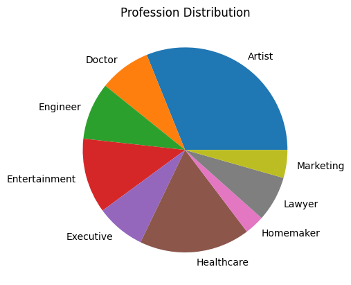
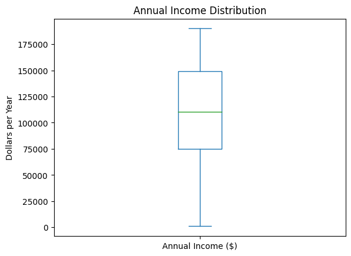
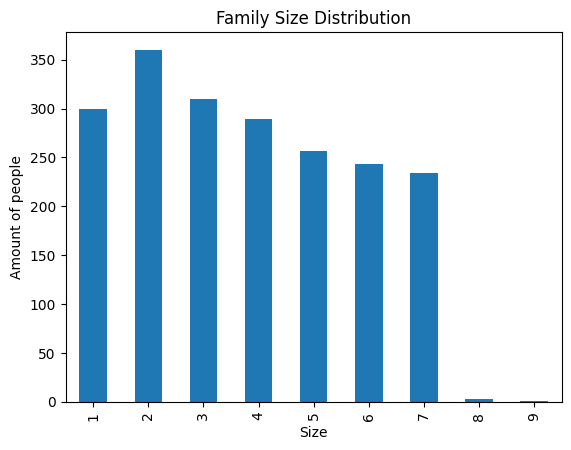
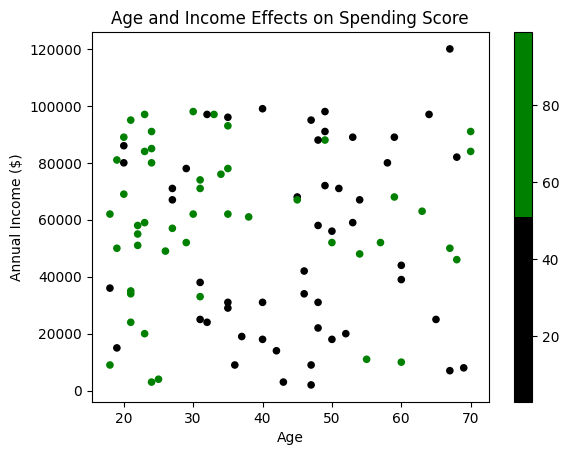
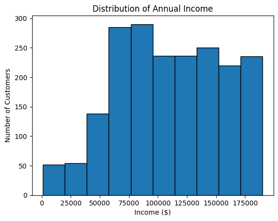
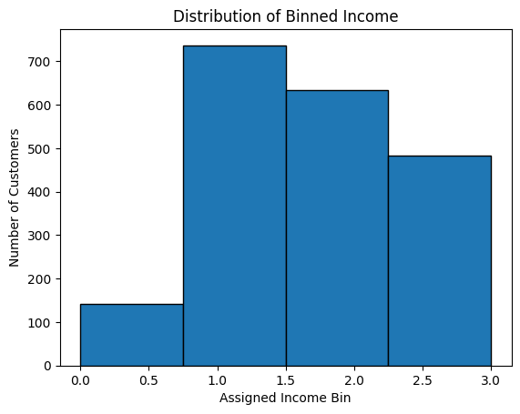
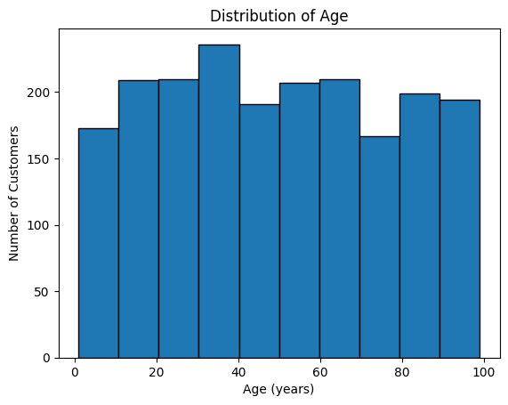
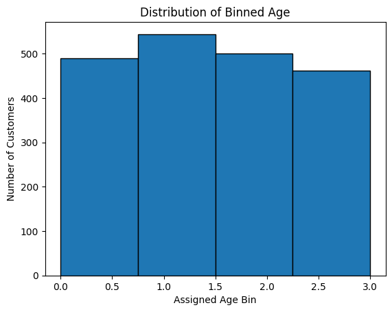
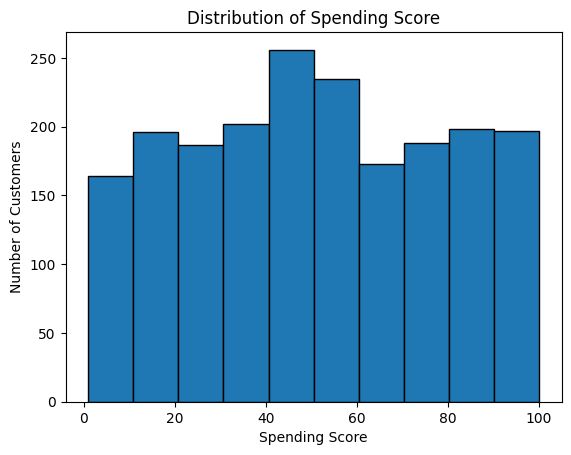
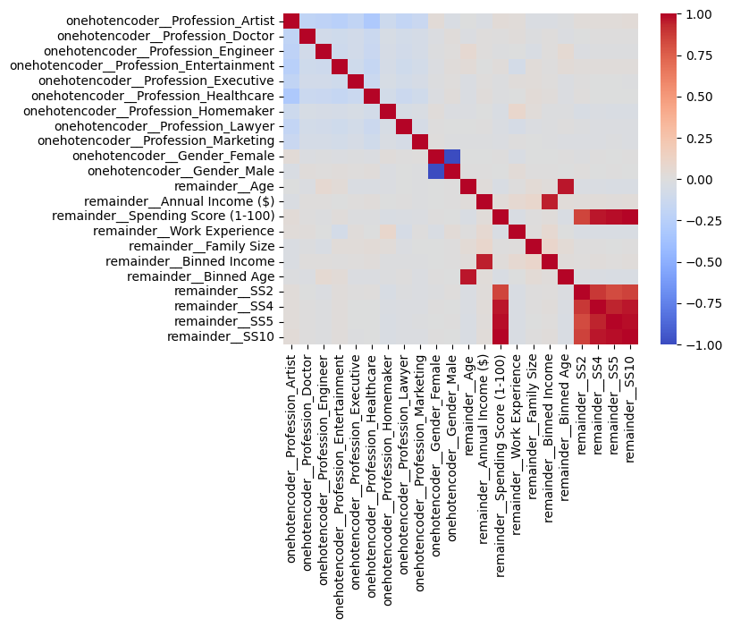

---
jupyter:
  colab:
  kernelspec:
    display_name: Python 3
    name: python3
  language_info:
    name: python
  nbformat: 4
  nbformat_minor: 0
---

::: {.cell .markdown id="FeWDOpbVkACl"}
# ML Project: Customer Spending Score
:::

::: {.cell .code id="QS3V5LGzHilF"}
``` python
# Names: Rahul Maligi, Ben Gonzales, Macy Huang, Tiffany Kao
```
:::

::: {.cell .markdown id="OfhZpA6eH8Xu"}
#Data Preprocessing
:::

::: {.cell .markdown id="9Mro1JrSkIwQ"}
Data Cleaning and Exploration
:::

::: {.cell .code id="w4sSELSJHuVL"}
``` python
#Imports
import pandas as pd
import numpy as np
import matplotlib.pyplot as plt
import matplotlib.colors as mcolors
from sklearn.preprocessing import StandardScaler, OneHotEncoder
from sklearn.model_selection import GridSearchCV, cross_val_predict
from sklearn.pipeline import Pipeline
from sklearn.compose import make_column_transformer
from sklearn.tree import DecisionTreeClassifier
from sklearn.model_selection import cross_val_score
from sklearn.ensemble import RandomForestClassifier, AdaBoostClassifier
from sklearn.metrics import classification_report, mean_squared_error, r2_score
from sklearn.linear_model import LinearRegression
from sklearn.model_selection import train_test_split
from sklearn.preprocessing import StandardScaler
from sklearn.cluster import KMeans
from sklearn.decomposition import PCA
from sklearn.pipeline import Pipeline
from sklearn.feature_selection import SelectKBest, f_classif, RFE
from sklearn.linear_model import LogisticRegression
from sklearn.naive_bayes import GaussianNB
from sklearn.metrics import accuracy_score, confusion_matrix, mean_absolute_error
from sklearn.neighbors import KNeighborsClassifier
from sklearn.svm import SVC

import seaborn
from IPython.core.interactiveshell import InteractiveShell
InteractiveShell.ast_node_interactivity = "all"

%matplotlib inline
```
:::

::: {.cell .code colab="{\"base_uri\":\"https://localhost:8080/\",\"height\":206}" id="jB2bm8OVkHGu" outputId="1294c58e-ca19-4051-dee0-f0eb2ff7be47"}
``` python
#import dataset, and show head
df = pd.read_csv('Customers.csv')
df.head()
```

::: {.output .execute_result execution_count="52"}
```{=html}

  <div id="df-ba60a0a4-41c9-47fd-b548-552dc2356664">
    <div class="colab-df-container">
      <div>
<style scoped>
    .dataframe tbody tr th:only-of-type {
        vertical-align: middle;
    }

    .dataframe tbody tr th {
        vertical-align: top;
    }

    .dataframe thead th {
        text-align: right;
    }
</style>
<table border="1" class="dataframe">
  <thead>
    <tr style="text-align: right;">
      <th></th>
      <th>CustomerID</th>
      <th>Gender</th>
      <th>Age</th>
      <th>Annual Income ($)</th>
      <th>Spending Score (1-100)</th>
      <th>Profession</th>
      <th>Work Experience</th>
      <th>Family Size</th>
    </tr>
  </thead>
  <tbody>
    <tr>
      <th>0</th>
      <td>1</td>
      <td>Male</td>
      <td>19</td>
      <td>15000</td>
      <td>39</td>
      <td>Healthcare</td>
      <td>1</td>
      <td>4</td>
    </tr>
    <tr>
      <th>1</th>
      <td>2</td>
      <td>Male</td>
      <td>21</td>
      <td>35000</td>
      <td>81</td>
      <td>Engineer</td>
      <td>3</td>
      <td>3</td>
    </tr>
    <tr>
      <th>2</th>
      <td>3</td>
      <td>Female</td>
      <td>20</td>
      <td>86000</td>
      <td>6</td>
      <td>Engineer</td>
      <td>1</td>
      <td>1</td>
    </tr>
    <tr>
      <th>3</th>
      <td>4</td>
      <td>Female</td>
      <td>23</td>
      <td>59000</td>
      <td>77</td>
      <td>Lawyer</td>
      <td>0</td>
      <td>2</td>
    </tr>
    <tr>
      <th>4</th>
      <td>5</td>
      <td>Female</td>
      <td>31</td>
      <td>38000</td>
      <td>40</td>
      <td>Entertainment</td>
      <td>2</td>
      <td>6</td>
    </tr>
  </tbody>
</table>
</div>
      <button class="colab-df-convert" onclick="convertToInteractive('df-ba60a0a4-41c9-47fd-b548-552dc2356664')"
              title="Convert this dataframe to an interactive table."
              style="display:none;">
        
  <svg xmlns="http://www.w3.org/2000/svg" height="24px"viewBox="0 0 24 24"
       width="24px">
    <path d="M0 0h24v24H0V0z" fill="none"/>
    <path d="M18.56 5.44l.94 2.06.94-2.06 2.06-.94-2.06-.94-.94-2.06-.94 2.06-2.06.94zm-11 1L8.5 8.5l.94-2.06 2.06-.94-2.06-.94L8.5 2.5l-.94 2.06-2.06.94zm10 10l.94 2.06.94-2.06 2.06-.94-2.06-.94-.94-2.06-.94 2.06-2.06.94z"/><path d="M17.41 7.96l-1.37-1.37c-.4-.4-.92-.59-1.43-.59-.52 0-1.04.2-1.43.59L10.3 9.45l-7.72 7.72c-.78.78-.78 2.05 0 2.83L4 21.41c.39.39.9.59 1.41.59.51 0 1.02-.2 1.41-.59l7.78-7.78 2.81-2.81c.8-.78.8-2.07 0-2.86zM5.41 20L4 18.59l7.72-7.72 1.47 1.35L5.41 20z"/>
  </svg>
      </button>
      
  <style>
    .colab-df-container {
      display:flex;
      flex-wrap:wrap;
      gap: 12px;
    }

    .colab-df-convert {
      background-color: #E8F0FE;
      border: none;
      border-radius: 50%;
      cursor: pointer;
      display: none;
      fill: #1967D2;
      height: 32px;
      padding: 0 0 0 0;
      width: 32px;
    }

    .colab-df-convert:hover {
      background-color: #E2EBFA;
      box-shadow: 0px 1px 2px rgba(60, 64, 67, 0.3), 0px 1px 3px 1px rgba(60, 64, 67, 0.15);
      fill: #174EA6;
    }

    [theme=dark] .colab-df-convert {
      background-color: #3B4455;
      fill: #D2E3FC;
    }

    [theme=dark] .colab-df-convert:hover {
      background-color: #434B5C;
      box-shadow: 0px 1px 3px 1px rgba(0, 0, 0, 0.15);
      filter: drop-shadow(0px 1px 2px rgba(0, 0, 0, 0.3));
      fill: #FFFFFF;
    }
  </style>

      <script>
        const buttonEl =
          document.querySelector('#df-ba60a0a4-41c9-47fd-b548-552dc2356664 button.colab-df-convert');
        buttonEl.style.display =
          google.colab.kernel.accessAllowed ? 'block' : 'none';

        async function convertToInteractive(key) {
          const element = document.querySelector('#df-ba60a0a4-41c9-47fd-b548-552dc2356664');
          const dataTable =
            await google.colab.kernel.invokeFunction('convertToInteractive',
                                                     [key], {});
          if (!dataTable) return;

          const docLinkHtml = 'Like what you see? Visit the ' +
            '<a target="_blank" href=https://colab.research.google.com/notebooks/data_table.ipynb>data table notebook</a>'
            + ' to learn more about interactive tables.';
          element.innerHTML = '';
          dataTable['output_type'] = 'display_data';
          await google.colab.output.renderOutput(dataTable, element);
          const docLink = document.createElement('div');
          docLink.innerHTML = docLinkHtml;
          element.appendChild(docLink);
        }
      </script>
    </div>
  </div>
  
```
:::
:::

::: {.cell .markdown id="QagphCkikq3Y"}
#Data Exploration
:::

::: {.cell .code colab="{\"base_uri\":\"https://localhost:8080/\"}" id="Q1jiyCqbc6MY" outputId="5b7899ed-d325-4501-98c6-51f8932317f6"}
``` python
#How many missing values do we have?
print("Missing values in Gender: ", (df['Gender'] == 0).sum())
print("Missing values in Age: ", (df['Age'] == 0).sum())
print("Missing values in Annual Income: ", (df['Annual Income ($)'] == 0).sum())
print("Missing values in Spending Score: ", (df['Spending Score (1-100)'] == 0).sum())
print("Missing values in Profession: ", (df['Profession'] == 0).sum())
#note for Work experience, some people have 0 years of experience and some are missing values
#This will be determined in the next few cells
print("Missing values in Work Experience: ", (df['Work Experience'] == 0).sum())
print("Missing values in Family Size: ", (df['Family Size'] == 0).sum())
```

::: {.output .stream .stdout}
    Missing values in Gender:  0
    Missing values in Age:  24
    Missing values in Annual Income:  2
    Missing values in Spending Score:  2
    Missing values in Profession:  0
    Missing values in Work Experience:  431
    Missing values in Family Size:  0
:::
:::

::: {.cell .code colab="{\"base_uri\":\"https://localhost:8080/\",\"height\":206}" id="Vn0ckp6cj4Ju" outputId="f36da854-ab78-40b8-c178-7df8d7b35639"}
``` python
#Imputation for Profession
#replace 0s with nan for the rest of the data set
#Use forward fill 
df.replace(0,np.nan, inplace=True)
df["Profession"].ffill(inplace=True)
df.head()
```

::: {.output .execute_result execution_count="54"}
```{=html}

  <div id="df-212e33b0-eb2c-49da-9a52-5a68efa572b0">
    <div class="colab-df-container">
      <div>
<style scoped>
    .dataframe tbody tr th:only-of-type {
        vertical-align: middle;
    }

    .dataframe tbody tr th {
        vertical-align: top;
    }

    .dataframe thead th {
        text-align: right;
    }
</style>
<table border="1" class="dataframe">
  <thead>
    <tr style="text-align: right;">
      <th></th>
      <th>CustomerID</th>
      <th>Gender</th>
      <th>Age</th>
      <th>Annual Income ($)</th>
      <th>Spending Score (1-100)</th>
      <th>Profession</th>
      <th>Work Experience</th>
      <th>Family Size</th>
    </tr>
  </thead>
  <tbody>
    <tr>
      <th>0</th>
      <td>1</td>
      <td>Male</td>
      <td>19.0</td>
      <td>15000.0</td>
      <td>39.0</td>
      <td>Healthcare</td>
      <td>1.0</td>
      <td>4</td>
    </tr>
    <tr>
      <th>1</th>
      <td>2</td>
      <td>Male</td>
      <td>21.0</td>
      <td>35000.0</td>
      <td>81.0</td>
      <td>Engineer</td>
      <td>3.0</td>
      <td>3</td>
    </tr>
    <tr>
      <th>2</th>
      <td>3</td>
      <td>Female</td>
      <td>20.0</td>
      <td>86000.0</td>
      <td>6.0</td>
      <td>Engineer</td>
      <td>1.0</td>
      <td>1</td>
    </tr>
    <tr>
      <th>3</th>
      <td>4</td>
      <td>Female</td>
      <td>23.0</td>
      <td>59000.0</td>
      <td>77.0</td>
      <td>Lawyer</td>
      <td>NaN</td>
      <td>2</td>
    </tr>
    <tr>
      <th>4</th>
      <td>5</td>
      <td>Female</td>
      <td>31.0</td>
      <td>38000.0</td>
      <td>40.0</td>
      <td>Entertainment</td>
      <td>2.0</td>
      <td>6</td>
    </tr>
  </tbody>
</table>
</div>
      <button class="colab-df-convert" onclick="convertToInteractive('df-212e33b0-eb2c-49da-9a52-5a68efa572b0')"
              title="Convert this dataframe to an interactive table."
              style="display:none;">
        
  <svg xmlns="http://www.w3.org/2000/svg" height="24px"viewBox="0 0 24 24"
       width="24px">
    <path d="M0 0h24v24H0V0z" fill="none"/>
    <path d="M18.56 5.44l.94 2.06.94-2.06 2.06-.94-2.06-.94-.94-2.06-.94 2.06-2.06.94zm-11 1L8.5 8.5l.94-2.06 2.06-.94-2.06-.94L8.5 2.5l-.94 2.06-2.06.94zm10 10l.94 2.06.94-2.06 2.06-.94-2.06-.94-.94-2.06-.94 2.06-2.06.94z"/><path d="M17.41 7.96l-1.37-1.37c-.4-.4-.92-.59-1.43-.59-.52 0-1.04.2-1.43.59L10.3 9.45l-7.72 7.72c-.78.78-.78 2.05 0 2.83L4 21.41c.39.39.9.59 1.41.59.51 0 1.02-.2 1.41-.59l7.78-7.78 2.81-2.81c.8-.78.8-2.07 0-2.86zM5.41 20L4 18.59l7.72-7.72 1.47 1.35L5.41 20z"/>
  </svg>
      </button>
      
  <style>
    .colab-df-container {
      display:flex;
      flex-wrap:wrap;
      gap: 12px;
    }

    .colab-df-convert {
      background-color: #E8F0FE;
      border: none;
      border-radius: 50%;
      cursor: pointer;
      display: none;
      fill: #1967D2;
      height: 32px;
      padding: 0 0 0 0;
      width: 32px;
    }

    .colab-df-convert:hover {
      background-color: #E2EBFA;
      box-shadow: 0px 1px 2px rgba(60, 64, 67, 0.3), 0px 1px 3px 1px rgba(60, 64, 67, 0.15);
      fill: #174EA6;
    }

    [theme=dark] .colab-df-convert {
      background-color: #3B4455;
      fill: #D2E3FC;
    }

    [theme=dark] .colab-df-convert:hover {
      background-color: #434B5C;
      box-shadow: 0px 1px 3px 1px rgba(0, 0, 0, 0.15);
      filter: drop-shadow(0px 1px 2px rgba(0, 0, 0, 0.3));
      fill: #FFFFFF;
    }
  </style>

      <script>
        const buttonEl =
          document.querySelector('#df-212e33b0-eb2c-49da-9a52-5a68efa572b0 button.colab-df-convert');
        buttonEl.style.display =
          google.colab.kernel.accessAllowed ? 'block' : 'none';

        async function convertToInteractive(key) {
          const element = document.querySelector('#df-212e33b0-eb2c-49da-9a52-5a68efa572b0');
          const dataTable =
            await google.colab.kernel.invokeFunction('convertToInteractive',
                                                     [key], {});
          if (!dataTable) return;

          const docLinkHtml = 'Like what you see? Visit the ' +
            '<a target="_blank" href=https://colab.research.google.com/notebooks/data_table.ipynb>data table notebook</a>'
            + ' to learn more about interactive tables.';
          element.innerHTML = '';
          dataTable['output_type'] = 'display_data';
          await google.colab.output.renderOutput(dataTable, element);
          const docLink = document.createElement('div');
          docLink.innerHTML = docLinkHtml;
          element.appendChild(docLink);
        }
      </script>
    </div>
  </div>
  
```
:::
:::

::: {.cell .code colab="{\"base_uri\":\"https://localhost:8080/\",\"height\":677}" id="GdOdLAjWLr3F" outputId="e93c188d-e403-4627-d916-37b45089bd4f"}
``` python
#Imputation for Work experience
#fill in with the median for Profession group
ex_maps = {}
for i in df.groupby('Profession')['Work Experience']:
    ex_maps[i[0]] = i[1].median()
df['Work Experience'] = df['Work Experience'].fillna(df['Profession'].map(ex_maps))
df.head(20)
```

::: {.output .execute_result execution_count="55"}
```{=html}

  <div id="df-3b0ff4f5-7c4b-4eea-9a70-e1073c7870c0">
    <div class="colab-df-container">
      <div>
<style scoped>
    .dataframe tbody tr th:only-of-type {
        vertical-align: middle;
    }

    .dataframe tbody tr th {
        vertical-align: top;
    }

    .dataframe thead th {
        text-align: right;
    }
</style>
<table border="1" class="dataframe">
  <thead>
    <tr style="text-align: right;">
      <th></th>
      <th>CustomerID</th>
      <th>Gender</th>
      <th>Age</th>
      <th>Annual Income ($)</th>
      <th>Spending Score (1-100)</th>
      <th>Profession</th>
      <th>Work Experience</th>
      <th>Family Size</th>
    </tr>
  </thead>
  <tbody>
    <tr>
      <th>0</th>
      <td>1</td>
      <td>Male</td>
      <td>19.0</td>
      <td>15000.0</td>
      <td>39.0</td>
      <td>Healthcare</td>
      <td>1.0</td>
      <td>4</td>
    </tr>
    <tr>
      <th>1</th>
      <td>2</td>
      <td>Male</td>
      <td>21.0</td>
      <td>35000.0</td>
      <td>81.0</td>
      <td>Engineer</td>
      <td>3.0</td>
      <td>3</td>
    </tr>
    <tr>
      <th>2</th>
      <td>3</td>
      <td>Female</td>
      <td>20.0</td>
      <td>86000.0</td>
      <td>6.0</td>
      <td>Engineer</td>
      <td>1.0</td>
      <td>1</td>
    </tr>
    <tr>
      <th>3</th>
      <td>4</td>
      <td>Female</td>
      <td>23.0</td>
      <td>59000.0</td>
      <td>77.0</td>
      <td>Lawyer</td>
      <td>4.0</td>
      <td>2</td>
    </tr>
    <tr>
      <th>4</th>
      <td>5</td>
      <td>Female</td>
      <td>31.0</td>
      <td>38000.0</td>
      <td>40.0</td>
      <td>Entertainment</td>
      <td>2.0</td>
      <td>6</td>
    </tr>
    <tr>
      <th>5</th>
      <td>6</td>
      <td>Female</td>
      <td>22.0</td>
      <td>58000.0</td>
      <td>76.0</td>
      <td>Artist</td>
      <td>5.0</td>
      <td>2</td>
    </tr>
    <tr>
      <th>6</th>
      <td>7</td>
      <td>Female</td>
      <td>35.0</td>
      <td>31000.0</td>
      <td>6.0</td>
      <td>Healthcare</td>
      <td>1.0</td>
      <td>3</td>
    </tr>
    <tr>
      <th>7</th>
      <td>8</td>
      <td>Female</td>
      <td>23.0</td>
      <td>84000.0</td>
      <td>94.0</td>
      <td>Healthcare</td>
      <td>1.0</td>
      <td>3</td>
    </tr>
    <tr>
      <th>8</th>
      <td>9</td>
      <td>Male</td>
      <td>64.0</td>
      <td>97000.0</td>
      <td>3.0</td>
      <td>Engineer</td>
      <td>5.0</td>
      <td>3</td>
    </tr>
    <tr>
      <th>9</th>
      <td>10</td>
      <td>Female</td>
      <td>30.0</td>
      <td>98000.0</td>
      <td>72.0</td>
      <td>Artist</td>
      <td>1.0</td>
      <td>4</td>
    </tr>
    <tr>
      <th>10</th>
      <td>11</td>
      <td>Male</td>
      <td>67.0</td>
      <td>7000.0</td>
      <td>14.0</td>
      <td>Engineer</td>
      <td>1.0</td>
      <td>3</td>
    </tr>
    <tr>
      <th>11</th>
      <td>12</td>
      <td>Female</td>
      <td>35.0</td>
      <td>93000.0</td>
      <td>99.0</td>
      <td>Healthcare</td>
      <td>4.0</td>
      <td>4</td>
    </tr>
    <tr>
      <th>12</th>
      <td>13</td>
      <td>Female</td>
      <td>58.0</td>
      <td>80000.0</td>
      <td>15.0</td>
      <td>Executive</td>
      <td>5.0</td>
      <td>5</td>
    </tr>
    <tr>
      <th>13</th>
      <td>14</td>
      <td>Female</td>
      <td>24.0</td>
      <td>91000.0</td>
      <td>77.0</td>
      <td>Lawyer</td>
      <td>1.0</td>
      <td>1</td>
    </tr>
    <tr>
      <th>14</th>
      <td>15</td>
      <td>Male</td>
      <td>37.0</td>
      <td>19000.0</td>
      <td>13.0</td>
      <td>Doctor</td>
      <td>5.0</td>
      <td>1</td>
    </tr>
    <tr>
      <th>15</th>
      <td>16</td>
      <td>Male</td>
      <td>22.0</td>
      <td>51000.0</td>
      <td>79.0</td>
      <td>Healthcare</td>
      <td>1.0</td>
      <td>2</td>
    </tr>
    <tr>
      <th>16</th>
      <td>17</td>
      <td>Female</td>
      <td>35.0</td>
      <td>29000.0</td>
      <td>35.0</td>
      <td>Homemaker</td>
      <td>9.0</td>
      <td>5</td>
    </tr>
    <tr>
      <th>17</th>
      <td>18</td>
      <td>Male</td>
      <td>20.0</td>
      <td>89000.0</td>
      <td>66.0</td>
      <td>Healthcare</td>
      <td>1.0</td>
      <td>6</td>
    </tr>
    <tr>
      <th>18</th>
      <td>19</td>
      <td>Male</td>
      <td>52.0</td>
      <td>20000.0</td>
      <td>29.0</td>
      <td>Entertainment</td>
      <td>1.0</td>
      <td>4</td>
    </tr>
    <tr>
      <th>19</th>
      <td>20</td>
      <td>Female</td>
      <td>35.0</td>
      <td>62000.0</td>
      <td>98.0</td>
      <td>Artist</td>
      <td>5.0</td>
      <td>1</td>
    </tr>
  </tbody>
</table>
</div>
      <button class="colab-df-convert" onclick="convertToInteractive('df-3b0ff4f5-7c4b-4eea-9a70-e1073c7870c0')"
              title="Convert this dataframe to an interactive table."
              style="display:none;">
        
  <svg xmlns="http://www.w3.org/2000/svg" height="24px"viewBox="0 0 24 24"
       width="24px">
    <path d="M0 0h24v24H0V0z" fill="none"/>
    <path d="M18.56 5.44l.94 2.06.94-2.06 2.06-.94-2.06-.94-.94-2.06-.94 2.06-2.06.94zm-11 1L8.5 8.5l.94-2.06 2.06-.94-2.06-.94L8.5 2.5l-.94 2.06-2.06.94zm10 10l.94 2.06.94-2.06 2.06-.94-2.06-.94-.94-2.06-.94 2.06-2.06.94z"/><path d="M17.41 7.96l-1.37-1.37c-.4-.4-.92-.59-1.43-.59-.52 0-1.04.2-1.43.59L10.3 9.45l-7.72 7.72c-.78.78-.78 2.05 0 2.83L4 21.41c.39.39.9.59 1.41.59.51 0 1.02-.2 1.41-.59l7.78-7.78 2.81-2.81c.8-.78.8-2.07 0-2.86zM5.41 20L4 18.59l7.72-7.72 1.47 1.35L5.41 20z"/>
  </svg>
      </button>
      
  <style>
    .colab-df-container {
      display:flex;
      flex-wrap:wrap;
      gap: 12px;
    }

    .colab-df-convert {
      background-color: #E8F0FE;
      border: none;
      border-radius: 50%;
      cursor: pointer;
      display: none;
      fill: #1967D2;
      height: 32px;
      padding: 0 0 0 0;
      width: 32px;
    }

    .colab-df-convert:hover {
      background-color: #E2EBFA;
      box-shadow: 0px 1px 2px rgba(60, 64, 67, 0.3), 0px 1px 3px 1px rgba(60, 64, 67, 0.15);
      fill: #174EA6;
    }

    [theme=dark] .colab-df-convert {
      background-color: #3B4455;
      fill: #D2E3FC;
    }

    [theme=dark] .colab-df-convert:hover {
      background-color: #434B5C;
      box-shadow: 0px 1px 3px 1px rgba(0, 0, 0, 0.15);
      filter: drop-shadow(0px 1px 2px rgba(0, 0, 0, 0.3));
      fill: #FFFFFF;
    }
  </style>

      <script>
        const buttonEl =
          document.querySelector('#df-3b0ff4f5-7c4b-4eea-9a70-e1073c7870c0 button.colab-df-convert');
        buttonEl.style.display =
          google.colab.kernel.accessAllowed ? 'block' : 'none';

        async function convertToInteractive(key) {
          const element = document.querySelector('#df-3b0ff4f5-7c4b-4eea-9a70-e1073c7870c0');
          const dataTable =
            await google.colab.kernel.invokeFunction('convertToInteractive',
                                                     [key], {});
          if (!dataTable) return;

          const docLinkHtml = 'Like what you see? Visit the ' +
            '<a target="_blank" href=https://colab.research.google.com/notebooks/data_table.ipynb>data table notebook</a>'
            + ' to learn more about interactive tables.';
          element.innerHTML = '';
          dataTable['output_type'] = 'display_data';
          await google.colab.output.renderOutput(dataTable, element);
          const docLink = document.createElement('div');
          docLink.innerHTML = docLinkHtml;
          element.appendChild(docLink);
        }
      </script>
    </div>
  </div>
  
```
:::
:::

::: {.cell .code colab="{\"base_uri\":\"https://localhost:8080/\",\"height\":677}" id="_nlTLi8FiFef" outputId="e88b2f9d-e3ab-4c33-8d01-e32227f44c26"}
``` python
#Since there are very few missing values in Annual Income and Spending score
#we can drop them
df = df[df['Annual Income ($)'] > 0]
df = df[df['Spending Score (1-100)'] > 0]

#Missing values in ages will be imputed
#Fill in with the median age of the person's Profession category
age_maps = {}
for i in df.groupby('Profession')['Age']:
    age_maps[i[0]] = i[1].median()
df['Age'] = df['Age'].fillna(df['Profession'].map(age_maps))
df.head(20)
# print("Missing values in Age: ", (np.isnan(df['Age'])).sum())
```

::: {.output .execute_result execution_count="56"}
```{=html}

  <div id="df-10012995-35c3-4a20-a6c8-b410a8d440f5">
    <div class="colab-df-container">
      <div>
<style scoped>
    .dataframe tbody tr th:only-of-type {
        vertical-align: middle;
    }

    .dataframe tbody tr th {
        vertical-align: top;
    }

    .dataframe thead th {
        text-align: right;
    }
</style>
<table border="1" class="dataframe">
  <thead>
    <tr style="text-align: right;">
      <th></th>
      <th>CustomerID</th>
      <th>Gender</th>
      <th>Age</th>
      <th>Annual Income ($)</th>
      <th>Spending Score (1-100)</th>
      <th>Profession</th>
      <th>Work Experience</th>
      <th>Family Size</th>
    </tr>
  </thead>
  <tbody>
    <tr>
      <th>0</th>
      <td>1</td>
      <td>Male</td>
      <td>19.0</td>
      <td>15000.0</td>
      <td>39.0</td>
      <td>Healthcare</td>
      <td>1.0</td>
      <td>4</td>
    </tr>
    <tr>
      <th>1</th>
      <td>2</td>
      <td>Male</td>
      <td>21.0</td>
      <td>35000.0</td>
      <td>81.0</td>
      <td>Engineer</td>
      <td>3.0</td>
      <td>3</td>
    </tr>
    <tr>
      <th>2</th>
      <td>3</td>
      <td>Female</td>
      <td>20.0</td>
      <td>86000.0</td>
      <td>6.0</td>
      <td>Engineer</td>
      <td>1.0</td>
      <td>1</td>
    </tr>
    <tr>
      <th>3</th>
      <td>4</td>
      <td>Female</td>
      <td>23.0</td>
      <td>59000.0</td>
      <td>77.0</td>
      <td>Lawyer</td>
      <td>4.0</td>
      <td>2</td>
    </tr>
    <tr>
      <th>4</th>
      <td>5</td>
      <td>Female</td>
      <td>31.0</td>
      <td>38000.0</td>
      <td>40.0</td>
      <td>Entertainment</td>
      <td>2.0</td>
      <td>6</td>
    </tr>
    <tr>
      <th>5</th>
      <td>6</td>
      <td>Female</td>
      <td>22.0</td>
      <td>58000.0</td>
      <td>76.0</td>
      <td>Artist</td>
      <td>5.0</td>
      <td>2</td>
    </tr>
    <tr>
      <th>6</th>
      <td>7</td>
      <td>Female</td>
      <td>35.0</td>
      <td>31000.0</td>
      <td>6.0</td>
      <td>Healthcare</td>
      <td>1.0</td>
      <td>3</td>
    </tr>
    <tr>
      <th>7</th>
      <td>8</td>
      <td>Female</td>
      <td>23.0</td>
      <td>84000.0</td>
      <td>94.0</td>
      <td>Healthcare</td>
      <td>1.0</td>
      <td>3</td>
    </tr>
    <tr>
      <th>8</th>
      <td>9</td>
      <td>Male</td>
      <td>64.0</td>
      <td>97000.0</td>
      <td>3.0</td>
      <td>Engineer</td>
      <td>5.0</td>
      <td>3</td>
    </tr>
    <tr>
      <th>9</th>
      <td>10</td>
      <td>Female</td>
      <td>30.0</td>
      <td>98000.0</td>
      <td>72.0</td>
      <td>Artist</td>
      <td>1.0</td>
      <td>4</td>
    </tr>
    <tr>
      <th>10</th>
      <td>11</td>
      <td>Male</td>
      <td>67.0</td>
      <td>7000.0</td>
      <td>14.0</td>
      <td>Engineer</td>
      <td>1.0</td>
      <td>3</td>
    </tr>
    <tr>
      <th>11</th>
      <td>12</td>
      <td>Female</td>
      <td>35.0</td>
      <td>93000.0</td>
      <td>99.0</td>
      <td>Healthcare</td>
      <td>4.0</td>
      <td>4</td>
    </tr>
    <tr>
      <th>12</th>
      <td>13</td>
      <td>Female</td>
      <td>58.0</td>
      <td>80000.0</td>
      <td>15.0</td>
      <td>Executive</td>
      <td>5.0</td>
      <td>5</td>
    </tr>
    <tr>
      <th>13</th>
      <td>14</td>
      <td>Female</td>
      <td>24.0</td>
      <td>91000.0</td>
      <td>77.0</td>
      <td>Lawyer</td>
      <td>1.0</td>
      <td>1</td>
    </tr>
    <tr>
      <th>14</th>
      <td>15</td>
      <td>Male</td>
      <td>37.0</td>
      <td>19000.0</td>
      <td>13.0</td>
      <td>Doctor</td>
      <td>5.0</td>
      <td>1</td>
    </tr>
    <tr>
      <th>15</th>
      <td>16</td>
      <td>Male</td>
      <td>22.0</td>
      <td>51000.0</td>
      <td>79.0</td>
      <td>Healthcare</td>
      <td>1.0</td>
      <td>2</td>
    </tr>
    <tr>
      <th>16</th>
      <td>17</td>
      <td>Female</td>
      <td>35.0</td>
      <td>29000.0</td>
      <td>35.0</td>
      <td>Homemaker</td>
      <td>9.0</td>
      <td>5</td>
    </tr>
    <tr>
      <th>17</th>
      <td>18</td>
      <td>Male</td>
      <td>20.0</td>
      <td>89000.0</td>
      <td>66.0</td>
      <td>Healthcare</td>
      <td>1.0</td>
      <td>6</td>
    </tr>
    <tr>
      <th>18</th>
      <td>19</td>
      <td>Male</td>
      <td>52.0</td>
      <td>20000.0</td>
      <td>29.0</td>
      <td>Entertainment</td>
      <td>1.0</td>
      <td>4</td>
    </tr>
    <tr>
      <th>19</th>
      <td>20</td>
      <td>Female</td>
      <td>35.0</td>
      <td>62000.0</td>
      <td>98.0</td>
      <td>Artist</td>
      <td>5.0</td>
      <td>1</td>
    </tr>
  </tbody>
</table>
</div>
      <button class="colab-df-convert" onclick="convertToInteractive('df-10012995-35c3-4a20-a6c8-b410a8d440f5')"
              title="Convert this dataframe to an interactive table."
              style="display:none;">
        
  <svg xmlns="http://www.w3.org/2000/svg" height="24px"viewBox="0 0 24 24"
       width="24px">
    <path d="M0 0h24v24H0V0z" fill="none"/>
    <path d="M18.56 5.44l.94 2.06.94-2.06 2.06-.94-2.06-.94-.94-2.06-.94 2.06-2.06.94zm-11 1L8.5 8.5l.94-2.06 2.06-.94-2.06-.94L8.5 2.5l-.94 2.06-2.06.94zm10 10l.94 2.06.94-2.06 2.06-.94-2.06-.94-.94-2.06-.94 2.06-2.06.94z"/><path d="M17.41 7.96l-1.37-1.37c-.4-.4-.92-.59-1.43-.59-.52 0-1.04.2-1.43.59L10.3 9.45l-7.72 7.72c-.78.78-.78 2.05 0 2.83L4 21.41c.39.39.9.59 1.41.59.51 0 1.02-.2 1.41-.59l7.78-7.78 2.81-2.81c.8-.78.8-2.07 0-2.86zM5.41 20L4 18.59l7.72-7.72 1.47 1.35L5.41 20z"/>
  </svg>
      </button>
      
  <style>
    .colab-df-container {
      display:flex;
      flex-wrap:wrap;
      gap: 12px;
    }

    .colab-df-convert {
      background-color: #E8F0FE;
      border: none;
      border-radius: 50%;
      cursor: pointer;
      display: none;
      fill: #1967D2;
      height: 32px;
      padding: 0 0 0 0;
      width: 32px;
    }

    .colab-df-convert:hover {
      background-color: #E2EBFA;
      box-shadow: 0px 1px 2px rgba(60, 64, 67, 0.3), 0px 1px 3px 1px rgba(60, 64, 67, 0.15);
      fill: #174EA6;
    }

    [theme=dark] .colab-df-convert {
      background-color: #3B4455;
      fill: #D2E3FC;
    }

    [theme=dark] .colab-df-convert:hover {
      background-color: #434B5C;
      box-shadow: 0px 1px 3px 1px rgba(0, 0, 0, 0.15);
      filter: drop-shadow(0px 1px 2px rgba(0, 0, 0, 0.3));
      fill: #FFFFFF;
    }
  </style>

      <script>
        const buttonEl =
          document.querySelector('#df-10012995-35c3-4a20-a6c8-b410a8d440f5 button.colab-df-convert');
        buttonEl.style.display =
          google.colab.kernel.accessAllowed ? 'block' : 'none';

        async function convertToInteractive(key) {
          const element = document.querySelector('#df-10012995-35c3-4a20-a6c8-b410a8d440f5');
          const dataTable =
            await google.colab.kernel.invokeFunction('convertToInteractive',
                                                     [key], {});
          if (!dataTable) return;

          const docLinkHtml = 'Like what you see? Visit the ' +
            '<a target="_blank" href=https://colab.research.google.com/notebooks/data_table.ipynb>data table notebook</a>'
            + ' to learn more about interactive tables.';
          element.innerHTML = '';
          dataTable['output_type'] = 'display_data';
          await google.colab.output.renderOutput(dataTable, element);
          const docLink = document.createElement('div');
          docLink.innerHTML = docLinkHtml;
          element.appendChild(docLink);
        }
      </script>
    </div>
  </div>
  
```
:::
:::

::: {.cell .code colab="{\"base_uri\":\"https://localhost:8080/\",\"height\":293}" id="KmxPIgc-Yet1" outputId="492732e8-856c-4bf6-e320-87b518456dd0"}
``` python
#Correlation Matrix
df.corr()
```

::: {.output .stream .stderr}
    <ipython-input-57-025dc37326d1>:2: FutureWarning: The default value of numeric_only in DataFrame.corr is deprecated. In a future version, it will default to False. Select only valid columns or specify the value of numeric_only to silence this warning.
      df.corr()
:::

::: {.output .execute_result execution_count="57"}
```{=html}

  <div id="df-9d310342-b4d6-4e1c-9484-e0eeb7d60197">
    <div class="colab-df-container">
      <div>
<style scoped>
    .dataframe tbody tr th:only-of-type {
        vertical-align: middle;
    }

    .dataframe tbody tr th {
        vertical-align: top;
    }

    .dataframe thead th {
        text-align: right;
    }
</style>
<table border="1" class="dataframe">
  <thead>
    <tr style="text-align: right;">
      <th></th>
      <th>CustomerID</th>
      <th>Age</th>
      <th>Annual Income ($)</th>
      <th>Spending Score (1-100)</th>
      <th>Work Experience</th>
      <th>Family Size</th>
    </tr>
  </thead>
  <tbody>
    <tr>
      <th>CustomerID</th>
      <td>1.000000</td>
      <td>0.072588</td>
      <td>0.325392</td>
      <td>0.017925</td>
      <td>0.075995</td>
      <td>0.161185</td>
    </tr>
    <tr>
      <th>Age</th>
      <td>0.072588</td>
      <td>1.000000</td>
      <td>0.022146</td>
      <td>-0.037727</td>
      <td>0.000828</td>
      <td>0.042727</td>
    </tr>
    <tr>
      <th>Annual Income ($)</th>
      <td>0.325392</td>
      <td>0.022146</td>
      <td>1.000000</td>
      <td>0.023987</td>
      <td>0.069951</td>
      <td>0.093419</td>
    </tr>
    <tr>
      <th>Spending Score (1-100)</th>
      <td>0.017925</td>
      <td>-0.037727</td>
      <td>0.023987</td>
      <td>1.000000</td>
      <td>-0.031378</td>
      <td>0.005291</td>
    </tr>
    <tr>
      <th>Work Experience</th>
      <td>0.075995</td>
      <td>0.000828</td>
      <td>0.069951</td>
      <td>-0.031378</td>
      <td>1.000000</td>
      <td>0.015472</td>
    </tr>
    <tr>
      <th>Family Size</th>
      <td>0.161185</td>
      <td>0.042727</td>
      <td>0.093419</td>
      <td>0.005291</td>
      <td>0.015472</td>
      <td>1.000000</td>
    </tr>
  </tbody>
</table>
</div>
      <button class="colab-df-convert" onclick="convertToInteractive('df-9d310342-b4d6-4e1c-9484-e0eeb7d60197')"
              title="Convert this dataframe to an interactive table."
              style="display:none;">
        
  <svg xmlns="http://www.w3.org/2000/svg" height="24px"viewBox="0 0 24 24"
       width="24px">
    <path d="M0 0h24v24H0V0z" fill="none"/>
    <path d="M18.56 5.44l.94 2.06.94-2.06 2.06-.94-2.06-.94-.94-2.06-.94 2.06-2.06.94zm-11 1L8.5 8.5l.94-2.06 2.06-.94-2.06-.94L8.5 2.5l-.94 2.06-2.06.94zm10 10l.94 2.06.94-2.06 2.06-.94-2.06-.94-.94-2.06-.94 2.06-2.06.94z"/><path d="M17.41 7.96l-1.37-1.37c-.4-.4-.92-.59-1.43-.59-.52 0-1.04.2-1.43.59L10.3 9.45l-7.72 7.72c-.78.78-.78 2.05 0 2.83L4 21.41c.39.39.9.59 1.41.59.51 0 1.02-.2 1.41-.59l7.78-7.78 2.81-2.81c.8-.78.8-2.07 0-2.86zM5.41 20L4 18.59l7.72-7.72 1.47 1.35L5.41 20z"/>
  </svg>
      </button>
      
  <style>
    .colab-df-container {
      display:flex;
      flex-wrap:wrap;
      gap: 12px;
    }

    .colab-df-convert {
      background-color: #E8F0FE;
      border: none;
      border-radius: 50%;
      cursor: pointer;
      display: none;
      fill: #1967D2;
      height: 32px;
      padding: 0 0 0 0;
      width: 32px;
    }

    .colab-df-convert:hover {
      background-color: #E2EBFA;
      box-shadow: 0px 1px 2px rgba(60, 64, 67, 0.3), 0px 1px 3px 1px rgba(60, 64, 67, 0.15);
      fill: #174EA6;
    }

    [theme=dark] .colab-df-convert {
      background-color: #3B4455;
      fill: #D2E3FC;
    }

    [theme=dark] .colab-df-convert:hover {
      background-color: #434B5C;
      box-shadow: 0px 1px 3px 1px rgba(0, 0, 0, 0.15);
      filter: drop-shadow(0px 1px 2px rgba(0, 0, 0, 0.3));
      fill: #FFFFFF;
    }
  </style>

      <script>
        const buttonEl =
          document.querySelector('#df-9d310342-b4d6-4e1c-9484-e0eeb7d60197 button.colab-df-convert');
        buttonEl.style.display =
          google.colab.kernel.accessAllowed ? 'block' : 'none';

        async function convertToInteractive(key) {
          const element = document.querySelector('#df-9d310342-b4d6-4e1c-9484-e0eeb7d60197');
          const dataTable =
            await google.colab.kernel.invokeFunction('convertToInteractive',
                                                     [key], {});
          if (!dataTable) return;

          const docLinkHtml = 'Like what you see? Visit the ' +
            '<a target="_blank" href=https://colab.research.google.com/notebooks/data_table.ipynb>data table notebook</a>'
            + ' to learn more about interactive tables.';
          element.innerHTML = '';
          dataTable['output_type'] = 'display_data';
          await google.colab.output.renderOutput(dataTable, element);
          const docLink = document.createElement('div');
          docLink.innerHTML = docLinkHtml;
          element.appendChild(docLink);
        }
      </script>
    </div>
  </div>
  
```
:::
:::

::: {.cell .markdown id="K8vB26KCF3_1"}
The correlation matrix shows that all of the features have incredibly
low correlation. First we will take a closer look at our inital data, to
see if we can find any trends or reasons for such low correlation. Later
some feature engineering will be implemented in hopes of improvement.
However, because the inital dataset used has such low correlation, The
accuracies of our models are also impacted.
:::

::: {.cell .code colab="{\"base_uri\":\"https://localhost:8080/\",\"height\":446}" id="KofQZQ5pL0OT" outputId="922a7c48-e75a-4528-af61-a5f319b8c96a"}
``` python
#Distribution of Professions
occ = df.groupby('Profession')
occ.size().plot.pie(title='Profession Distribution')
plt.show()
```

::: {.output .execute_result execution_count="58"}
    <Axes: title={'center': 'Profession Distribution'}>
:::

::: {.output .display_data}

:::
:::

::: {.cell .markdown id="faaaZeRqF_Ul"}
The most common Profession is Artist, followed by Healthcare and
Entertainment. The data seems to be fairly well distruibuted.
:::

::: {.cell .code colab="{\"base_uri\":\"https://localhost:8080/\",\"height\":470}" id="LzNTOMEWI8EG" outputId="6210420f-3124-49b3-f135-7a27abbf7980"}
``` python
#Outliers?  Income
income = df['Annual Income ($)']
income.plot(kind='box', title='Annual Income Distribution', 
ylabel='Dollars per Year')

print("The average income is: ", income.mean())
```

::: {.output .execute_result execution_count="59"}
    <Axes: title={'center': 'Annual Income Distribution'}, ylabel='Dollars per Year'>
:::

::: {.output .stream .stdout}
    The average income is:  110891.10370741483
:::

::: {.output .display_data}

:::
:::

::: {.cell .markdown id="D6qJ0ImIGJWE"}
According to the box plot, there are no discernable outliers, and the
average income is around 110891.
:::

::: {.cell .code colab="{\"base_uri\":\"https://localhost:8080/\",\"height\":485}" id="jDs_Jq4UfUkL" outputId="e386dcf0-7bca-45e3-83b6-3be2abf4ac39"}
``` python
#Distribution of Family Sizes
#Family size of 9 would be a natural outlier
amount = df.groupby('Family Size').size()
ages = df['Family Size'].unique()
amount.plot(kind='bar', title='Family Size Distribution', xlabel = 'Size', 
ylabel='Amount of people')
plt.show()
```

::: {.output .execute_result execution_count="60"}
    <Axes: title={'center': 'Family Size Distribution'}, xlabel='Size', ylabel='Amount of people'>
:::

::: {.output .display_data}

:::
:::

::: {.cell .markdown id="WCkXsGrDGawU"}
There is a reasonably even distribution of family sizes. A family size
of 9 could be considered a natural outlier, but we chose to leave it in
as it doesn\'t have much of an effect on spending score.
:::

::: {.cell .code colab="{\"base_uri\":\"https://localhost:8080/\",\"height\":579}" id="L4X8N6fKgzgW" outputId="25f751a7-8e28-4787-e287-c2d00fca848e"}
``` python
#Compare and graph income, age, and spending score
hundred = df.head(100)
incomes = hundred.groupby('Spending Score (1-100)')

#Spending scores above 50 are green, below and including are black
hundred['Spending Score (1-100)'].replace(['<=50', '>50'],
                        [0, 1], inplace=True)
#plt.title("Age and Income Effects on Spending Score")
hundred.plot.scatter(x='Age', y='Annual Income ($)', 
                     title = "Age and Income Effects on Spending Score",
                     c=hundred['Spending Score (1-100)'],
            cmap = mcolors.ListedColormap(["black", "green"]))
```

::: {.output .stream .stderr}
    <ipython-input-61-36e6118006a9>:6: SettingWithCopyWarning: 
    A value is trying to be set on a copy of a slice from a DataFrame

    See the caveats in the documentation: https://pandas.pydata.org/pandas-docs/stable/user_guide/indexing.html#returning-a-view-versus-a-copy
      hundred['Spending Score (1-100)'].replace(['<=50', '>50'],
:::

::: {.output .execute_result execution_count="61"}
    <Axes: title={'center': 'Age and Income Effects on Spending Score'}, xlabel='Age', ylabel='Annual Income ($)'>
:::

::: {.output .display_data}

:::
:::

::: {.cell .markdown id="HMxbK6EvGrc9"}
No discernable pattern between age, income, and spending score. I
thought there\'d be a bit of correlation between age and income, however
there does not appear to be a pattern of any sort.
:::

::: {.cell .markdown id="YVSYWgWRkxZF"}
#Feature Engineering
:::

::: {.cell .markdown id="TFazRFyf94YE"}
We decided to bin some of the features to see if they would be easier to
predict as categorical features instead of numerical ones. This allowed
us to use the same accuracy metric across our models. For the sake of
experimentation, we also converted Spending Score, our target variable,
using a few bin sizes.
:::

::: {.cell .code colab="{\"base_uri\":\"https://localhost:8080/\",\"height\":1000}" id="7-JJi4yukKak" outputId="079842d7-1335-4762-a20a-f43cd3219091"}
``` python
# bin age, income, and spending score
df['Annual Income ($)'] = df['Annual Income ($)'].astype('int')
df['Annual Income ($)'].plot(kind="hist", edgecolor="black", grid=False)
plt.title("Distribution of Annual Income")
plt.xlabel("Income ($)")
plt.ylabel("Number of Customers")
plt.show()
bins=[50000 * x for x in range(5)]
df['Binned Income'] = pd.cut(df['Annual Income ($)'], bins, labels=False)
df['Binned Income'].plot(kind="hist", edgecolor="black", bins=4, grid=False)
plt.title("Distribution of Binned Income")
plt.xlabel("Assigned Income Bin")
plt.ylabel("Number of Customers")
plt.show()

#Bins for Age
df['Age'] = df['Age'].astype('int')
df['Age'].plot(kind="hist", edgecolor="black", grid=False)
plt.title("Distribution of Age")
plt.xlabel("Age (years)")
plt.ylabel("Number of Customers")
plt.show()
df['Binned Age'] = pd.cut(df['Age'], bins=[0, 25, 50, 75, 100], labels=False)
df['Binned Age'].plot(kind="hist", edgecolor="black", bins=4, grid=False)
plt.title("Distribution of Binned Age")
plt.xlabel("Assigned Age Bin")
plt.ylabel("Number of Customers")
plt.show()

#Bins for spending score
df['Spending Score (1-100)'] = df['Spending Score (1-100)'].astype('int')
df['SS2'] = pd.cut(df['Spending Score (1-100)'], bins=[0, 50, 100], labels=False)
df['SS4'] = pd.cut(df['Spending Score (1-100)'], bins=[0, 25, 50, 75, 100], labels=False)
df['SS5'] = pd.cut(df['Spending Score (1-100)'], bins=[0, 20, 40, 60, 80, 100], labels=False)
df['SS10'] = pd.cut(df['Spending Score (1-100)'], bins=[0, 10, 20, 30, 40, 50, 60, 70, 80, 90, 100], labels=False)
df.head()
```

::: {.output .execute_result execution_count="62"}
    <Axes: ylabel='Frequency'>
:::

::: {.output .execute_result execution_count="62"}
    Text(0.5, 1.0, 'Distribution of Annual Income')
:::

::: {.output .execute_result execution_count="62"}
    Text(0.5, 0, 'Income ($)')
:::

::: {.output .execute_result execution_count="62"}
    Text(0, 0.5, 'Number of Customers')
:::

::: {.output .display_data}

:::

::: {.output .execute_result execution_count="62"}
    <Axes: ylabel='Frequency'>
:::

::: {.output .execute_result execution_count="62"}
    Text(0.5, 1.0, 'Distribution of Binned Income')
:::

::: {.output .execute_result execution_count="62"}
    Text(0.5, 0, 'Assigned Income Bin')
:::

::: {.output .execute_result execution_count="62"}
    Text(0, 0.5, 'Number of Customers')
:::

::: {.output .display_data}

:::

::: {.output .execute_result execution_count="62"}
    <Axes: ylabel='Frequency'>
:::

::: {.output .execute_result execution_count="62"}
    Text(0.5, 1.0, 'Distribution of Age')
:::

::: {.output .execute_result execution_count="62"}
    Text(0.5, 0, 'Age (years)')
:::

::: {.output .execute_result execution_count="62"}
    Text(0, 0.5, 'Number of Customers')
:::

::: {.output .display_data}

:::

::: {.output .execute_result execution_count="62"}
    <Axes: ylabel='Frequency'>
:::

::: {.output .execute_result execution_count="62"}
    Text(0.5, 1.0, 'Distribution of Binned Age')
:::

::: {.output .execute_result execution_count="62"}
    Text(0.5, 0, 'Assigned Age Bin')
:::

::: {.output .execute_result execution_count="62"}
    Text(0, 0.5, 'Number of Customers')
:::

::: {.output .display_data}

:::

::: {.output .execute_result execution_count="62"}
```{=html}

  <div id="df-4c356e27-49d2-486a-869e-e2164f76a75e">
    <div class="colab-df-container">
      <div>
<style scoped>
    .dataframe tbody tr th:only-of-type {
        vertical-align: middle;
    }

    .dataframe tbody tr th {
        vertical-align: top;
    }

    .dataframe thead th {
        text-align: right;
    }
</style>
<table border="1" class="dataframe">
  <thead>
    <tr style="text-align: right;">
      <th></th>
      <th>CustomerID</th>
      <th>Gender</th>
      <th>Age</th>
      <th>Annual Income ($)</th>
      <th>Spending Score (1-100)</th>
      <th>Profession</th>
      <th>Work Experience</th>
      <th>Family Size</th>
      <th>Binned Income</th>
      <th>Binned Age</th>
      <th>SS2</th>
      <th>SS4</th>
      <th>SS5</th>
      <th>SS10</th>
    </tr>
  </thead>
  <tbody>
    <tr>
      <th>0</th>
      <td>1</td>
      <td>Male</td>
      <td>19</td>
      <td>15000</td>
      <td>39</td>
      <td>Healthcare</td>
      <td>1.0</td>
      <td>4</td>
      <td>0</td>
      <td>0</td>
      <td>0</td>
      <td>1</td>
      <td>1</td>
      <td>3</td>
    </tr>
    <tr>
      <th>1</th>
      <td>2</td>
      <td>Male</td>
      <td>21</td>
      <td>35000</td>
      <td>81</td>
      <td>Engineer</td>
      <td>3.0</td>
      <td>3</td>
      <td>0</td>
      <td>0</td>
      <td>1</td>
      <td>3</td>
      <td>4</td>
      <td>8</td>
    </tr>
    <tr>
      <th>2</th>
      <td>3</td>
      <td>Female</td>
      <td>20</td>
      <td>86000</td>
      <td>6</td>
      <td>Engineer</td>
      <td>1.0</td>
      <td>1</td>
      <td>1</td>
      <td>0</td>
      <td>0</td>
      <td>0</td>
      <td>0</td>
      <td>0</td>
    </tr>
    <tr>
      <th>3</th>
      <td>4</td>
      <td>Female</td>
      <td>23</td>
      <td>59000</td>
      <td>77</td>
      <td>Lawyer</td>
      <td>4.0</td>
      <td>2</td>
      <td>1</td>
      <td>0</td>
      <td>1</td>
      <td>3</td>
      <td>3</td>
      <td>7</td>
    </tr>
    <tr>
      <th>4</th>
      <td>5</td>
      <td>Female</td>
      <td>31</td>
      <td>38000</td>
      <td>40</td>
      <td>Entertainment</td>
      <td>2.0</td>
      <td>6</td>
      <td>0</td>
      <td>1</td>
      <td>0</td>
      <td>1</td>
      <td>1</td>
      <td>3</td>
    </tr>
  </tbody>
</table>
</div>
      <button class="colab-df-convert" onclick="convertToInteractive('df-4c356e27-49d2-486a-869e-e2164f76a75e')"
              title="Convert this dataframe to an interactive table."
              style="display:none;">
        
  <svg xmlns="http://www.w3.org/2000/svg" height="24px"viewBox="0 0 24 24"
       width="24px">
    <path d="M0 0h24v24H0V0z" fill="none"/>
    <path d="M18.56 5.44l.94 2.06.94-2.06 2.06-.94-2.06-.94-.94-2.06-.94 2.06-2.06.94zm-11 1L8.5 8.5l.94-2.06 2.06-.94-2.06-.94L8.5 2.5l-.94 2.06-2.06.94zm10 10l.94 2.06.94-2.06 2.06-.94-2.06-.94-.94-2.06-.94 2.06-2.06.94z"/><path d="M17.41 7.96l-1.37-1.37c-.4-.4-.92-.59-1.43-.59-.52 0-1.04.2-1.43.59L10.3 9.45l-7.72 7.72c-.78.78-.78 2.05 0 2.83L4 21.41c.39.39.9.59 1.41.59.51 0 1.02-.2 1.41-.59l7.78-7.78 2.81-2.81c.8-.78.8-2.07 0-2.86zM5.41 20L4 18.59l7.72-7.72 1.47 1.35L5.41 20z"/>
  </svg>
      </button>
      
  <style>
    .colab-df-container {
      display:flex;
      flex-wrap:wrap;
      gap: 12px;
    }

    .colab-df-convert {
      background-color: #E8F0FE;
      border: none;
      border-radius: 50%;
      cursor: pointer;
      display: none;
      fill: #1967D2;
      height: 32px;
      padding: 0 0 0 0;
      width: 32px;
    }

    .colab-df-convert:hover {
      background-color: #E2EBFA;
      box-shadow: 0px 1px 2px rgba(60, 64, 67, 0.3), 0px 1px 3px 1px rgba(60, 64, 67, 0.15);
      fill: #174EA6;
    }

    [theme=dark] .colab-df-convert {
      background-color: #3B4455;
      fill: #D2E3FC;
    }

    [theme=dark] .colab-df-convert:hover {
      background-color: #434B5C;
      box-shadow: 0px 1px 3px 1px rgba(0, 0, 0, 0.15);
      filter: drop-shadow(0px 1px 2px rgba(0, 0, 0, 0.3));
      fill: #FFFFFF;
    }
  </style>

      <script>
        const buttonEl =
          document.querySelector('#df-4c356e27-49d2-486a-869e-e2164f76a75e button.colab-df-convert');
        buttonEl.style.display =
          google.colab.kernel.accessAllowed ? 'block' : 'none';

        async function convertToInteractive(key) {
          const element = document.querySelector('#df-4c356e27-49d2-486a-869e-e2164f76a75e');
          const dataTable =
            await google.colab.kernel.invokeFunction('convertToInteractive',
                                                     [key], {});
          if (!dataTable) return;

          const docLinkHtml = 'Like what you see? Visit the ' +
            '<a target="_blank" href=https://colab.research.google.com/notebooks/data_table.ipynb>data table notebook</a>'
            + ' to learn more about interactive tables.';
          element.innerHTML = '';
          dataTable['output_type'] = 'display_data';
          await google.colab.output.renderOutput(dataTable, element);
          const docLink = document.createElement('div');
          docLink.innerHTML = docLinkHtml;
          element.appendChild(docLink);
        }
      </script>
    </div>
  </div>
  
```
:::
:::

::: {.cell .markdown id="_HUINeWR-pRq"}
There were a few changes we had to make to the data - a couple features
were composed of categorical data so we one-hot encoded them. The
customer ID feature is just metadata and has no impact on an assigned
spending score we also decided to drop it.
:::

::: {.cell .code colab="{\"base_uri\":\"https://localhost:8080/\",\"height\":317}" id="XD0C0SOjkHfM" outputId="7e586a69-d61c-4c3a-928b-501932bfc261"}
``` python
# Drop irrelevant features, one-hot encode categorical features
# List of categorical data needed to be encoded
categorical_data = ["Profession", "Gender"]
# Encode data
transformer = make_column_transformer((OneHotEncoder(), categorical_data), remainder = 'passthrough')
transformed = transformer.fit_transform(df)
# Create transformed df
transformed_df = pd.DataFrame(transformed, columns=transformer.get_feature_names_out())
# Drop customer id
transformed_df = transformed_df.drop("remainder__CustomerID", axis=1)
# separate features from label
features = transformed_df.drop(["remainder__Spending Score (1-100)", "remainder__SS2", "remainder__SS4", "remainder__SS5", "remainder__SS10"], axis=1)

# trying out different labels/binning
labels = transformed_df["remainder__Spending Score (1-100)"].values.ravel()
labels_ss2 = transformed_df["remainder__SS2"].values.ravel()
labels_ss4 = transformed_df["remainder__SS4"].values.ravel()
labels_ss5 = transformed_df["remainder__SS5"].values.ravel()
labels_ss10 = transformed_df["remainder__SS10"].values.ravel()
labels_list = [labels_ss2, labels_ss4, labels_ss5, labels_ss10, labels]
# take a look at transformed data
transformed_df.head()
```

::: {.output .execute_result execution_count="63"}
```{=html}

  <div id="df-1d695177-5084-4518-b4fd-c8eace75c2c9">
    <div class="colab-df-container">
      <div>
<style scoped>
    .dataframe tbody tr th:only-of-type {
        vertical-align: middle;
    }

    .dataframe tbody tr th {
        vertical-align: top;
    }

    .dataframe thead th {
        text-align: right;
    }
</style>
<table border="1" class="dataframe">
  <thead>
    <tr style="text-align: right;">
      <th></th>
      <th>onehotencoder__Profession_Artist</th>
      <th>onehotencoder__Profession_Doctor</th>
      <th>onehotencoder__Profession_Engineer</th>
      <th>onehotencoder__Profession_Entertainment</th>
      <th>onehotencoder__Profession_Executive</th>
      <th>onehotencoder__Profession_Healthcare</th>
      <th>onehotencoder__Profession_Homemaker</th>
      <th>onehotencoder__Profession_Lawyer</th>
      <th>onehotencoder__Profession_Marketing</th>
      <th>onehotencoder__Gender_Female</th>
      <th>...</th>
      <th>remainder__Annual Income ($)</th>
      <th>remainder__Spending Score (1-100)</th>
      <th>remainder__Work Experience</th>
      <th>remainder__Family Size</th>
      <th>remainder__Binned Income</th>
      <th>remainder__Binned Age</th>
      <th>remainder__SS2</th>
      <th>remainder__SS4</th>
      <th>remainder__SS5</th>
      <th>remainder__SS10</th>
    </tr>
  </thead>
  <tbody>
    <tr>
      <th>0</th>
      <td>0.0</td>
      <td>0.0</td>
      <td>0.0</td>
      <td>0.0</td>
      <td>0.0</td>
      <td>1.0</td>
      <td>0.0</td>
      <td>0.0</td>
      <td>0.0</td>
      <td>0.0</td>
      <td>...</td>
      <td>15000.0</td>
      <td>39.0</td>
      <td>1.0</td>
      <td>4.0</td>
      <td>0.0</td>
      <td>0.0</td>
      <td>0.0</td>
      <td>1.0</td>
      <td>1.0</td>
      <td>3.0</td>
    </tr>
    <tr>
      <th>1</th>
      <td>0.0</td>
      <td>0.0</td>
      <td>1.0</td>
      <td>0.0</td>
      <td>0.0</td>
      <td>0.0</td>
      <td>0.0</td>
      <td>0.0</td>
      <td>0.0</td>
      <td>0.0</td>
      <td>...</td>
      <td>35000.0</td>
      <td>81.0</td>
      <td>3.0</td>
      <td>3.0</td>
      <td>0.0</td>
      <td>0.0</td>
      <td>1.0</td>
      <td>3.0</td>
      <td>4.0</td>
      <td>8.0</td>
    </tr>
    <tr>
      <th>2</th>
      <td>0.0</td>
      <td>0.0</td>
      <td>1.0</td>
      <td>0.0</td>
      <td>0.0</td>
      <td>0.0</td>
      <td>0.0</td>
      <td>0.0</td>
      <td>0.0</td>
      <td>1.0</td>
      <td>...</td>
      <td>86000.0</td>
      <td>6.0</td>
      <td>1.0</td>
      <td>1.0</td>
      <td>1.0</td>
      <td>0.0</td>
      <td>0.0</td>
      <td>0.0</td>
      <td>0.0</td>
      <td>0.0</td>
    </tr>
    <tr>
      <th>3</th>
      <td>0.0</td>
      <td>0.0</td>
      <td>0.0</td>
      <td>0.0</td>
      <td>0.0</td>
      <td>0.0</td>
      <td>0.0</td>
      <td>1.0</td>
      <td>0.0</td>
      <td>1.0</td>
      <td>...</td>
      <td>59000.0</td>
      <td>77.0</td>
      <td>4.0</td>
      <td>2.0</td>
      <td>1.0</td>
      <td>0.0</td>
      <td>1.0</td>
      <td>3.0</td>
      <td>3.0</td>
      <td>7.0</td>
    </tr>
    <tr>
      <th>4</th>
      <td>0.0</td>
      <td>0.0</td>
      <td>0.0</td>
      <td>1.0</td>
      <td>0.0</td>
      <td>0.0</td>
      <td>0.0</td>
      <td>0.0</td>
      <td>0.0</td>
      <td>1.0</td>
      <td>...</td>
      <td>38000.0</td>
      <td>40.0</td>
      <td>2.0</td>
      <td>6.0</td>
      <td>0.0</td>
      <td>1.0</td>
      <td>0.0</td>
      <td>1.0</td>
      <td>1.0</td>
      <td>3.0</td>
    </tr>
  </tbody>
</table>
<p>5 rows × 22 columns</p>
</div>
      <button class="colab-df-convert" onclick="convertToInteractive('df-1d695177-5084-4518-b4fd-c8eace75c2c9')"
              title="Convert this dataframe to an interactive table."
              style="display:none;">
        
  <svg xmlns="http://www.w3.org/2000/svg" height="24px"viewBox="0 0 24 24"
       width="24px">
    <path d="M0 0h24v24H0V0z" fill="none"/>
    <path d="M18.56 5.44l.94 2.06.94-2.06 2.06-.94-2.06-.94-.94-2.06-.94 2.06-2.06.94zm-11 1L8.5 8.5l.94-2.06 2.06-.94-2.06-.94L8.5 2.5l-.94 2.06-2.06.94zm10 10l.94 2.06.94-2.06 2.06-.94-2.06-.94-.94-2.06-.94 2.06-2.06.94z"/><path d="M17.41 7.96l-1.37-1.37c-.4-.4-.92-.59-1.43-.59-.52 0-1.04.2-1.43.59L10.3 9.45l-7.72 7.72c-.78.78-.78 2.05 0 2.83L4 21.41c.39.39.9.59 1.41.59.51 0 1.02-.2 1.41-.59l7.78-7.78 2.81-2.81c.8-.78.8-2.07 0-2.86zM5.41 20L4 18.59l7.72-7.72 1.47 1.35L5.41 20z"/>
  </svg>
      </button>
      
  <style>
    .colab-df-container {
      display:flex;
      flex-wrap:wrap;
      gap: 12px;
    }

    .colab-df-convert {
      background-color: #E8F0FE;
      border: none;
      border-radius: 50%;
      cursor: pointer;
      display: none;
      fill: #1967D2;
      height: 32px;
      padding: 0 0 0 0;
      width: 32px;
    }

    .colab-df-convert:hover {
      background-color: #E2EBFA;
      box-shadow: 0px 1px 2px rgba(60, 64, 67, 0.3), 0px 1px 3px 1px rgba(60, 64, 67, 0.15);
      fill: #174EA6;
    }

    [theme=dark] .colab-df-convert {
      background-color: #3B4455;
      fill: #D2E3FC;
    }

    [theme=dark] .colab-df-convert:hover {
      background-color: #434B5C;
      box-shadow: 0px 1px 3px 1px rgba(0, 0, 0, 0.15);
      filter: drop-shadow(0px 1px 2px rgba(0, 0, 0, 0.3));
      fill: #FFFFFF;
    }
  </style>

      <script>
        const buttonEl =
          document.querySelector('#df-1d695177-5084-4518-b4fd-c8eace75c2c9 button.colab-df-convert');
        buttonEl.style.display =
          google.colab.kernel.accessAllowed ? 'block' : 'none';

        async function convertToInteractive(key) {
          const element = document.querySelector('#df-1d695177-5084-4518-b4fd-c8eace75c2c9');
          const dataTable =
            await google.colab.kernel.invokeFunction('convertToInteractive',
                                                     [key], {});
          if (!dataTable) return;

          const docLinkHtml = 'Like what you see? Visit the ' +
            '<a target="_blank" href=https://colab.research.google.com/notebooks/data_table.ipynb>data table notebook</a>'
            + ' to learn more about interactive tables.';
          element.innerHTML = '';
          dataTable['output_type'] = 'display_data';
          await google.colab.output.renderOutput(dataTable, element);
          const docLink = document.createElement('div');
          docLink.innerHTML = docLinkHtml;
          element.appendChild(docLink);
        }
      </script>
    </div>
  </div>
  
```
:::
:::

::: {.cell .markdown id="X2WGsCtR_Dah"}
Plotting a histogram of our target variable, Spending Score, we decided
that the data did not show significant imbalances in the Spending Score
continuum. For this reason, we decided scaling and conducting a PCA
would be sufficient for making overall data adjustments and transforming
it with SMOTE would not significantly affect our results.
:::

::: {.cell .code colab="{\"base_uri\":\"https://localhost:8080/\",\"height\":490}" id="P8OlzutcHGjl" outputId="66676cfa-0893-4be3-d346-0193931c51fa"}
``` python
# make histogram of spending score to see if there's any imbalance (which would necessitate SMOTE)
transformed_df['remainder__Spending Score (1-100)'] = transformed_df['remainder__Spending Score (1-100)'].astype('int')
transformed_df['remainder__Spending Score (1-100)'].plot(kind="hist", edgecolor="black", grid=False)
plt.title("Distribution of Spending Score")
plt.xlabel("Spending Score")
plt.ylabel("Number of Customers")

# spending score distribution is not terribly imbalanced, will just scale and conduct a PCA on the data before training our models
```

::: {.output .execute_result execution_count="64"}
    <Axes: ylabel='Frequency'>
:::

::: {.output .execute_result execution_count="64"}
    Text(0.5, 1.0, 'Distribution of Spending Score')
:::

::: {.output .execute_result execution_count="64"}
    Text(0.5, 0, 'Spending Score')
:::

::: {.output .execute_result execution_count="64"}
    Text(0, 0.5, 'Number of Customers')
:::

::: {.output .display_data}

:::
:::

::: {.cell .markdown id="9PcgFhS0_kb_"}
Following that, there were a few ways we decided to analyze the features
for what the most and least significant features were. These methods
included K-means Clustering, random forest classification, ANOVA tests
(to select the best features), and recursive feature elimination.

Our intuition was that income and family size should have some
relationship with the amount a customer would spend and therefore impact
the assigned Spending Score, but as seen in our correlation matrix
earlier though, all of our features were generally uncorrelated \-- with
the Spending Score and with other features. Ultimately, since the
methods produced inconsistent \"best features\" to keep, we decided not
to drop any features.
:::

::: {.cell .code colab="{\"base_uri\":\"https://localhost:8080/\",\"height\":1000}" id="BmCmzayg9rhX" outputId="f961360c-aaff-4e29-d76c-f38015bd8714"}
``` python
# Using kmeans clustering to do some unsupervised feature analysis
# split dataset into train and test
transformed_df['remainder__Age'] = transformed_df['remainder__Age'].astype('int')
X_train, X_test, y_train, y_test = train_test_split(features, transformed_df.iloc[:, 13])

# scale, PCA data before performing clustering
scaler = StandardScaler()
pca = PCA(n_components=.95, svd_solver='full')
# kmeans++ to avoid cases in which kmeans is initiated strangely and converges inconsistently
km = KMeans(n_clusters=10, init='k-means++', random_state=11)

pipeline = Pipeline([('scaler', scaler), ('pca', pca), ('km', km)])
pipeline.fit(X_train, y_train)
y_pred = pipeline.predict(X_test)

# bin spending score for a better idea of whether our models can predict it accurately based on the current version of our data
y_test = pd.cut(y_test, bins=10, labels=False)

# compare kmeans clustering assignments vs actual data's spending score bins
print(np.count_nonzero(y_pred==y_test) / len(y_test))

centroids = pipeline.named_steps['km'].cluster_centers_

# see what the most important features are for each cluster
for i in range(len(centroids)):
    print('cluster ' + str(i) + ' : centroid = ' + str(centroids[i]))
    print('top 5 features:')
    sorted_features = sorted(range(12), key=lambda k: centroids[i][k], reverse=True)
    for j in sorted_features[:5]:
        print(str(X_train.columns[j]))
    print()

    # print how much cluster associates with a spending score bin
    indices = (y_pred == i)
    predictions = y_test[indices]
    print('cluster ' + str(i) + ': \n' + str(predictions.value_counts(normalize=True)))

```

::: {.output .stream .stderr}
    /usr/local/lib/python3.9/dist-packages/sklearn/cluster/_kmeans.py:870: FutureWarning: The default value of `n_init` will change from 10 to 'auto' in 1.4. Set the value of `n_init` explicitly to suppress the warning
      warnings.warn(
:::

::: {.output .execute_result execution_count="65"}
```{=html}
<style>#sk-container-id-1 {color: black;background-color: white;}#sk-container-id-1 pre{padding: 0;}#sk-container-id-1 div.sk-toggleable {background-color: white;}#sk-container-id-1 label.sk-toggleable__label {cursor: pointer;display: block;width: 100%;margin-bottom: 0;padding: 0.3em;box-sizing: border-box;text-align: center;}#sk-container-id-1 label.sk-toggleable__label-arrow:before {content: "▸";float: left;margin-right: 0.25em;color: #696969;}#sk-container-id-1 label.sk-toggleable__label-arrow:hover:before {color: black;}#sk-container-id-1 div.sk-estimator:hover label.sk-toggleable__label-arrow:before {color: black;}#sk-container-id-1 div.sk-toggleable__content {max-height: 0;max-width: 0;overflow: hidden;text-align: left;background-color: #f0f8ff;}#sk-container-id-1 div.sk-toggleable__content pre {margin: 0.2em;color: black;border-radius: 0.25em;background-color: #f0f8ff;}#sk-container-id-1 input.sk-toggleable__control:checked~div.sk-toggleable__content {max-height: 200px;max-width: 100%;overflow: auto;}#sk-container-id-1 input.sk-toggleable__control:checked~label.sk-toggleable__label-arrow:before {content: "▾";}#sk-container-id-1 div.sk-estimator input.sk-toggleable__control:checked~label.sk-toggleable__label {background-color: #d4ebff;}#sk-container-id-1 div.sk-label input.sk-toggleable__control:checked~label.sk-toggleable__label {background-color: #d4ebff;}#sk-container-id-1 input.sk-hidden--visually {border: 0;clip: rect(1px 1px 1px 1px);clip: rect(1px, 1px, 1px, 1px);height: 1px;margin: -1px;overflow: hidden;padding: 0;position: absolute;width: 1px;}#sk-container-id-1 div.sk-estimator {font-family: monospace;background-color: #f0f8ff;border: 1px dotted black;border-radius: 0.25em;box-sizing: border-box;margin-bottom: 0.5em;}#sk-container-id-1 div.sk-estimator:hover {background-color: #d4ebff;}#sk-container-id-1 div.sk-parallel-item::after {content: "";width: 100%;border-bottom: 1px solid gray;flex-grow: 1;}#sk-container-id-1 div.sk-label:hover label.sk-toggleable__label {background-color: #d4ebff;}#sk-container-id-1 div.sk-serial::before {content: "";position: absolute;border-left: 1px solid gray;box-sizing: border-box;top: 0;bottom: 0;left: 50%;z-index: 0;}#sk-container-id-1 div.sk-serial {display: flex;flex-direction: column;align-items: center;background-color: white;padding-right: 0.2em;padding-left: 0.2em;position: relative;}#sk-container-id-1 div.sk-item {position: relative;z-index: 1;}#sk-container-id-1 div.sk-parallel {display: flex;align-items: stretch;justify-content: center;background-color: white;position: relative;}#sk-container-id-1 div.sk-item::before, #sk-container-id-1 div.sk-parallel-item::before {content: "";position: absolute;border-left: 1px solid gray;box-sizing: border-box;top: 0;bottom: 0;left: 50%;z-index: -1;}#sk-container-id-1 div.sk-parallel-item {display: flex;flex-direction: column;z-index: 1;position: relative;background-color: white;}#sk-container-id-1 div.sk-parallel-item:first-child::after {align-self: flex-end;width: 50%;}#sk-container-id-1 div.sk-parallel-item:last-child::after {align-self: flex-start;width: 50%;}#sk-container-id-1 div.sk-parallel-item:only-child::after {width: 0;}#sk-container-id-1 div.sk-dashed-wrapped {border: 1px dashed gray;margin: 0 0.4em 0.5em 0.4em;box-sizing: border-box;padding-bottom: 0.4em;background-color: white;}#sk-container-id-1 div.sk-label label {font-family: monospace;font-weight: bold;display: inline-block;line-height: 1.2em;}#sk-container-id-1 div.sk-label-container {text-align: center;}#sk-container-id-1 div.sk-container {/* jupyter's `normalize.less` sets `[hidden] { display: none; }` but bootstrap.min.css set `[hidden] { display: none !important; }` so we also need the `!important` here to be able to override the default hidden behavior on the sphinx rendered scikit-learn.org. See: https://github.com/scikit-learn/scikit-learn/issues/21755 */display: inline-block !important;position: relative;}#sk-container-id-1 div.sk-text-repr-fallback {display: none;}</style><div id="sk-container-id-1" class="sk-top-container"><div class="sk-text-repr-fallback"><pre>Pipeline(steps=[(&#x27;scaler&#x27;, StandardScaler()),
                (&#x27;pca&#x27;, PCA(n_components=0.95, svd_solver=&#x27;full&#x27;)),
                (&#x27;km&#x27;, KMeans(n_clusters=10, random_state=11))])</pre><b>In a Jupyter environment, please rerun this cell to show the HTML representation or trust the notebook. <br />On GitHub, the HTML representation is unable to render, please try loading this page with nbviewer.org.</b></div><div class="sk-container" hidden><div class="sk-item sk-dashed-wrapped"><div class="sk-label-container"><div class="sk-label sk-toggleable"><input class="sk-toggleable__control sk-hidden--visually" id="sk-estimator-id-1" type="checkbox" ><label for="sk-estimator-id-1" class="sk-toggleable__label sk-toggleable__label-arrow">Pipeline</label><div class="sk-toggleable__content"><pre>Pipeline(steps=[(&#x27;scaler&#x27;, StandardScaler()),
                (&#x27;pca&#x27;, PCA(n_components=0.95, svd_solver=&#x27;full&#x27;)),
                (&#x27;km&#x27;, KMeans(n_clusters=10, random_state=11))])</pre></div></div></div><div class="sk-serial"><div class="sk-item"><div class="sk-estimator sk-toggleable"><input class="sk-toggleable__control sk-hidden--visually" id="sk-estimator-id-2" type="checkbox" ><label for="sk-estimator-id-2" class="sk-toggleable__label sk-toggleable__label-arrow">StandardScaler</label><div class="sk-toggleable__content"><pre>StandardScaler()</pre></div></div></div><div class="sk-item"><div class="sk-estimator sk-toggleable"><input class="sk-toggleable__control sk-hidden--visually" id="sk-estimator-id-3" type="checkbox" ><label for="sk-estimator-id-3" class="sk-toggleable__label sk-toggleable__label-arrow">PCA</label><div class="sk-toggleable__content"><pre>PCA(n_components=0.95, svd_solver=&#x27;full&#x27;)</pre></div></div></div><div class="sk-item"><div class="sk-estimator sk-toggleable"><input class="sk-toggleable__control sk-hidden--visually" id="sk-estimator-id-4" type="checkbox" ><label for="sk-estimator-id-4" class="sk-toggleable__label sk-toggleable__label-arrow">KMeans</label><div class="sk-toggleable__content"><pre>KMeans(n_clusters=10, random_state=11)</pre></div></div></div></div></div></div></div>
```
:::

::: {.output .stream .stdout}
    0.09018036072144289
    cluster 0 : centroid = [ 1.08159217 -0.61592453 -0.5778952   1.54458602  0.18489959 -0.30938136
     -0.08241212  0.0647847  -0.02629171 -0.02713025 -0.04190144  0.03534705
     -0.00609422]
    top 5 features:
    onehotencoder__Profession_Entertainment
    onehotencoder__Profession_Artist
    onehotencoder__Profession_Executive
    onehotencoder__Profession_Lawyer
    remainder__Age

    cluster 0: 
    9    0.141414
    4    0.131313
    3    0.131313
    1    0.121212
    5    0.090909
    6    0.090909
    2    0.080808
    0    0.080808
    7    0.070707
    8    0.060606
    Name: remainder__Spending Score (1-100), dtype: float64
    cluster 1 : centroid = [-0.27486674  0.12993387 -0.05049623 -1.17076855  1.69428191 -0.68053601
     -0.88178118  0.18235654 -0.06231458 -0.1003562  -0.05850688 -0.38597077
     -0.05707412]
    top 5 features:
    onehotencoder__Profession_Executive
    onehotencoder__Profession_Lawyer
    onehotencoder__Profession_Doctor
    onehotencoder__Profession_Engineer
    onehotencoder__Gender_Male

    cluster 1: 
    5    0.147727
    2    0.125000
    3    0.125000
    6    0.113636
    0    0.113636
    9    0.102273
    1    0.102273
    4    0.079545
    8    0.045455
    7    0.045455
    Name: remainder__Spending Score (1-100), dtype: float64
    cluster 2 : centroid = [-0.21518376 -0.43463175  0.37295416 -0.52126152 -1.15391373  0.87138768
     -1.35716536 -1.35827849 -2.01674236  0.12016859 -0.3745822   0.56074304
      0.44128257]
    top 5 features:
    onehotencoder__Profession_Healthcare
    remainder__Age
    onehotencoder__Profession_Engineer
    onehotencoder__Gender_Female
    onehotencoder__Profession_Artist

    cluster 2: 
    1    0.209302
    5    0.162791
    3    0.139535
    4    0.139535
    8    0.116279
    2    0.093023
    6    0.046512
    9    0.046512
    0    0.023256
    7    0.023256
    Name: remainder__Spending Score (1-100), dtype: float64
    cluster 3 : centroid = [-0.84765576  1.05019274  0.71056338  1.82846814  0.19297343 -0.2765468
     -0.02995769 -0.00422011 -0.02999627 -0.07404064  0.00809694  0.10865276
     -0.10129491]
    top 5 features:
    onehotencoder__Profession_Entertainment
    onehotencoder__Profession_Doctor
    onehotencoder__Profession_Engineer
    onehotencoder__Profession_Executive
    remainder__Age

    cluster 3: 
    4    0.181818
    5    0.181818
    0    0.163636
    8    0.090909
    3    0.072727
    1    0.072727
    9    0.072727
    7    0.054545
    6    0.054545
    2    0.054545
    Name: remainder__Spending Score (1-100), dtype: float64
    cluster 4 : centroid = [ 0.27327809 -0.00874929  0.14344824 -0.57132728 -0.34941356  0.64754171
      0.08127751 -0.22965254  0.38786595  0.35475908  4.9144513   0.37027411
     -0.01420817]
    top 5 features:
    onehotencoder__Gender_Male
    onehotencoder__Profession_Healthcare
    onehotencoder__Profession_Marketing
    remainder__Age
    onehotencoder__Gender_Female

    cluster 4: 
    9    0.206897
    4    0.137931
    6    0.137931
    7    0.103448
    0    0.103448
    5    0.103448
    2    0.068966
    3    0.068966
    8    0.034483
    1    0.034483
    Name: remainder__Spending Score (1-100), dtype: float64
    cluster 5 : centroid = [-0.20541601  0.0464517   0.13880005 -0.54530141 -1.27085142  0.06513127
     -1.09183063 -0.15272253  2.71579948  1.7026124  -0.69292479  0.41740016
      0.69554416]
    top 5 features:
    onehotencoder__Profession_Marketing
    onehotencoder__Gender_Female
    remainder__Age
    onehotencoder__Profession_Engineer
    onehotencoder__Profession_Healthcare

    cluster 5: 
    1    0.179487
    0    0.128205
    7    0.102564
    8    0.102564
    2    0.102564
    5    0.102564
    4    0.102564
    9    0.076923
    3    0.051282
    6    0.051282
    Name: remainder__Spending Score (1-100), dtype: float64
    cluster 6 : centroid = [-0.04072557  0.29830206 -0.16503047 -0.56419658 -0.63736985  1.52606433
      0.12176785  2.72387676 -0.21463734 -0.81267347 -0.32690895  0.50020619
     -0.11350642]
    top 5 features:
    onehotencoder__Profession_Lawyer
    onehotencoder__Profession_Healthcare
    remainder__Age
    onehotencoder__Profession_Doctor
    onehotencoder__Profession_Homemaker

    cluster 6: 
    4    0.21875
    9    0.15625
    1    0.12500
    0    0.12500
    3    0.09375
    5    0.09375
    2    0.06250
    6    0.06250
    7    0.06250
    Name: remainder__Spending Score (1-100), dtype: float64
    cluster 7 : centroid = [ 0.28574266  0.21344193 -0.21710205 -0.44030081  1.36705291  2.32367174
      2.26225133 -0.80776478 -0.48257961  3.11861292 -0.7032872  -0.06488188
     -2.46814708]
    top 5 features:
    onehotencoder__Gender_Female
    onehotencoder__Profession_Healthcare
    onehotencoder__Profession_Homemaker
    onehotencoder__Profession_Executive
    onehotencoder__Profession_Artist

    cluster 7: 
    3    0.272727
    4    0.181818
    5    0.181818
    0    0.090909
    6    0.090909
    9    0.090909
    2    0.090909
    Name: remainder__Spending Score (1-100), dtype: float64
    cluster 8 : centroid = [-0.19989493 -0.12146992  0.28096005 -0.84157807 -1.14477766 -1.58584799
      1.72422228  0.17719928 -0.55716626  0.2806776  -0.11046731 -0.6371769
      0.43043437]
    top 5 features:
    onehotencoder__Profession_Homemaker
    onehotencoder__Profession_Engineer
    onehotencoder__Gender_Female
    onehotencoder__Profession_Lawyer
    onehotencoder__Gender_Male

    cluster 8: 
    4    0.166667
    3    0.133333
    8    0.133333
    7    0.116667
    2    0.100000
    0    0.083333
    1    0.066667
    5    0.066667
    9    0.066667
    6    0.066667
    Name: remainder__Spending Score (1-100), dtype: float64
    cluster 9 : centroid = [-0.22746169 -0.17172689 -0.35519772 -0.54552447 -0.04035355  1.01826492
      1.06436123 -1.73220443  1.34599375 -2.41035597 -0.38325061 -0.18407152
     -0.28750596]
    top 5 features:
    onehotencoder__Profession_Marketing
    onehotencoder__Profession_Homemaker
    onehotencoder__Profession_Healthcare
    onehotencoder__Profession_Executive
    onehotencoder__Profession_Doctor

    cluster 9: 
    8    0.186047
    0    0.162791
    7    0.139535
    4    0.139535
    2    0.116279
    5    0.093023
    6    0.069767
    9    0.046512
    1    0.023256
    3    0.023256
    Name: remainder__Spending Score (1-100), dtype: float64
:::
:::

::: {.cell .markdown id="9aE9eCCzBTC1"}
Interestingly, the numeric annual income/age are more important than the
binned income and age and Profession is hardly significant at all. If we
had to pick the method that selected important features most accurately,
it would probably be this random forest classifier, since it appears to
be most consistent with our hypothesized features of most importance.
:::

::: {.cell .code colab="{\"base_uri\":\"https://localhost:8080/\",\"height\":360}" id="rQ0wu9vRdn-2" outputId="d0e69572-70df-4777-c881-41875c098cc5"}
``` python
# rank important features using a random forest classifier
rfc = RandomForestClassifier(n_estimators=60)
rfc.fit(X_train, y_train)
ft_imp = rfc.feature_importances_
indices = np.argsort(ft_imp)[::-1]
print(indices)

for f in range(15):
    print('feature: '  + str(X_train.columns[indices[f]]) + ', importance: ' + str(ft_imp[indices[f]]))
```

::: {.output .execute_result execution_count="66"}
```{=html}
<style>#sk-container-id-2 {color: black;background-color: white;}#sk-container-id-2 pre{padding: 0;}#sk-container-id-2 div.sk-toggleable {background-color: white;}#sk-container-id-2 label.sk-toggleable__label {cursor: pointer;display: block;width: 100%;margin-bottom: 0;padding: 0.3em;box-sizing: border-box;text-align: center;}#sk-container-id-2 label.sk-toggleable__label-arrow:before {content: "▸";float: left;margin-right: 0.25em;color: #696969;}#sk-container-id-2 label.sk-toggleable__label-arrow:hover:before {color: black;}#sk-container-id-2 div.sk-estimator:hover label.sk-toggleable__label-arrow:before {color: black;}#sk-container-id-2 div.sk-toggleable__content {max-height: 0;max-width: 0;overflow: hidden;text-align: left;background-color: #f0f8ff;}#sk-container-id-2 div.sk-toggleable__content pre {margin: 0.2em;color: black;border-radius: 0.25em;background-color: #f0f8ff;}#sk-container-id-2 input.sk-toggleable__control:checked~div.sk-toggleable__content {max-height: 200px;max-width: 100%;overflow: auto;}#sk-container-id-2 input.sk-toggleable__control:checked~label.sk-toggleable__label-arrow:before {content: "▾";}#sk-container-id-2 div.sk-estimator input.sk-toggleable__control:checked~label.sk-toggleable__label {background-color: #d4ebff;}#sk-container-id-2 div.sk-label input.sk-toggleable__control:checked~label.sk-toggleable__label {background-color: #d4ebff;}#sk-container-id-2 input.sk-hidden--visually {border: 0;clip: rect(1px 1px 1px 1px);clip: rect(1px, 1px, 1px, 1px);height: 1px;margin: -1px;overflow: hidden;padding: 0;position: absolute;width: 1px;}#sk-container-id-2 div.sk-estimator {font-family: monospace;background-color: #f0f8ff;border: 1px dotted black;border-radius: 0.25em;box-sizing: border-box;margin-bottom: 0.5em;}#sk-container-id-2 div.sk-estimator:hover {background-color: #d4ebff;}#sk-container-id-2 div.sk-parallel-item::after {content: "";width: 100%;border-bottom: 1px solid gray;flex-grow: 1;}#sk-container-id-2 div.sk-label:hover label.sk-toggleable__label {background-color: #d4ebff;}#sk-container-id-2 div.sk-serial::before {content: "";position: absolute;border-left: 1px solid gray;box-sizing: border-box;top: 0;bottom: 0;left: 50%;z-index: 0;}#sk-container-id-2 div.sk-serial {display: flex;flex-direction: column;align-items: center;background-color: white;padding-right: 0.2em;padding-left: 0.2em;position: relative;}#sk-container-id-2 div.sk-item {position: relative;z-index: 1;}#sk-container-id-2 div.sk-parallel {display: flex;align-items: stretch;justify-content: center;background-color: white;position: relative;}#sk-container-id-2 div.sk-item::before, #sk-container-id-2 div.sk-parallel-item::before {content: "";position: absolute;border-left: 1px solid gray;box-sizing: border-box;top: 0;bottom: 0;left: 50%;z-index: -1;}#sk-container-id-2 div.sk-parallel-item {display: flex;flex-direction: column;z-index: 1;position: relative;background-color: white;}#sk-container-id-2 div.sk-parallel-item:first-child::after {align-self: flex-end;width: 50%;}#sk-container-id-2 div.sk-parallel-item:last-child::after {align-self: flex-start;width: 50%;}#sk-container-id-2 div.sk-parallel-item:only-child::after {width: 0;}#sk-container-id-2 div.sk-dashed-wrapped {border: 1px dashed gray;margin: 0 0.4em 0.5em 0.4em;box-sizing: border-box;padding-bottom: 0.4em;background-color: white;}#sk-container-id-2 div.sk-label label {font-family: monospace;font-weight: bold;display: inline-block;line-height: 1.2em;}#sk-container-id-2 div.sk-label-container {text-align: center;}#sk-container-id-2 div.sk-container {/* jupyter's `normalize.less` sets `[hidden] { display: none; }` but bootstrap.min.css set `[hidden] { display: none !important; }` so we also need the `!important` here to be able to override the default hidden behavior on the sphinx rendered scikit-learn.org. See: https://github.com/scikit-learn/scikit-learn/issues/21755 */display: inline-block !important;position: relative;}#sk-container-id-2 div.sk-text-repr-fallback {display: none;}</style><div id="sk-container-id-2" class="sk-top-container"><div class="sk-text-repr-fallback"><pre>RandomForestClassifier(n_estimators=60)</pre><b>In a Jupyter environment, please rerun this cell to show the HTML representation or trust the notebook. <br />On GitHub, the HTML representation is unable to render, please try loading this page with nbviewer.org.</b></div><div class="sk-container" hidden><div class="sk-item"><div class="sk-estimator sk-toggleable"><input class="sk-toggleable__control sk-hidden--visually" id="sk-estimator-id-5" type="checkbox" checked><label for="sk-estimator-id-5" class="sk-toggleable__label sk-toggleable__label-arrow">RandomForestClassifier</label><div class="sk-toggleable__content"><pre>RandomForestClassifier(n_estimators=60)</pre></div></div></div></div></div>
```
:::

::: {.output .stream .stdout}
    [12 11 13 14 16 15  0 10  9  5  3  2  1  4  7  8  6]
    feature: remainder__Annual Income ($), importance: 0.22429124318961347
    feature: remainder__Age, importance: 0.20331110264279315
    feature: remainder__Work Experience, importance: 0.14078898132904188
    feature: remainder__Family Size, importance: 0.13293975641452316
    feature: remainder__Binned Age, importance: 0.06164311165156556
    feature: remainder__Binned Income, importance: 0.055848576651914915
    feature: onehotencoder__Profession_Artist, importance: 0.02470126037304925
    feature: onehotencoder__Gender_Male, importance: 0.022835313006708536
    feature: onehotencoder__Gender_Female, importance: 0.02275576123743723
    feature: onehotencoder__Profession_Healthcare, importance: 0.019827495017611177
    feature: onehotencoder__Profession_Entertainment, importance: 0.01743243352039661
    feature: onehotencoder__Profession_Engineer, importance: 0.01593099076259067
    feature: onehotencoder__Profession_Doctor, importance: 0.01390920488839934
    feature: onehotencoder__Profession_Executive, importance: 0.01262535970125985
    feature: onehotencoder__Profession_Lawyer, importance: 0.012398794423756375
:::
:::

::: {.cell .markdown id="ATT7Nj9gCWxL"}
When we used scikit-learn\'s feature selection/elimination tools,
results were very different. Our one-hot encoding of the profession and
gender categories resulted in fracturings within the category where some
professions or genders might be selected as important features, but
others would not. However, with a category like gender, where the
assignment was mutually exclusively male or female, we would expect both
features to be selected.
:::

::: {.cell .code colab="{\"base_uri\":\"https://localhost:8080/\"}" id="kirWV4C1dwLC" outputId="6da4f54d-5bdd-41d2-e432-5c9bcb5e5d31"}
``` python
num_features = 8

# use anova test to choose best k features
sel = SelectKBest(score_func=f_classif, k=num_features).fit(X_train, y_train)
sel_indices = sel.get_support(indices=True)

print('selector features:', X_train.columns[sel_indices])

# recursive feature elim
rfe = RFE(LogisticRegression(), n_features_to_select=num_features).fit(X_train, y_train)
rfe_indices = rfe.get_support(indices=True)
print(' features:', X_train.columns[rfe_indices])
```

::: {.output .stream .stdout}
    selector features: Index(['onehotencoder__Profession_Doctor',
           'onehotencoder__Profession_Entertainment',
           'onehotencoder__Profession_Executive',
           'onehotencoder__Profession_Healthcare',
           'onehotencoder__Profession_Homemaker', 'remainder__Age',
           'remainder__Annual Income ($)', 'remainder__Binned Income'],
          dtype='object')
:::

::: {.output .stream .stderr}
    /usr/local/lib/python3.9/dist-packages/sklearn/linear_model/_logistic.py:458: ConvergenceWarning: lbfgs failed to converge (status=1):
    STOP: TOTAL NO. of ITERATIONS REACHED LIMIT.

    Increase the number of iterations (max_iter) or scale the data as shown in:
        https://scikit-learn.org/stable/modules/preprocessing.html
    Please also refer to the documentation for alternative solver options:
        https://scikit-learn.org/stable/modules/linear_model.html#logistic-regression
      n_iter_i = _check_optimize_result(
    /usr/local/lib/python3.9/dist-packages/sklearn/linear_model/_logistic.py:458: ConvergenceWarning: lbfgs failed to converge (status=1):
    STOP: TOTAL NO. of ITERATIONS REACHED LIMIT.

    Increase the number of iterations (max_iter) or scale the data as shown in:
        https://scikit-learn.org/stable/modules/preprocessing.html
    Please also refer to the documentation for alternative solver options:
        https://scikit-learn.org/stable/modules/linear_model.html#logistic-regression
      n_iter_i = _check_optimize_result(
    /usr/local/lib/python3.9/dist-packages/sklearn/linear_model/_logistic.py:458: ConvergenceWarning: lbfgs failed to converge (status=1):
    STOP: TOTAL NO. of ITERATIONS REACHED LIMIT.

    Increase the number of iterations (max_iter) or scale the data as shown in:
        https://scikit-learn.org/stable/modules/preprocessing.html
    Please also refer to the documentation for alternative solver options:
        https://scikit-learn.org/stable/modules/linear_model.html#logistic-regression
      n_iter_i = _check_optimize_result(
:::

::: {.output .stream .stdout}
     features: Index(['onehotencoder__Profession_Doctor',
           'onehotencoder__Profession_Engineer',
           'onehotencoder__Profession_Entertainment',
           'onehotencoder__Profession_Executive',
           'onehotencoder__Profession_Healthcare',
           'onehotencoder__Profession_Homemaker',
           'onehotencoder__Profession_Lawyer',
           'onehotencoder__Profession_Marketing'],
          dtype='object')
:::
:::

::: {.cell .markdown id="8oWQVZS3Dkm-"}
Looking at the correlation matrix of our transformed data one last time
before scaling it, the low correlation between elements of our data is
very evident. There are some very faintly orange or blue squares in our
data, but it can\'t say anything very interesting about relationships in
our data.
:::

::: {.cell .code colab="{\"base_uri\":\"https://localhost:8080/\",\"height\":737}" id="YvQk8xeYdup6" outputId="b2d7f560-3cf6-43e9-d768-969510fd15b1"}
``` python
# heat maps, correlation matrices
corr_matrix = transformed_df.corr()
seaborn.heatmap(corr_matrix, cmap='coolwarm')
```

::: {.output .execute_result execution_count="68"}
    <Axes: >
:::

::: {.output .display_data}

:::
:::

::: {.cell .markdown id="5T0ZuKErEMtG"}
Seeing that our feature selection methods produced varying results, we
decided not to drop anything. We also determined that there weren\'t any
features we should create from our limited data - without any
information about how or where the data was collected either (e.g.
knowing the location of the shop so we could compare CPI, average wealth
of the area, etc.), we could not bring in new information and create
more relevant features. Instead, we scaled the data and applied a PCA to
hopefully reduce noise and error.
:::

::: {.cell .code colab="{\"base_uri\":\"https://localhost:8080/\",\"height\":575}" id="24KepE7LiOiM" outputId="9db75030-4d33-4224-843f-6ea2aa78335a"}
``` python
# scale, PCA data
scaler = StandardScaler()
scaler.fit(features)
scaled_data = scaler.transform(features)
scaled_df = pd.DataFrame(scaled_data)

pca = PCA(n_components=.95, svd_solver='full')
pca_data = pca.fit_transform(scaled_df)
print(pca_data.shape)
scaled_df = pd.DataFrame(pca_data)
print(scaled_df)
```

::: {.output .execute_result execution_count="69"}
```{=html}
<style>#sk-container-id-3 {color: black;background-color: white;}#sk-container-id-3 pre{padding: 0;}#sk-container-id-3 div.sk-toggleable {background-color: white;}#sk-container-id-3 label.sk-toggleable__label {cursor: pointer;display: block;width: 100%;margin-bottom: 0;padding: 0.3em;box-sizing: border-box;text-align: center;}#sk-container-id-3 label.sk-toggleable__label-arrow:before {content: "▸";float: left;margin-right: 0.25em;color: #696969;}#sk-container-id-3 label.sk-toggleable__label-arrow:hover:before {color: black;}#sk-container-id-3 div.sk-estimator:hover label.sk-toggleable__label-arrow:before {color: black;}#sk-container-id-3 div.sk-toggleable__content {max-height: 0;max-width: 0;overflow: hidden;text-align: left;background-color: #f0f8ff;}#sk-container-id-3 div.sk-toggleable__content pre {margin: 0.2em;color: black;border-radius: 0.25em;background-color: #f0f8ff;}#sk-container-id-3 input.sk-toggleable__control:checked~div.sk-toggleable__content {max-height: 200px;max-width: 100%;overflow: auto;}#sk-container-id-3 input.sk-toggleable__control:checked~label.sk-toggleable__label-arrow:before {content: "▾";}#sk-container-id-3 div.sk-estimator input.sk-toggleable__control:checked~label.sk-toggleable__label {background-color: #d4ebff;}#sk-container-id-3 div.sk-label input.sk-toggleable__control:checked~label.sk-toggleable__label {background-color: #d4ebff;}#sk-container-id-3 input.sk-hidden--visually {border: 0;clip: rect(1px 1px 1px 1px);clip: rect(1px, 1px, 1px, 1px);height: 1px;margin: -1px;overflow: hidden;padding: 0;position: absolute;width: 1px;}#sk-container-id-3 div.sk-estimator {font-family: monospace;background-color: #f0f8ff;border: 1px dotted black;border-radius: 0.25em;box-sizing: border-box;margin-bottom: 0.5em;}#sk-container-id-3 div.sk-estimator:hover {background-color: #d4ebff;}#sk-container-id-3 div.sk-parallel-item::after {content: "";width: 100%;border-bottom: 1px solid gray;flex-grow: 1;}#sk-container-id-3 div.sk-label:hover label.sk-toggleable__label {background-color: #d4ebff;}#sk-container-id-3 div.sk-serial::before {content: "";position: absolute;border-left: 1px solid gray;box-sizing: border-box;top: 0;bottom: 0;left: 50%;z-index: 0;}#sk-container-id-3 div.sk-serial {display: flex;flex-direction: column;align-items: center;background-color: white;padding-right: 0.2em;padding-left: 0.2em;position: relative;}#sk-container-id-3 div.sk-item {position: relative;z-index: 1;}#sk-container-id-3 div.sk-parallel {display: flex;align-items: stretch;justify-content: center;background-color: white;position: relative;}#sk-container-id-3 div.sk-item::before, #sk-container-id-3 div.sk-parallel-item::before {content: "";position: absolute;border-left: 1px solid gray;box-sizing: border-box;top: 0;bottom: 0;left: 50%;z-index: -1;}#sk-container-id-3 div.sk-parallel-item {display: flex;flex-direction: column;z-index: 1;position: relative;background-color: white;}#sk-container-id-3 div.sk-parallel-item:first-child::after {align-self: flex-end;width: 50%;}#sk-container-id-3 div.sk-parallel-item:last-child::after {align-self: flex-start;width: 50%;}#sk-container-id-3 div.sk-parallel-item:only-child::after {width: 0;}#sk-container-id-3 div.sk-dashed-wrapped {border: 1px dashed gray;margin: 0 0.4em 0.5em 0.4em;box-sizing: border-box;padding-bottom: 0.4em;background-color: white;}#sk-container-id-3 div.sk-label label {font-family: monospace;font-weight: bold;display: inline-block;line-height: 1.2em;}#sk-container-id-3 div.sk-label-container {text-align: center;}#sk-container-id-3 div.sk-container {/* jupyter's `normalize.less` sets `[hidden] { display: none; }` but bootstrap.min.css set `[hidden] { display: none !important; }` so we also need the `!important` here to be able to override the default hidden behavior on the sphinx rendered scikit-learn.org. See: https://github.com/scikit-learn/scikit-learn/issues/21755 */display: inline-block !important;position: relative;}#sk-container-id-3 div.sk-text-repr-fallback {display: none;}</style><div id="sk-container-id-3" class="sk-top-container"><div class="sk-text-repr-fallback"><pre>StandardScaler()</pre><b>In a Jupyter environment, please rerun this cell to show the HTML representation or trust the notebook. <br />On GitHub, the HTML representation is unable to render, please try loading this page with nbviewer.org.</b></div><div class="sk-container" hidden><div class="sk-item"><div class="sk-estimator sk-toggleable"><input class="sk-toggleable__control sk-hidden--visually" id="sk-estimator-id-6" type="checkbox" checked><label for="sk-estimator-id-6" class="sk-toggleable__label sk-toggleable__label-arrow">StandardScaler</label><div class="sk-toggleable__content"><pre>StandardScaler()</pre></div></div></div></div></div>
```
:::

::: {.output .stream .stdout}
    (1996, 13)
                0         1         2         3         4         5         6   \
    0     2.130735  2.885995  1.051812 -1.371184  1.483670 -1.482049 -0.387244   
    1     1.736393  2.640013  1.236816 -0.656372 -0.623781  1.137518 -1.841772   
    2     2.147514 -0.176938 -0.226089 -0.821835 -1.009815  1.022693 -2.446636   
    3     2.532470 -0.043121 -0.195738 -0.891720 -1.199084 -0.058120 -1.744983   
    4     2.362497 -0.261245  1.185595 -1.361129 -1.718772 -1.470922  1.698294   
    ...        ...       ...       ...       ...       ...       ...       ...   
    1991 -1.507834 -2.006411 -1.222468  1.719023  0.431118 -0.223384  0.640797   
    1992 -0.246878 -1.530636  1.757640 -0.699305  0.274766  1.538787  0.791018   
    1993 -1.378806  1.063530  2.022570 -0.768594  2.225408 -0.451161 -0.286361   
    1994 -3.080658  0.531386 -0.232191 -0.094655 -0.158635  1.380339  0.965481   
    1995 -2.104874  0.676118  1.680862 -0.604043 -1.719544 -1.035418  0.986444   

                7         8         9         10        11        12  
    0    -0.033554 -0.122373 -0.308932 -0.111132  0.503306  0.689970  
    1    -0.309298 -2.278709 -0.204226 -0.613250  1.074169  0.094008  
    2    -0.185248 -2.326450 -0.445285 -0.546256  0.148211  0.740109  
    3    -1.212379  2.052143  1.518524 -0.675485 -0.417654 -0.735170  
    4     0.478310 -0.750900  0.084888 -0.355349  0.893454 -0.466854  
    ...        ...       ...       ...       ...       ...       ...  
    1991 -0.043661  0.110395  0.152460 -0.039561  1.102146 -0.685742  
    1992  2.325189  1.823370 -1.128994 -0.257823  1.682136 -0.614620  
    1993  0.219823  0.002378  0.009276  0.023148 -1.384684 -0.660055  
    1994 -2.258984  0.475354 -1.774786  0.118004 -1.706246  0.428772  
    1995  0.666544 -0.677518  0.204545 -0.102898 -1.492196 -0.317663  

    [1996 rows x 13 columns]
:::
:::

::: {.cell .markdown id="MS3dvOL_ICkx"}
#Models
:::

::: {.cell .markdown id="vjgY8stVkMiZ"}
##Model 1: Linear Regression

Firstly, we run linear regression as a baseline model because of its
simplicity and speed. The R-squared value is a great preliminary
statistical measure that gives us a general idea of how much of the
variance of the spending scores can be captured by the features.
:::

::: {.cell .code colab="{\"base_uri\":\"https://localhost:8080/\"}" id="XPMAyCM8kHh7" outputId="c2a99968-3fe7-440c-e2c1-43bcbd879825"}
``` python
#spending score
#ben
num_bins = ['2 bins', '4 bins', '5 bins', '10 bins', 'No bins']
def linear_regression(_features):
    for i in range(len(labels_list)):
        
        # reserve 30% of data for testing
        X_train, X_test, y_train, y_test = train_test_split(_features, labels_list[i], test_size=0.3)

        # fit a linear regression model to the training data
        linear_regression = LinearRegression()
        linear_regression.fit(X_train, y_train)

        # evaluation
        y_pred = linear_regression.predict(X_test)
        mse = mean_squared_error(y_test, y_pred)
        mae = mean_absolute_error(y_test, y_pred)
        r2 = r2_score(y_test, y_pred)

        print(num_bins[i])
        print("MSE:", mse)
        print("MAE:", mae)
        print("R-squared:", r2)
        print()

# without scaled data
print("Without scaled data:")
linear_regression(features)

# with scaled data
print("With scaled data:")
linear_regression(scaled_df)
```

::: {.output .stream .stdout}
    Without scaled data:
    2 bins
    MSE: 0.2541121077493049
    MAE: 0.5013926620849565
    R-squared: -0.016473927763811513

    4 bins
    MSE: 1.2534676728624263
    MAE: 0.9957899135901477
    R-squared: -0.012488697586912734

    5 bins
    MSE: 1.8211562327206043
    MAE: 1.1168704929516224
    R-squared: -0.017494102218296614

    10 bins
    MSE: 7.973386501567941
    MAE: 2.3815511976557207
    R-squared: -0.016868930884011535

    No bins
    MSE: 776.5330589496448
    MAE: 23.96378682356987
    R-squared: -0.017232016555937868

    With scaled data:
    2 bins
    MSE: 0.2504786444861191
    MAE: 0.49899501814462904
    R-squared: -0.0020514240507538695

    4 bins
    MSE: 1.2122238574275384
    MAE: 0.9741673696539837
    R-squared: -0.01613665140841558

    5 bins
    MSE: 1.95255794850599
    MAE: 1.1744035362159684
    R-squared: -0.009399449730133735

    10 bins
    MSE: 7.551783948094921
    MAE: 2.338033918389741
    R-squared: -0.0030732148911316592

    No bins
    MSE: 752.7339238981886
    MAE: 23.224442421010334
    R-squared: -0.011035872220664267
:::
:::

::: {.cell .markdown id="jPs7L5iMWiyT"}
The model performed very poorly. The R-squared values are near zero or
below zero with high MSE values.
:::

::: {.cell .markdown id="60YIs-nzk3mu"}
##Model 2: Naive Bayes

Next, we use another simple and fast model before moving towards more
complicated models. Naive Bayes works well with high-dimensional data.
This time we use a classification approach instead of a regressor to
predict the data.
:::

::: {.cell .code colab="{\"base_uri\":\"https://localhost:8080/\"}" id="nvAo-7rHkHj6" outputId="6f05e2e0-b2d1-4b93-9933-b8ea64fddc48"}
``` python
#ben
def naive_bayes(_features):
    for i in range(len(labels_list)):
        # reserve 30% of data for testing
        X_train, X_test, y_train, y_test = train_test_split(_features, labels_list[i], test_size=0.3)

        # fit a naive bayes model to the training data
        gnb = GaussianNB()
        gnb.fit(X_train, y_train)

        # evaluate the performance
        y_pred = gnb.predict(X_test)
        mse = mean_squared_error(y_test, y_pred)
        mae = mean_absolute_error(y_test, y_pred)
        r2 = r2_score(y_test, y_pred)
        accuracy = accuracy_score(y_test, y_pred)
        class_report = classification_report(y_test, y_pred)

        print(num_bins[i])
        print("Accuracy:", accuracy)
        print("MSE:", mse)
        print("MAE:", mae)
        print("Classification Report:", class_report)

# without scaled data
print("Without scaled data:")
naive_bayes(features)

# with scaled data
print("With scaled data:")
naive_bayes(scaled_df)
```

::: {.output .stream .stdout}
    Without scaled data:
    2 bins
    Accuracy: 0.4941569282136895
    MSE: 0.5058430717863105
    MAE: 0.5058430717863105
    Classification Report:               precision    recall  f1-score   support

             0.0       0.52      0.42      0.46       315
             1.0       0.47      0.58      0.52       284

        accuracy                           0.49       599
       macro avg       0.50      0.50      0.49       599
    weighted avg       0.50      0.49      0.49       599

    4 bins
    Accuracy: 0.2570951585976628
    MSE: 1.8030050083472453
    MAE: 1.0717863105175292
    Classification Report:               precision    recall  f1-score   support

             0.0       0.10      0.01      0.02       144
             1.0       0.26      0.54      0.35       159
             2.0       0.21      0.21      0.21       149
             3.0       0.37      0.23      0.28       147

        accuracy                           0.26       599
       macro avg       0.23      0.25      0.22       599
    weighted avg       0.23      0.26      0.22       599

    5 bins
    Accuracy: 0.2270450751252087
    MSE: 2.654424040066778
    MAE: 1.2988313856427378
    Classification Report:               precision    recall  f1-score   support

             0.0       0.00      0.00      0.00       111
             1.0       0.13      0.13      0.13       110
             2.0       0.26      0.64      0.37       158
             3.0       0.00      0.00      0.00       112
             4.0       0.19      0.19      0.19       108

        accuracy                           0.23       599
       macro avg       0.12      0.19      0.14       599
    weighted avg       0.13      0.23      0.16       599

    10 bins
    Accuracy: 0.09515859766277128
    MSE: 11.10517529215359
    MAE: 2.7646076794657763
    Classification Report:               precision    recall  f1-score   support

             0.0       0.00      0.00      0.00        39
             1.0       0.02      0.02      0.02        60
             2.0       0.03      0.02      0.02        48
             3.0       0.18      0.05      0.08        57
             4.0       0.13      0.37      0.19        86
             5.0       0.09      0.21      0.13        67
             6.0       0.00      0.00      0.00        56
             7.0       0.20      0.01      0.03        67
             8.0       0.05      0.05      0.05        57
             9.0       0.10      0.03      0.05        62

        accuracy                           0.10       599
       macro avg       0.08      0.08      0.06       599
    weighted avg       0.09      0.10      0.07       599

    No bins
    Accuracy: 0.011686143572621035
    MSE: 1495.0300500834724
    MAE: 31.697829716193656
    Classification Report:               precision    recall  f1-score   support

             1.0       0.00      0.00      0.00         3
             2.0       0.00      0.00      0.00         6
             3.0       0.00      0.00      0.00         6
             4.0       0.03      0.20      0.05         5
             5.0       0.00      0.00      0.00         3
             6.0       0.00      0.00      0.00         5
             7.0       0.00      0.00      0.00         3
             8.0       0.00      0.00      0.00         6
             9.0       0.00      0.00      0.00         5
            10.0       0.00      0.00      0.00         3
            11.0       0.00      0.00      0.00         4
            12.0       0.00      0.00      0.00         5
            13.0       0.00      0.00      0.00         4
            14.0       0.00      0.00      0.00         8
            15.0       0.00      0.00      0.00         5
            16.0       0.00      0.00      0.00         6
            17.0       0.02      0.14      0.03         7
            18.0       0.00      0.00      0.00         7
            19.0       0.00      0.00      0.00         4
            20.0       0.00      0.00      0.00         8
            21.0       0.00      0.00      0.00         4
            22.0       0.00      0.00      0.00         6
            23.0       0.00      0.00      0.00         6
            24.0       0.00      0.00      0.00         2
            25.0       0.00      0.00      0.00         4
            26.0       0.00      0.00      0.00         2
            27.0       0.00      0.00      0.00         4
            28.0       0.00      0.00      0.00         4
            29.0       0.00      0.00      0.00         2
            30.0       0.00      0.00      0.00         5
            31.0       0.00      0.00      0.00         4
            32.0       0.00      0.00      0.00        11
            33.0       0.00      0.00      0.00         3
            34.0       0.00      0.00      0.00         8
            35.0       0.00      0.00      0.00         3
            36.0       0.00      0.00      0.00         3
            37.0       0.00      0.00      0.00         9
            38.0       0.00      0.00      0.00         6
            39.0       0.00      0.00      0.00         7
            40.0       0.00      0.00      0.00        11
            41.0       0.00      0.00      0.00         6
            42.0       0.00      0.00      0.00         9
            43.0       0.00      0.00      0.00         4
            44.0       0.00      0.00      0.00         9
            45.0       0.00      0.00      0.00        10
            46.0       0.00      0.00      0.00         9
            47.0       0.00      0.00      0.00         6
            48.0       0.00      0.00      0.00         5
            49.0       0.00      0.00      0.00         9
            50.0       0.00      0.00      0.00         9
            51.0       0.00      0.00      0.00         9
            52.0       0.00      0.00      0.00         6
            53.0       0.00      0.00      0.00         7
            54.0       0.00      0.00      0.00         5
            55.0       0.12      0.10      0.11        10
            56.0       0.00      0.00      0.00         6
            57.0       0.00      0.00      0.00         6
            58.0       0.00      0.00      0.00         4
            59.0       0.00      0.00      0.00         9
            60.0       0.00      0.00      0.00         6
            61.0       0.00      0.00      0.00         9
            62.0       0.00      0.00      0.00         4
            63.0       0.00      0.00      0.00         8
            64.0       0.00      0.00      0.00         3
            65.0       0.00      0.00      0.00         6
            66.0       0.00      0.00      0.00         7
            67.0       0.00      0.00      0.00         6
            68.0       0.00      0.00      0.00         3
            69.0       0.00      0.00      0.00         4
            70.0       0.00      0.00      0.00         6
            71.0       0.00      0.00      0.00         5
            72.0       0.00      0.00      0.00         2
            73.0       0.08      0.11      0.10         9
            74.0       0.00      0.00      0.00         7
            75.0       0.00      0.00      0.00        11
            76.0       0.00      0.00      0.00         6
            77.0       0.00      0.00      0.00         9
            78.0       0.01      0.20      0.03         5
            79.0       0.01      0.17      0.02         6
            80.0       0.00      0.00      0.00         7
            81.0       0.00      0.00      0.00         9
            82.0       0.00      0.00      0.00         8
            83.0       0.00      0.00      0.00         7
            84.0       0.00      0.00      0.00         7
            85.0       0.00      0.00      0.00         3
            86.0       0.00      0.00      0.00         6
            87.0       0.00      0.00      0.00         5
            88.0       0.00      0.00      0.00         7
            89.0       0.00      0.00      0.00         5
            90.0       0.00      0.00      0.00         1
            91.0       0.00      0.00      0.00         7
            92.0       0.06      0.10      0.08        10
            93.0       0.00      0.00      0.00         8
            94.0       0.00      0.00      0.00         5
            95.0       0.00      0.00      0.00         4
            96.0       0.00      0.00      0.00        11
            97.0       0.00      0.00      0.00         5
            98.0       0.00      0.00      0.00         6
            99.0       0.00      0.00      0.00         6
           100.0       0.00      0.00      0.00         5

        accuracy                           0.01       599
       macro avg       0.00      0.01      0.00       599
    weighted avg       0.01      0.01      0.01       599

    With scaled data:
    2 bins
    Accuracy: 0.5158597662771286
    MSE: 0.48414023372287146
    MAE: 0.48414023372287146
    Classification Report:               precision    recall  f1-score   support

             0.0       0.56      0.42      0.48       318
             1.0       0.49      0.63      0.55       281

        accuracy                           0.52       599
       macro avg       0.52      0.52      0.51       599
    weighted avg       0.53      0.52      0.51       599

    4 bins
    Accuracy: 0.25041736227045075
    MSE: 1.8464106844741235
    MAE: 1.0784641068447411
    Classification Report:               precision    recall  f1-score   support

             0.0       0.27      0.07      0.11       136
             1.0       0.30      0.33      0.31       178
             2.0       0.20      0.32      0.25       146
             3.0       0.25      0.27      0.26       139

        accuracy                           0.25       599
       macro avg       0.26      0.24      0.23       599
    weighted avg       0.26      0.25      0.24       599
:::

::: {.output .stream .stderr}
    /usr/local/lib/python3.9/dist-packages/sklearn/metrics/_classification.py:1344: UndefinedMetricWarning: Precision and F-score are ill-defined and being set to 0.0 in labels with no predicted samples. Use `zero_division` parameter to control this behavior.
      _warn_prf(average, modifier, msg_start, len(result))
    /usr/local/lib/python3.9/dist-packages/sklearn/metrics/_classification.py:1344: UndefinedMetricWarning: Precision and F-score are ill-defined and being set to 0.0 in labels with no predicted samples. Use `zero_division` parameter to control this behavior.
      _warn_prf(average, modifier, msg_start, len(result))
    /usr/local/lib/python3.9/dist-packages/sklearn/metrics/_classification.py:1344: UndefinedMetricWarning: Precision and F-score are ill-defined and being set to 0.0 in labels with no predicted samples. Use `zero_division` parameter to control this behavior.
      _warn_prf(average, modifier, msg_start, len(result))
    /usr/local/lib/python3.9/dist-packages/sklearn/metrics/_classification.py:1344: UndefinedMetricWarning: Precision and F-score are ill-defined and being set to 0.0 in labels with no predicted samples. Use `zero_division` parameter to control this behavior.
      _warn_prf(average, modifier, msg_start, len(result))
    /usr/local/lib/python3.9/dist-packages/sklearn/metrics/_classification.py:1344: UndefinedMetricWarning: Precision and F-score are ill-defined and being set to 0.0 in labels with no predicted samples. Use `zero_division` parameter to control this behavior.
      _warn_prf(average, modifier, msg_start, len(result))
    /usr/local/lib/python3.9/dist-packages/sklearn/metrics/_classification.py:1344: UndefinedMetricWarning: Precision and F-score are ill-defined and being set to 0.0 in labels with no predicted samples. Use `zero_division` parameter to control this behavior.
      _warn_prf(average, modifier, msg_start, len(result))
    /usr/local/lib/python3.9/dist-packages/sklearn/metrics/_classification.py:1344: UndefinedMetricWarning: Precision and F-score are ill-defined and being set to 0.0 in labels with no predicted samples. Use `zero_division` parameter to control this behavior.
      _warn_prf(average, modifier, msg_start, len(result))
    /usr/local/lib/python3.9/dist-packages/sklearn/metrics/_classification.py:1344: UndefinedMetricWarning: Precision and F-score are ill-defined and being set to 0.0 in labels with no predicted samples. Use `zero_division` parameter to control this behavior.
      _warn_prf(average, modifier, msg_start, len(result))
    /usr/local/lib/python3.9/dist-packages/sklearn/metrics/_classification.py:1344: UndefinedMetricWarning: Precision and F-score are ill-defined and being set to 0.0 in labels with no predicted samples. Use `zero_division` parameter to control this behavior.
      _warn_prf(average, modifier, msg_start, len(result))
:::

::: {.output .stream .stdout}
    5 bins
    Accuracy: 0.20534223706176963
    MSE: 3.7529215358931554
    MAE: 1.5459098497495827
    Classification Report:               precision    recall  f1-score   support

             0.0       0.15      0.08      0.11       106
             1.0       0.11      0.05      0.06       111
             2.0       0.24      0.34      0.28       145
             3.0       0.22      0.19      0.20       109
             4.0       0.20      0.30      0.24       128

        accuracy                           0.21       599
       macro avg       0.18      0.19      0.18       599
    weighted avg       0.19      0.21      0.19       599

    10 bins
    Accuracy: 0.11853088480801335
    MSE: 18.31719532554257
    MAE: 3.4457429048414023
    Classification Report:               precision    recall  f1-score   support

             0.0       0.09      0.15      0.11        46
             1.0       0.00      0.00      0.00        51
             2.0       0.00      0.00      0.00        56
             3.0       0.14      0.08      0.10        63
             4.0       0.12      0.18      0.14        65
             5.0       0.13      0.06      0.08        64
             6.0       0.11      0.17      0.13        58
             7.0       0.12      0.03      0.05        63
             8.0       0.11      0.09      0.10        64
             9.0       0.14      0.36      0.20        69

        accuracy                           0.12       599
       macro avg       0.09      0.11      0.09       599
    weighted avg       0.10      0.12      0.10       599

    No bins
    Accuracy: 0.01335559265442404
    MSE: 1437.5392320534224
    MAE: 31.10517529215359
    Classification Report:               precision    recall  f1-score   support

             1.0       0.00      0.00      0.00         4
             2.0       0.00      0.00      0.00         3
             3.0       0.00      0.00      0.00         4
             4.0       0.00      0.00      0.00         8
             5.0       0.00      0.00      0.00         3
             6.0       0.00      0.00      0.00         2
             7.0       0.00      0.00      0.00         5
             8.0       0.00      0.00      0.00         4
             9.0       0.00      0.00      0.00         4
            10.0       0.00      0.00      0.00        10
            11.0       0.00      0.00      0.00         3
            12.0       0.00      0.00      0.00         6
            13.0       0.00      0.00      0.00         6
            14.0       0.00      0.00      0.00         7
            15.0       0.00      0.00      0.00         4
            16.0       0.00      0.00      0.00         5
            17.0       0.00      0.00      0.00         4
            18.0       0.00      0.00      0.00         5
            19.0       0.08      0.25      0.12         4
            20.0       0.00      0.00      0.00         3
            21.0       0.00      0.00      0.00         6
            22.0       0.00      0.00      0.00         6
            23.0       0.00      0.00      0.00         4
            24.0       0.00      0.00      0.00        10
            25.0       0.00      0.00      0.00         5
            26.0       0.00      0.00      0.00         6
            27.0       0.00      0.00      0.00         3
            28.0       0.00      0.00      0.00         8
            29.0       0.00      0.00      0.00         3
            30.0       0.00      0.00      0.00         9
            31.0       0.00      0.00      0.00         6
            32.0       0.00      0.00      0.00         7
            33.0       0.08      0.33      0.13         3
            34.0       0.00      0.00      0.00         5
            35.0       0.00      0.00      0.00         5
            36.0       0.00      0.00      0.00         2
            37.0       0.00      0.00      0.00         5
            38.0       0.00      0.00      0.00         4
            39.0       0.00      0.00      0.00         3
            40.0       0.00      0.00      0.00         4
            41.0       0.00      0.00      0.00        10
            42.0       0.00      0.00      0.00        10
            43.0       0.00      0.00      0.00         8
            44.0       1.00      0.17      0.29         6
            45.0       0.00      0.00      0.00        10
            46.0       0.00      0.00      0.00        11
            47.0       0.00      0.00      0.00         4
            48.0       0.00      0.00      0.00         7
            49.0       0.00      0.00      0.00         6
            50.0       0.00      0.00      0.00         8
            51.0       0.00      0.00      0.00         5
            52.0       0.00      0.00      0.00        11
            53.0       0.00      0.00      0.00         6
            54.0       0.00      0.00      0.00         7
            55.0       0.00      0.00      0.00        13
            56.0       0.00      0.00      0.00         9
            57.0       0.00      0.00      0.00         4
            58.0       0.00      0.00      0.00         3
            59.0       0.00      0.00      0.00         9
            60.0       0.20      0.17      0.18         6
            61.0       0.00      0.00      0.00         7
            62.0       0.00      0.00      0.00         5
            63.0       0.00      0.00      0.00         5
            64.0       0.00      0.00      0.00         7
            65.0       0.00      0.00      0.00         6
            66.0       0.00      0.00      0.00         5
            67.0       0.00      0.00      0.00         6
            68.0       0.07      0.17      0.10         6
            69.0       0.00      0.00      0.00         5
            70.0       0.00      0.00      0.00         3
            71.0       0.00      0.00      0.00         4
            72.0       0.00      0.00      0.00         2
            73.0       0.00      0.00      0.00         8
            74.0       0.00      0.00      0.00         4
            75.0       0.00      0.00      0.00        10
            76.0       0.00      0.00      0.00         6
            77.0       0.00      0.00      0.00         8
            78.0       0.00      0.00      0.00        10
            79.0       0.00      0.00      0.00         6
            80.0       0.00      0.00      0.00         4
            81.0       0.00      0.00      0.00         9
            82.0       0.00      0.00      0.00         7
            83.0       0.00      0.00      0.00         7
            84.0       0.22      0.18      0.20        11
            85.0       0.00      0.00      0.00         6
            86.0       0.00      0.00      0.00         5
            87.0       0.00      0.00      0.00        11
            88.0       0.11      0.20      0.14         5
            89.0       0.00      0.00      0.00         5
            90.0       0.00      0.00      0.00         5
            91.0       0.00      0.00      0.00         4
            92.0       0.00      0.00      0.00         9
            93.0       0.00      0.00      0.00         5
            94.0       0.00      0.00      0.00         8
            95.0       0.00      0.00      0.00         3
            96.0       0.00      0.00      0.00         7
            97.0       0.00      0.00      0.00         5
            98.0       0.00      0.00      0.00         7
            99.0       0.00      0.00      0.00         5
           100.0       0.00      0.00      0.00         7

        accuracy                           0.01       599
       macro avg       0.02      0.01      0.01       599
    weighted avg       0.02      0.01      0.01       599
:::

::: {.output .stream .stderr}
    /usr/local/lib/python3.9/dist-packages/sklearn/metrics/_classification.py:1344: UndefinedMetricWarning: Precision and F-score are ill-defined and being set to 0.0 in labels with no predicted samples. Use `zero_division` parameter to control this behavior.
      _warn_prf(average, modifier, msg_start, len(result))
    /usr/local/lib/python3.9/dist-packages/sklearn/metrics/_classification.py:1344: UndefinedMetricWarning: Precision and F-score are ill-defined and being set to 0.0 in labels with no predicted samples. Use `zero_division` parameter to control this behavior.
      _warn_prf(average, modifier, msg_start, len(result))
    /usr/local/lib/python3.9/dist-packages/sklearn/metrics/_classification.py:1344: UndefinedMetricWarning: Precision and F-score are ill-defined and being set to 0.0 in labels with no predicted samples. Use `zero_division` parameter to control this behavior.
      _warn_prf(average, modifier, msg_start, len(result))
:::
:::

::: {.cell .markdown id="YsX8TAB_WoJP"}
The model performed nearly the same as linear regression and KNN.
:::

::: {.cell .markdown id="OzDD7GYYk2OL"}
##Model 3: KNN

Next, we choose to use KNN as it may work better with data that is not
linearly separable. Additionally, it's quite good at filtering out
noise, resulting in more accurate predictions.
:::

::: {.cell .code colab="{\"base_uri\":\"https://localhost:8080/\"}" id="GodZJ_w8kcl-" outputId="5cacd41d-8ee5-4fa6-ebd6-9006b64665f2"}
``` python
KNeighborsClassifier,
#ben
def knn(_features):
    for i in range(len(labels_list)):
        # reserve 30% of the data for testing
        X_train, X_test, y_train, y_test = train_test_split(_features, labels_list[i], test_size=0.3)

        # check k values for 1-20 for the best prediction
        best_k = -1
        best_mse = float('inf')
        for k in range(1, 21):

            # fit knn model to training data
            knn = KNeighborsClassifier(n_neighbors=k)
            knn.fit(X_train, y_train)

            # evaluate its performance
            y_pred = knn.predict(X_test)
            mse = mean_squared_error(y_test, y_pred)
            mae = mean_absolute_error(y_test, y_pred)
            if mse < best_mse:
                best_k = k
                best_mse = mse
                best_mae = mae
                best_class_report = classification_report(y_test, y_pred, output_dict=True)

        print(num_bins[i])
        print("Most accurate k:", best_k)
        print("MSE:", best_mse)
        print("MAE:", best_mae)
        print("Classification Report:", best_class_report)
        print()

# without scaled data
print("Without scaled data:")
knn(features)

# with scaled data
print("With scaled data:")
knn(scaled_df)
```

::: {.output .execute_result execution_count="72"}
    (sklearn.neighbors._classification.KNeighborsClassifier,)
:::

::: {.output .stream .stdout}
    Without scaled data:
    2 bins
    Most accurate k: 9
    MSE: 0.46410684474123537
    MAE: 0.46410684474123537
    Classification Report: {'0.0': {'precision': 0.5118343195266272, 'recall': 0.6048951048951049, 'f1-score': 0.5544871794871794, 'support': 286}, '1.0': {'precision': 0.5670498084291188, 'recall': 0.4728434504792332, 'f1-score': 0.5156794425087108, 'support': 313}, 'accuracy': 0.5358931552587646, 'macro avg': {'precision': 0.539442063977873, 'recall': 0.5388692776871691, 'f1-score': 0.5350833109979451, 'support': 599}, 'weighted avg': {'precision': 0.540686486515742, 'recall': 0.5358931552587646, 'f1-score': 0.53420867919626, 'support': 599}}

    4 bins
    Most accurate k: 1
    MSE: 2.2454090150250416
    MAE: 1.1903171953255425
    Classification Report: {'0.0': {'precision': 0.30201342281879195, 'recall': 0.3284671532846715, 'f1-score': 0.3146853146853147, 'support': 137}, '1.0': {'precision': 0.21714285714285714, 'recall': 0.2360248447204969, 'f1-score': 0.2261904761904762, 'support': 161}, '2.0': {'precision': 0.2248062015503876, 'recall': 0.18125, 'f1-score': 0.20069204152249137, 'support': 160}, '3.0': {'precision': 0.23972602739726026, 'recall': 0.24822695035460993, 'f1-score': 0.24390243902439024, 'support': 141}, 'accuracy': 0.24540901502504173, 'macro avg': {'precision': 0.24592212722732423, 'recall': 0.24849223708994458, 'f1-score': 0.2463675678556681, 'support': 599}, 'weighted avg': {'precision': 0.2439168631673626, 'recall': 0.24540901502504173, 'f1-score': 0.24378885696926952, 'support': 599}}

    5 bins
    Most accurate k: 2
    MSE: 3.5442404006677797
    MAE: 1.5008347245409015
    Classification Report: {'0.0': {'precision': 0.21910112359550563, 'recall': 0.3577981651376147, 'f1-score': 0.27177700348432055, 'support': 109}, '1.0': {'precision': 0.2159090909090909, 'recall': 0.296875, 'f1-score': 0.25, 'support': 128}, '2.0': {'precision': 0.16891891891891891, 'recall': 0.18115942028985507, 'f1-score': 0.17482517482517484, 'support': 138}, '3.0': {'precision': 0.15625, 'recall': 0.08547008547008547, 'f1-score': 0.11049723756906078, 'support': 117}, '4.0': {'precision': 0.15151515151515152, 'recall': 0.04672897196261682, 'f1-score': 0.07142857142857142, 'support': 107}, 'accuracy': 0.19532554257095158, 'macro avg': {'precision': 0.1823388569877334, 'recall': 0.19360632857203444, 'f1-score': 0.1757055974614255, 'support': 599}, 'weighted avg': {'precision': 0.18250846098698792, 'recall': 0.19532554257095158, 'f1-score': 0.17749683045759987, 'support': 599}}

    10 bins
    Most accurate k: 2
    MSE: 14.666110183639399
    MAE: 3.0868113522537564
    Classification Report: {'0.0': {'precision': 0.13333333333333333, 'recall': 0.22641509433962265, 'f1-score': 0.1678321678321678, 'support': 53}, '1.0': {'precision': 0.08035714285714286, 'recall': 0.14516129032258066, 'f1-score': 0.10344827586206896, 'support': 62}, '2.0': {'precision': 0.14084507042253522, 'recall': 0.15151515151515152, 'f1-score': 0.14598540145985403, 'support': 66}, '3.0': {'precision': 0.14583333333333334, 'recall': 0.2545454545454545, 'f1-score': 0.18543046357615892, 'support': 55}, '4.0': {'precision': 0.06493506493506493, 'recall': 0.0641025641025641, 'f1-score': 0.06451612903225806, 'support': 78}, '5.0': {'precision': 0.16666666666666666, 'recall': 0.18461538461538463, 'f1-score': 0.17518248175182485, 'support': 65}, '6.0': {'precision': 0.03125, 'recall': 0.02, 'f1-score': 0.024390243902439022, 'support': 50}, '7.0': {'precision': 0.16666666666666666, 'recall': 0.07547169811320754, 'f1-score': 0.10389610389610389, 'support': 53}, '8.0': {'precision': 0.045454545454545456, 'recall': 0.016666666666666666, 'f1-score': 0.024390243902439025, 'support': 60}, '9.0': {'precision': 0.0, 'recall': 0.0, 'f1-score': 0.0, 'support': 57}, 'accuracy': 0.11352253756260434, 'macro avg': {'precision': 0.09753418236692885, 'recall': 0.11384933042206322, 'f1-score': 0.09950715112153145, 'support': 599}, 'weighted avg': {'precision': 0.09747377623356367, 'recall': 0.11352253756260434, 'f1-score': 0.09975150201291956, 'support': 599}}
:::

::: {.output .stream .stderr}
    /usr/local/lib/python3.9/dist-packages/sklearn/metrics/_classification.py:1344: UndefinedMetricWarning: Recall and F-score are ill-defined and being set to 0.0 in labels with no true samples. Use `zero_division` parameter to control this behavior.
      _warn_prf(average, modifier, msg_start, len(result))
    /usr/local/lib/python3.9/dist-packages/sklearn/metrics/_classification.py:1344: UndefinedMetricWarning: Recall and F-score are ill-defined and being set to 0.0 in labels with no true samples. Use `zero_division` parameter to control this behavior.
      _warn_prf(average, modifier, msg_start, len(result))
    /usr/local/lib/python3.9/dist-packages/sklearn/metrics/_classification.py:1344: UndefinedMetricWarning: Recall and F-score are ill-defined and being set to 0.0 in labels with no true samples. Use `zero_division` parameter to control this behavior.
      _warn_prf(average, modifier, msg_start, len(result))
    /usr/local/lib/python3.9/dist-packages/sklearn/metrics/_classification.py:1344: UndefinedMetricWarning: Precision and F-score are ill-defined and being set to 0.0 in labels with no predicted samples. Use `zero_division` parameter to control this behavior.
      _warn_prf(average, modifier, msg_start, len(result))
    /usr/local/lib/python3.9/dist-packages/sklearn/metrics/_classification.py:1344: UndefinedMetricWarning: Recall and F-score are ill-defined and being set to 0.0 in labels with no true samples. Use `zero_division` parameter to control this behavior.
      _warn_prf(average, modifier, msg_start, len(result))
    /usr/local/lib/python3.9/dist-packages/sklearn/metrics/_classification.py:1344: UndefinedMetricWarning: Precision and F-score are ill-defined and being set to 0.0 in labels with no predicted samples. Use `zero_division` parameter to control this behavior.
      _warn_prf(average, modifier, msg_start, len(result))
    /usr/local/lib/python3.9/dist-packages/sklearn/metrics/_classification.py:1344: UndefinedMetricWarning: Recall and F-score are ill-defined and being set to 0.0 in labels with no true samples. Use `zero_division` parameter to control this behavior.
      _warn_prf(average, modifier, msg_start, len(result))
    /usr/local/lib/python3.9/dist-packages/sklearn/metrics/_classification.py:1344: UndefinedMetricWarning: Precision and F-score are ill-defined and being set to 0.0 in labels with no predicted samples. Use `zero_division` parameter to control this behavior.
      _warn_prf(average, modifier, msg_start, len(result))
    /usr/local/lib/python3.9/dist-packages/sklearn/metrics/_classification.py:1344: UndefinedMetricWarning: Recall and F-score are ill-defined and being set to 0.0 in labels with no true samples. Use `zero_division` parameter to control this behavior.
      _warn_prf(average, modifier, msg_start, len(result))
:::

::: {.output .stream .stdout}
    No bins
    Most accurate k: 2
    MSE: 1393.7111853088481
    MAE: 30.07846410684474
    Classification Report: {'1.0': {'precision': 0.0, 'recall': 0.0, 'f1-score': 0.0, 'support': 9}, '2.0': {'precision': 0.0, 'recall': 0.0, 'f1-score': 0.0, 'support': 4}, '3.0': {'precision': 0.0, 'recall': 0.0, 'f1-score': 0.0, 'support': 7}, '4.0': {'precision': 0.0, 'recall': 0.0, 'f1-score': 0.0, 'support': 6}, '5.0': {'precision': 0.0, 'recall': 0.0, 'f1-score': 0.0, 'support': 5}, '6.0': {'precision': 0.0, 'recall': 0.0, 'f1-score': 0.0, 'support': 4}, '7.0': {'precision': 0.0, 'recall': 0.0, 'f1-score': 0.0, 'support': 7}, '8.0': {'precision': 0.0, 'recall': 0.0, 'f1-score': 0.0, 'support': 3}, '9.0': {'precision': 0.0, 'recall': 0.0, 'f1-score': 0.0, 'support': 4}, '10.0': {'precision': 0.0, 'recall': 0.0, 'f1-score': 0.0, 'support': 6}, '11.0': {'precision': 0.0, 'recall': 0.0, 'f1-score': 0.0, 'support': 1}, '12.0': {'precision': 0.07692307692307693, 'recall': 0.16666666666666666, 'f1-score': 0.10526315789473684, 'support': 6}, '13.0': {'precision': 0.0, 'recall': 0.0, 'f1-score': 0.0, 'support': 7}, '14.0': {'precision': 0.0, 'recall': 0.0, 'f1-score': 0.0, 'support': 6}, '15.0': {'precision': 0.0, 'recall': 0.0, 'f1-score': 0.0, 'support': 3}, '16.0': {'precision': 0.0, 'recall': 0.0, 'f1-score': 0.0, 'support': 4}, '17.0': {'precision': 0.0, 'recall': 0.0, 'f1-score': 0.0, 'support': 5}, '18.0': {'precision': 0.0, 'recall': 0.0, 'f1-score': 0.0, 'support': 4}, '19.0': {'precision': 0.0, 'recall': 0.0, 'f1-score': 0.0, 'support': 6}, '20.0': {'precision': 0.0, 'recall': 0.0, 'f1-score': 0.0, 'support': 4}, '21.0': {'precision': 0.0, 'recall': 0.0, 'f1-score': 0.0, 'support': 8}, '22.0': {'precision': 0.0, 'recall': 0.0, 'f1-score': 0.0, 'support': 6}, '23.0': {'precision': 0.125, 'recall': 0.14285714285714285, 'f1-score': 0.13333333333333333, 'support': 7}, '24.0': {'precision': 0.0, 'recall': 0.0, 'f1-score': 0.0, 'support': 11}, '25.0': {'precision': 0.125, 'recall': 0.2, 'f1-score': 0.15384615384615385, 'support': 5}, '26.0': {'precision': 0.0, 'recall': 0.0, 'f1-score': 0.0, 'support': 5}, '27.0': {'precision': 0.0, 'recall': 0.0, 'f1-score': 0.0, 'support': 6}, '28.0': {'precision': 0.0, 'recall': 0.0, 'f1-score': 0.0, 'support': 5}, '29.0': {'precision': 0.0, 'recall': 0.0, 'f1-score': 0.0, 'support': 6}, '30.0': {'precision': 0.1, 'recall': 0.16666666666666666, 'f1-score': 0.125, 'support': 6}, '31.0': {'precision': 0.0, 'recall': 0.0, 'f1-score': 0.0, 'support': 7}, '32.0': {'precision': 0.0, 'recall': 0.0, 'f1-score': 0.0, 'support': 5}, '33.0': {'precision': 0.0, 'recall': 0.0, 'f1-score': 0.0, 'support': 3}, '34.0': {'precision': 0.0, 'recall': 0.0, 'f1-score': 0.0, 'support': 4}, '35.0': {'precision': 0.09090909090909091, 'recall': 0.16666666666666666, 'f1-score': 0.11764705882352942, 'support': 6}, '36.0': {'precision': 0.125, 'recall': 0.125, 'f1-score': 0.125, 'support': 8}, '37.0': {'precision': 0.0, 'recall': 0.0, 'f1-score': 0.0, 'support': 5}, '38.0': {'precision': 0.0, 'recall': 0.0, 'f1-score': 0.0, 'support': 9}, '39.0': {'precision': 0.0, 'recall': 0.0, 'f1-score': 0.0, 'support': 2}, '40.0': {'precision': 0.0, 'recall': 0.0, 'f1-score': 0.0, 'support': 8}, '41.0': {'precision': 0.0, 'recall': 0.0, 'f1-score': 0.0, 'support': 8}, '42.0': {'precision': 0.0, 'recall': 0.0, 'f1-score': 0.0, 'support': 5}, '43.0': {'precision': 0.0, 'recall': 0.0, 'f1-score': 0.0, 'support': 6}, '44.0': {'precision': 0.0, 'recall': 0.0, 'f1-score': 0.0, 'support': 4}, '45.0': {'precision': 0.0, 'recall': 0.0, 'f1-score': 0.0, 'support': 8}, '46.0': {'precision': 0.0, 'recall': 0.0, 'f1-score': 0.0, 'support': 8}, '47.0': {'precision': 0.0, 'recall': 0.0, 'f1-score': 0.0, 'support': 9}, '48.0': {'precision': 0.0, 'recall': 0.0, 'f1-score': 0.0, 'support': 6}, '49.0': {'precision': 0.0, 'recall': 0.0, 'f1-score': 0.0, 'support': 11}, '50.0': {'precision': 0.0, 'recall': 0.0, 'f1-score': 0.0, 'support': 6}, '51.0': {'precision': 0.0, 'recall': 0.0, 'f1-score': 0.0, 'support': 11}, '52.0': {'precision': 0.0, 'recall': 0.0, 'f1-score': 0.0, 'support': 9}, '53.0': {'precision': 0.0, 'recall': 0.0, 'f1-score': 0.0, 'support': 7}, '54.0': {'precision': 0.0, 'recall': 0.0, 'f1-score': 0.0, 'support': 8}, '55.0': {'precision': 0.0, 'recall': 0.0, 'f1-score': 0.0, 'support': 10}, '56.0': {'precision': 0.0, 'recall': 0.0, 'f1-score': 0.0, 'support': 4}, '57.0': {'precision': 0.0, 'recall': 0.0, 'f1-score': 0.0, 'support': 7}, '58.0': {'precision': 0.0, 'recall': 0.0, 'f1-score': 0.0, 'support': 8}, '59.0': {'precision': 0.0, 'recall': 0.0, 'f1-score': 0.0, 'support': 10}, '60.0': {'precision': 0.0, 'recall': 0.0, 'f1-score': 0.0, 'support': 10}, '61.0': {'precision': 0.0, 'recall': 0.0, 'f1-score': 0.0, 'support': 6}, '62.0': {'precision': 0.0, 'recall': 0.0, 'f1-score': 0.0, 'support': 6}, '63.0': {'precision': 0.0, 'recall': 0.0, 'f1-score': 0.0, 'support': 0}, '64.0': {'precision': 0.0, 'recall': 0.0, 'f1-score': 0.0, 'support': 6}, '65.0': {'precision': 0.0, 'recall': 0.0, 'f1-score': 0.0, 'support': 7}, '66.0': {'precision': 0.0, 'recall': 0.0, 'f1-score': 0.0, 'support': 4}, '67.0': {'precision': 0.0, 'recall': 0.0, 'f1-score': 0.0, 'support': 3}, '68.0': {'precision': 0.0, 'recall': 0.0, 'f1-score': 0.0, 'support': 5}, '69.0': {'precision': 0.0, 'recall': 0.0, 'f1-score': 0.0, 'support': 8}, '70.0': {'precision': 0.0, 'recall': 0.0, 'f1-score': 0.0, 'support': 8}, '71.0': {'precision': 0.0, 'recall': 0.0, 'f1-score': 0.0, 'support': 6}, '72.0': {'precision': 0.0, 'recall': 0.0, 'f1-score': 0.0, 'support': 2}, '73.0': {'precision': 0.0, 'recall': 0.0, 'f1-score': 0.0, 'support': 8}, '74.0': {'precision': 0.0, 'recall': 0.0, 'f1-score': 0.0, 'support': 5}, '75.0': {'precision': 1.0, 'recall': 0.125, 'f1-score': 0.2222222222222222, 'support': 8}, '76.0': {'precision': 0.0, 'recall': 0.0, 'f1-score': 0.0, 'support': 11}, '77.0': {'precision': 0.0, 'recall': 0.0, 'f1-score': 0.0, 'support': 9}, '78.0': {'precision': 0.0, 'recall': 0.0, 'f1-score': 0.0, 'support': 7}, '79.0': {'precision': 0.5, 'recall': 0.2, 'f1-score': 0.28571428571428575, 'support': 5}, '80.0': {'precision': 0.0, 'recall': 0.0, 'f1-score': 0.0, 'support': 4}, '81.0': {'precision': 0.0, 'recall': 0.0, 'f1-score': 0.0, 'support': 7}, '82.0': {'precision': 0.0, 'recall': 0.0, 'f1-score': 0.0, 'support': 5}, '83.0': {'precision': 0.0, 'recall': 0.0, 'f1-score': 0.0, 'support': 4}, '84.0': {'precision': 0.0, 'recall': 0.0, 'f1-score': 0.0, 'support': 8}, '85.0': {'precision': 0.0, 'recall': 0.0, 'f1-score': 0.0, 'support': 4}, '86.0': {'precision': 0.0, 'recall': 0.0, 'f1-score': 0.0, 'support': 4}, '87.0': {'precision': 0.0, 'recall': 0.0, 'f1-score': 0.0, 'support': 6}, '88.0': {'precision': 0.0, 'recall': 0.0, 'f1-score': 0.0, 'support': 7}, '89.0': {'precision': 0.0, 'recall': 0.0, 'f1-score': 0.0, 'support': 6}, '90.0': {'precision': 0.0, 'recall': 0.0, 'f1-score': 0.0, 'support': 6}, '91.0': {'precision': 0.0, 'recall': 0.0, 'f1-score': 0.0, 'support': 5}, '92.0': {'precision': 0.0, 'recall': 0.0, 'f1-score': 0.0, 'support': 4}, '93.0': {'precision': 0.0, 'recall': 0.0, 'f1-score': 0.0, 'support': 6}, '94.0': {'precision': 0.0, 'recall': 0.0, 'f1-score': 0.0, 'support': 5}, '95.0': {'precision': 0.0, 'recall': 0.0, 'f1-score': 0.0, 'support': 2}, '96.0': {'precision': 0.0, 'recall': 0.0, 'f1-score': 0.0, 'support': 6}, '97.0': {'precision': 0.0, 'recall': 0.0, 'f1-score': 0.0, 'support': 6}, '98.0': {'precision': 0.0, 'recall': 0.0, 'f1-score': 0.0, 'support': 2}, '99.0': {'precision': 0.0, 'recall': 0.0, 'f1-score': 0.0, 'support': 5}, '100.0': {'precision': 0.0, 'recall': 0.0, 'f1-score': 0.0, 'support': 5}, 'accuracy': 0.01335559265442404, 'macro avg': {'precision': 0.021428321678321677, 'recall': 0.012928571428571426, 'f1-score': 0.012680262118342616, 'support': 599}, 'weighted avg': {'precision': 0.02438563106342739, 'recall': 0.01335559265442404, 'f1-score': 0.013349540249120046, 'support': 599}}

    With scaled data:
    2 bins
    Most accurate k: 6
    MSE: 0.4757929883138564
    MAE: 0.4757929883138564
    Classification Report: {'0.0': {'precision': 0.5116279069767442, 'recall': 0.673469387755102, 'f1-score': 0.5814977973568282, 'support': 294}, '1.0': {'precision': 0.5471698113207547, 'recall': 0.380327868852459, 'f1-score': 0.448742746615087, 'support': 305}, 'accuracy': 0.5242070116861436, 'macro avg': {'precision': 0.5293988591487495, 'recall': 0.5268986283037805, 'f1-score': 0.5151202719859576, 'support': 599}, 'weighted avg': {'precision': 0.529725203846399, 'recall': 0.5242070116861436, 'f1-score': 0.5139013190993473, 'support': 599}}

    4 bins
    Most accurate k: 11
    MSE: 2.1135225375626043
    MAE: 1.1352253756260433
    Classification Report: {'0.0': {'precision': 0.3129251700680272, 'recall': 0.30666666666666664, 'f1-score': 0.30976430976430974, 'support': 150}, '1.0': {'precision': 0.2169811320754717, 'recall': 0.3006535947712418, 'f1-score': 0.25205479452054796, 'support': 153}, '2.0': {'precision': 0.29838709677419356, 'recall': 0.22424242424242424, 'f1-score': 0.2560553633217993, 'support': 165}, '3.0': {'precision': 0.3017241379310345, 'recall': 0.26717557251908397, 'f1-score': 0.2834008097165992, 'support': 131}, 'accuracy': 0.27378964941569284, 'macro avg': {'precision': 0.2825043842121817, 'recall': 0.2746845645498542, 'f1-score': 0.27531881933081404, 'support': 599}, 'weighted avg': {'precision': 0.2819643101076105, 'recall': 0.27378964941569284, 'f1-score': 0.2744635576748943, 'support': 599}}

    5 bins
    Most accurate k: 18
    MSE: 3.707846410684474
    MAE: 1.5509181969949917
    Classification Report: {'0.0': {'precision': 0.21153846153846154, 'recall': 0.17886178861788618, 'f1-score': 0.19383259911894274, 'support': 123}, '1.0': {'precision': 0.17365269461077845, 'recall': 0.2761904761904762, 'f1-score': 0.21323529411764705, 'support': 105}, '2.0': {'precision': 0.22596153846153846, 'recall': 0.3643410852713178, 'f1-score': 0.2789317507418398, 'support': 129}, '3.0': {'precision': 0.23404255319148937, 'recall': 0.09322033898305085, 'f1-score': 0.13333333333333336, 'support': 118}, '4.0': {'precision': 0.1095890410958904, 'recall': 0.06451612903225806, 'f1-score': 0.08121827411167512, 'support': 124}, 'accuracy': 0.19532554257095158, 'macro avg': {'precision': 0.19095685777963164, 'recall': 0.1954259636189978, 'f1-score': 0.18011025028468758, 'support': 599}, 'weighted avg': {'precision': 0.19133199421934413, 'recall': 0.19532554257095158, 'f1-score': 0.18033006801813234, 'support': 599}}

    10 bins
    Most accurate k: 8
    MSE: 14.409015025041736
    MAE: 3.0767946577629384
    Classification Report: {'0.0': {'precision': 0.06097560975609756, 'recall': 0.125, 'f1-score': 0.08196721311475409, 'support': 40}, '1.0': {'precision': 0.058823529411764705, 'recall': 0.10869565217391304, 'f1-score': 0.07633587786259542, 'support': 46}, '2.0': {'precision': 0.17647058823529413, 'recall': 0.19672131147540983, 'f1-score': 0.18604651162790695, 'support': 61}, '3.0': {'precision': 0.20588235294117646, 'recall': 0.2153846153846154, 'f1-score': 0.2105263157894737, 'support': 65}, '4.0': {'precision': 0.15217391304347827, 'recall': 0.16279069767441862, 'f1-score': 0.15730337078651688, 'support': 86}, '5.0': {'precision': 0.11538461538461539, 'recall': 0.14516129032258066, 'f1-score': 0.1285714285714286, 'support': 62}, '6.0': {'precision': 0.06060606060606061, 'recall': 0.04081632653061224, 'f1-score': 0.04878048780487805, 'support': 49}, '7.0': {'precision': 0.18518518518518517, 'recall': 0.07246376811594203, 'f1-score': 0.10416666666666667, 'support': 69}, '8.0': {'precision': 0.08823529411764706, 'recall': 0.045454545454545456, 'f1-score': 0.060000000000000005, 'support': 66}, '9.0': {'precision': 0.0625, 'recall': 0.03636363636363636, 'f1-score': 0.04597701149425287, 'support': 55}, 'accuracy': 0.11853088480801335, 'macro avg': {'precision': 0.11662371486813192, 'recall': 0.11488518434956736, 'f1-score': 0.1099674883718473, 'support': 599}, 'weighted avg': {'precision': 0.12444285876717735, 'recall': 0.11853088480801335, 'f1-score': 0.11584171057692759, 'support': 599}}
:::

::: {.output .stream .stderr}
    /usr/local/lib/python3.9/dist-packages/sklearn/metrics/_classification.py:1344: UndefinedMetricWarning: Precision and F-score are ill-defined and being set to 0.0 in labels with no predicted samples. Use `zero_division` parameter to control this behavior.
      _warn_prf(average, modifier, msg_start, len(result))
    /usr/local/lib/python3.9/dist-packages/sklearn/metrics/_classification.py:1344: UndefinedMetricWarning: Precision and F-score are ill-defined and being set to 0.0 in labels with no predicted samples. Use `zero_division` parameter to control this behavior.
      _warn_prf(average, modifier, msg_start, len(result))
    /usr/local/lib/python3.9/dist-packages/sklearn/metrics/_classification.py:1344: UndefinedMetricWarning: Precision and F-score are ill-defined and being set to 0.0 in labels with no predicted samples. Use `zero_division` parameter to control this behavior.
      _warn_prf(average, modifier, msg_start, len(result))
    /usr/local/lib/python3.9/dist-packages/sklearn/metrics/_classification.py:1344: UndefinedMetricWarning: Precision and F-score are ill-defined and being set to 0.0 in labels with no predicted samples. Use `zero_division` parameter to control this behavior.
      _warn_prf(average, modifier, msg_start, len(result))
    /usr/local/lib/python3.9/dist-packages/sklearn/metrics/_classification.py:1344: UndefinedMetricWarning: Precision and F-score are ill-defined and being set to 0.0 in labels with no predicted samples. Use `zero_division` parameter to control this behavior.
      _warn_prf(average, modifier, msg_start, len(result))
    /usr/local/lib/python3.9/dist-packages/sklearn/metrics/_classification.py:1344: UndefinedMetricWarning: Precision and F-score are ill-defined and being set to 0.0 in labels with no predicted samples. Use `zero_division` parameter to control this behavior.
      _warn_prf(average, modifier, msg_start, len(result))
:::

::: {.output .stream .stdout}
    No bins
    Most accurate k: 2
    MSE: 1513.0467445742904
    MAE: 32.12186978297162
    Classification Report: {'1.0': {'precision': 0.0, 'recall': 0.0, 'f1-score': 0.0, 'support': 6}, '2.0': {'precision': 0.0, 'recall': 0.0, 'f1-score': 0.0, 'support': 2}, '3.0': {'precision': 0.16666666666666666, 'recall': 0.09090909090909091, 'f1-score': 0.11764705882352942, 'support': 11}, '4.0': {'precision': 0.0, 'recall': 0.0, 'f1-score': 0.0, 'support': 6}, '5.0': {'precision': 0.1111111111111111, 'recall': 0.3333333333333333, 'f1-score': 0.16666666666666666, 'support': 3}, '6.0': {'precision': 0.0, 'recall': 0.0, 'f1-score': 0.0, 'support': 4}, '7.0': {'precision': 0.0, 'recall': 0.0, 'f1-score': 0.0, 'support': 5}, '8.0': {'precision': 0.0, 'recall': 0.0, 'f1-score': 0.0, 'support': 2}, '9.0': {'precision': 0.0, 'recall': 0.0, 'f1-score': 0.0, 'support': 2}, '10.0': {'precision': 0.0, 'recall': 0.0, 'f1-score': 0.0, 'support': 7}, '11.0': {'precision': 0.0, 'recall': 0.0, 'f1-score': 0.0, 'support': 4}, '12.0': {'precision': 0.0, 'recall': 0.0, 'f1-score': 0.0, 'support': 6}, '13.0': {'precision': 0.0, 'recall': 0.0, 'f1-score': 0.0, 'support': 7}, '14.0': {'precision': 0.0, 'recall': 0.0, 'f1-score': 0.0, 'support': 6}, '15.0': {'precision': 0.0, 'recall': 0.0, 'f1-score': 0.0, 'support': 4}, '16.0': {'precision': 0.0, 'recall': 0.0, 'f1-score': 0.0, 'support': 11}, '17.0': {'precision': 0.0, 'recall': 0.0, 'f1-score': 0.0, 'support': 11}, '18.0': {'precision': 0.0, 'recall': 0.0, 'f1-score': 0.0, 'support': 5}, '19.0': {'precision': 0.0, 'recall': 0.0, 'f1-score': 0.0, 'support': 5}, '20.0': {'precision': 0.0, 'recall': 0.0, 'f1-score': 0.0, 'support': 4}, '21.0': {'precision': 0.0, 'recall': 0.0, 'f1-score': 0.0, 'support': 3}, '22.0': {'precision': 0.0, 'recall': 0.0, 'f1-score': 0.0, 'support': 3}, '23.0': {'precision': 0.0, 'recall': 0.0, 'f1-score': 0.0, 'support': 7}, '24.0': {'precision': 0.16666666666666666, 'recall': 0.125, 'f1-score': 0.14285714285714288, 'support': 8}, '25.0': {'precision': 0.0, 'recall': 0.0, 'f1-score': 0.0, 'support': 7}, '26.0': {'precision': 0.0, 'recall': 0.0, 'f1-score': 0.0, 'support': 4}, '27.0': {'precision': 0.0, 'recall': 0.0, 'f1-score': 0.0, 'support': 5}, '28.0': {'precision': 0.0, 'recall': 0.0, 'f1-score': 0.0, 'support': 2}, '29.0': {'precision': 0.0, 'recall': 0.0, 'f1-score': 0.0, 'support': 7}, '30.0': {'precision': 0.0, 'recall': 0.0, 'f1-score': 0.0, 'support': 9}, '31.0': {'precision': 0.0, 'recall': 0.0, 'f1-score': 0.0, 'support': 2}, '32.0': {'precision': 0.0, 'recall': 0.0, 'f1-score': 0.0, 'support': 8}, '33.0': {'precision': 0.0, 'recall': 0.0, 'f1-score': 0.0, 'support': 4}, '34.0': {'precision': 0.0, 'recall': 0.0, 'f1-score': 0.0, 'support': 4}, '35.0': {'precision': 0.0, 'recall': 0.0, 'f1-score': 0.0, 'support': 2}, '36.0': {'precision': 0.0, 'recall': 0.0, 'f1-score': 0.0, 'support': 5}, '37.0': {'precision': 0.0, 'recall': 0.0, 'f1-score': 0.0, 'support': 13}, '38.0': {'precision': 0.0, 'recall': 0.0, 'f1-score': 0.0, 'support': 5}, '39.0': {'precision': 0.0, 'recall': 0.0, 'f1-score': 0.0, 'support': 5}, '40.0': {'precision': 0.08333333333333333, 'recall': 0.2, 'f1-score': 0.11764705882352941, 'support': 5}, '41.0': {'precision': 0.0, 'recall': 0.0, 'f1-score': 0.0, 'support': 7}, '42.0': {'precision': 0.0, 'recall': 0.0, 'f1-score': 0.0, 'support': 10}, '43.0': {'precision': 0.0, 'recall': 0.0, 'f1-score': 0.0, 'support': 9}, '44.0': {'precision': 0.0, 'recall': 0.0, 'f1-score': 0.0, 'support': 4}, '45.0': {'precision': 0.0, 'recall': 0.0, 'f1-score': 0.0, 'support': 10}, '46.0': {'precision': 0.14285714285714285, 'recall': 0.16666666666666666, 'f1-score': 0.15384615384615383, 'support': 6}, '47.0': {'precision': 0.0, 'recall': 0.0, 'f1-score': 0.0, 'support': 6}, '48.0': {'precision': 0.0, 'recall': 0.0, 'f1-score': 0.0, 'support': 6}, '49.0': {'precision': 0.0, 'recall': 0.0, 'f1-score': 0.0, 'support': 15}, '50.0': {'precision': 0.0, 'recall': 0.0, 'f1-score': 0.0, 'support': 6}, '51.0': {'precision': 0.0, 'recall': 0.0, 'f1-score': 0.0, 'support': 11}, '52.0': {'precision': 0.0, 'recall': 0.0, 'f1-score': 0.0, 'support': 12}, '53.0': {'precision': 0.0, 'recall': 0.0, 'f1-score': 0.0, 'support': 6}, '54.0': {'precision': 0.0, 'recall': 0.0, 'f1-score': 0.0, 'support': 9}, '55.0': {'precision': 0.0, 'recall': 0.0, 'f1-score': 0.0, 'support': 9}, '56.0': {'precision': 0.0, 'recall': 0.0, 'f1-score': 0.0, 'support': 4}, '57.0': {'precision': 0.0, 'recall': 0.0, 'f1-score': 0.0, 'support': 6}, '58.0': {'precision': 0.0, 'recall': 0.0, 'f1-score': 0.0, 'support': 5}, '59.0': {'precision': 0.0, 'recall': 0.0, 'f1-score': 0.0, 'support': 8}, '60.0': {'precision': 0.0, 'recall': 0.0, 'f1-score': 0.0, 'support': 9}, '61.0': {'precision': 0.0, 'recall': 0.0, 'f1-score': 0.0, 'support': 11}, '62.0': {'precision': 0.0, 'recall': 0.0, 'f1-score': 0.0, 'support': 9}, '63.0': {'precision': 0.0, 'recall': 0.0, 'f1-score': 0.0, 'support': 5}, '64.0': {'precision': 0.0, 'recall': 0.0, 'f1-score': 0.0, 'support': 1}, '65.0': {'precision': 0.0, 'recall': 0.0, 'f1-score': 0.0, 'support': 8}, '66.0': {'precision': 0.0, 'recall': 0.0, 'f1-score': 0.0, 'support': 3}, '67.0': {'precision': 0.0, 'recall': 0.0, 'f1-score': 0.0, 'support': 9}, '68.0': {'precision': 0.0, 'recall': 0.0, 'f1-score': 0.0, 'support': 2}, '69.0': {'precision': 0.0, 'recall': 0.0, 'f1-score': 0.0, 'support': 5}, '70.0': {'precision': 0.0, 'recall': 0.0, 'f1-score': 0.0, 'support': 4}, '71.0': {'precision': 0.0, 'recall': 0.0, 'f1-score': 0.0, 'support': 5}, '72.0': {'precision': 0.0, 'recall': 0.0, 'f1-score': 0.0, 'support': 1}, '73.0': {'precision': 0.0, 'recall': 0.0, 'f1-score': 0.0, 'support': 7}, '74.0': {'precision': 0.0, 'recall': 0.0, 'f1-score': 0.0, 'support': 6}, '75.0': {'precision': 0.0, 'recall': 0.0, 'f1-score': 0.0, 'support': 7}, '76.0': {'precision': 0.0, 'recall': 0.0, 'f1-score': 0.0, 'support': 3}, '77.0': {'precision': 0.0, 'recall': 0.0, 'f1-score': 0.0, 'support': 10}, '78.0': {'precision': 0.0, 'recall': 0.0, 'f1-score': 0.0, 'support': 6}, '79.0': {'precision': 0.0, 'recall': 0.0, 'f1-score': 0.0, 'support': 6}, '80.0': {'precision': 0.0, 'recall': 0.0, 'f1-score': 0.0, 'support': 2}, '81.0': {'precision': 0.0, 'recall': 0.0, 'f1-score': 0.0, 'support': 7}, '82.0': {'precision': 0.0, 'recall': 0.0, 'f1-score': 0.0, 'support': 3}, '83.0': {'precision': 0.0, 'recall': 0.0, 'f1-score': 0.0, 'support': 9}, '84.0': {'precision': 0.0, 'recall': 0.0, 'f1-score': 0.0, 'support': 7}, '85.0': {'precision': 0.0, 'recall': 0.0, 'f1-score': 0.0, 'support': 4}, '86.0': {'precision': 0.0, 'recall': 0.0, 'f1-score': 0.0, 'support': 2}, '87.0': {'precision': 0.0, 'recall': 0.0, 'f1-score': 0.0, 'support': 11}, '88.0': {'precision': 0.0, 'recall': 0.0, 'f1-score': 0.0, 'support': 4}, '89.0': {'precision': 0.0, 'recall': 0.0, 'f1-score': 0.0, 'support': 5}, '90.0': {'precision': 0.0, 'recall': 0.0, 'f1-score': 0.0, 'support': 2}, '91.0': {'precision': 0.0, 'recall': 0.0, 'f1-score': 0.0, 'support': 8}, '92.0': {'precision': 0.0, 'recall': 0.0, 'f1-score': 0.0, 'support': 8}, '93.0': {'precision': 0.0, 'recall': 0.0, 'f1-score': 0.0, 'support': 10}, '94.0': {'precision': 0.0, 'recall': 0.0, 'f1-score': 0.0, 'support': 5}, '95.0': {'precision': 0.0, 'recall': 0.0, 'f1-score': 0.0, 'support': 3}, '96.0': {'precision': 0.0, 'recall': 0.0, 'f1-score': 0.0, 'support': 8}, '97.0': {'precision': 0.0, 'recall': 0.0, 'f1-score': 0.0, 'support': 3}, '98.0': {'precision': 0.0, 'recall': 0.0, 'f1-score': 0.0, 'support': 5}, '99.0': {'precision': 0.0, 'recall': 0.0, 'f1-score': 0.0, 'support': 2}, '100.0': {'precision': 0.0, 'recall': 0.0, 'f1-score': 0.0, 'support': 6}, 'accuracy': 0.008347245409015025, 'macro avg': {'precision': 0.006706349206349205, 'recall': 0.009159090909090908, 'f1-score': 0.006986640810170221, 'support': 599}, 'weighted avg': {'precision': 0.00796963192622625, 'recall': 0.008347245409015025, 'f1-score': 0.007426188659616923, 'support': 599}}
:::
:::

::: {.cell .markdown id="IU-KnPQ-Wtnw"}
The model performed nearly the same as linear regression and naive
bayes.
:::

::: {.cell .markdown id="qZLL9pBgk54D"}
##Model 4: Decision Tree

Before getting into more intensive models, we decided to experiment with
how Decision Trees perform on the model since the past few have produced
fairly low performance. Decision are quick and easy to create and test
and provide a good baseline to predict how ensemble classifiers will
perform.
:::

::: {.cell .code colab="{\"base_uri\":\"https://localhost:8080/\",\"height\":1000}" id="iV1RDv7akcvs" outputId="bdec956a-4f45-4236-c47a-c16b2bfcb6de"}
``` python
# iterate through bin sizes for outcome variable to see how model performs on
# different groupings of spending score
print("Without Scaled Data:")
for i in range(0, len(labels_list)):
    label = labels_list[i]
    print(["2 Bins", "4 Bins", "5 Bins", "10 Bins", "No Bins"][i])
    gridsearch = GridSearchCV(
        estimator = DecisionTreeClassifier(criterion='entropy'),
        param_grid = {
            'max_depth':(5, 10, 15, 20), 
            'min_samples_leaf':(5, 10, 15, 20), 
            'max_features':(5, 10, 15)
        },
        cv = 5,
        scoring = 'accuracy'
    )
    gridsearch.fit(features, label)
    y_predicted = cross_val_predict(gridsearch, features, label, cv=5)
    print("Best Params: ", gridsearch.best_params_)
    print("Best Accuracy: ", gridsearch.best_score_)
    print("MSE: ", mean_squared_error(label, y_predicted))
    print("MAE: ", mean_absolute_error(label, y_predicted))
    print("Classification Report: ", classification_report(label, y_predicted))
    print("Average Cross Val Score: ", cross_val_score(gridsearch, features, label, cv=10).mean())

# perform previous result using scaled and pca data
print("With Scaled Data:")
for i in range(0, len(labels_list)):
    label = labels_list[i]
    print(["2 Bins", "4 Bins", "5 Bins", "10 Bins", "No Bins"][i])
    gridsearch = GridSearchCV(
        estimator = DecisionTreeClassifier(criterion='entropy'),
        param_grid = {
            'max_depth':(5, 10, 15, 20), 
            'min_samples_leaf':(5, 10, 15, 20), 
            'max_features':(5, 10, 15)
        },
        cv = 5,
        scoring = 'accuracy'
    )
    gridsearch.fit(scaled_df, label)
    y_predicted = cross_val_predict(gridsearch, scaled_df, label, cv=5)
    print("Best Params: ", gridsearch.best_params_)
    print("Best Accuracy: ", gridsearch.best_score_)
    print("MSE: ", mean_squared_error(label, y_predicted))
    print("MAE: ", mean_absolute_error(label, y_predicted))
    print("Classification Report: ", classification_report(label, y_predicted))
    print("Average Cross Val Score: ", cross_val_score(gridsearch, scaled_df, label, cv=10).mean())
```

::: {.output .execute_result execution_count="73"}
```{=html}
<style>#sk-container-id-4 {color: black;background-color: white;}#sk-container-id-4 pre{padding: 0;}#sk-container-id-4 div.sk-toggleable {background-color: white;}#sk-container-id-4 label.sk-toggleable__label {cursor: pointer;display: block;width: 100%;margin-bottom: 0;padding: 0.3em;box-sizing: border-box;text-align: center;}#sk-container-id-4 label.sk-toggleable__label-arrow:before {content: "▸";float: left;margin-right: 0.25em;color: #696969;}#sk-container-id-4 label.sk-toggleable__label-arrow:hover:before {color: black;}#sk-container-id-4 div.sk-estimator:hover label.sk-toggleable__label-arrow:before {color: black;}#sk-container-id-4 div.sk-toggleable__content {max-height: 0;max-width: 0;overflow: hidden;text-align: left;background-color: #f0f8ff;}#sk-container-id-4 div.sk-toggleable__content pre {margin: 0.2em;color: black;border-radius: 0.25em;background-color: #f0f8ff;}#sk-container-id-4 input.sk-toggleable__control:checked~div.sk-toggleable__content {max-height: 200px;max-width: 100%;overflow: auto;}#sk-container-id-4 input.sk-toggleable__control:checked~label.sk-toggleable__label-arrow:before {content: "▾";}#sk-container-id-4 div.sk-estimator input.sk-toggleable__control:checked~label.sk-toggleable__label {background-color: #d4ebff;}#sk-container-id-4 div.sk-label input.sk-toggleable__control:checked~label.sk-toggleable__label {background-color: #d4ebff;}#sk-container-id-4 input.sk-hidden--visually {border: 0;clip: rect(1px 1px 1px 1px);clip: rect(1px, 1px, 1px, 1px);height: 1px;margin: -1px;overflow: hidden;padding: 0;position: absolute;width: 1px;}#sk-container-id-4 div.sk-estimator {font-family: monospace;background-color: #f0f8ff;border: 1px dotted black;border-radius: 0.25em;box-sizing: border-box;margin-bottom: 0.5em;}#sk-container-id-4 div.sk-estimator:hover {background-color: #d4ebff;}#sk-container-id-4 div.sk-parallel-item::after {content: "";width: 100%;border-bottom: 1px solid gray;flex-grow: 1;}#sk-container-id-4 div.sk-label:hover label.sk-toggleable__label {background-color: #d4ebff;}#sk-container-id-4 div.sk-serial::before {content: "";position: absolute;border-left: 1px solid gray;box-sizing: border-box;top: 0;bottom: 0;left: 50%;z-index: 0;}#sk-container-id-4 div.sk-serial {display: flex;flex-direction: column;align-items: center;background-color: white;padding-right: 0.2em;padding-left: 0.2em;position: relative;}#sk-container-id-4 div.sk-item {position: relative;z-index: 1;}#sk-container-id-4 div.sk-parallel {display: flex;align-items: stretch;justify-content: center;background-color: white;position: relative;}#sk-container-id-4 div.sk-item::before, #sk-container-id-4 div.sk-parallel-item::before {content: "";position: absolute;border-left: 1px solid gray;box-sizing: border-box;top: 0;bottom: 0;left: 50%;z-index: -1;}#sk-container-id-4 div.sk-parallel-item {display: flex;flex-direction: column;z-index: 1;position: relative;background-color: white;}#sk-container-id-4 div.sk-parallel-item:first-child::after {align-self: flex-end;width: 50%;}#sk-container-id-4 div.sk-parallel-item:last-child::after {align-self: flex-start;width: 50%;}#sk-container-id-4 div.sk-parallel-item:only-child::after {width: 0;}#sk-container-id-4 div.sk-dashed-wrapped {border: 1px dashed gray;margin: 0 0.4em 0.5em 0.4em;box-sizing: border-box;padding-bottom: 0.4em;background-color: white;}#sk-container-id-4 div.sk-label label {font-family: monospace;font-weight: bold;display: inline-block;line-height: 1.2em;}#sk-container-id-4 div.sk-label-container {text-align: center;}#sk-container-id-4 div.sk-container {/* jupyter's `normalize.less` sets `[hidden] { display: none; }` but bootstrap.min.css set `[hidden] { display: none !important; }` so we also need the `!important` here to be able to override the default hidden behavior on the sphinx rendered scikit-learn.org. See: https://github.com/scikit-learn/scikit-learn/issues/21755 */display: inline-block !important;position: relative;}#sk-container-id-4 div.sk-text-repr-fallback {display: none;}</style><div id="sk-container-id-4" class="sk-top-container"><div class="sk-text-repr-fallback"><pre>GridSearchCV(cv=5, estimator=DecisionTreeClassifier(criterion=&#x27;entropy&#x27;),
             param_grid={&#x27;max_depth&#x27;: (5, 10, 15, 20),
                         &#x27;max_features&#x27;: (5, 10, 15),
                         &#x27;min_samples_leaf&#x27;: (5, 10, 15, 20)},
             scoring=&#x27;accuracy&#x27;)</pre><b>In a Jupyter environment, please rerun this cell to show the HTML representation or trust the notebook. <br />On GitHub, the HTML representation is unable to render, please try loading this page with nbviewer.org.</b></div><div class="sk-container" hidden><div class="sk-item sk-dashed-wrapped"><div class="sk-label-container"><div class="sk-label sk-toggleable"><input class="sk-toggleable__control sk-hidden--visually" id="sk-estimator-id-7" type="checkbox" ><label for="sk-estimator-id-7" class="sk-toggleable__label sk-toggleable__label-arrow">GridSearchCV</label><div class="sk-toggleable__content"><pre>GridSearchCV(cv=5, estimator=DecisionTreeClassifier(criterion=&#x27;entropy&#x27;),
             param_grid={&#x27;max_depth&#x27;: (5, 10, 15, 20),
                         &#x27;max_features&#x27;: (5, 10, 15),
                         &#x27;min_samples_leaf&#x27;: (5, 10, 15, 20)},
             scoring=&#x27;accuracy&#x27;)</pre></div></div></div><div class="sk-parallel"><div class="sk-parallel-item"><div class="sk-item"><div class="sk-label-container"><div class="sk-label sk-toggleable"><input class="sk-toggleable__control sk-hidden--visually" id="sk-estimator-id-8" type="checkbox" ><label for="sk-estimator-id-8" class="sk-toggleable__label sk-toggleable__label-arrow">estimator: DecisionTreeClassifier</label><div class="sk-toggleable__content"><pre>DecisionTreeClassifier(criterion=&#x27;entropy&#x27;)</pre></div></div></div><div class="sk-serial"><div class="sk-item"><div class="sk-estimator sk-toggleable"><input class="sk-toggleable__control sk-hidden--visually" id="sk-estimator-id-9" type="checkbox" ><label for="sk-estimator-id-9" class="sk-toggleable__label sk-toggleable__label-arrow">DecisionTreeClassifier</label><div class="sk-toggleable__content"><pre>DecisionTreeClassifier(criterion=&#x27;entropy&#x27;)</pre></div></div></div></div></div></div></div></div></div></div>
```
:::

::: {.output .stream .stdout}
    Best Params:  {'max_depth': 10, 'max_features': 10, 'min_samples_leaf': 10}
    Best Accuracy:  0.5120401002506266
    MSE:  0.5170340681362725
    MAE:  0.5170340681362725
    Classification Report:                precision    recall  f1-score   support

             0.0       0.49      0.52      0.50      1005
             1.0       0.48      0.45      0.46       991

        accuracy                           0.48      1996
       macro avg       0.48      0.48      0.48      1996
    weighted avg       0.48      0.48      0.48      1996

    Average Cross Val Score:  0.4905301507537688
:::

::: {.output .execute_result execution_count="73"}
```{=html}
<style>#sk-container-id-5 {color: black;background-color: white;}#sk-container-id-5 pre{padding: 0;}#sk-container-id-5 div.sk-toggleable {background-color: white;}#sk-container-id-5 label.sk-toggleable__label {cursor: pointer;display: block;width: 100%;margin-bottom: 0;padding: 0.3em;box-sizing: border-box;text-align: center;}#sk-container-id-5 label.sk-toggleable__label-arrow:before {content: "▸";float: left;margin-right: 0.25em;color: #696969;}#sk-container-id-5 label.sk-toggleable__label-arrow:hover:before {color: black;}#sk-container-id-5 div.sk-estimator:hover label.sk-toggleable__label-arrow:before {color: black;}#sk-container-id-5 div.sk-toggleable__content {max-height: 0;max-width: 0;overflow: hidden;text-align: left;background-color: #f0f8ff;}#sk-container-id-5 div.sk-toggleable__content pre {margin: 0.2em;color: black;border-radius: 0.25em;background-color: #f0f8ff;}#sk-container-id-5 input.sk-toggleable__control:checked~div.sk-toggleable__content {max-height: 200px;max-width: 100%;overflow: auto;}#sk-container-id-5 input.sk-toggleable__control:checked~label.sk-toggleable__label-arrow:before {content: "▾";}#sk-container-id-5 div.sk-estimator input.sk-toggleable__control:checked~label.sk-toggleable__label {background-color: #d4ebff;}#sk-container-id-5 div.sk-label input.sk-toggleable__control:checked~label.sk-toggleable__label {background-color: #d4ebff;}#sk-container-id-5 input.sk-hidden--visually {border: 0;clip: rect(1px 1px 1px 1px);clip: rect(1px, 1px, 1px, 1px);height: 1px;margin: -1px;overflow: hidden;padding: 0;position: absolute;width: 1px;}#sk-container-id-5 div.sk-estimator {font-family: monospace;background-color: #f0f8ff;border: 1px dotted black;border-radius: 0.25em;box-sizing: border-box;margin-bottom: 0.5em;}#sk-container-id-5 div.sk-estimator:hover {background-color: #d4ebff;}#sk-container-id-5 div.sk-parallel-item::after {content: "";width: 100%;border-bottom: 1px solid gray;flex-grow: 1;}#sk-container-id-5 div.sk-label:hover label.sk-toggleable__label {background-color: #d4ebff;}#sk-container-id-5 div.sk-serial::before {content: "";position: absolute;border-left: 1px solid gray;box-sizing: border-box;top: 0;bottom: 0;left: 50%;z-index: 0;}#sk-container-id-5 div.sk-serial {display: flex;flex-direction: column;align-items: center;background-color: white;padding-right: 0.2em;padding-left: 0.2em;position: relative;}#sk-container-id-5 div.sk-item {position: relative;z-index: 1;}#sk-container-id-5 div.sk-parallel {display: flex;align-items: stretch;justify-content: center;background-color: white;position: relative;}#sk-container-id-5 div.sk-item::before, #sk-container-id-5 div.sk-parallel-item::before {content: "";position: absolute;border-left: 1px solid gray;box-sizing: border-box;top: 0;bottom: 0;left: 50%;z-index: -1;}#sk-container-id-5 div.sk-parallel-item {display: flex;flex-direction: column;z-index: 1;position: relative;background-color: white;}#sk-container-id-5 div.sk-parallel-item:first-child::after {align-self: flex-end;width: 50%;}#sk-container-id-5 div.sk-parallel-item:last-child::after {align-self: flex-start;width: 50%;}#sk-container-id-5 div.sk-parallel-item:only-child::after {width: 0;}#sk-container-id-5 div.sk-dashed-wrapped {border: 1px dashed gray;margin: 0 0.4em 0.5em 0.4em;box-sizing: border-box;padding-bottom: 0.4em;background-color: white;}#sk-container-id-5 div.sk-label label {font-family: monospace;font-weight: bold;display: inline-block;line-height: 1.2em;}#sk-container-id-5 div.sk-label-container {text-align: center;}#sk-container-id-5 div.sk-container {/* jupyter's `normalize.less` sets `[hidden] { display: none; }` but bootstrap.min.css set `[hidden] { display: none !important; }` so we also need the `!important` here to be able to override the default hidden behavior on the sphinx rendered scikit-learn.org. See: https://github.com/scikit-learn/scikit-learn/issues/21755 */display: inline-block !important;position: relative;}#sk-container-id-5 div.sk-text-repr-fallback {display: none;}</style><div id="sk-container-id-5" class="sk-top-container"><div class="sk-text-repr-fallback"><pre>GridSearchCV(cv=5, estimator=DecisionTreeClassifier(criterion=&#x27;entropy&#x27;),
             param_grid={&#x27;max_depth&#x27;: (5, 10, 15, 20),
                         &#x27;max_features&#x27;: (5, 10, 15),
                         &#x27;min_samples_leaf&#x27;: (5, 10, 15, 20)},
             scoring=&#x27;accuracy&#x27;)</pre><b>In a Jupyter environment, please rerun this cell to show the HTML representation or trust the notebook. <br />On GitHub, the HTML representation is unable to render, please try loading this page with nbviewer.org.</b></div><div class="sk-container" hidden><div class="sk-item sk-dashed-wrapped"><div class="sk-label-container"><div class="sk-label sk-toggleable"><input class="sk-toggleable__control sk-hidden--visually" id="sk-estimator-id-10" type="checkbox" ><label for="sk-estimator-id-10" class="sk-toggleable__label sk-toggleable__label-arrow">GridSearchCV</label><div class="sk-toggleable__content"><pre>GridSearchCV(cv=5, estimator=DecisionTreeClassifier(criterion=&#x27;entropy&#x27;),
             param_grid={&#x27;max_depth&#x27;: (5, 10, 15, 20),
                         &#x27;max_features&#x27;: (5, 10, 15),
                         &#x27;min_samples_leaf&#x27;: (5, 10, 15, 20)},
             scoring=&#x27;accuracy&#x27;)</pre></div></div></div><div class="sk-parallel"><div class="sk-parallel-item"><div class="sk-item"><div class="sk-label-container"><div class="sk-label sk-toggleable"><input class="sk-toggleable__control sk-hidden--visually" id="sk-estimator-id-11" type="checkbox" ><label for="sk-estimator-id-11" class="sk-toggleable__label sk-toggleable__label-arrow">estimator: DecisionTreeClassifier</label><div class="sk-toggleable__content"><pre>DecisionTreeClassifier(criterion=&#x27;entropy&#x27;)</pre></div></div></div><div class="sk-serial"><div class="sk-item"><div class="sk-estimator sk-toggleable"><input class="sk-toggleable__control sk-hidden--visually" id="sk-estimator-id-12" type="checkbox" ><label for="sk-estimator-id-12" class="sk-toggleable__label sk-toggleable__label-arrow">DecisionTreeClassifier</label><div class="sk-toggleable__content"><pre>DecisionTreeClassifier(criterion=&#x27;entropy&#x27;)</pre></div></div></div></div></div></div></div></div></div></div>
```
:::

::: {.output .stream .stdout}
    Best Params:  {'max_depth': 10, 'max_features': 10, 'min_samples_leaf': 5}
    Best Accuracy:  0.26553884711779446
    MSE:  2.3231462925851702
    MAE:  1.2029058116232465
    Classification Report:                precision    recall  f1-score   support

             0.0       0.23      0.22      0.22       460
             1.0       0.28      0.38      0.32       545
             2.0       0.23      0.18      0.20       503
             3.0       0.25      0.22      0.24       488

        accuracy                           0.25      1996
       macro avg       0.25      0.25      0.25      1996
    weighted avg       0.25      0.25      0.25      1996

    Average Cross Val Score:  0.25953015075376884
:::

::: {.output .execute_result execution_count="73"}
```{=html}
<style>#sk-container-id-6 {color: black;background-color: white;}#sk-container-id-6 pre{padding: 0;}#sk-container-id-6 div.sk-toggleable {background-color: white;}#sk-container-id-6 label.sk-toggleable__label {cursor: pointer;display: block;width: 100%;margin-bottom: 0;padding: 0.3em;box-sizing: border-box;text-align: center;}#sk-container-id-6 label.sk-toggleable__label-arrow:before {content: "▸";float: left;margin-right: 0.25em;color: #696969;}#sk-container-id-6 label.sk-toggleable__label-arrow:hover:before {color: black;}#sk-container-id-6 div.sk-estimator:hover label.sk-toggleable__label-arrow:before {color: black;}#sk-container-id-6 div.sk-toggleable__content {max-height: 0;max-width: 0;overflow: hidden;text-align: left;background-color: #f0f8ff;}#sk-container-id-6 div.sk-toggleable__content pre {margin: 0.2em;color: black;border-radius: 0.25em;background-color: #f0f8ff;}#sk-container-id-6 input.sk-toggleable__control:checked~div.sk-toggleable__content {max-height: 200px;max-width: 100%;overflow: auto;}#sk-container-id-6 input.sk-toggleable__control:checked~label.sk-toggleable__label-arrow:before {content: "▾";}#sk-container-id-6 div.sk-estimator input.sk-toggleable__control:checked~label.sk-toggleable__label {background-color: #d4ebff;}#sk-container-id-6 div.sk-label input.sk-toggleable__control:checked~label.sk-toggleable__label {background-color: #d4ebff;}#sk-container-id-6 input.sk-hidden--visually {border: 0;clip: rect(1px 1px 1px 1px);clip: rect(1px, 1px, 1px, 1px);height: 1px;margin: -1px;overflow: hidden;padding: 0;position: absolute;width: 1px;}#sk-container-id-6 div.sk-estimator {font-family: monospace;background-color: #f0f8ff;border: 1px dotted black;border-radius: 0.25em;box-sizing: border-box;margin-bottom: 0.5em;}#sk-container-id-6 div.sk-estimator:hover {background-color: #d4ebff;}#sk-container-id-6 div.sk-parallel-item::after {content: "";width: 100%;border-bottom: 1px solid gray;flex-grow: 1;}#sk-container-id-6 div.sk-label:hover label.sk-toggleable__label {background-color: #d4ebff;}#sk-container-id-6 div.sk-serial::before {content: "";position: absolute;border-left: 1px solid gray;box-sizing: border-box;top: 0;bottom: 0;left: 50%;z-index: 0;}#sk-container-id-6 div.sk-serial {display: flex;flex-direction: column;align-items: center;background-color: white;padding-right: 0.2em;padding-left: 0.2em;position: relative;}#sk-container-id-6 div.sk-item {position: relative;z-index: 1;}#sk-container-id-6 div.sk-parallel {display: flex;align-items: stretch;justify-content: center;background-color: white;position: relative;}#sk-container-id-6 div.sk-item::before, #sk-container-id-6 div.sk-parallel-item::before {content: "";position: absolute;border-left: 1px solid gray;box-sizing: border-box;top: 0;bottom: 0;left: 50%;z-index: -1;}#sk-container-id-6 div.sk-parallel-item {display: flex;flex-direction: column;z-index: 1;position: relative;background-color: white;}#sk-container-id-6 div.sk-parallel-item:first-child::after {align-self: flex-end;width: 50%;}#sk-container-id-6 div.sk-parallel-item:last-child::after {align-self: flex-start;width: 50%;}#sk-container-id-6 div.sk-parallel-item:only-child::after {width: 0;}#sk-container-id-6 div.sk-dashed-wrapped {border: 1px dashed gray;margin: 0 0.4em 0.5em 0.4em;box-sizing: border-box;padding-bottom: 0.4em;background-color: white;}#sk-container-id-6 div.sk-label label {font-family: monospace;font-weight: bold;display: inline-block;line-height: 1.2em;}#sk-container-id-6 div.sk-label-container {text-align: center;}#sk-container-id-6 div.sk-container {/* jupyter's `normalize.less` sets `[hidden] { display: none; }` but bootstrap.min.css set `[hidden] { display: none !important; }` so we also need the `!important` here to be able to override the default hidden behavior on the sphinx rendered scikit-learn.org. See: https://github.com/scikit-learn/scikit-learn/issues/21755 */display: inline-block !important;position: relative;}#sk-container-id-6 div.sk-text-repr-fallback {display: none;}</style><div id="sk-container-id-6" class="sk-top-container"><div class="sk-text-repr-fallback"><pre>GridSearchCV(cv=5, estimator=DecisionTreeClassifier(criterion=&#x27;entropy&#x27;),
             param_grid={&#x27;max_depth&#x27;: (5, 10, 15, 20),
                         &#x27;max_features&#x27;: (5, 10, 15),
                         &#x27;min_samples_leaf&#x27;: (5, 10, 15, 20)},
             scoring=&#x27;accuracy&#x27;)</pre><b>In a Jupyter environment, please rerun this cell to show the HTML representation or trust the notebook. <br />On GitHub, the HTML representation is unable to render, please try loading this page with nbviewer.org.</b></div><div class="sk-container" hidden><div class="sk-item sk-dashed-wrapped"><div class="sk-label-container"><div class="sk-label sk-toggleable"><input class="sk-toggleable__control sk-hidden--visually" id="sk-estimator-id-13" type="checkbox" ><label for="sk-estimator-id-13" class="sk-toggleable__label sk-toggleable__label-arrow">GridSearchCV</label><div class="sk-toggleable__content"><pre>GridSearchCV(cv=5, estimator=DecisionTreeClassifier(criterion=&#x27;entropy&#x27;),
             param_grid={&#x27;max_depth&#x27;: (5, 10, 15, 20),
                         &#x27;max_features&#x27;: (5, 10, 15),
                         &#x27;min_samples_leaf&#x27;: (5, 10, 15, 20)},
             scoring=&#x27;accuracy&#x27;)</pre></div></div></div><div class="sk-parallel"><div class="sk-parallel-item"><div class="sk-item"><div class="sk-label-container"><div class="sk-label sk-toggleable"><input class="sk-toggleable__control sk-hidden--visually" id="sk-estimator-id-14" type="checkbox" ><label for="sk-estimator-id-14" class="sk-toggleable__label sk-toggleable__label-arrow">estimator: DecisionTreeClassifier</label><div class="sk-toggleable__content"><pre>DecisionTreeClassifier(criterion=&#x27;entropy&#x27;)</pre></div></div></div><div class="sk-serial"><div class="sk-item"><div class="sk-estimator sk-toggleable"><input class="sk-toggleable__control sk-hidden--visually" id="sk-estimator-id-15" type="checkbox" ><label for="sk-estimator-id-15" class="sk-toggleable__label sk-toggleable__label-arrow">DecisionTreeClassifier</label><div class="sk-toggleable__content"><pre>DecisionTreeClassifier(criterion=&#x27;entropy&#x27;)</pre></div></div></div></div></div></div></div></div></div></div>
```
:::

::: {.output .stream .stdout}
    Best Params:  {'max_depth': 5, 'max_features': 10, 'min_samples_leaf': 20}
    Best Accuracy:  0.2339598997493734
    MSE:  2.8947895791583167
    MAE:  1.3677354709418839
    Classification Report:                precision    recall  f1-score   support

             0.0       0.16      0.09      0.11       360
             1.0       0.18      0.15      0.16       389
             2.0       0.24      0.54      0.33       491
             3.0       0.19      0.11      0.14       361
             4.0       0.18      0.08      0.11       395

        accuracy                           0.21      1996
       macro avg       0.19      0.19      0.17      1996
    weighted avg       0.19      0.21      0.18      1996

    Average Cross Val Score:  0.23047236180904523
:::

::: {.output .execute_result execution_count="73"}
```{=html}
<style>#sk-container-id-7 {color: black;background-color: white;}#sk-container-id-7 pre{padding: 0;}#sk-container-id-7 div.sk-toggleable {background-color: white;}#sk-container-id-7 label.sk-toggleable__label {cursor: pointer;display: block;width: 100%;margin-bottom: 0;padding: 0.3em;box-sizing: border-box;text-align: center;}#sk-container-id-7 label.sk-toggleable__label-arrow:before {content: "▸";float: left;margin-right: 0.25em;color: #696969;}#sk-container-id-7 label.sk-toggleable__label-arrow:hover:before {color: black;}#sk-container-id-7 div.sk-estimator:hover label.sk-toggleable__label-arrow:before {color: black;}#sk-container-id-7 div.sk-toggleable__content {max-height: 0;max-width: 0;overflow: hidden;text-align: left;background-color: #f0f8ff;}#sk-container-id-7 div.sk-toggleable__content pre {margin: 0.2em;color: black;border-radius: 0.25em;background-color: #f0f8ff;}#sk-container-id-7 input.sk-toggleable__control:checked~div.sk-toggleable__content {max-height: 200px;max-width: 100%;overflow: auto;}#sk-container-id-7 input.sk-toggleable__control:checked~label.sk-toggleable__label-arrow:before {content: "▾";}#sk-container-id-7 div.sk-estimator input.sk-toggleable__control:checked~label.sk-toggleable__label {background-color: #d4ebff;}#sk-container-id-7 div.sk-label input.sk-toggleable__control:checked~label.sk-toggleable__label {background-color: #d4ebff;}#sk-container-id-7 input.sk-hidden--visually {border: 0;clip: rect(1px 1px 1px 1px);clip: rect(1px, 1px, 1px, 1px);height: 1px;margin: -1px;overflow: hidden;padding: 0;position: absolute;width: 1px;}#sk-container-id-7 div.sk-estimator {font-family: monospace;background-color: #f0f8ff;border: 1px dotted black;border-radius: 0.25em;box-sizing: border-box;margin-bottom: 0.5em;}#sk-container-id-7 div.sk-estimator:hover {background-color: #d4ebff;}#sk-container-id-7 div.sk-parallel-item::after {content: "";width: 100%;border-bottom: 1px solid gray;flex-grow: 1;}#sk-container-id-7 div.sk-label:hover label.sk-toggleable__label {background-color: #d4ebff;}#sk-container-id-7 div.sk-serial::before {content: "";position: absolute;border-left: 1px solid gray;box-sizing: border-box;top: 0;bottom: 0;left: 50%;z-index: 0;}#sk-container-id-7 div.sk-serial {display: flex;flex-direction: column;align-items: center;background-color: white;padding-right: 0.2em;padding-left: 0.2em;position: relative;}#sk-container-id-7 div.sk-item {position: relative;z-index: 1;}#sk-container-id-7 div.sk-parallel {display: flex;align-items: stretch;justify-content: center;background-color: white;position: relative;}#sk-container-id-7 div.sk-item::before, #sk-container-id-7 div.sk-parallel-item::before {content: "";position: absolute;border-left: 1px solid gray;box-sizing: border-box;top: 0;bottom: 0;left: 50%;z-index: -1;}#sk-container-id-7 div.sk-parallel-item {display: flex;flex-direction: column;z-index: 1;position: relative;background-color: white;}#sk-container-id-7 div.sk-parallel-item:first-child::after {align-self: flex-end;width: 50%;}#sk-container-id-7 div.sk-parallel-item:last-child::after {align-self: flex-start;width: 50%;}#sk-container-id-7 div.sk-parallel-item:only-child::after {width: 0;}#sk-container-id-7 div.sk-dashed-wrapped {border: 1px dashed gray;margin: 0 0.4em 0.5em 0.4em;box-sizing: border-box;padding-bottom: 0.4em;background-color: white;}#sk-container-id-7 div.sk-label label {font-family: monospace;font-weight: bold;display: inline-block;line-height: 1.2em;}#sk-container-id-7 div.sk-label-container {text-align: center;}#sk-container-id-7 div.sk-container {/* jupyter's `normalize.less` sets `[hidden] { display: none; }` but bootstrap.min.css set `[hidden] { display: none !important; }` so we also need the `!important` here to be able to override the default hidden behavior on the sphinx rendered scikit-learn.org. See: https://github.com/scikit-learn/scikit-learn/issues/21755 */display: inline-block !important;position: relative;}#sk-container-id-7 div.sk-text-repr-fallback {display: none;}</style><div id="sk-container-id-7" class="sk-top-container"><div class="sk-text-repr-fallback"><pre>GridSearchCV(cv=5, estimator=DecisionTreeClassifier(criterion=&#x27;entropy&#x27;),
             param_grid={&#x27;max_depth&#x27;: (5, 10, 15, 20),
                         &#x27;max_features&#x27;: (5, 10, 15),
                         &#x27;min_samples_leaf&#x27;: (5, 10, 15, 20)},
             scoring=&#x27;accuracy&#x27;)</pre><b>In a Jupyter environment, please rerun this cell to show the HTML representation or trust the notebook. <br />On GitHub, the HTML representation is unable to render, please try loading this page with nbviewer.org.</b></div><div class="sk-container" hidden><div class="sk-item sk-dashed-wrapped"><div class="sk-label-container"><div class="sk-label sk-toggleable"><input class="sk-toggleable__control sk-hidden--visually" id="sk-estimator-id-16" type="checkbox" ><label for="sk-estimator-id-16" class="sk-toggleable__label sk-toggleable__label-arrow">GridSearchCV</label><div class="sk-toggleable__content"><pre>GridSearchCV(cv=5, estimator=DecisionTreeClassifier(criterion=&#x27;entropy&#x27;),
             param_grid={&#x27;max_depth&#x27;: (5, 10, 15, 20),
                         &#x27;max_features&#x27;: (5, 10, 15),
                         &#x27;min_samples_leaf&#x27;: (5, 10, 15, 20)},
             scoring=&#x27;accuracy&#x27;)</pre></div></div></div><div class="sk-parallel"><div class="sk-parallel-item"><div class="sk-item"><div class="sk-label-container"><div class="sk-label sk-toggleable"><input class="sk-toggleable__control sk-hidden--visually" id="sk-estimator-id-17" type="checkbox" ><label for="sk-estimator-id-17" class="sk-toggleable__label sk-toggleable__label-arrow">estimator: DecisionTreeClassifier</label><div class="sk-toggleable__content"><pre>DecisionTreeClassifier(criterion=&#x27;entropy&#x27;)</pre></div></div></div><div class="sk-serial"><div class="sk-item"><div class="sk-estimator sk-toggleable"><input class="sk-toggleable__control sk-hidden--visually" id="sk-estimator-id-18" type="checkbox" ><label for="sk-estimator-id-18" class="sk-toggleable__label sk-toggleable__label-arrow">DecisionTreeClassifier</label><div class="sk-toggleable__content"><pre>DecisionTreeClassifier(criterion=&#x27;entropy&#x27;)</pre></div></div></div></div></div></div></div></div></div></div>
```
:::

::: {.output .stream .stdout}
    Best Params:  {'max_depth': 5, 'max_features': 10, 'min_samples_leaf': 20}
    Best Accuracy:  0.12325814536340851
    MSE:  12.664328657314629
    MAE:  2.8947895791583167
    Classification Report:                precision    recall  f1-score   support

             0.0       0.06      0.01      0.02       164
             1.0       0.07      0.03      0.04       196
             2.0       0.15      0.10      0.12       187
             3.0       0.09      0.08      0.08       202
             4.0       0.14      0.42      0.21       256
             5.0       0.12      0.16      0.13       235
             6.0       0.07      0.02      0.03       173
             7.0       0.08      0.05      0.07       188
             8.0       0.07      0.03      0.04       198
             9.0       0.09      0.11      0.10       197

        accuracy                           0.11      1996
       macro avg       0.09      0.10      0.08      1996
    weighted avg       0.10      0.11      0.09      1996

    Average Cross Val Score:  0.1197462311557789
:::

::: {.output .execute_result execution_count="73"}
```{=html}
<style>#sk-container-id-8 {color: black;background-color: white;}#sk-container-id-8 pre{padding: 0;}#sk-container-id-8 div.sk-toggleable {background-color: white;}#sk-container-id-8 label.sk-toggleable__label {cursor: pointer;display: block;width: 100%;margin-bottom: 0;padding: 0.3em;box-sizing: border-box;text-align: center;}#sk-container-id-8 label.sk-toggleable__label-arrow:before {content: "▸";float: left;margin-right: 0.25em;color: #696969;}#sk-container-id-8 label.sk-toggleable__label-arrow:hover:before {color: black;}#sk-container-id-8 div.sk-estimator:hover label.sk-toggleable__label-arrow:before {color: black;}#sk-container-id-8 div.sk-toggleable__content {max-height: 0;max-width: 0;overflow: hidden;text-align: left;background-color: #f0f8ff;}#sk-container-id-8 div.sk-toggleable__content pre {margin: 0.2em;color: black;border-radius: 0.25em;background-color: #f0f8ff;}#sk-container-id-8 input.sk-toggleable__control:checked~div.sk-toggleable__content {max-height: 200px;max-width: 100%;overflow: auto;}#sk-container-id-8 input.sk-toggleable__control:checked~label.sk-toggleable__label-arrow:before {content: "▾";}#sk-container-id-8 div.sk-estimator input.sk-toggleable__control:checked~label.sk-toggleable__label {background-color: #d4ebff;}#sk-container-id-8 div.sk-label input.sk-toggleable__control:checked~label.sk-toggleable__label {background-color: #d4ebff;}#sk-container-id-8 input.sk-hidden--visually {border: 0;clip: rect(1px 1px 1px 1px);clip: rect(1px, 1px, 1px, 1px);height: 1px;margin: -1px;overflow: hidden;padding: 0;position: absolute;width: 1px;}#sk-container-id-8 div.sk-estimator {font-family: monospace;background-color: #f0f8ff;border: 1px dotted black;border-radius: 0.25em;box-sizing: border-box;margin-bottom: 0.5em;}#sk-container-id-8 div.sk-estimator:hover {background-color: #d4ebff;}#sk-container-id-8 div.sk-parallel-item::after {content: "";width: 100%;border-bottom: 1px solid gray;flex-grow: 1;}#sk-container-id-8 div.sk-label:hover label.sk-toggleable__label {background-color: #d4ebff;}#sk-container-id-8 div.sk-serial::before {content: "";position: absolute;border-left: 1px solid gray;box-sizing: border-box;top: 0;bottom: 0;left: 50%;z-index: 0;}#sk-container-id-8 div.sk-serial {display: flex;flex-direction: column;align-items: center;background-color: white;padding-right: 0.2em;padding-left: 0.2em;position: relative;}#sk-container-id-8 div.sk-item {position: relative;z-index: 1;}#sk-container-id-8 div.sk-parallel {display: flex;align-items: stretch;justify-content: center;background-color: white;position: relative;}#sk-container-id-8 div.sk-item::before, #sk-container-id-8 div.sk-parallel-item::before {content: "";position: absolute;border-left: 1px solid gray;box-sizing: border-box;top: 0;bottom: 0;left: 50%;z-index: -1;}#sk-container-id-8 div.sk-parallel-item {display: flex;flex-direction: column;z-index: 1;position: relative;background-color: white;}#sk-container-id-8 div.sk-parallel-item:first-child::after {align-self: flex-end;width: 50%;}#sk-container-id-8 div.sk-parallel-item:last-child::after {align-self: flex-start;width: 50%;}#sk-container-id-8 div.sk-parallel-item:only-child::after {width: 0;}#sk-container-id-8 div.sk-dashed-wrapped {border: 1px dashed gray;margin: 0 0.4em 0.5em 0.4em;box-sizing: border-box;padding-bottom: 0.4em;background-color: white;}#sk-container-id-8 div.sk-label label {font-family: monospace;font-weight: bold;display: inline-block;line-height: 1.2em;}#sk-container-id-8 div.sk-label-container {text-align: center;}#sk-container-id-8 div.sk-container {/* jupyter's `normalize.less` sets `[hidden] { display: none; }` but bootstrap.min.css set `[hidden] { display: none !important; }` so we also need the `!important` here to be able to override the default hidden behavior on the sphinx rendered scikit-learn.org. See: https://github.com/scikit-learn/scikit-learn/issues/21755 */display: inline-block !important;position: relative;}#sk-container-id-8 div.sk-text-repr-fallback {display: none;}</style><div id="sk-container-id-8" class="sk-top-container"><div class="sk-text-repr-fallback"><pre>GridSearchCV(cv=5, estimator=DecisionTreeClassifier(criterion=&#x27;entropy&#x27;),
             param_grid={&#x27;max_depth&#x27;: (5, 10, 15, 20),
                         &#x27;max_features&#x27;: (5, 10, 15),
                         &#x27;min_samples_leaf&#x27;: (5, 10, 15, 20)},
             scoring=&#x27;accuracy&#x27;)</pre><b>In a Jupyter environment, please rerun this cell to show the HTML representation or trust the notebook. <br />On GitHub, the HTML representation is unable to render, please try loading this page with nbviewer.org.</b></div><div class="sk-container" hidden><div class="sk-item sk-dashed-wrapped"><div class="sk-label-container"><div class="sk-label sk-toggleable"><input class="sk-toggleable__control sk-hidden--visually" id="sk-estimator-id-19" type="checkbox" ><label for="sk-estimator-id-19" class="sk-toggleable__label sk-toggleable__label-arrow">GridSearchCV</label><div class="sk-toggleable__content"><pre>GridSearchCV(cv=5, estimator=DecisionTreeClassifier(criterion=&#x27;entropy&#x27;),
             param_grid={&#x27;max_depth&#x27;: (5, 10, 15, 20),
                         &#x27;max_features&#x27;: (5, 10, 15),
                         &#x27;min_samples_leaf&#x27;: (5, 10, 15, 20)},
             scoring=&#x27;accuracy&#x27;)</pre></div></div></div><div class="sk-parallel"><div class="sk-parallel-item"><div class="sk-item"><div class="sk-label-container"><div class="sk-label sk-toggleable"><input class="sk-toggleable__control sk-hidden--visually" id="sk-estimator-id-20" type="checkbox" ><label for="sk-estimator-id-20" class="sk-toggleable__label sk-toggleable__label-arrow">estimator: DecisionTreeClassifier</label><div class="sk-toggleable__content"><pre>DecisionTreeClassifier(criterion=&#x27;entropy&#x27;)</pre></div></div></div><div class="sk-serial"><div class="sk-item"><div class="sk-estimator sk-toggleable"><input class="sk-toggleable__control sk-hidden--visually" id="sk-estimator-id-21" type="checkbox" ><label for="sk-estimator-id-21" class="sk-toggleable__label sk-toggleable__label-arrow">DecisionTreeClassifier</label><div class="sk-toggleable__content"><pre>DecisionTreeClassifier(criterion=&#x27;entropy&#x27;)</pre></div></div></div></div></div></div></div></div></div></div>
```
:::

::: {.output .stream .stdout}
    Best Params:  {'max_depth': 5, 'max_features': 10, 'min_samples_leaf': 15}
    Best Accuracy:  0.016032581453634086
    MSE:  1704.9298597194388
    MAE:  33.61823647294589
    Classification Report:                precision    recall  f1-score   support

             1.0       0.00      0.00      0.00        18
             2.0       0.00      0.00      0.00        14
             3.0       0.00      0.00      0.00        21
             4.0       0.06      0.17      0.08        24
             5.0       0.00      0.00      0.00        14
             6.0       0.00      0.00      0.00        12
             7.0       0.00      0.00      0.00        13
             8.0       0.03      0.07      0.05        14
             9.0       0.00      0.00      0.00        12
            10.0       0.02      0.05      0.03        22
            11.0       0.00      0.00      0.00        15
            12.0       0.00      0.00      0.00        19
            13.0       0.02      0.12      0.04        17
            14.0       0.06      0.07      0.07        27
            15.0       0.00      0.00      0.00        12
            16.0       0.03      0.05      0.04        21
            17.0       0.00      0.00      0.00        31
            18.0       0.03      0.05      0.04        19
            19.0       0.00      0.00      0.00        17
            20.0       0.00      0.00      0.00        18
            21.0       0.03      0.05      0.04        19
            22.0       0.00      0.00      0.00        18
            23.0       0.02      0.04      0.03        23
            24.0       0.00      0.00      0.00        24
            25.0       0.00      0.00      0.00        16
            26.0       0.00      0.00      0.00        13
            27.0       0.00      0.00      0.00        17
            28.0       0.00      0.00      0.00        18
            29.0       0.00      0.00      0.00        16
            30.0       0.00      0.00      0.00        23
            31.0       0.00      0.00      0.00        19
            32.0       0.00      0.00      0.00        21
            33.0       0.00      0.00      0.00        12
            34.0       0.00      0.00      0.00        21
            35.0       0.00      0.00      0.00        17
            36.0       0.00      0.00      0.00        24
            37.0       0.00      0.00      0.00        20
            38.0       0.04      0.05      0.04        22
            39.0       0.00      0.00      0.00        23
            40.0       0.00      0.00      0.00        23
            41.0       0.02      0.04      0.02        26
            42.0       0.05      0.06      0.05        33
            43.0       0.00      0.00      0.00        19
            44.0       0.00      0.00      0.00        20
            45.0       0.00      0.00      0.00        24
            46.0       0.02      0.04      0.02        28
            47.0       0.05      0.08      0.06        24
            48.0       0.00      0.00      0.00        24
            49.0       0.00      0.00      0.00        34
            50.0       0.00      0.00      0.00        24
            51.0       0.02      0.04      0.02        26
            52.0       0.09      0.04      0.05        27
            53.0       0.08      0.05      0.06        19
            54.0       0.00      0.00      0.00        20
            55.0       0.10      0.09      0.10        32
            56.0       0.00      0.00      0.00        20
            57.0       0.00      0.00      0.00        20
            58.0       0.00      0.00      0.00        18
            59.0       0.00      0.00      0.00        27
            60.0       0.00      0.00      0.00        26
            61.0       0.00      0.00      0.00        24
            62.0       0.00      0.00      0.00        20
            63.0       0.00      0.00      0.00        13
            64.0       0.00      0.00      0.00        13
            65.0       0.00      0.00      0.00        18
            66.0       0.11      0.06      0.07        18
            67.0       0.02      0.06      0.03        17
            68.0       0.00      0.00      0.00        13
            69.0       0.00      0.00      0.00        20
            70.0       0.00      0.00      0.00        17
            71.0       0.00      0.00      0.00        15
            72.0       0.00      0.00      0.00        12
            73.0       0.04      0.04      0.04        25
            74.0       0.00      0.00      0.00        17
            75.0       0.03      0.08      0.04        26
            76.0       0.00      0.00      0.00        19
            77.0       0.00      0.00      0.00        23
            78.0       0.00      0.00      0.00        19
            79.0       0.00      0.00      0.00        19
            80.0       0.00      0.00      0.00        13
            81.0       0.11      0.04      0.06        27
            82.0       0.00      0.00      0.00        18
            83.0       0.00      0.00      0.00        24
            84.0       0.00      0.00      0.00        20
            85.0       0.00      0.00      0.00        14
            86.0       0.00      0.00      0.00        19
            87.0       0.00      0.00      0.00        24
            88.0       0.00      0.00      0.00        20
            89.0       0.00      0.00      0.00        17
            90.0       0.00      0.00      0.00        15
            91.0       0.12      0.05      0.07        21
            92.0       0.00      0.00      0.00        22
            93.0       0.00      0.00      0.00        24
            94.0       0.00      0.00      0.00        20
            95.0       0.00      0.00      0.00        12
            96.0       0.00      0.00      0.00        25
            97.0       0.00      0.00      0.00        20
            98.0       0.00      0.00      0.00        15
            99.0       0.00      0.00      0.00        20
           100.0       0.00      0.00      0.00        18

        accuracy                           0.02      1996
       macro avg       0.01      0.01      0.01      1996
    weighted avg       0.01      0.02      0.01      1996
:::

::: {.output .stream .stderr}
    /usr/local/lib/python3.9/dist-packages/sklearn/metrics/_classification.py:1344: UndefinedMetricWarning: Precision and F-score are ill-defined and being set to 0.0 in labels with no predicted samples. Use `zero_division` parameter to control this behavior.
      _warn_prf(average, modifier, msg_start, len(result))
    /usr/local/lib/python3.9/dist-packages/sklearn/metrics/_classification.py:1344: UndefinedMetricWarning: Precision and F-score are ill-defined and being set to 0.0 in labels with no predicted samples. Use `zero_division` parameter to control this behavior.
      _warn_prf(average, modifier, msg_start, len(result))
    /usr/local/lib/python3.9/dist-packages/sklearn/metrics/_classification.py:1344: UndefinedMetricWarning: Precision and F-score are ill-defined and being set to 0.0 in labels with no predicted samples. Use `zero_division` parameter to control this behavior.
      _warn_prf(average, modifier, msg_start, len(result))
:::

::: {.output .stream .stdout}
    Average Cross Val Score:  0.015030150753768845
:::

::: {.output .execute_result execution_count="73"}
```{=html}
<style>#sk-container-id-9 {color: black;background-color: white;}#sk-container-id-9 pre{padding: 0;}#sk-container-id-9 div.sk-toggleable {background-color: white;}#sk-container-id-9 label.sk-toggleable__label {cursor: pointer;display: block;width: 100%;margin-bottom: 0;padding: 0.3em;box-sizing: border-box;text-align: center;}#sk-container-id-9 label.sk-toggleable__label-arrow:before {content: "▸";float: left;margin-right: 0.25em;color: #696969;}#sk-container-id-9 label.sk-toggleable__label-arrow:hover:before {color: black;}#sk-container-id-9 div.sk-estimator:hover label.sk-toggleable__label-arrow:before {color: black;}#sk-container-id-9 div.sk-toggleable__content {max-height: 0;max-width: 0;overflow: hidden;text-align: left;background-color: #f0f8ff;}#sk-container-id-9 div.sk-toggleable__content pre {margin: 0.2em;color: black;border-radius: 0.25em;background-color: #f0f8ff;}#sk-container-id-9 input.sk-toggleable__control:checked~div.sk-toggleable__content {max-height: 200px;max-width: 100%;overflow: auto;}#sk-container-id-9 input.sk-toggleable__control:checked~label.sk-toggleable__label-arrow:before {content: "▾";}#sk-container-id-9 div.sk-estimator input.sk-toggleable__control:checked~label.sk-toggleable__label {background-color: #d4ebff;}#sk-container-id-9 div.sk-label input.sk-toggleable__control:checked~label.sk-toggleable__label {background-color: #d4ebff;}#sk-container-id-9 input.sk-hidden--visually {border: 0;clip: rect(1px 1px 1px 1px);clip: rect(1px, 1px, 1px, 1px);height: 1px;margin: -1px;overflow: hidden;padding: 0;position: absolute;width: 1px;}#sk-container-id-9 div.sk-estimator {font-family: monospace;background-color: #f0f8ff;border: 1px dotted black;border-radius: 0.25em;box-sizing: border-box;margin-bottom: 0.5em;}#sk-container-id-9 div.sk-estimator:hover {background-color: #d4ebff;}#sk-container-id-9 div.sk-parallel-item::after {content: "";width: 100%;border-bottom: 1px solid gray;flex-grow: 1;}#sk-container-id-9 div.sk-label:hover label.sk-toggleable__label {background-color: #d4ebff;}#sk-container-id-9 div.sk-serial::before {content: "";position: absolute;border-left: 1px solid gray;box-sizing: border-box;top: 0;bottom: 0;left: 50%;z-index: 0;}#sk-container-id-9 div.sk-serial {display: flex;flex-direction: column;align-items: center;background-color: white;padding-right: 0.2em;padding-left: 0.2em;position: relative;}#sk-container-id-9 div.sk-item {position: relative;z-index: 1;}#sk-container-id-9 div.sk-parallel {display: flex;align-items: stretch;justify-content: center;background-color: white;position: relative;}#sk-container-id-9 div.sk-item::before, #sk-container-id-9 div.sk-parallel-item::before {content: "";position: absolute;border-left: 1px solid gray;box-sizing: border-box;top: 0;bottom: 0;left: 50%;z-index: -1;}#sk-container-id-9 div.sk-parallel-item {display: flex;flex-direction: column;z-index: 1;position: relative;background-color: white;}#sk-container-id-9 div.sk-parallel-item:first-child::after {align-self: flex-end;width: 50%;}#sk-container-id-9 div.sk-parallel-item:last-child::after {align-self: flex-start;width: 50%;}#sk-container-id-9 div.sk-parallel-item:only-child::after {width: 0;}#sk-container-id-9 div.sk-dashed-wrapped {border: 1px dashed gray;margin: 0 0.4em 0.5em 0.4em;box-sizing: border-box;padding-bottom: 0.4em;background-color: white;}#sk-container-id-9 div.sk-label label {font-family: monospace;font-weight: bold;display: inline-block;line-height: 1.2em;}#sk-container-id-9 div.sk-label-container {text-align: center;}#sk-container-id-9 div.sk-container {/* jupyter's `normalize.less` sets `[hidden] { display: none; }` but bootstrap.min.css set `[hidden] { display: none !important; }` so we also need the `!important` here to be able to override the default hidden behavior on the sphinx rendered scikit-learn.org. See: https://github.com/scikit-learn/scikit-learn/issues/21755 */display: inline-block !important;position: relative;}#sk-container-id-9 div.sk-text-repr-fallback {display: none;}</style><div id="sk-container-id-9" class="sk-top-container"><div class="sk-text-repr-fallback"><pre>GridSearchCV(cv=5, estimator=DecisionTreeClassifier(criterion=&#x27;entropy&#x27;),
             param_grid={&#x27;max_depth&#x27;: (5, 10, 15, 20),
                         &#x27;max_features&#x27;: (5, 10, 15),
                         &#x27;min_samples_leaf&#x27;: (5, 10, 15, 20)},
             scoring=&#x27;accuracy&#x27;)</pre><b>In a Jupyter environment, please rerun this cell to show the HTML representation or trust the notebook. <br />On GitHub, the HTML representation is unable to render, please try loading this page with nbviewer.org.</b></div><div class="sk-container" hidden><div class="sk-item sk-dashed-wrapped"><div class="sk-label-container"><div class="sk-label sk-toggleable"><input class="sk-toggleable__control sk-hidden--visually" id="sk-estimator-id-22" type="checkbox" ><label for="sk-estimator-id-22" class="sk-toggleable__label sk-toggleable__label-arrow">GridSearchCV</label><div class="sk-toggleable__content"><pre>GridSearchCV(cv=5, estimator=DecisionTreeClassifier(criterion=&#x27;entropy&#x27;),
             param_grid={&#x27;max_depth&#x27;: (5, 10, 15, 20),
                         &#x27;max_features&#x27;: (5, 10, 15),
                         &#x27;min_samples_leaf&#x27;: (5, 10, 15, 20)},
             scoring=&#x27;accuracy&#x27;)</pre></div></div></div><div class="sk-parallel"><div class="sk-parallel-item"><div class="sk-item"><div class="sk-label-container"><div class="sk-label sk-toggleable"><input class="sk-toggleable__control sk-hidden--visually" id="sk-estimator-id-23" type="checkbox" ><label for="sk-estimator-id-23" class="sk-toggleable__label sk-toggleable__label-arrow">estimator: DecisionTreeClassifier</label><div class="sk-toggleable__content"><pre>DecisionTreeClassifier(criterion=&#x27;entropy&#x27;)</pre></div></div></div><div class="sk-serial"><div class="sk-item"><div class="sk-estimator sk-toggleable"><input class="sk-toggleable__control sk-hidden--visually" id="sk-estimator-id-24" type="checkbox" ><label for="sk-estimator-id-24" class="sk-toggleable__label sk-toggleable__label-arrow">DecisionTreeClassifier</label><div class="sk-toggleable__content"><pre>DecisionTreeClassifier(criterion=&#x27;entropy&#x27;)</pre></div></div></div></div></div></div></div></div></div></div>
```
:::

::: {.output .stream .stdout}
    Best Params:  {'max_depth': 15, 'max_features': 5, 'min_samples_leaf': 10}
    Best Accuracy:  0.5165338345864662
    MSE:  0.5210420841683366
    MAE:  0.5210420841683366
    Classification Report:                precision    recall  f1-score   support

             0.0       0.48      0.37      0.42      1005
             1.0       0.48      0.59      0.53       991

        accuracy                           0.48      1996
       macro avg       0.48      0.48      0.47      1996
    weighted avg       0.48      0.48      0.47      1996

    Average Cross Val Score:  0.4864824120603015
:::

::: {.output .execute_result execution_count="73"}
```{=html}
<style>#sk-container-id-10 {color: black;background-color: white;}#sk-container-id-10 pre{padding: 0;}#sk-container-id-10 div.sk-toggleable {background-color: white;}#sk-container-id-10 label.sk-toggleable__label {cursor: pointer;display: block;width: 100%;margin-bottom: 0;padding: 0.3em;box-sizing: border-box;text-align: center;}#sk-container-id-10 label.sk-toggleable__label-arrow:before {content: "▸";float: left;margin-right: 0.25em;color: #696969;}#sk-container-id-10 label.sk-toggleable__label-arrow:hover:before {color: black;}#sk-container-id-10 div.sk-estimator:hover label.sk-toggleable__label-arrow:before {color: black;}#sk-container-id-10 div.sk-toggleable__content {max-height: 0;max-width: 0;overflow: hidden;text-align: left;background-color: #f0f8ff;}#sk-container-id-10 div.sk-toggleable__content pre {margin: 0.2em;color: black;border-radius: 0.25em;background-color: #f0f8ff;}#sk-container-id-10 input.sk-toggleable__control:checked~div.sk-toggleable__content {max-height: 200px;max-width: 100%;overflow: auto;}#sk-container-id-10 input.sk-toggleable__control:checked~label.sk-toggleable__label-arrow:before {content: "▾";}#sk-container-id-10 div.sk-estimator input.sk-toggleable__control:checked~label.sk-toggleable__label {background-color: #d4ebff;}#sk-container-id-10 div.sk-label input.sk-toggleable__control:checked~label.sk-toggleable__label {background-color: #d4ebff;}#sk-container-id-10 input.sk-hidden--visually {border: 0;clip: rect(1px 1px 1px 1px);clip: rect(1px, 1px, 1px, 1px);height: 1px;margin: -1px;overflow: hidden;padding: 0;position: absolute;width: 1px;}#sk-container-id-10 div.sk-estimator {font-family: monospace;background-color: #f0f8ff;border: 1px dotted black;border-radius: 0.25em;box-sizing: border-box;margin-bottom: 0.5em;}#sk-container-id-10 div.sk-estimator:hover {background-color: #d4ebff;}#sk-container-id-10 div.sk-parallel-item::after {content: "";width: 100%;border-bottom: 1px solid gray;flex-grow: 1;}#sk-container-id-10 div.sk-label:hover label.sk-toggleable__label {background-color: #d4ebff;}#sk-container-id-10 div.sk-serial::before {content: "";position: absolute;border-left: 1px solid gray;box-sizing: border-box;top: 0;bottom: 0;left: 50%;z-index: 0;}#sk-container-id-10 div.sk-serial {display: flex;flex-direction: column;align-items: center;background-color: white;padding-right: 0.2em;padding-left: 0.2em;position: relative;}#sk-container-id-10 div.sk-item {position: relative;z-index: 1;}#sk-container-id-10 div.sk-parallel {display: flex;align-items: stretch;justify-content: center;background-color: white;position: relative;}#sk-container-id-10 div.sk-item::before, #sk-container-id-10 div.sk-parallel-item::before {content: "";position: absolute;border-left: 1px solid gray;box-sizing: border-box;top: 0;bottom: 0;left: 50%;z-index: -1;}#sk-container-id-10 div.sk-parallel-item {display: flex;flex-direction: column;z-index: 1;position: relative;background-color: white;}#sk-container-id-10 div.sk-parallel-item:first-child::after {align-self: flex-end;width: 50%;}#sk-container-id-10 div.sk-parallel-item:last-child::after {align-self: flex-start;width: 50%;}#sk-container-id-10 div.sk-parallel-item:only-child::after {width: 0;}#sk-container-id-10 div.sk-dashed-wrapped {border: 1px dashed gray;margin: 0 0.4em 0.5em 0.4em;box-sizing: border-box;padding-bottom: 0.4em;background-color: white;}#sk-container-id-10 div.sk-label label {font-family: monospace;font-weight: bold;display: inline-block;line-height: 1.2em;}#sk-container-id-10 div.sk-label-container {text-align: center;}#sk-container-id-10 div.sk-container {/* jupyter's `normalize.less` sets `[hidden] { display: none; }` but bootstrap.min.css set `[hidden] { display: none !important; }` so we also need the `!important` here to be able to override the default hidden behavior on the sphinx rendered scikit-learn.org. See: https://github.com/scikit-learn/scikit-learn/issues/21755 */display: inline-block !important;position: relative;}#sk-container-id-10 div.sk-text-repr-fallback {display: none;}</style><div id="sk-container-id-10" class="sk-top-container"><div class="sk-text-repr-fallback"><pre>GridSearchCV(cv=5, estimator=DecisionTreeClassifier(criterion=&#x27;entropy&#x27;),
             param_grid={&#x27;max_depth&#x27;: (5, 10, 15, 20),
                         &#x27;max_features&#x27;: (5, 10, 15),
                         &#x27;min_samples_leaf&#x27;: (5, 10, 15, 20)},
             scoring=&#x27;accuracy&#x27;)</pre><b>In a Jupyter environment, please rerun this cell to show the HTML representation or trust the notebook. <br />On GitHub, the HTML representation is unable to render, please try loading this page with nbviewer.org.</b></div><div class="sk-container" hidden><div class="sk-item sk-dashed-wrapped"><div class="sk-label-container"><div class="sk-label sk-toggleable"><input class="sk-toggleable__control sk-hidden--visually" id="sk-estimator-id-25" type="checkbox" ><label for="sk-estimator-id-25" class="sk-toggleable__label sk-toggleable__label-arrow">GridSearchCV</label><div class="sk-toggleable__content"><pre>GridSearchCV(cv=5, estimator=DecisionTreeClassifier(criterion=&#x27;entropy&#x27;),
             param_grid={&#x27;max_depth&#x27;: (5, 10, 15, 20),
                         &#x27;max_features&#x27;: (5, 10, 15),
                         &#x27;min_samples_leaf&#x27;: (5, 10, 15, 20)},
             scoring=&#x27;accuracy&#x27;)</pre></div></div></div><div class="sk-parallel"><div class="sk-parallel-item"><div class="sk-item"><div class="sk-label-container"><div class="sk-label sk-toggleable"><input class="sk-toggleable__control sk-hidden--visually" id="sk-estimator-id-26" type="checkbox" ><label for="sk-estimator-id-26" class="sk-toggleable__label sk-toggleable__label-arrow">estimator: DecisionTreeClassifier</label><div class="sk-toggleable__content"><pre>DecisionTreeClassifier(criterion=&#x27;entropy&#x27;)</pre></div></div></div><div class="sk-serial"><div class="sk-item"><div class="sk-estimator sk-toggleable"><input class="sk-toggleable__control sk-hidden--visually" id="sk-estimator-id-27" type="checkbox" ><label for="sk-estimator-id-27" class="sk-toggleable__label sk-toggleable__label-arrow">DecisionTreeClassifier</label><div class="sk-toggleable__content"><pre>DecisionTreeClassifier(criterion=&#x27;entropy&#x27;)</pre></div></div></div></div></div></div></div></div></div></div>
```
:::

::: {.output .stream .stdout}
    Best Params:  {'max_depth': 5, 'max_features': 5, 'min_samples_leaf': 15}
    Best Accuracy:  0.26704260651629075
    MSE:  2.3777555110220443
    MAE:  1.2344689378757514
    Classification Report:                precision    recall  f1-score   support

             0.0       0.19      0.15      0.17       460
             1.0       0.26      0.41      0.32       545
             2.0       0.22      0.12      0.15       503
             3.0       0.23      0.23      0.23       488

        accuracy                           0.23      1996
       macro avg       0.22      0.23      0.22      1996
    weighted avg       0.23      0.23      0.22      1996

    Average Cross Val Score:  0.2424849246231156
:::

::: {.output .execute_result execution_count="73"}
```{=html}
<style>#sk-container-id-11 {color: black;background-color: white;}#sk-container-id-11 pre{padding: 0;}#sk-container-id-11 div.sk-toggleable {background-color: white;}#sk-container-id-11 label.sk-toggleable__label {cursor: pointer;display: block;width: 100%;margin-bottom: 0;padding: 0.3em;box-sizing: border-box;text-align: center;}#sk-container-id-11 label.sk-toggleable__label-arrow:before {content: "▸";float: left;margin-right: 0.25em;color: #696969;}#sk-container-id-11 label.sk-toggleable__label-arrow:hover:before {color: black;}#sk-container-id-11 div.sk-estimator:hover label.sk-toggleable__label-arrow:before {color: black;}#sk-container-id-11 div.sk-toggleable__content {max-height: 0;max-width: 0;overflow: hidden;text-align: left;background-color: #f0f8ff;}#sk-container-id-11 div.sk-toggleable__content pre {margin: 0.2em;color: black;border-radius: 0.25em;background-color: #f0f8ff;}#sk-container-id-11 input.sk-toggleable__control:checked~div.sk-toggleable__content {max-height: 200px;max-width: 100%;overflow: auto;}#sk-container-id-11 input.sk-toggleable__control:checked~label.sk-toggleable__label-arrow:before {content: "▾";}#sk-container-id-11 div.sk-estimator input.sk-toggleable__control:checked~label.sk-toggleable__label {background-color: #d4ebff;}#sk-container-id-11 div.sk-label input.sk-toggleable__control:checked~label.sk-toggleable__label {background-color: #d4ebff;}#sk-container-id-11 input.sk-hidden--visually {border: 0;clip: rect(1px 1px 1px 1px);clip: rect(1px, 1px, 1px, 1px);height: 1px;margin: -1px;overflow: hidden;padding: 0;position: absolute;width: 1px;}#sk-container-id-11 div.sk-estimator {font-family: monospace;background-color: #f0f8ff;border: 1px dotted black;border-radius: 0.25em;box-sizing: border-box;margin-bottom: 0.5em;}#sk-container-id-11 div.sk-estimator:hover {background-color: #d4ebff;}#sk-container-id-11 div.sk-parallel-item::after {content: "";width: 100%;border-bottom: 1px solid gray;flex-grow: 1;}#sk-container-id-11 div.sk-label:hover label.sk-toggleable__label {background-color: #d4ebff;}#sk-container-id-11 div.sk-serial::before {content: "";position: absolute;border-left: 1px solid gray;box-sizing: border-box;top: 0;bottom: 0;left: 50%;z-index: 0;}#sk-container-id-11 div.sk-serial {display: flex;flex-direction: column;align-items: center;background-color: white;padding-right: 0.2em;padding-left: 0.2em;position: relative;}#sk-container-id-11 div.sk-item {position: relative;z-index: 1;}#sk-container-id-11 div.sk-parallel {display: flex;align-items: stretch;justify-content: center;background-color: white;position: relative;}#sk-container-id-11 div.sk-item::before, #sk-container-id-11 div.sk-parallel-item::before {content: "";position: absolute;border-left: 1px solid gray;box-sizing: border-box;top: 0;bottom: 0;left: 50%;z-index: -1;}#sk-container-id-11 div.sk-parallel-item {display: flex;flex-direction: column;z-index: 1;position: relative;background-color: white;}#sk-container-id-11 div.sk-parallel-item:first-child::after {align-self: flex-end;width: 50%;}#sk-container-id-11 div.sk-parallel-item:last-child::after {align-self: flex-start;width: 50%;}#sk-container-id-11 div.sk-parallel-item:only-child::after {width: 0;}#sk-container-id-11 div.sk-dashed-wrapped {border: 1px dashed gray;margin: 0 0.4em 0.5em 0.4em;box-sizing: border-box;padding-bottom: 0.4em;background-color: white;}#sk-container-id-11 div.sk-label label {font-family: monospace;font-weight: bold;display: inline-block;line-height: 1.2em;}#sk-container-id-11 div.sk-label-container {text-align: center;}#sk-container-id-11 div.sk-container {/* jupyter's `normalize.less` sets `[hidden] { display: none; }` but bootstrap.min.css set `[hidden] { display: none !important; }` so we also need the `!important` here to be able to override the default hidden behavior on the sphinx rendered scikit-learn.org. See: https://github.com/scikit-learn/scikit-learn/issues/21755 */display: inline-block !important;position: relative;}#sk-container-id-11 div.sk-text-repr-fallback {display: none;}</style><div id="sk-container-id-11" class="sk-top-container"><div class="sk-text-repr-fallback"><pre>GridSearchCV(cv=5, estimator=DecisionTreeClassifier(criterion=&#x27;entropy&#x27;),
             param_grid={&#x27;max_depth&#x27;: (5, 10, 15, 20),
                         &#x27;max_features&#x27;: (5, 10, 15),
                         &#x27;min_samples_leaf&#x27;: (5, 10, 15, 20)},
             scoring=&#x27;accuracy&#x27;)</pre><b>In a Jupyter environment, please rerun this cell to show the HTML representation or trust the notebook. <br />On GitHub, the HTML representation is unable to render, please try loading this page with nbviewer.org.</b></div><div class="sk-container" hidden><div class="sk-item sk-dashed-wrapped"><div class="sk-label-container"><div class="sk-label sk-toggleable"><input class="sk-toggleable__control sk-hidden--visually" id="sk-estimator-id-28" type="checkbox" ><label for="sk-estimator-id-28" class="sk-toggleable__label sk-toggleable__label-arrow">GridSearchCV</label><div class="sk-toggleable__content"><pre>GridSearchCV(cv=5, estimator=DecisionTreeClassifier(criterion=&#x27;entropy&#x27;),
             param_grid={&#x27;max_depth&#x27;: (5, 10, 15, 20),
                         &#x27;max_features&#x27;: (5, 10, 15),
                         &#x27;min_samples_leaf&#x27;: (5, 10, 15, 20)},
             scoring=&#x27;accuracy&#x27;)</pre></div></div></div><div class="sk-parallel"><div class="sk-parallel-item"><div class="sk-item"><div class="sk-label-container"><div class="sk-label sk-toggleable"><input class="sk-toggleable__control sk-hidden--visually" id="sk-estimator-id-29" type="checkbox" ><label for="sk-estimator-id-29" class="sk-toggleable__label sk-toggleable__label-arrow">estimator: DecisionTreeClassifier</label><div class="sk-toggleable__content"><pre>DecisionTreeClassifier(criterion=&#x27;entropy&#x27;)</pre></div></div></div><div class="sk-serial"><div class="sk-item"><div class="sk-estimator sk-toggleable"><input class="sk-toggleable__control sk-hidden--visually" id="sk-estimator-id-30" type="checkbox" ><label for="sk-estimator-id-30" class="sk-toggleable__label sk-toggleable__label-arrow">DecisionTreeClassifier</label><div class="sk-toggleable__content"><pre>DecisionTreeClassifier(criterion=&#x27;entropy&#x27;)</pre></div></div></div></div></div></div></div></div></div></div>
```
:::

::: {.output .stream .stdout}
    Best Params:  {'max_depth': 5, 'max_features': 10, 'min_samples_leaf': 5}
    Best Accuracy:  0.23295739348370925
    MSE:  2.8166332665330662
    MAE:  1.339679358717435
    Classification Report:                precision    recall  f1-score   support

             0.0       0.16      0.04      0.07       360
             1.0       0.21      0.07      0.10       389
             2.0       0.24      0.70      0.36       491
             3.0       0.31      0.02      0.05       361
             4.0       0.18      0.15      0.16       395

        accuracy                           0.23      1996
       macro avg       0.22      0.20      0.15      1996
    weighted avg       0.22      0.23      0.16      1996

    Average Cross Val Score:  0.21392964824120603
:::

::: {.output .execute_result execution_count="73"}
```{=html}
<style>#sk-container-id-12 {color: black;background-color: white;}#sk-container-id-12 pre{padding: 0;}#sk-container-id-12 div.sk-toggleable {background-color: white;}#sk-container-id-12 label.sk-toggleable__label {cursor: pointer;display: block;width: 100%;margin-bottom: 0;padding: 0.3em;box-sizing: border-box;text-align: center;}#sk-container-id-12 label.sk-toggleable__label-arrow:before {content: "▸";float: left;margin-right: 0.25em;color: #696969;}#sk-container-id-12 label.sk-toggleable__label-arrow:hover:before {color: black;}#sk-container-id-12 div.sk-estimator:hover label.sk-toggleable__label-arrow:before {color: black;}#sk-container-id-12 div.sk-toggleable__content {max-height: 0;max-width: 0;overflow: hidden;text-align: left;background-color: #f0f8ff;}#sk-container-id-12 div.sk-toggleable__content pre {margin: 0.2em;color: black;border-radius: 0.25em;background-color: #f0f8ff;}#sk-container-id-12 input.sk-toggleable__control:checked~div.sk-toggleable__content {max-height: 200px;max-width: 100%;overflow: auto;}#sk-container-id-12 input.sk-toggleable__control:checked~label.sk-toggleable__label-arrow:before {content: "▾";}#sk-container-id-12 div.sk-estimator input.sk-toggleable__control:checked~label.sk-toggleable__label {background-color: #d4ebff;}#sk-container-id-12 div.sk-label input.sk-toggleable__control:checked~label.sk-toggleable__label {background-color: #d4ebff;}#sk-container-id-12 input.sk-hidden--visually {border: 0;clip: rect(1px 1px 1px 1px);clip: rect(1px, 1px, 1px, 1px);height: 1px;margin: -1px;overflow: hidden;padding: 0;position: absolute;width: 1px;}#sk-container-id-12 div.sk-estimator {font-family: monospace;background-color: #f0f8ff;border: 1px dotted black;border-radius: 0.25em;box-sizing: border-box;margin-bottom: 0.5em;}#sk-container-id-12 div.sk-estimator:hover {background-color: #d4ebff;}#sk-container-id-12 div.sk-parallel-item::after {content: "";width: 100%;border-bottom: 1px solid gray;flex-grow: 1;}#sk-container-id-12 div.sk-label:hover label.sk-toggleable__label {background-color: #d4ebff;}#sk-container-id-12 div.sk-serial::before {content: "";position: absolute;border-left: 1px solid gray;box-sizing: border-box;top: 0;bottom: 0;left: 50%;z-index: 0;}#sk-container-id-12 div.sk-serial {display: flex;flex-direction: column;align-items: center;background-color: white;padding-right: 0.2em;padding-left: 0.2em;position: relative;}#sk-container-id-12 div.sk-item {position: relative;z-index: 1;}#sk-container-id-12 div.sk-parallel {display: flex;align-items: stretch;justify-content: center;background-color: white;position: relative;}#sk-container-id-12 div.sk-item::before, #sk-container-id-12 div.sk-parallel-item::before {content: "";position: absolute;border-left: 1px solid gray;box-sizing: border-box;top: 0;bottom: 0;left: 50%;z-index: -1;}#sk-container-id-12 div.sk-parallel-item {display: flex;flex-direction: column;z-index: 1;position: relative;background-color: white;}#sk-container-id-12 div.sk-parallel-item:first-child::after {align-self: flex-end;width: 50%;}#sk-container-id-12 div.sk-parallel-item:last-child::after {align-self: flex-start;width: 50%;}#sk-container-id-12 div.sk-parallel-item:only-child::after {width: 0;}#sk-container-id-12 div.sk-dashed-wrapped {border: 1px dashed gray;margin: 0 0.4em 0.5em 0.4em;box-sizing: border-box;padding-bottom: 0.4em;background-color: white;}#sk-container-id-12 div.sk-label label {font-family: monospace;font-weight: bold;display: inline-block;line-height: 1.2em;}#sk-container-id-12 div.sk-label-container {text-align: center;}#sk-container-id-12 div.sk-container {/* jupyter's `normalize.less` sets `[hidden] { display: none; }` but bootstrap.min.css set `[hidden] { display: none !important; }` so we also need the `!important` here to be able to override the default hidden behavior on the sphinx rendered scikit-learn.org. See: https://github.com/scikit-learn/scikit-learn/issues/21755 */display: inline-block !important;position: relative;}#sk-container-id-12 div.sk-text-repr-fallback {display: none;}</style><div id="sk-container-id-12" class="sk-top-container"><div class="sk-text-repr-fallback"><pre>GridSearchCV(cv=5, estimator=DecisionTreeClassifier(criterion=&#x27;entropy&#x27;),
             param_grid={&#x27;max_depth&#x27;: (5, 10, 15, 20),
                         &#x27;max_features&#x27;: (5, 10, 15),
                         &#x27;min_samples_leaf&#x27;: (5, 10, 15, 20)},
             scoring=&#x27;accuracy&#x27;)</pre><b>In a Jupyter environment, please rerun this cell to show the HTML representation or trust the notebook. <br />On GitHub, the HTML representation is unable to render, please try loading this page with nbviewer.org.</b></div><div class="sk-container" hidden><div class="sk-item sk-dashed-wrapped"><div class="sk-label-container"><div class="sk-label sk-toggleable"><input class="sk-toggleable__control sk-hidden--visually" id="sk-estimator-id-31" type="checkbox" ><label for="sk-estimator-id-31" class="sk-toggleable__label sk-toggleable__label-arrow">GridSearchCV</label><div class="sk-toggleable__content"><pre>GridSearchCV(cv=5, estimator=DecisionTreeClassifier(criterion=&#x27;entropy&#x27;),
             param_grid={&#x27;max_depth&#x27;: (5, 10, 15, 20),
                         &#x27;max_features&#x27;: (5, 10, 15),
                         &#x27;min_samples_leaf&#x27;: (5, 10, 15, 20)},
             scoring=&#x27;accuracy&#x27;)</pre></div></div></div><div class="sk-parallel"><div class="sk-parallel-item"><div class="sk-item"><div class="sk-label-container"><div class="sk-label sk-toggleable"><input class="sk-toggleable__control sk-hidden--visually" id="sk-estimator-id-32" type="checkbox" ><label for="sk-estimator-id-32" class="sk-toggleable__label sk-toggleable__label-arrow">estimator: DecisionTreeClassifier</label><div class="sk-toggleable__content"><pre>DecisionTreeClassifier(criterion=&#x27;entropy&#x27;)</pre></div></div></div><div class="sk-serial"><div class="sk-item"><div class="sk-estimator sk-toggleable"><input class="sk-toggleable__control sk-hidden--visually" id="sk-estimator-id-33" type="checkbox" ><label for="sk-estimator-id-33" class="sk-toggleable__label sk-toggleable__label-arrow">DecisionTreeClassifier</label><div class="sk-toggleable__content"><pre>DecisionTreeClassifier(criterion=&#x27;entropy&#x27;)</pre></div></div></div></div></div></div></div></div></div></div>
```
:::

::: {.output .stream .stdout}
    Best Params:  {'max_depth': 5, 'max_features': 5, 'min_samples_leaf': 20}
    Best Accuracy:  0.12574937343358394
    MSE:  10.800100200400802
    MAE:  2.687875751503006
    Classification Report:                precision    recall  f1-score   support

             0.0       0.08      0.01      0.01       164
             1.0       0.11      0.12      0.12       196
             2.0       0.05      0.01      0.02       187
             3.0       0.07      0.03      0.04       202
             4.0       0.12      0.41      0.19       256
             5.0       0.12      0.31      0.17       235
             6.0       0.00      0.00      0.00       173
             7.0       0.06      0.02      0.03       188
             8.0       0.14      0.01      0.02       198
             9.0       0.08      0.02      0.03       197

        accuracy                           0.11      1996
       macro avg       0.08      0.09      0.06      1996
    weighted avg       0.09      0.11      0.07      1996

    Average Cross Val Score:  0.11021608040201006
:::

::: {.output .execute_result execution_count="73"}
```{=html}
<style>#sk-container-id-13 {color: black;background-color: white;}#sk-container-id-13 pre{padding: 0;}#sk-container-id-13 div.sk-toggleable {background-color: white;}#sk-container-id-13 label.sk-toggleable__label {cursor: pointer;display: block;width: 100%;margin-bottom: 0;padding: 0.3em;box-sizing: border-box;text-align: center;}#sk-container-id-13 label.sk-toggleable__label-arrow:before {content: "▸";float: left;margin-right: 0.25em;color: #696969;}#sk-container-id-13 label.sk-toggleable__label-arrow:hover:before {color: black;}#sk-container-id-13 div.sk-estimator:hover label.sk-toggleable__label-arrow:before {color: black;}#sk-container-id-13 div.sk-toggleable__content {max-height: 0;max-width: 0;overflow: hidden;text-align: left;background-color: #f0f8ff;}#sk-container-id-13 div.sk-toggleable__content pre {margin: 0.2em;color: black;border-radius: 0.25em;background-color: #f0f8ff;}#sk-container-id-13 input.sk-toggleable__control:checked~div.sk-toggleable__content {max-height: 200px;max-width: 100%;overflow: auto;}#sk-container-id-13 input.sk-toggleable__control:checked~label.sk-toggleable__label-arrow:before {content: "▾";}#sk-container-id-13 div.sk-estimator input.sk-toggleable__control:checked~label.sk-toggleable__label {background-color: #d4ebff;}#sk-container-id-13 div.sk-label input.sk-toggleable__control:checked~label.sk-toggleable__label {background-color: #d4ebff;}#sk-container-id-13 input.sk-hidden--visually {border: 0;clip: rect(1px 1px 1px 1px);clip: rect(1px, 1px, 1px, 1px);height: 1px;margin: -1px;overflow: hidden;padding: 0;position: absolute;width: 1px;}#sk-container-id-13 div.sk-estimator {font-family: monospace;background-color: #f0f8ff;border: 1px dotted black;border-radius: 0.25em;box-sizing: border-box;margin-bottom: 0.5em;}#sk-container-id-13 div.sk-estimator:hover {background-color: #d4ebff;}#sk-container-id-13 div.sk-parallel-item::after {content: "";width: 100%;border-bottom: 1px solid gray;flex-grow: 1;}#sk-container-id-13 div.sk-label:hover label.sk-toggleable__label {background-color: #d4ebff;}#sk-container-id-13 div.sk-serial::before {content: "";position: absolute;border-left: 1px solid gray;box-sizing: border-box;top: 0;bottom: 0;left: 50%;z-index: 0;}#sk-container-id-13 div.sk-serial {display: flex;flex-direction: column;align-items: center;background-color: white;padding-right: 0.2em;padding-left: 0.2em;position: relative;}#sk-container-id-13 div.sk-item {position: relative;z-index: 1;}#sk-container-id-13 div.sk-parallel {display: flex;align-items: stretch;justify-content: center;background-color: white;position: relative;}#sk-container-id-13 div.sk-item::before, #sk-container-id-13 div.sk-parallel-item::before {content: "";position: absolute;border-left: 1px solid gray;box-sizing: border-box;top: 0;bottom: 0;left: 50%;z-index: -1;}#sk-container-id-13 div.sk-parallel-item {display: flex;flex-direction: column;z-index: 1;position: relative;background-color: white;}#sk-container-id-13 div.sk-parallel-item:first-child::after {align-self: flex-end;width: 50%;}#sk-container-id-13 div.sk-parallel-item:last-child::after {align-self: flex-start;width: 50%;}#sk-container-id-13 div.sk-parallel-item:only-child::after {width: 0;}#sk-container-id-13 div.sk-dashed-wrapped {border: 1px dashed gray;margin: 0 0.4em 0.5em 0.4em;box-sizing: border-box;padding-bottom: 0.4em;background-color: white;}#sk-container-id-13 div.sk-label label {font-family: monospace;font-weight: bold;display: inline-block;line-height: 1.2em;}#sk-container-id-13 div.sk-label-container {text-align: center;}#sk-container-id-13 div.sk-container {/* jupyter's `normalize.less` sets `[hidden] { display: none; }` but bootstrap.min.css set `[hidden] { display: none !important; }` so we also need the `!important` here to be able to override the default hidden behavior on the sphinx rendered scikit-learn.org. See: https://github.com/scikit-learn/scikit-learn/issues/21755 */display: inline-block !important;position: relative;}#sk-container-id-13 div.sk-text-repr-fallback {display: none;}</style><div id="sk-container-id-13" class="sk-top-container"><div class="sk-text-repr-fallback"><pre>GridSearchCV(cv=5, estimator=DecisionTreeClassifier(criterion=&#x27;entropy&#x27;),
             param_grid={&#x27;max_depth&#x27;: (5, 10, 15, 20),
                         &#x27;max_features&#x27;: (5, 10, 15),
                         &#x27;min_samples_leaf&#x27;: (5, 10, 15, 20)},
             scoring=&#x27;accuracy&#x27;)</pre><b>In a Jupyter environment, please rerun this cell to show the HTML representation or trust the notebook. <br />On GitHub, the HTML representation is unable to render, please try loading this page with nbviewer.org.</b></div><div class="sk-container" hidden><div class="sk-item sk-dashed-wrapped"><div class="sk-label-container"><div class="sk-label sk-toggleable"><input class="sk-toggleable__control sk-hidden--visually" id="sk-estimator-id-34" type="checkbox" ><label for="sk-estimator-id-34" class="sk-toggleable__label sk-toggleable__label-arrow">GridSearchCV</label><div class="sk-toggleable__content"><pre>GridSearchCV(cv=5, estimator=DecisionTreeClassifier(criterion=&#x27;entropy&#x27;),
             param_grid={&#x27;max_depth&#x27;: (5, 10, 15, 20),
                         &#x27;max_features&#x27;: (5, 10, 15),
                         &#x27;min_samples_leaf&#x27;: (5, 10, 15, 20)},
             scoring=&#x27;accuracy&#x27;)</pre></div></div></div><div class="sk-parallel"><div class="sk-parallel-item"><div class="sk-item"><div class="sk-label-container"><div class="sk-label sk-toggleable"><input class="sk-toggleable__control sk-hidden--visually" id="sk-estimator-id-35" type="checkbox" ><label for="sk-estimator-id-35" class="sk-toggleable__label sk-toggleable__label-arrow">estimator: DecisionTreeClassifier</label><div class="sk-toggleable__content"><pre>DecisionTreeClassifier(criterion=&#x27;entropy&#x27;)</pre></div></div></div><div class="sk-serial"><div class="sk-item"><div class="sk-estimator sk-toggleable"><input class="sk-toggleable__control sk-hidden--visually" id="sk-estimator-id-36" type="checkbox" ><label for="sk-estimator-id-36" class="sk-toggleable__label sk-toggleable__label-arrow">DecisionTreeClassifier</label><div class="sk-toggleable__content"><pre>DecisionTreeClassifier(criterion=&#x27;entropy&#x27;)</pre></div></div></div></div></div></div></div></div></div></div>
```
:::

::: {.output .stream .stdout}
    Best Params:  {'max_depth': 5, 'max_features': 5, 'min_samples_leaf': 5}
    Best Accuracy:  0.016532581453634086
    MSE:  1526.0480961923847
    MAE:  31.982965931863728
    Classification Report:                precision    recall  f1-score   support

             1.0       0.00      0.00      0.00        18
             2.0       0.00      0.00      0.00        14
             3.0       0.02      0.05      0.03        21
             4.0       0.00      0.00      0.00        24
             5.0       0.04      0.07      0.05        14
             6.0       0.00      0.00      0.00        12
             7.0       0.00      0.00      0.00        13
             8.0       0.00      0.00      0.00        14
             9.0       0.05      0.08      0.06        12
            10.0       0.00      0.00      0.00        22
            11.0       0.00      0.00      0.00        15
            12.0       0.04      0.05      0.05        19
            13.0       0.00      0.00      0.00        17
            14.0       0.00      0.00      0.00        27
            15.0       0.04      0.08      0.05        12
            16.0       0.00      0.00      0.00        21
            17.0       0.03      0.06      0.04        31
            18.0       0.00      0.00      0.00        19
            19.0       0.03      0.06      0.04        17
            20.0       0.00      0.00      0.00        18
            21.0       0.03      0.05      0.04        19
            22.0       0.00      0.00      0.00        18
            23.0       0.00      0.00      0.00        23
            24.0       0.00      0.00      0.00        24
            25.0       0.05      0.06      0.05        16
            26.0       0.00      0.00      0.00        13
            27.0       0.00      0.00      0.00        17
            28.0       0.00      0.00      0.00        18
            29.0       0.00      0.00      0.00        16
            30.0       0.01      0.04      0.02        23
            31.0       0.00      0.00      0.00        19
            32.0       0.00      0.00      0.00        21
            33.0       0.00      0.00      0.00        12
            34.0       0.00      0.00      0.00        21
            35.0       0.00      0.00      0.00        17
            36.0       0.00      0.00      0.00        24
            37.0       0.00      0.00      0.00        20
            38.0       0.02      0.05      0.03        22
            39.0       0.00      0.00      0.00        23
            40.0       0.02      0.04      0.03        23
            41.0       0.03      0.04      0.03        26
            42.0       0.00      0.00      0.00        33
            43.0       0.00      0.00      0.00        19
            44.0       0.00      0.00      0.00        20
            45.0       0.00      0.00      0.00        24
            46.0       0.00      0.00      0.00        28
            47.0       0.00      0.00      0.00        24
            48.0       0.00      0.00      0.00        24
            49.0       0.00      0.00      0.00        34
            50.0       0.00      0.00      0.00        24
            51.0       0.00      0.00      0.00        26
            52.0       0.00      0.00      0.00        27
            53.0       0.00      0.00      0.00        19
            54.0       0.00      0.00      0.00        20
            55.0       0.00      0.00      0.00        32
            56.0       0.00      0.00      0.00        20
            57.0       0.00      0.00      0.00        20
            58.0       0.00      0.00      0.00        18
            59.0       0.14      0.04      0.06        27
            60.0       0.00      0.00      0.00        26
            61.0       0.00      0.00      0.00        24
            62.0       0.00      0.00      0.00        20
            63.0       0.00      0.00      0.00        13
            64.0       0.00      0.00      0.00        13
            65.0       0.00      0.00      0.00        18
            66.0       0.00      0.00      0.00        18
            67.0       0.00      0.00      0.00        17
            68.0       0.00      0.00      0.00        13
            69.0       0.02      0.05      0.03        20
            70.0       0.00      0.00      0.00        17
            71.0       0.00      0.00      0.00        15
            72.0       0.00      0.00      0.00        12
            73.0       0.00      0.00      0.00        25
            74.0       0.00      0.00      0.00        17
            75.0       0.00      0.00      0.00        26
            76.0       0.00      0.00      0.00        19
            77.0       0.00      0.00      0.00        23
            78.0       0.00      0.00      0.00        19
            79.0       0.00      0.00      0.00        19
            80.0       0.00      0.00      0.00        13
            81.0       0.10      0.04      0.05        27
            82.0       0.00      0.00      0.00        18
            83.0       0.11      0.04      0.06        24
            84.0       0.00      0.00      0.00        20
            85.0       0.00      0.00      0.00        14
            86.0       0.00      0.00      0.00        19
            87.0       0.00      0.00      0.00        24
            88.0       0.00      0.00      0.00        20
            89.0       0.00      0.00      0.00        17
            90.0       0.00      0.00      0.00        15
            91.0       0.00      0.00      0.00        21
            92.0       0.00      0.00      0.00        22
            93.0       0.00      0.00      0.00        24
            94.0       0.00      0.00      0.00        20
            95.0       0.00      0.00      0.00        12
            96.0       0.09      0.04      0.06        25
            97.0       0.00      0.00      0.00        20
            98.0       0.00      0.00      0.00        15
            99.0       0.00      0.00      0.00        20
           100.0       0.00      0.00      0.00        18

        accuracy                           0.01      1996
       macro avg       0.01      0.01      0.01      1996
    weighted avg       0.01      0.01      0.01      1996
:::

::: {.output .stream .stderr}
    /usr/local/lib/python3.9/dist-packages/sklearn/metrics/_classification.py:1344: UndefinedMetricWarning: Precision and F-score are ill-defined and being set to 0.0 in labels with no predicted samples. Use `zero_division` parameter to control this behavior.
      _warn_prf(average, modifier, msg_start, len(result))
    /usr/local/lib/python3.9/dist-packages/sklearn/metrics/_classification.py:1344: UndefinedMetricWarning: Precision and F-score are ill-defined and being set to 0.0 in labels with no predicted samples. Use `zero_division` parameter to control this behavior.
      _warn_prf(average, modifier, msg_start, len(result))
    /usr/local/lib/python3.9/dist-packages/sklearn/metrics/_classification.py:1344: UndefinedMetricWarning: Precision and F-score are ill-defined and being set to 0.0 in labels with no predicted samples. Use `zero_division` parameter to control this behavior.
      _warn_prf(average, modifier, msg_start, len(result))
:::

::: {.output .stream .stdout}
    Average Cross Val Score:  0.011515075376884423
:::
:::

::: {.cell .markdown id="4OYyMOD17_Ha"}
With the Decision Tree, we see an improvement in the accuracy, MSE, and
MAE compared to Linear Regression, Naive Bayes, and KNN overall however
the performance increase is very slight. The model performs slightly
better than guessing in some instances.
:::

::: {.cell .markdown id="5lmqgK6ok8G0"}
##Model 5: Random Forest

After seeing small improvements when using the Decision Tree classifier,
we decided to use more thorough models that build upon the smaller ones.
The first ensemble classifier we decide to use is a Random Forest
Classifier as we can see if a greater number of Decision Trees can lead
to a more desirable performance.
:::

::: {.cell .code colab="{\"base_uri\":\"https://localhost:8080/\",\"height\":1000}" id="3wW6fzeOk_3X" outputId="0fe0dd18-0962-4538-d101-0b92b437cba8"}
``` python
# iterate through bin sizes for outcome variable to see how model performs on
# different groupings of spending score
print("Without Scaled Data:")
for i in range(0, len(labels_list)):
    label = labels_list[i]
    print(["2 Bins", "4 Bins", "5 Bins", "10 Bins", "No Bins"][i])
    gridsearch = GridSearchCV(
            RandomForestClassifier(), 
            param_grid = {'n_estimators':(50,100,150)}, 
            cv=5,
            scoring='accuracy'
        )
    gridsearch.fit(features, label)
    y_predicted = cross_val_predict(gridsearch, features, label, cv=5)
    print("Best Params: ", gridsearch.best_params_)
    print("Best Accuracy: ", gridsearch.best_score_)
    print("MSE: ", mean_squared_error(label, y_predicted))
    print("MAE: ", mean_absolute_error(label, y_predicted))
    print("Classification Report: ", classification_report(label, y_predicted))
    print("Average Cross Val Score: ", cross_val_score(gridsearch, features, label, cv=10).mean())

# perform previous result using scaled and pca data
print("With Scaled Data:")
for i in range(0, len(labels_list)):
    label = labels_list[i]
    print(["2 Bins", "4 Bins", "5 Bins", "10 Bins", "No Bins"][i])
    gridsearch =  GridSearchCV(
            RandomForestClassifier(), 
            param_grid = {'n_estimators':(50,100,150)}, 
            cv=5,
            scoring='accuracy'
        )
    gridsearch.fit(features, label)
    y_predicted = cross_val_predict(gridsearch, scaled_df, label, cv=5)
    print("Best Params: ", gridsearch.best_params_)
    print("Best Accuracy: ", gridsearch.best_score_)
    print("MSE: ", mean_squared_error(label, y_predicted))
    print("MAE: ", mean_absolute_error(label, y_predicted))
    print("Classification Report: ", classification_report(label, y_predicted))
    print("Average Cross Val Score: ", cross_val_score(gridsearch, scaled_df, label, cv=10).mean())
```

::: {.output .execute_result execution_count="74"}
```{=html}
<style>#sk-container-id-14 {color: black;background-color: white;}#sk-container-id-14 pre{padding: 0;}#sk-container-id-14 div.sk-toggleable {background-color: white;}#sk-container-id-14 label.sk-toggleable__label {cursor: pointer;display: block;width: 100%;margin-bottom: 0;padding: 0.3em;box-sizing: border-box;text-align: center;}#sk-container-id-14 label.sk-toggleable__label-arrow:before {content: "▸";float: left;margin-right: 0.25em;color: #696969;}#sk-container-id-14 label.sk-toggleable__label-arrow:hover:before {color: black;}#sk-container-id-14 div.sk-estimator:hover label.sk-toggleable__label-arrow:before {color: black;}#sk-container-id-14 div.sk-toggleable__content {max-height: 0;max-width: 0;overflow: hidden;text-align: left;background-color: #f0f8ff;}#sk-container-id-14 div.sk-toggleable__content pre {margin: 0.2em;color: black;border-radius: 0.25em;background-color: #f0f8ff;}#sk-container-id-14 input.sk-toggleable__control:checked~div.sk-toggleable__content {max-height: 200px;max-width: 100%;overflow: auto;}#sk-container-id-14 input.sk-toggleable__control:checked~label.sk-toggleable__label-arrow:before {content: "▾";}#sk-container-id-14 div.sk-estimator input.sk-toggleable__control:checked~label.sk-toggleable__label {background-color: #d4ebff;}#sk-container-id-14 div.sk-label input.sk-toggleable__control:checked~label.sk-toggleable__label {background-color: #d4ebff;}#sk-container-id-14 input.sk-hidden--visually {border: 0;clip: rect(1px 1px 1px 1px);clip: rect(1px, 1px, 1px, 1px);height: 1px;margin: -1px;overflow: hidden;padding: 0;position: absolute;width: 1px;}#sk-container-id-14 div.sk-estimator {font-family: monospace;background-color: #f0f8ff;border: 1px dotted black;border-radius: 0.25em;box-sizing: border-box;margin-bottom: 0.5em;}#sk-container-id-14 div.sk-estimator:hover {background-color: #d4ebff;}#sk-container-id-14 div.sk-parallel-item::after {content: "";width: 100%;border-bottom: 1px solid gray;flex-grow: 1;}#sk-container-id-14 div.sk-label:hover label.sk-toggleable__label {background-color: #d4ebff;}#sk-container-id-14 div.sk-serial::before {content: "";position: absolute;border-left: 1px solid gray;box-sizing: border-box;top: 0;bottom: 0;left: 50%;z-index: 0;}#sk-container-id-14 div.sk-serial {display: flex;flex-direction: column;align-items: center;background-color: white;padding-right: 0.2em;padding-left: 0.2em;position: relative;}#sk-container-id-14 div.sk-item {position: relative;z-index: 1;}#sk-container-id-14 div.sk-parallel {display: flex;align-items: stretch;justify-content: center;background-color: white;position: relative;}#sk-container-id-14 div.sk-item::before, #sk-container-id-14 div.sk-parallel-item::before {content: "";position: absolute;border-left: 1px solid gray;box-sizing: border-box;top: 0;bottom: 0;left: 50%;z-index: -1;}#sk-container-id-14 div.sk-parallel-item {display: flex;flex-direction: column;z-index: 1;position: relative;background-color: white;}#sk-container-id-14 div.sk-parallel-item:first-child::after {align-self: flex-end;width: 50%;}#sk-container-id-14 div.sk-parallel-item:last-child::after {align-self: flex-start;width: 50%;}#sk-container-id-14 div.sk-parallel-item:only-child::after {width: 0;}#sk-container-id-14 div.sk-dashed-wrapped {border: 1px dashed gray;margin: 0 0.4em 0.5em 0.4em;box-sizing: border-box;padding-bottom: 0.4em;background-color: white;}#sk-container-id-14 div.sk-label label {font-family: monospace;font-weight: bold;display: inline-block;line-height: 1.2em;}#sk-container-id-14 div.sk-label-container {text-align: center;}#sk-container-id-14 div.sk-container {/* jupyter's `normalize.less` sets `[hidden] { display: none; }` but bootstrap.min.css set `[hidden] { display: none !important; }` so we also need the `!important` here to be able to override the default hidden behavior on the sphinx rendered scikit-learn.org. See: https://github.com/scikit-learn/scikit-learn/issues/21755 */display: inline-block !important;position: relative;}#sk-container-id-14 div.sk-text-repr-fallback {display: none;}</style><div id="sk-container-id-14" class="sk-top-container"><div class="sk-text-repr-fallback"><pre>GridSearchCV(cv=5, estimator=RandomForestClassifier(),
             param_grid={&#x27;n_estimators&#x27;: (50, 100, 150)}, scoring=&#x27;accuracy&#x27;)</pre><b>In a Jupyter environment, please rerun this cell to show the HTML representation or trust the notebook. <br />On GitHub, the HTML representation is unable to render, please try loading this page with nbviewer.org.</b></div><div class="sk-container" hidden><div class="sk-item sk-dashed-wrapped"><div class="sk-label-container"><div class="sk-label sk-toggleable"><input class="sk-toggleable__control sk-hidden--visually" id="sk-estimator-id-37" type="checkbox" ><label for="sk-estimator-id-37" class="sk-toggleable__label sk-toggleable__label-arrow">GridSearchCV</label><div class="sk-toggleable__content"><pre>GridSearchCV(cv=5, estimator=RandomForestClassifier(),
             param_grid={&#x27;n_estimators&#x27;: (50, 100, 150)}, scoring=&#x27;accuracy&#x27;)</pre></div></div></div><div class="sk-parallel"><div class="sk-parallel-item"><div class="sk-item"><div class="sk-label-container"><div class="sk-label sk-toggleable"><input class="sk-toggleable__control sk-hidden--visually" id="sk-estimator-id-38" type="checkbox" ><label for="sk-estimator-id-38" class="sk-toggleable__label sk-toggleable__label-arrow">estimator: RandomForestClassifier</label><div class="sk-toggleable__content"><pre>RandomForestClassifier()</pre></div></div></div><div class="sk-serial"><div class="sk-item"><div class="sk-estimator sk-toggleable"><input class="sk-toggleable__control sk-hidden--visually" id="sk-estimator-id-39" type="checkbox" ><label for="sk-estimator-id-39" class="sk-toggleable__label sk-toggleable__label-arrow">RandomForestClassifier</label><div class="sk-toggleable__content"><pre>RandomForestClassifier()</pre></div></div></div></div></div></div></div></div></div></div>
```
:::

::: {.output .stream .stdout}
    Best Params:  {'n_estimators': 100}
    Best Accuracy:  0.472437343358396
    MSE:  0.5320641282565131
    MAE:  0.5320641282565131
    Classification Report:                precision    recall  f1-score   support

             0.0       0.48      0.55      0.51      1005
             1.0       0.46      0.39      0.42       991

        accuracy                           0.47      1996
       macro avg       0.47      0.47      0.46      1996
    weighted avg       0.47      0.47      0.46      1996

    Average Cross Val Score:  0.4729698492462312
:::

::: {.output .execute_result execution_count="74"}
```{=html}
<style>#sk-container-id-15 {color: black;background-color: white;}#sk-container-id-15 pre{padding: 0;}#sk-container-id-15 div.sk-toggleable {background-color: white;}#sk-container-id-15 label.sk-toggleable__label {cursor: pointer;display: block;width: 100%;margin-bottom: 0;padding: 0.3em;box-sizing: border-box;text-align: center;}#sk-container-id-15 label.sk-toggleable__label-arrow:before {content: "▸";float: left;margin-right: 0.25em;color: #696969;}#sk-container-id-15 label.sk-toggleable__label-arrow:hover:before {color: black;}#sk-container-id-15 div.sk-estimator:hover label.sk-toggleable__label-arrow:before {color: black;}#sk-container-id-15 div.sk-toggleable__content {max-height: 0;max-width: 0;overflow: hidden;text-align: left;background-color: #f0f8ff;}#sk-container-id-15 div.sk-toggleable__content pre {margin: 0.2em;color: black;border-radius: 0.25em;background-color: #f0f8ff;}#sk-container-id-15 input.sk-toggleable__control:checked~div.sk-toggleable__content {max-height: 200px;max-width: 100%;overflow: auto;}#sk-container-id-15 input.sk-toggleable__control:checked~label.sk-toggleable__label-arrow:before {content: "▾";}#sk-container-id-15 div.sk-estimator input.sk-toggleable__control:checked~label.sk-toggleable__label {background-color: #d4ebff;}#sk-container-id-15 div.sk-label input.sk-toggleable__control:checked~label.sk-toggleable__label {background-color: #d4ebff;}#sk-container-id-15 input.sk-hidden--visually {border: 0;clip: rect(1px 1px 1px 1px);clip: rect(1px, 1px, 1px, 1px);height: 1px;margin: -1px;overflow: hidden;padding: 0;position: absolute;width: 1px;}#sk-container-id-15 div.sk-estimator {font-family: monospace;background-color: #f0f8ff;border: 1px dotted black;border-radius: 0.25em;box-sizing: border-box;margin-bottom: 0.5em;}#sk-container-id-15 div.sk-estimator:hover {background-color: #d4ebff;}#sk-container-id-15 div.sk-parallel-item::after {content: "";width: 100%;border-bottom: 1px solid gray;flex-grow: 1;}#sk-container-id-15 div.sk-label:hover label.sk-toggleable__label {background-color: #d4ebff;}#sk-container-id-15 div.sk-serial::before {content: "";position: absolute;border-left: 1px solid gray;box-sizing: border-box;top: 0;bottom: 0;left: 50%;z-index: 0;}#sk-container-id-15 div.sk-serial {display: flex;flex-direction: column;align-items: center;background-color: white;padding-right: 0.2em;padding-left: 0.2em;position: relative;}#sk-container-id-15 div.sk-item {position: relative;z-index: 1;}#sk-container-id-15 div.sk-parallel {display: flex;align-items: stretch;justify-content: center;background-color: white;position: relative;}#sk-container-id-15 div.sk-item::before, #sk-container-id-15 div.sk-parallel-item::before {content: "";position: absolute;border-left: 1px solid gray;box-sizing: border-box;top: 0;bottom: 0;left: 50%;z-index: -1;}#sk-container-id-15 div.sk-parallel-item {display: flex;flex-direction: column;z-index: 1;position: relative;background-color: white;}#sk-container-id-15 div.sk-parallel-item:first-child::after {align-self: flex-end;width: 50%;}#sk-container-id-15 div.sk-parallel-item:last-child::after {align-self: flex-start;width: 50%;}#sk-container-id-15 div.sk-parallel-item:only-child::after {width: 0;}#sk-container-id-15 div.sk-dashed-wrapped {border: 1px dashed gray;margin: 0 0.4em 0.5em 0.4em;box-sizing: border-box;padding-bottom: 0.4em;background-color: white;}#sk-container-id-15 div.sk-label label {font-family: monospace;font-weight: bold;display: inline-block;line-height: 1.2em;}#sk-container-id-15 div.sk-label-container {text-align: center;}#sk-container-id-15 div.sk-container {/* jupyter's `normalize.less` sets `[hidden] { display: none; }` but bootstrap.min.css set `[hidden] { display: none !important; }` so we also need the `!important` here to be able to override the default hidden behavior on the sphinx rendered scikit-learn.org. See: https://github.com/scikit-learn/scikit-learn/issues/21755 */display: inline-block !important;position: relative;}#sk-container-id-15 div.sk-text-repr-fallback {display: none;}</style><div id="sk-container-id-15" class="sk-top-container"><div class="sk-text-repr-fallback"><pre>GridSearchCV(cv=5, estimator=RandomForestClassifier(),
             param_grid={&#x27;n_estimators&#x27;: (50, 100, 150)}, scoring=&#x27;accuracy&#x27;)</pre><b>In a Jupyter environment, please rerun this cell to show the HTML representation or trust the notebook. <br />On GitHub, the HTML representation is unable to render, please try loading this page with nbviewer.org.</b></div><div class="sk-container" hidden><div class="sk-item sk-dashed-wrapped"><div class="sk-label-container"><div class="sk-label sk-toggleable"><input class="sk-toggleable__control sk-hidden--visually" id="sk-estimator-id-40" type="checkbox" ><label for="sk-estimator-id-40" class="sk-toggleable__label sk-toggleable__label-arrow">GridSearchCV</label><div class="sk-toggleable__content"><pre>GridSearchCV(cv=5, estimator=RandomForestClassifier(),
             param_grid={&#x27;n_estimators&#x27;: (50, 100, 150)}, scoring=&#x27;accuracy&#x27;)</pre></div></div></div><div class="sk-parallel"><div class="sk-parallel-item"><div class="sk-item"><div class="sk-label-container"><div class="sk-label sk-toggleable"><input class="sk-toggleable__control sk-hidden--visually" id="sk-estimator-id-41" type="checkbox" ><label for="sk-estimator-id-41" class="sk-toggleable__label sk-toggleable__label-arrow">estimator: RandomForestClassifier</label><div class="sk-toggleable__content"><pre>RandomForestClassifier()</pre></div></div></div><div class="sk-serial"><div class="sk-item"><div class="sk-estimator sk-toggleable"><input class="sk-toggleable__control sk-hidden--visually" id="sk-estimator-id-42" type="checkbox" ><label for="sk-estimator-id-42" class="sk-toggleable__label sk-toggleable__label-arrow">RandomForestClassifier</label><div class="sk-toggleable__content"><pre>RandomForestClassifier()</pre></div></div></div></div></div></div></div></div></div></div>
```
:::

::: {.output .stream .stdout}
    Best Params:  {'n_estimators': 100}
    Best Accuracy:  0.23446992481203005
    MSE:  2.470941883767535
    MAE:  1.2595190380761523
    Classification Report:                precision    recall  f1-score   support

             0.0       0.22      0.23      0.23       460
             1.0       0.24      0.26      0.25       545
             2.0       0.22      0.20      0.21       503
             3.0       0.23      0.20      0.22       488

        accuracy                           0.23      1996
       macro avg       0.23      0.23      0.23      1996
    weighted avg       0.23      0.23      0.23      1996

    Average Cross Val Score:  0.2224396984924623
:::

::: {.output .execute_result execution_count="74"}
```{=html}
<style>#sk-container-id-16 {color: black;background-color: white;}#sk-container-id-16 pre{padding: 0;}#sk-container-id-16 div.sk-toggleable {background-color: white;}#sk-container-id-16 label.sk-toggleable__label {cursor: pointer;display: block;width: 100%;margin-bottom: 0;padding: 0.3em;box-sizing: border-box;text-align: center;}#sk-container-id-16 label.sk-toggleable__label-arrow:before {content: "▸";float: left;margin-right: 0.25em;color: #696969;}#sk-container-id-16 label.sk-toggleable__label-arrow:hover:before {color: black;}#sk-container-id-16 div.sk-estimator:hover label.sk-toggleable__label-arrow:before {color: black;}#sk-container-id-16 div.sk-toggleable__content {max-height: 0;max-width: 0;overflow: hidden;text-align: left;background-color: #f0f8ff;}#sk-container-id-16 div.sk-toggleable__content pre {margin: 0.2em;color: black;border-radius: 0.25em;background-color: #f0f8ff;}#sk-container-id-16 input.sk-toggleable__control:checked~div.sk-toggleable__content {max-height: 200px;max-width: 100%;overflow: auto;}#sk-container-id-16 input.sk-toggleable__control:checked~label.sk-toggleable__label-arrow:before {content: "▾";}#sk-container-id-16 div.sk-estimator input.sk-toggleable__control:checked~label.sk-toggleable__label {background-color: #d4ebff;}#sk-container-id-16 div.sk-label input.sk-toggleable__control:checked~label.sk-toggleable__label {background-color: #d4ebff;}#sk-container-id-16 input.sk-hidden--visually {border: 0;clip: rect(1px 1px 1px 1px);clip: rect(1px, 1px, 1px, 1px);height: 1px;margin: -1px;overflow: hidden;padding: 0;position: absolute;width: 1px;}#sk-container-id-16 div.sk-estimator {font-family: monospace;background-color: #f0f8ff;border: 1px dotted black;border-radius: 0.25em;box-sizing: border-box;margin-bottom: 0.5em;}#sk-container-id-16 div.sk-estimator:hover {background-color: #d4ebff;}#sk-container-id-16 div.sk-parallel-item::after {content: "";width: 100%;border-bottom: 1px solid gray;flex-grow: 1;}#sk-container-id-16 div.sk-label:hover label.sk-toggleable__label {background-color: #d4ebff;}#sk-container-id-16 div.sk-serial::before {content: "";position: absolute;border-left: 1px solid gray;box-sizing: border-box;top: 0;bottom: 0;left: 50%;z-index: 0;}#sk-container-id-16 div.sk-serial {display: flex;flex-direction: column;align-items: center;background-color: white;padding-right: 0.2em;padding-left: 0.2em;position: relative;}#sk-container-id-16 div.sk-item {position: relative;z-index: 1;}#sk-container-id-16 div.sk-parallel {display: flex;align-items: stretch;justify-content: center;background-color: white;position: relative;}#sk-container-id-16 div.sk-item::before, #sk-container-id-16 div.sk-parallel-item::before {content: "";position: absolute;border-left: 1px solid gray;box-sizing: border-box;top: 0;bottom: 0;left: 50%;z-index: -1;}#sk-container-id-16 div.sk-parallel-item {display: flex;flex-direction: column;z-index: 1;position: relative;background-color: white;}#sk-container-id-16 div.sk-parallel-item:first-child::after {align-self: flex-end;width: 50%;}#sk-container-id-16 div.sk-parallel-item:last-child::after {align-self: flex-start;width: 50%;}#sk-container-id-16 div.sk-parallel-item:only-child::after {width: 0;}#sk-container-id-16 div.sk-dashed-wrapped {border: 1px dashed gray;margin: 0 0.4em 0.5em 0.4em;box-sizing: border-box;padding-bottom: 0.4em;background-color: white;}#sk-container-id-16 div.sk-label label {font-family: monospace;font-weight: bold;display: inline-block;line-height: 1.2em;}#sk-container-id-16 div.sk-label-container {text-align: center;}#sk-container-id-16 div.sk-container {/* jupyter's `normalize.less` sets `[hidden] { display: none; }` but bootstrap.min.css set `[hidden] { display: none !important; }` so we also need the `!important` here to be able to override the default hidden behavior on the sphinx rendered scikit-learn.org. See: https://github.com/scikit-learn/scikit-learn/issues/21755 */display: inline-block !important;position: relative;}#sk-container-id-16 div.sk-text-repr-fallback {display: none;}</style><div id="sk-container-id-16" class="sk-top-container"><div class="sk-text-repr-fallback"><pre>GridSearchCV(cv=5, estimator=RandomForestClassifier(),
             param_grid={&#x27;n_estimators&#x27;: (50, 100, 150)}, scoring=&#x27;accuracy&#x27;)</pre><b>In a Jupyter environment, please rerun this cell to show the HTML representation or trust the notebook. <br />On GitHub, the HTML representation is unable to render, please try loading this page with nbviewer.org.</b></div><div class="sk-container" hidden><div class="sk-item sk-dashed-wrapped"><div class="sk-label-container"><div class="sk-label sk-toggleable"><input class="sk-toggleable__control sk-hidden--visually" id="sk-estimator-id-43" type="checkbox" ><label for="sk-estimator-id-43" class="sk-toggleable__label sk-toggleable__label-arrow">GridSearchCV</label><div class="sk-toggleable__content"><pre>GridSearchCV(cv=5, estimator=RandomForestClassifier(),
             param_grid={&#x27;n_estimators&#x27;: (50, 100, 150)}, scoring=&#x27;accuracy&#x27;)</pre></div></div></div><div class="sk-parallel"><div class="sk-parallel-item"><div class="sk-item"><div class="sk-label-container"><div class="sk-label sk-toggleable"><input class="sk-toggleable__control sk-hidden--visually" id="sk-estimator-id-44" type="checkbox" ><label for="sk-estimator-id-44" class="sk-toggleable__label sk-toggleable__label-arrow">estimator: RandomForestClassifier</label><div class="sk-toggleable__content"><pre>RandomForestClassifier()</pre></div></div></div><div class="sk-serial"><div class="sk-item"><div class="sk-estimator sk-toggleable"><input class="sk-toggleable__control sk-hidden--visually" id="sk-estimator-id-45" type="checkbox" ><label for="sk-estimator-id-45" class="sk-toggleable__label sk-toggleable__label-arrow">RandomForestClassifier</label><div class="sk-toggleable__content"><pre>RandomForestClassifier()</pre></div></div></div></div></div></div></div></div></div></div>
```
:::

::: {.output .stream .stdout}
    Best Params:  {'n_estimators': 50}
    Best Accuracy:  0.19689223057644112
    MSE:  3.8001002004008018
    MAE:  1.5746492985971945
    Classification Report:                precision    recall  f1-score   support

             0.0       0.15      0.14      0.14       360
             1.0       0.19      0.19      0.19       389
             2.0       0.24      0.30      0.27       491
             3.0       0.13      0.11      0.12       361
             4.0       0.20      0.18      0.19       395

        accuracy                           0.19      1996
       macro avg       0.18      0.18      0.18      1996
    weighted avg       0.18      0.19      0.19      1996

    Average Cross Val Score:  0.19889698492462313
:::

::: {.output .execute_result execution_count="74"}
```{=html}
<style>#sk-container-id-17 {color: black;background-color: white;}#sk-container-id-17 pre{padding: 0;}#sk-container-id-17 div.sk-toggleable {background-color: white;}#sk-container-id-17 label.sk-toggleable__label {cursor: pointer;display: block;width: 100%;margin-bottom: 0;padding: 0.3em;box-sizing: border-box;text-align: center;}#sk-container-id-17 label.sk-toggleable__label-arrow:before {content: "▸";float: left;margin-right: 0.25em;color: #696969;}#sk-container-id-17 label.sk-toggleable__label-arrow:hover:before {color: black;}#sk-container-id-17 div.sk-estimator:hover label.sk-toggleable__label-arrow:before {color: black;}#sk-container-id-17 div.sk-toggleable__content {max-height: 0;max-width: 0;overflow: hidden;text-align: left;background-color: #f0f8ff;}#sk-container-id-17 div.sk-toggleable__content pre {margin: 0.2em;color: black;border-radius: 0.25em;background-color: #f0f8ff;}#sk-container-id-17 input.sk-toggleable__control:checked~div.sk-toggleable__content {max-height: 200px;max-width: 100%;overflow: auto;}#sk-container-id-17 input.sk-toggleable__control:checked~label.sk-toggleable__label-arrow:before {content: "▾";}#sk-container-id-17 div.sk-estimator input.sk-toggleable__control:checked~label.sk-toggleable__label {background-color: #d4ebff;}#sk-container-id-17 div.sk-label input.sk-toggleable__control:checked~label.sk-toggleable__label {background-color: #d4ebff;}#sk-container-id-17 input.sk-hidden--visually {border: 0;clip: rect(1px 1px 1px 1px);clip: rect(1px, 1px, 1px, 1px);height: 1px;margin: -1px;overflow: hidden;padding: 0;position: absolute;width: 1px;}#sk-container-id-17 div.sk-estimator {font-family: monospace;background-color: #f0f8ff;border: 1px dotted black;border-radius: 0.25em;box-sizing: border-box;margin-bottom: 0.5em;}#sk-container-id-17 div.sk-estimator:hover {background-color: #d4ebff;}#sk-container-id-17 div.sk-parallel-item::after {content: "";width: 100%;border-bottom: 1px solid gray;flex-grow: 1;}#sk-container-id-17 div.sk-label:hover label.sk-toggleable__label {background-color: #d4ebff;}#sk-container-id-17 div.sk-serial::before {content: "";position: absolute;border-left: 1px solid gray;box-sizing: border-box;top: 0;bottom: 0;left: 50%;z-index: 0;}#sk-container-id-17 div.sk-serial {display: flex;flex-direction: column;align-items: center;background-color: white;padding-right: 0.2em;padding-left: 0.2em;position: relative;}#sk-container-id-17 div.sk-item {position: relative;z-index: 1;}#sk-container-id-17 div.sk-parallel {display: flex;align-items: stretch;justify-content: center;background-color: white;position: relative;}#sk-container-id-17 div.sk-item::before, #sk-container-id-17 div.sk-parallel-item::before {content: "";position: absolute;border-left: 1px solid gray;box-sizing: border-box;top: 0;bottom: 0;left: 50%;z-index: -1;}#sk-container-id-17 div.sk-parallel-item {display: flex;flex-direction: column;z-index: 1;position: relative;background-color: white;}#sk-container-id-17 div.sk-parallel-item:first-child::after {align-self: flex-end;width: 50%;}#sk-container-id-17 div.sk-parallel-item:last-child::after {align-self: flex-start;width: 50%;}#sk-container-id-17 div.sk-parallel-item:only-child::after {width: 0;}#sk-container-id-17 div.sk-dashed-wrapped {border: 1px dashed gray;margin: 0 0.4em 0.5em 0.4em;box-sizing: border-box;padding-bottom: 0.4em;background-color: white;}#sk-container-id-17 div.sk-label label {font-family: monospace;font-weight: bold;display: inline-block;line-height: 1.2em;}#sk-container-id-17 div.sk-label-container {text-align: center;}#sk-container-id-17 div.sk-container {/* jupyter's `normalize.less` sets `[hidden] { display: none; }` but bootstrap.min.css set `[hidden] { display: none !important; }` so we also need the `!important` here to be able to override the default hidden behavior on the sphinx rendered scikit-learn.org. See: https://github.com/scikit-learn/scikit-learn/issues/21755 */display: inline-block !important;position: relative;}#sk-container-id-17 div.sk-text-repr-fallback {display: none;}</style><div id="sk-container-id-17" class="sk-top-container"><div class="sk-text-repr-fallback"><pre>GridSearchCV(cv=5, estimator=RandomForestClassifier(),
             param_grid={&#x27;n_estimators&#x27;: (50, 100, 150)}, scoring=&#x27;accuracy&#x27;)</pre><b>In a Jupyter environment, please rerun this cell to show the HTML representation or trust the notebook. <br />On GitHub, the HTML representation is unable to render, please try loading this page with nbviewer.org.</b></div><div class="sk-container" hidden><div class="sk-item sk-dashed-wrapped"><div class="sk-label-container"><div class="sk-label sk-toggleable"><input class="sk-toggleable__control sk-hidden--visually" id="sk-estimator-id-46" type="checkbox" ><label for="sk-estimator-id-46" class="sk-toggleable__label sk-toggleable__label-arrow">GridSearchCV</label><div class="sk-toggleable__content"><pre>GridSearchCV(cv=5, estimator=RandomForestClassifier(),
             param_grid={&#x27;n_estimators&#x27;: (50, 100, 150)}, scoring=&#x27;accuracy&#x27;)</pre></div></div></div><div class="sk-parallel"><div class="sk-parallel-item"><div class="sk-item"><div class="sk-label-container"><div class="sk-label sk-toggleable"><input class="sk-toggleable__control sk-hidden--visually" id="sk-estimator-id-47" type="checkbox" ><label for="sk-estimator-id-47" class="sk-toggleable__label sk-toggleable__label-arrow">estimator: RandomForestClassifier</label><div class="sk-toggleable__content"><pre>RandomForestClassifier()</pre></div></div></div><div class="sk-serial"><div class="sk-item"><div class="sk-estimator sk-toggleable"><input class="sk-toggleable__control sk-hidden--visually" id="sk-estimator-id-48" type="checkbox" ><label for="sk-estimator-id-48" class="sk-toggleable__label sk-toggleable__label-arrow">RandomForestClassifier</label><div class="sk-toggleable__content"><pre>RandomForestClassifier()</pre></div></div></div></div></div></div></div></div></div></div>
```
:::

::: {.output .stream .stdout}
    Best Params:  {'n_estimators': 50}
    Best Accuracy:  0.09468170426065162
    MSE:  15.669338677354709
    MAE:  3.220440881763527
    Classification Report:                precision    recall  f1-score   support

             0.0       0.08      0.08      0.08       164
             1.0       0.06      0.06      0.06       196
             2.0       0.11      0.12      0.11       187
             3.0       0.14      0.12      0.13       202
             4.0       0.11      0.14      0.13       256
             5.0       0.09      0.11      0.10       235
             6.0       0.06      0.05      0.05       173
             7.0       0.07      0.07      0.07       188
             8.0       0.11      0.10      0.11       198
             9.0       0.10      0.09      0.10       197

        accuracy                           0.10      1996
       macro avg       0.09      0.09      0.09      1996
    weighted avg       0.10      0.10      0.10      1996

    Average Cross Val Score:  0.10017839195979898
:::

::: {.output .execute_result execution_count="74"}
```{=html}
<style>#sk-container-id-18 {color: black;background-color: white;}#sk-container-id-18 pre{padding: 0;}#sk-container-id-18 div.sk-toggleable {background-color: white;}#sk-container-id-18 label.sk-toggleable__label {cursor: pointer;display: block;width: 100%;margin-bottom: 0;padding: 0.3em;box-sizing: border-box;text-align: center;}#sk-container-id-18 label.sk-toggleable__label-arrow:before {content: "▸";float: left;margin-right: 0.25em;color: #696969;}#sk-container-id-18 label.sk-toggleable__label-arrow:hover:before {color: black;}#sk-container-id-18 div.sk-estimator:hover label.sk-toggleable__label-arrow:before {color: black;}#sk-container-id-18 div.sk-toggleable__content {max-height: 0;max-width: 0;overflow: hidden;text-align: left;background-color: #f0f8ff;}#sk-container-id-18 div.sk-toggleable__content pre {margin: 0.2em;color: black;border-radius: 0.25em;background-color: #f0f8ff;}#sk-container-id-18 input.sk-toggleable__control:checked~div.sk-toggleable__content {max-height: 200px;max-width: 100%;overflow: auto;}#sk-container-id-18 input.sk-toggleable__control:checked~label.sk-toggleable__label-arrow:before {content: "▾";}#sk-container-id-18 div.sk-estimator input.sk-toggleable__control:checked~label.sk-toggleable__label {background-color: #d4ebff;}#sk-container-id-18 div.sk-label input.sk-toggleable__control:checked~label.sk-toggleable__label {background-color: #d4ebff;}#sk-container-id-18 input.sk-hidden--visually {border: 0;clip: rect(1px 1px 1px 1px);clip: rect(1px, 1px, 1px, 1px);height: 1px;margin: -1px;overflow: hidden;padding: 0;position: absolute;width: 1px;}#sk-container-id-18 div.sk-estimator {font-family: monospace;background-color: #f0f8ff;border: 1px dotted black;border-radius: 0.25em;box-sizing: border-box;margin-bottom: 0.5em;}#sk-container-id-18 div.sk-estimator:hover {background-color: #d4ebff;}#sk-container-id-18 div.sk-parallel-item::after {content: "";width: 100%;border-bottom: 1px solid gray;flex-grow: 1;}#sk-container-id-18 div.sk-label:hover label.sk-toggleable__label {background-color: #d4ebff;}#sk-container-id-18 div.sk-serial::before {content: "";position: absolute;border-left: 1px solid gray;box-sizing: border-box;top: 0;bottom: 0;left: 50%;z-index: 0;}#sk-container-id-18 div.sk-serial {display: flex;flex-direction: column;align-items: center;background-color: white;padding-right: 0.2em;padding-left: 0.2em;position: relative;}#sk-container-id-18 div.sk-item {position: relative;z-index: 1;}#sk-container-id-18 div.sk-parallel {display: flex;align-items: stretch;justify-content: center;background-color: white;position: relative;}#sk-container-id-18 div.sk-item::before, #sk-container-id-18 div.sk-parallel-item::before {content: "";position: absolute;border-left: 1px solid gray;box-sizing: border-box;top: 0;bottom: 0;left: 50%;z-index: -1;}#sk-container-id-18 div.sk-parallel-item {display: flex;flex-direction: column;z-index: 1;position: relative;background-color: white;}#sk-container-id-18 div.sk-parallel-item:first-child::after {align-self: flex-end;width: 50%;}#sk-container-id-18 div.sk-parallel-item:last-child::after {align-self: flex-start;width: 50%;}#sk-container-id-18 div.sk-parallel-item:only-child::after {width: 0;}#sk-container-id-18 div.sk-dashed-wrapped {border: 1px dashed gray;margin: 0 0.4em 0.5em 0.4em;box-sizing: border-box;padding-bottom: 0.4em;background-color: white;}#sk-container-id-18 div.sk-label label {font-family: monospace;font-weight: bold;display: inline-block;line-height: 1.2em;}#sk-container-id-18 div.sk-label-container {text-align: center;}#sk-container-id-18 div.sk-container {/* jupyter's `normalize.less` sets `[hidden] { display: none; }` but bootstrap.min.css set `[hidden] { display: none !important; }` so we also need the `!important` here to be able to override the default hidden behavior on the sphinx rendered scikit-learn.org. See: https://github.com/scikit-learn/scikit-learn/issues/21755 */display: inline-block !important;position: relative;}#sk-container-id-18 div.sk-text-repr-fallback {display: none;}</style><div id="sk-container-id-18" class="sk-top-container"><div class="sk-text-repr-fallback"><pre>GridSearchCV(cv=5, estimator=RandomForestClassifier(),
             param_grid={&#x27;n_estimators&#x27;: (50, 100, 150)}, scoring=&#x27;accuracy&#x27;)</pre><b>In a Jupyter environment, please rerun this cell to show the HTML representation or trust the notebook. <br />On GitHub, the HTML representation is unable to render, please try loading this page with nbviewer.org.</b></div><div class="sk-container" hidden><div class="sk-item sk-dashed-wrapped"><div class="sk-label-container"><div class="sk-label sk-toggleable"><input class="sk-toggleable__control sk-hidden--visually" id="sk-estimator-id-49" type="checkbox" ><label for="sk-estimator-id-49" class="sk-toggleable__label sk-toggleable__label-arrow">GridSearchCV</label><div class="sk-toggleable__content"><pre>GridSearchCV(cv=5, estimator=RandomForestClassifier(),
             param_grid={&#x27;n_estimators&#x27;: (50, 100, 150)}, scoring=&#x27;accuracy&#x27;)</pre></div></div></div><div class="sk-parallel"><div class="sk-parallel-item"><div class="sk-item"><div class="sk-label-container"><div class="sk-label sk-toggleable"><input class="sk-toggleable__control sk-hidden--visually" id="sk-estimator-id-50" type="checkbox" ><label for="sk-estimator-id-50" class="sk-toggleable__label sk-toggleable__label-arrow">estimator: RandomForestClassifier</label><div class="sk-toggleable__content"><pre>RandomForestClassifier()</pre></div></div></div><div class="sk-serial"><div class="sk-item"><div class="sk-estimator sk-toggleable"><input class="sk-toggleable__control sk-hidden--visually" id="sk-estimator-id-51" type="checkbox" ><label for="sk-estimator-id-51" class="sk-toggleable__label sk-toggleable__label-arrow">RandomForestClassifier</label><div class="sk-toggleable__content"><pre>RandomForestClassifier()</pre></div></div></div></div></div></div></div></div></div></div>
```
:::

::: {.output .stream .stdout}
    Best Params:  {'n_estimators': 150}
    Best Accuracy:  0.012020050125313283
    MSE:  1620.0215430861724
    MAE:  33.0125250501002
    Classification Report:                precision    recall  f1-score   support

             1.0       0.00      0.00      0.00        18
             2.0       0.00      0.00      0.00        14
             3.0       0.06      0.10      0.07        21
             4.0       0.00      0.00      0.00        24
             5.0       0.00      0.00      0.00        14
             6.0       0.00      0.00      0.00        12
             7.0       0.00      0.00      0.00        13
             8.0       0.00      0.00      0.00        14
             9.0       0.00      0.00      0.00        12
            10.0       0.00      0.00      0.00        22
            11.0       0.00      0.00      0.00        15
            12.0       0.00      0.00      0.00        19
            13.0       0.00      0.00      0.00        17
            14.0       0.00      0.00      0.00        27
            15.0       0.00      0.00      0.00        12
            16.0       0.00      0.00      0.00        21
            17.0       0.00      0.00      0.00        31
            18.0       0.00      0.00      0.00        19
            19.0       0.00      0.00      0.00        17
            20.0       0.00      0.00      0.00        18
            21.0       0.00      0.00      0.00        19
            22.0       0.00      0.00      0.00        18
            23.0       0.03      0.04      0.04        23
            24.0       0.00      0.00      0.00        24
            25.0       0.00      0.00      0.00        16
            26.0       0.00      0.00      0.00        13
            27.0       0.00      0.00      0.00        17
            28.0       0.00      0.00      0.00        18
            29.0       0.00      0.00      0.00        16
            30.0       0.03      0.04      0.03        23
            31.0       0.00      0.00      0.00        19
            32.0       0.00      0.00      0.00        21
            33.0       0.00      0.00      0.00        12
            34.0       0.00      0.00      0.00        21
            35.0       0.07      0.12      0.09        17
            36.0       0.00      0.00      0.00        24
            37.0       0.00      0.00      0.00        20
            38.0       0.00      0.00      0.00        22
            39.0       0.00      0.00      0.00        23
            40.0       0.00      0.00      0.00        23
            41.0       0.00      0.00      0.00        26
            42.0       0.00      0.00      0.00        33
            43.0       0.00      0.00      0.00        19
            44.0       0.00      0.00      0.00        20
            45.0       0.00      0.00      0.00        24
            46.0       0.06      0.04      0.04        28
            47.0       0.18      0.08      0.11        24
            48.0       0.00      0.00      0.00        24
            49.0       0.03      0.03      0.03        34
            50.0       0.00      0.00      0.00        24
            51.0       0.04      0.04      0.04        26
            52.0       0.00      0.00      0.00        27
            53.0       0.00      0.00      0.00        19
            54.0       0.00      0.00      0.00        20
            55.0       0.03      0.03      0.03        32
            56.0       0.00      0.00      0.00        20
            57.0       0.00      0.00      0.00        20
            58.0       0.03      0.06      0.04        18
            59.0       0.00      0.00      0.00        27
            60.0       0.00      0.00      0.00        26
            61.0       0.00      0.00      0.00        24
            62.0       0.00      0.00      0.00        20
            63.0       0.00      0.00      0.00        13
            64.0       0.00      0.00      0.00        13
            65.0       0.00      0.00      0.00        18
            66.0       0.00      0.00      0.00        18
            67.0       0.00      0.00      0.00        17
            68.0       0.00      0.00      0.00        13
            69.0       0.00      0.00      0.00        20
            70.0       0.00      0.00      0.00        17
            71.0       0.00      0.00      0.00        15
            72.0       0.00      0.00      0.00        12
            73.0       0.00      0.00      0.00        25
            74.0       0.00      0.00      0.00        17
            75.0       0.00      0.00      0.00        26
            76.0       0.00      0.00      0.00        19
            77.0       0.09      0.09      0.09        23
            78.0       0.00      0.00      0.00        19
            79.0       0.00      0.00      0.00        19
            80.0       0.00      0.00      0.00        13
            81.0       0.00      0.00      0.00        27
            82.0       0.00      0.00      0.00        18
            83.0       0.10      0.08      0.09        24
            84.0       0.00      0.00      0.00        20
            85.0       0.00      0.00      0.00        14
            86.0       0.00      0.00      0.00        19
            87.0       0.00      0.00      0.00        24
            88.0       0.11      0.10      0.11        20
            89.0       0.00      0.00      0.00        17
            90.0       0.00      0.00      0.00        15
            91.0       0.00      0.00      0.00        21
            92.0       0.00      0.00      0.00        22
            93.0       0.00      0.00      0.00        24
            94.0       0.00      0.00      0.00        20
            95.0       0.00      0.00      0.00        12
            96.0       0.00      0.00      0.00        25
            97.0       0.00      0.00      0.00        20
            98.0       0.00      0.00      0.00        15
            99.0       0.00      0.00      0.00        20
           100.0       0.00      0.00      0.00        18

        accuracy                           0.01      1996
       macro avg       0.01      0.01      0.01      1996
    weighted avg       0.01      0.01      0.01      1996

    Average Cross Val Score:  0.009012562814070351
:::

::: {.output .execute_result execution_count="74"}
```{=html}
<style>#sk-container-id-19 {color: black;background-color: white;}#sk-container-id-19 pre{padding: 0;}#sk-container-id-19 div.sk-toggleable {background-color: white;}#sk-container-id-19 label.sk-toggleable__label {cursor: pointer;display: block;width: 100%;margin-bottom: 0;padding: 0.3em;box-sizing: border-box;text-align: center;}#sk-container-id-19 label.sk-toggleable__label-arrow:before {content: "▸";float: left;margin-right: 0.25em;color: #696969;}#sk-container-id-19 label.sk-toggleable__label-arrow:hover:before {color: black;}#sk-container-id-19 div.sk-estimator:hover label.sk-toggleable__label-arrow:before {color: black;}#sk-container-id-19 div.sk-toggleable__content {max-height: 0;max-width: 0;overflow: hidden;text-align: left;background-color: #f0f8ff;}#sk-container-id-19 div.sk-toggleable__content pre {margin: 0.2em;color: black;border-radius: 0.25em;background-color: #f0f8ff;}#sk-container-id-19 input.sk-toggleable__control:checked~div.sk-toggleable__content {max-height: 200px;max-width: 100%;overflow: auto;}#sk-container-id-19 input.sk-toggleable__control:checked~label.sk-toggleable__label-arrow:before {content: "▾";}#sk-container-id-19 div.sk-estimator input.sk-toggleable__control:checked~label.sk-toggleable__label {background-color: #d4ebff;}#sk-container-id-19 div.sk-label input.sk-toggleable__control:checked~label.sk-toggleable__label {background-color: #d4ebff;}#sk-container-id-19 input.sk-hidden--visually {border: 0;clip: rect(1px 1px 1px 1px);clip: rect(1px, 1px, 1px, 1px);height: 1px;margin: -1px;overflow: hidden;padding: 0;position: absolute;width: 1px;}#sk-container-id-19 div.sk-estimator {font-family: monospace;background-color: #f0f8ff;border: 1px dotted black;border-radius: 0.25em;box-sizing: border-box;margin-bottom: 0.5em;}#sk-container-id-19 div.sk-estimator:hover {background-color: #d4ebff;}#sk-container-id-19 div.sk-parallel-item::after {content: "";width: 100%;border-bottom: 1px solid gray;flex-grow: 1;}#sk-container-id-19 div.sk-label:hover label.sk-toggleable__label {background-color: #d4ebff;}#sk-container-id-19 div.sk-serial::before {content: "";position: absolute;border-left: 1px solid gray;box-sizing: border-box;top: 0;bottom: 0;left: 50%;z-index: 0;}#sk-container-id-19 div.sk-serial {display: flex;flex-direction: column;align-items: center;background-color: white;padding-right: 0.2em;padding-left: 0.2em;position: relative;}#sk-container-id-19 div.sk-item {position: relative;z-index: 1;}#sk-container-id-19 div.sk-parallel {display: flex;align-items: stretch;justify-content: center;background-color: white;position: relative;}#sk-container-id-19 div.sk-item::before, #sk-container-id-19 div.sk-parallel-item::before {content: "";position: absolute;border-left: 1px solid gray;box-sizing: border-box;top: 0;bottom: 0;left: 50%;z-index: -1;}#sk-container-id-19 div.sk-parallel-item {display: flex;flex-direction: column;z-index: 1;position: relative;background-color: white;}#sk-container-id-19 div.sk-parallel-item:first-child::after {align-self: flex-end;width: 50%;}#sk-container-id-19 div.sk-parallel-item:last-child::after {align-self: flex-start;width: 50%;}#sk-container-id-19 div.sk-parallel-item:only-child::after {width: 0;}#sk-container-id-19 div.sk-dashed-wrapped {border: 1px dashed gray;margin: 0 0.4em 0.5em 0.4em;box-sizing: border-box;padding-bottom: 0.4em;background-color: white;}#sk-container-id-19 div.sk-label label {font-family: monospace;font-weight: bold;display: inline-block;line-height: 1.2em;}#sk-container-id-19 div.sk-label-container {text-align: center;}#sk-container-id-19 div.sk-container {/* jupyter's `normalize.less` sets `[hidden] { display: none; }` but bootstrap.min.css set `[hidden] { display: none !important; }` so we also need the `!important` here to be able to override the default hidden behavior on the sphinx rendered scikit-learn.org. See: https://github.com/scikit-learn/scikit-learn/issues/21755 */display: inline-block !important;position: relative;}#sk-container-id-19 div.sk-text-repr-fallback {display: none;}</style><div id="sk-container-id-19" class="sk-top-container"><div class="sk-text-repr-fallback"><pre>GridSearchCV(cv=5, estimator=RandomForestClassifier(),
             param_grid={&#x27;n_estimators&#x27;: (50, 100, 150)}, scoring=&#x27;accuracy&#x27;)</pre><b>In a Jupyter environment, please rerun this cell to show the HTML representation or trust the notebook. <br />On GitHub, the HTML representation is unable to render, please try loading this page with nbviewer.org.</b></div><div class="sk-container" hidden><div class="sk-item sk-dashed-wrapped"><div class="sk-label-container"><div class="sk-label sk-toggleable"><input class="sk-toggleable__control sk-hidden--visually" id="sk-estimator-id-52" type="checkbox" ><label for="sk-estimator-id-52" class="sk-toggleable__label sk-toggleable__label-arrow">GridSearchCV</label><div class="sk-toggleable__content"><pre>GridSearchCV(cv=5, estimator=RandomForestClassifier(),
             param_grid={&#x27;n_estimators&#x27;: (50, 100, 150)}, scoring=&#x27;accuracy&#x27;)</pre></div></div></div><div class="sk-parallel"><div class="sk-parallel-item"><div class="sk-item"><div class="sk-label-container"><div class="sk-label sk-toggleable"><input class="sk-toggleable__control sk-hidden--visually" id="sk-estimator-id-53" type="checkbox" ><label for="sk-estimator-id-53" class="sk-toggleable__label sk-toggleable__label-arrow">estimator: RandomForestClassifier</label><div class="sk-toggleable__content"><pre>RandomForestClassifier()</pre></div></div></div><div class="sk-serial"><div class="sk-item"><div class="sk-estimator sk-toggleable"><input class="sk-toggleable__control sk-hidden--visually" id="sk-estimator-id-54" type="checkbox" ><label for="sk-estimator-id-54" class="sk-toggleable__label sk-toggleable__label-arrow">RandomForestClassifier</label><div class="sk-toggleable__content"><pre>RandomForestClassifier()</pre></div></div></div></div></div></div></div></div></div></div>
```
:::

::: {.output .stream .stdout}
    Best Params:  {'n_estimators': 100}
    Best Accuracy:  0.4679248120300752
    MSE:  0.532565130260521
    MAE:  0.532565130260521
    Classification Report:                precision    recall  f1-score   support

             0.0       0.47      0.52      0.50      1005
             1.0       0.46      0.41      0.44       991

        accuracy                           0.47      1996
       macro avg       0.47      0.47      0.47      1996
    weighted avg       0.47      0.47      0.47      1996

    Average Cross Val Score:  0.4900075376884422
:::

::: {.output .execute_result execution_count="74"}
```{=html}
<style>#sk-container-id-20 {color: black;background-color: white;}#sk-container-id-20 pre{padding: 0;}#sk-container-id-20 div.sk-toggleable {background-color: white;}#sk-container-id-20 label.sk-toggleable__label {cursor: pointer;display: block;width: 100%;margin-bottom: 0;padding: 0.3em;box-sizing: border-box;text-align: center;}#sk-container-id-20 label.sk-toggleable__label-arrow:before {content: "▸";float: left;margin-right: 0.25em;color: #696969;}#sk-container-id-20 label.sk-toggleable__label-arrow:hover:before {color: black;}#sk-container-id-20 div.sk-estimator:hover label.sk-toggleable__label-arrow:before {color: black;}#sk-container-id-20 div.sk-toggleable__content {max-height: 0;max-width: 0;overflow: hidden;text-align: left;background-color: #f0f8ff;}#sk-container-id-20 div.sk-toggleable__content pre {margin: 0.2em;color: black;border-radius: 0.25em;background-color: #f0f8ff;}#sk-container-id-20 input.sk-toggleable__control:checked~div.sk-toggleable__content {max-height: 200px;max-width: 100%;overflow: auto;}#sk-container-id-20 input.sk-toggleable__control:checked~label.sk-toggleable__label-arrow:before {content: "▾";}#sk-container-id-20 div.sk-estimator input.sk-toggleable__control:checked~label.sk-toggleable__label {background-color: #d4ebff;}#sk-container-id-20 div.sk-label input.sk-toggleable__control:checked~label.sk-toggleable__label {background-color: #d4ebff;}#sk-container-id-20 input.sk-hidden--visually {border: 0;clip: rect(1px 1px 1px 1px);clip: rect(1px, 1px, 1px, 1px);height: 1px;margin: -1px;overflow: hidden;padding: 0;position: absolute;width: 1px;}#sk-container-id-20 div.sk-estimator {font-family: monospace;background-color: #f0f8ff;border: 1px dotted black;border-radius: 0.25em;box-sizing: border-box;margin-bottom: 0.5em;}#sk-container-id-20 div.sk-estimator:hover {background-color: #d4ebff;}#sk-container-id-20 div.sk-parallel-item::after {content: "";width: 100%;border-bottom: 1px solid gray;flex-grow: 1;}#sk-container-id-20 div.sk-label:hover label.sk-toggleable__label {background-color: #d4ebff;}#sk-container-id-20 div.sk-serial::before {content: "";position: absolute;border-left: 1px solid gray;box-sizing: border-box;top: 0;bottom: 0;left: 50%;z-index: 0;}#sk-container-id-20 div.sk-serial {display: flex;flex-direction: column;align-items: center;background-color: white;padding-right: 0.2em;padding-left: 0.2em;position: relative;}#sk-container-id-20 div.sk-item {position: relative;z-index: 1;}#sk-container-id-20 div.sk-parallel {display: flex;align-items: stretch;justify-content: center;background-color: white;position: relative;}#sk-container-id-20 div.sk-item::before, #sk-container-id-20 div.sk-parallel-item::before {content: "";position: absolute;border-left: 1px solid gray;box-sizing: border-box;top: 0;bottom: 0;left: 50%;z-index: -1;}#sk-container-id-20 div.sk-parallel-item {display: flex;flex-direction: column;z-index: 1;position: relative;background-color: white;}#sk-container-id-20 div.sk-parallel-item:first-child::after {align-self: flex-end;width: 50%;}#sk-container-id-20 div.sk-parallel-item:last-child::after {align-self: flex-start;width: 50%;}#sk-container-id-20 div.sk-parallel-item:only-child::after {width: 0;}#sk-container-id-20 div.sk-dashed-wrapped {border: 1px dashed gray;margin: 0 0.4em 0.5em 0.4em;box-sizing: border-box;padding-bottom: 0.4em;background-color: white;}#sk-container-id-20 div.sk-label label {font-family: monospace;font-weight: bold;display: inline-block;line-height: 1.2em;}#sk-container-id-20 div.sk-label-container {text-align: center;}#sk-container-id-20 div.sk-container {/* jupyter's `normalize.less` sets `[hidden] { display: none; }` but bootstrap.min.css set `[hidden] { display: none !important; }` so we also need the `!important` here to be able to override the default hidden behavior on the sphinx rendered scikit-learn.org. See: https://github.com/scikit-learn/scikit-learn/issues/21755 */display: inline-block !important;position: relative;}#sk-container-id-20 div.sk-text-repr-fallback {display: none;}</style><div id="sk-container-id-20" class="sk-top-container"><div class="sk-text-repr-fallback"><pre>GridSearchCV(cv=5, estimator=RandomForestClassifier(),
             param_grid={&#x27;n_estimators&#x27;: (50, 100, 150)}, scoring=&#x27;accuracy&#x27;)</pre><b>In a Jupyter environment, please rerun this cell to show the HTML representation or trust the notebook. <br />On GitHub, the HTML representation is unable to render, please try loading this page with nbviewer.org.</b></div><div class="sk-container" hidden><div class="sk-item sk-dashed-wrapped"><div class="sk-label-container"><div class="sk-label sk-toggleable"><input class="sk-toggleable__control sk-hidden--visually" id="sk-estimator-id-55" type="checkbox" ><label for="sk-estimator-id-55" class="sk-toggleable__label sk-toggleable__label-arrow">GridSearchCV</label><div class="sk-toggleable__content"><pre>GridSearchCV(cv=5, estimator=RandomForestClassifier(),
             param_grid={&#x27;n_estimators&#x27;: (50, 100, 150)}, scoring=&#x27;accuracy&#x27;)</pre></div></div></div><div class="sk-parallel"><div class="sk-parallel-item"><div class="sk-item"><div class="sk-label-container"><div class="sk-label sk-toggleable"><input class="sk-toggleable__control sk-hidden--visually" id="sk-estimator-id-56" type="checkbox" ><label for="sk-estimator-id-56" class="sk-toggleable__label sk-toggleable__label-arrow">estimator: RandomForestClassifier</label><div class="sk-toggleable__content"><pre>RandomForestClassifier()</pre></div></div></div><div class="sk-serial"><div class="sk-item"><div class="sk-estimator sk-toggleable"><input class="sk-toggleable__control sk-hidden--visually" id="sk-estimator-id-57" type="checkbox" ><label for="sk-estimator-id-57" class="sk-toggleable__label sk-toggleable__label-arrow">RandomForestClassifier</label><div class="sk-toggleable__content"><pre>RandomForestClassifier()</pre></div></div></div></div></div></div></div></div></div></div>
```
:::

::: {.output .stream .stdout}
    Best Params:  {'n_estimators': 50}
    Best Accuracy:  0.23145989974937345
    MSE:  2.494488977955912
    MAE:  1.281062124248497
    Classification Report:                precision    recall  f1-score   support

             0.0       0.21      0.22      0.22       460
             1.0       0.22      0.23      0.23       545
             2.0       0.22      0.21      0.21       503
             3.0       0.21      0.19      0.20       488

        accuracy                           0.22      1996
       macro avg       0.21      0.21      0.21      1996
    weighted avg       0.22      0.22      0.22      1996

    Average Cross Val Score:  0.23348241206030154
:::

::: {.output .execute_result execution_count="74"}
```{=html}
<style>#sk-container-id-21 {color: black;background-color: white;}#sk-container-id-21 pre{padding: 0;}#sk-container-id-21 div.sk-toggleable {background-color: white;}#sk-container-id-21 label.sk-toggleable__label {cursor: pointer;display: block;width: 100%;margin-bottom: 0;padding: 0.3em;box-sizing: border-box;text-align: center;}#sk-container-id-21 label.sk-toggleable__label-arrow:before {content: "▸";float: left;margin-right: 0.25em;color: #696969;}#sk-container-id-21 label.sk-toggleable__label-arrow:hover:before {color: black;}#sk-container-id-21 div.sk-estimator:hover label.sk-toggleable__label-arrow:before {color: black;}#sk-container-id-21 div.sk-toggleable__content {max-height: 0;max-width: 0;overflow: hidden;text-align: left;background-color: #f0f8ff;}#sk-container-id-21 div.sk-toggleable__content pre {margin: 0.2em;color: black;border-radius: 0.25em;background-color: #f0f8ff;}#sk-container-id-21 input.sk-toggleable__control:checked~div.sk-toggleable__content {max-height: 200px;max-width: 100%;overflow: auto;}#sk-container-id-21 input.sk-toggleable__control:checked~label.sk-toggleable__label-arrow:before {content: "▾";}#sk-container-id-21 div.sk-estimator input.sk-toggleable__control:checked~label.sk-toggleable__label {background-color: #d4ebff;}#sk-container-id-21 div.sk-label input.sk-toggleable__control:checked~label.sk-toggleable__label {background-color: #d4ebff;}#sk-container-id-21 input.sk-hidden--visually {border: 0;clip: rect(1px 1px 1px 1px);clip: rect(1px, 1px, 1px, 1px);height: 1px;margin: -1px;overflow: hidden;padding: 0;position: absolute;width: 1px;}#sk-container-id-21 div.sk-estimator {font-family: monospace;background-color: #f0f8ff;border: 1px dotted black;border-radius: 0.25em;box-sizing: border-box;margin-bottom: 0.5em;}#sk-container-id-21 div.sk-estimator:hover {background-color: #d4ebff;}#sk-container-id-21 div.sk-parallel-item::after {content: "";width: 100%;border-bottom: 1px solid gray;flex-grow: 1;}#sk-container-id-21 div.sk-label:hover label.sk-toggleable__label {background-color: #d4ebff;}#sk-container-id-21 div.sk-serial::before {content: "";position: absolute;border-left: 1px solid gray;box-sizing: border-box;top: 0;bottom: 0;left: 50%;z-index: 0;}#sk-container-id-21 div.sk-serial {display: flex;flex-direction: column;align-items: center;background-color: white;padding-right: 0.2em;padding-left: 0.2em;position: relative;}#sk-container-id-21 div.sk-item {position: relative;z-index: 1;}#sk-container-id-21 div.sk-parallel {display: flex;align-items: stretch;justify-content: center;background-color: white;position: relative;}#sk-container-id-21 div.sk-item::before, #sk-container-id-21 div.sk-parallel-item::before {content: "";position: absolute;border-left: 1px solid gray;box-sizing: border-box;top: 0;bottom: 0;left: 50%;z-index: -1;}#sk-container-id-21 div.sk-parallel-item {display: flex;flex-direction: column;z-index: 1;position: relative;background-color: white;}#sk-container-id-21 div.sk-parallel-item:first-child::after {align-self: flex-end;width: 50%;}#sk-container-id-21 div.sk-parallel-item:last-child::after {align-self: flex-start;width: 50%;}#sk-container-id-21 div.sk-parallel-item:only-child::after {width: 0;}#sk-container-id-21 div.sk-dashed-wrapped {border: 1px dashed gray;margin: 0 0.4em 0.5em 0.4em;box-sizing: border-box;padding-bottom: 0.4em;background-color: white;}#sk-container-id-21 div.sk-label label {font-family: monospace;font-weight: bold;display: inline-block;line-height: 1.2em;}#sk-container-id-21 div.sk-label-container {text-align: center;}#sk-container-id-21 div.sk-container {/* jupyter's `normalize.less` sets `[hidden] { display: none; }` but bootstrap.min.css set `[hidden] { display: none !important; }` so we also need the `!important` here to be able to override the default hidden behavior on the sphinx rendered scikit-learn.org. See: https://github.com/scikit-learn/scikit-learn/issues/21755 */display: inline-block !important;position: relative;}#sk-container-id-21 div.sk-text-repr-fallback {display: none;}</style><div id="sk-container-id-21" class="sk-top-container"><div class="sk-text-repr-fallback"><pre>GridSearchCV(cv=5, estimator=RandomForestClassifier(),
             param_grid={&#x27;n_estimators&#x27;: (50, 100, 150)}, scoring=&#x27;accuracy&#x27;)</pre><b>In a Jupyter environment, please rerun this cell to show the HTML representation or trust the notebook. <br />On GitHub, the HTML representation is unable to render, please try loading this page with nbviewer.org.</b></div><div class="sk-container" hidden><div class="sk-item sk-dashed-wrapped"><div class="sk-label-container"><div class="sk-label sk-toggleable"><input class="sk-toggleable__control sk-hidden--visually" id="sk-estimator-id-58" type="checkbox" ><label for="sk-estimator-id-58" class="sk-toggleable__label sk-toggleable__label-arrow">GridSearchCV</label><div class="sk-toggleable__content"><pre>GridSearchCV(cv=5, estimator=RandomForestClassifier(),
             param_grid={&#x27;n_estimators&#x27;: (50, 100, 150)}, scoring=&#x27;accuracy&#x27;)</pre></div></div></div><div class="sk-parallel"><div class="sk-parallel-item"><div class="sk-item"><div class="sk-label-container"><div class="sk-label sk-toggleable"><input class="sk-toggleable__control sk-hidden--visually" id="sk-estimator-id-59" type="checkbox" ><label for="sk-estimator-id-59" class="sk-toggleable__label sk-toggleable__label-arrow">estimator: RandomForestClassifier</label><div class="sk-toggleable__content"><pre>RandomForestClassifier()</pre></div></div></div><div class="sk-serial"><div class="sk-item"><div class="sk-estimator sk-toggleable"><input class="sk-toggleable__control sk-hidden--visually" id="sk-estimator-id-60" type="checkbox" ><label for="sk-estimator-id-60" class="sk-toggleable__label sk-toggleable__label-arrow">RandomForestClassifier</label><div class="sk-toggleable__content"><pre>RandomForestClassifier()</pre></div></div></div></div></div></div></div></div></div></div>
```
:::

::: {.output .stream .stdout}
    Best Params:  {'n_estimators': 100}
    Best Accuracy:  0.19839598997493735
    MSE:  3.8877755511022043
    MAE:  1.5891783567134268
    Classification Report:                precision    recall  f1-score   support

             0.0       0.16      0.16      0.16       360
             1.0       0.19      0.20      0.19       389
             2.0       0.24      0.28      0.26       491
             3.0       0.16      0.13      0.14       361
             4.0       0.19      0.18      0.19       395

        accuracy                           0.20      1996
       macro avg       0.19      0.19      0.19      1996
    weighted avg       0.19      0.20      0.19      1996

    Average Cross Val Score:  0.1969045226130653
:::

::: {.output .execute_result execution_count="74"}
```{=html}
<style>#sk-container-id-22 {color: black;background-color: white;}#sk-container-id-22 pre{padding: 0;}#sk-container-id-22 div.sk-toggleable {background-color: white;}#sk-container-id-22 label.sk-toggleable__label {cursor: pointer;display: block;width: 100%;margin-bottom: 0;padding: 0.3em;box-sizing: border-box;text-align: center;}#sk-container-id-22 label.sk-toggleable__label-arrow:before {content: "▸";float: left;margin-right: 0.25em;color: #696969;}#sk-container-id-22 label.sk-toggleable__label-arrow:hover:before {color: black;}#sk-container-id-22 div.sk-estimator:hover label.sk-toggleable__label-arrow:before {color: black;}#sk-container-id-22 div.sk-toggleable__content {max-height: 0;max-width: 0;overflow: hidden;text-align: left;background-color: #f0f8ff;}#sk-container-id-22 div.sk-toggleable__content pre {margin: 0.2em;color: black;border-radius: 0.25em;background-color: #f0f8ff;}#sk-container-id-22 input.sk-toggleable__control:checked~div.sk-toggleable__content {max-height: 200px;max-width: 100%;overflow: auto;}#sk-container-id-22 input.sk-toggleable__control:checked~label.sk-toggleable__label-arrow:before {content: "▾";}#sk-container-id-22 div.sk-estimator input.sk-toggleable__control:checked~label.sk-toggleable__label {background-color: #d4ebff;}#sk-container-id-22 div.sk-label input.sk-toggleable__control:checked~label.sk-toggleable__label {background-color: #d4ebff;}#sk-container-id-22 input.sk-hidden--visually {border: 0;clip: rect(1px 1px 1px 1px);clip: rect(1px, 1px, 1px, 1px);height: 1px;margin: -1px;overflow: hidden;padding: 0;position: absolute;width: 1px;}#sk-container-id-22 div.sk-estimator {font-family: monospace;background-color: #f0f8ff;border: 1px dotted black;border-radius: 0.25em;box-sizing: border-box;margin-bottom: 0.5em;}#sk-container-id-22 div.sk-estimator:hover {background-color: #d4ebff;}#sk-container-id-22 div.sk-parallel-item::after {content: "";width: 100%;border-bottom: 1px solid gray;flex-grow: 1;}#sk-container-id-22 div.sk-label:hover label.sk-toggleable__label {background-color: #d4ebff;}#sk-container-id-22 div.sk-serial::before {content: "";position: absolute;border-left: 1px solid gray;box-sizing: border-box;top: 0;bottom: 0;left: 50%;z-index: 0;}#sk-container-id-22 div.sk-serial {display: flex;flex-direction: column;align-items: center;background-color: white;padding-right: 0.2em;padding-left: 0.2em;position: relative;}#sk-container-id-22 div.sk-item {position: relative;z-index: 1;}#sk-container-id-22 div.sk-parallel {display: flex;align-items: stretch;justify-content: center;background-color: white;position: relative;}#sk-container-id-22 div.sk-item::before, #sk-container-id-22 div.sk-parallel-item::before {content: "";position: absolute;border-left: 1px solid gray;box-sizing: border-box;top: 0;bottom: 0;left: 50%;z-index: -1;}#sk-container-id-22 div.sk-parallel-item {display: flex;flex-direction: column;z-index: 1;position: relative;background-color: white;}#sk-container-id-22 div.sk-parallel-item:first-child::after {align-self: flex-end;width: 50%;}#sk-container-id-22 div.sk-parallel-item:last-child::after {align-self: flex-start;width: 50%;}#sk-container-id-22 div.sk-parallel-item:only-child::after {width: 0;}#sk-container-id-22 div.sk-dashed-wrapped {border: 1px dashed gray;margin: 0 0.4em 0.5em 0.4em;box-sizing: border-box;padding-bottom: 0.4em;background-color: white;}#sk-container-id-22 div.sk-label label {font-family: monospace;font-weight: bold;display: inline-block;line-height: 1.2em;}#sk-container-id-22 div.sk-label-container {text-align: center;}#sk-container-id-22 div.sk-container {/* jupyter's `normalize.less` sets `[hidden] { display: none; }` but bootstrap.min.css set `[hidden] { display: none !important; }` so we also need the `!important` here to be able to override the default hidden behavior on the sphinx rendered scikit-learn.org. See: https://github.com/scikit-learn/scikit-learn/issues/21755 */display: inline-block !important;position: relative;}#sk-container-id-22 div.sk-text-repr-fallback {display: none;}</style><div id="sk-container-id-22" class="sk-top-container"><div class="sk-text-repr-fallback"><pre>GridSearchCV(cv=5, estimator=RandomForestClassifier(),
             param_grid={&#x27;n_estimators&#x27;: (50, 100, 150)}, scoring=&#x27;accuracy&#x27;)</pre><b>In a Jupyter environment, please rerun this cell to show the HTML representation or trust the notebook. <br />On GitHub, the HTML representation is unable to render, please try loading this page with nbviewer.org.</b></div><div class="sk-container" hidden><div class="sk-item sk-dashed-wrapped"><div class="sk-label-container"><div class="sk-label sk-toggleable"><input class="sk-toggleable__control sk-hidden--visually" id="sk-estimator-id-61" type="checkbox" ><label for="sk-estimator-id-61" class="sk-toggleable__label sk-toggleable__label-arrow">GridSearchCV</label><div class="sk-toggleable__content"><pre>GridSearchCV(cv=5, estimator=RandomForestClassifier(),
             param_grid={&#x27;n_estimators&#x27;: (50, 100, 150)}, scoring=&#x27;accuracy&#x27;)</pre></div></div></div><div class="sk-parallel"><div class="sk-parallel-item"><div class="sk-item"><div class="sk-label-container"><div class="sk-label sk-toggleable"><input class="sk-toggleable__control sk-hidden--visually" id="sk-estimator-id-62" type="checkbox" ><label for="sk-estimator-id-62" class="sk-toggleable__label sk-toggleable__label-arrow">estimator: RandomForestClassifier</label><div class="sk-toggleable__content"><pre>RandomForestClassifier()</pre></div></div></div><div class="sk-serial"><div class="sk-item"><div class="sk-estimator sk-toggleable"><input class="sk-toggleable__control sk-hidden--visually" id="sk-estimator-id-63" type="checkbox" ><label for="sk-estimator-id-63" class="sk-toggleable__label sk-toggleable__label-arrow">RandomForestClassifier</label><div class="sk-toggleable__content"><pre>RandomForestClassifier()</pre></div></div></div></div></div></div></div></div></div></div>
```
:::

::: {.output .stream .stdout}
    Best Params:  {'n_estimators': 100}
    Best Accuracy:  0.08866917293233081
    MSE:  15.8687374749499
    MAE:  3.280561122244489
    Classification Report:                precision    recall  f1-score   support

             0.0       0.07      0.07      0.07       164
             1.0       0.07      0.07      0.07       196
             2.0       0.09      0.10      0.09       187
             3.0       0.11      0.10      0.10       202
             4.0       0.09      0.11      0.10       256
             5.0       0.11      0.12      0.11       235
             6.0       0.04      0.03      0.04       173
             7.0       0.09      0.09      0.09       188
             8.0       0.08      0.07      0.07       198
             9.0       0.10      0.09      0.09       197

        accuracy                           0.09      1996
       macro avg       0.08      0.08      0.08      1996
    weighted avg       0.09      0.09      0.09      1996

    Average Cross Val Score:  0.09468844221105528
:::

::: {.output .execute_result execution_count="74"}
```{=html}
<style>#sk-container-id-23 {color: black;background-color: white;}#sk-container-id-23 pre{padding: 0;}#sk-container-id-23 div.sk-toggleable {background-color: white;}#sk-container-id-23 label.sk-toggleable__label {cursor: pointer;display: block;width: 100%;margin-bottom: 0;padding: 0.3em;box-sizing: border-box;text-align: center;}#sk-container-id-23 label.sk-toggleable__label-arrow:before {content: "▸";float: left;margin-right: 0.25em;color: #696969;}#sk-container-id-23 label.sk-toggleable__label-arrow:hover:before {color: black;}#sk-container-id-23 div.sk-estimator:hover label.sk-toggleable__label-arrow:before {color: black;}#sk-container-id-23 div.sk-toggleable__content {max-height: 0;max-width: 0;overflow: hidden;text-align: left;background-color: #f0f8ff;}#sk-container-id-23 div.sk-toggleable__content pre {margin: 0.2em;color: black;border-radius: 0.25em;background-color: #f0f8ff;}#sk-container-id-23 input.sk-toggleable__control:checked~div.sk-toggleable__content {max-height: 200px;max-width: 100%;overflow: auto;}#sk-container-id-23 input.sk-toggleable__control:checked~label.sk-toggleable__label-arrow:before {content: "▾";}#sk-container-id-23 div.sk-estimator input.sk-toggleable__control:checked~label.sk-toggleable__label {background-color: #d4ebff;}#sk-container-id-23 div.sk-label input.sk-toggleable__control:checked~label.sk-toggleable__label {background-color: #d4ebff;}#sk-container-id-23 input.sk-hidden--visually {border: 0;clip: rect(1px 1px 1px 1px);clip: rect(1px, 1px, 1px, 1px);height: 1px;margin: -1px;overflow: hidden;padding: 0;position: absolute;width: 1px;}#sk-container-id-23 div.sk-estimator {font-family: monospace;background-color: #f0f8ff;border: 1px dotted black;border-radius: 0.25em;box-sizing: border-box;margin-bottom: 0.5em;}#sk-container-id-23 div.sk-estimator:hover {background-color: #d4ebff;}#sk-container-id-23 div.sk-parallel-item::after {content: "";width: 100%;border-bottom: 1px solid gray;flex-grow: 1;}#sk-container-id-23 div.sk-label:hover label.sk-toggleable__label {background-color: #d4ebff;}#sk-container-id-23 div.sk-serial::before {content: "";position: absolute;border-left: 1px solid gray;box-sizing: border-box;top: 0;bottom: 0;left: 50%;z-index: 0;}#sk-container-id-23 div.sk-serial {display: flex;flex-direction: column;align-items: center;background-color: white;padding-right: 0.2em;padding-left: 0.2em;position: relative;}#sk-container-id-23 div.sk-item {position: relative;z-index: 1;}#sk-container-id-23 div.sk-parallel {display: flex;align-items: stretch;justify-content: center;background-color: white;position: relative;}#sk-container-id-23 div.sk-item::before, #sk-container-id-23 div.sk-parallel-item::before {content: "";position: absolute;border-left: 1px solid gray;box-sizing: border-box;top: 0;bottom: 0;left: 50%;z-index: -1;}#sk-container-id-23 div.sk-parallel-item {display: flex;flex-direction: column;z-index: 1;position: relative;background-color: white;}#sk-container-id-23 div.sk-parallel-item:first-child::after {align-self: flex-end;width: 50%;}#sk-container-id-23 div.sk-parallel-item:last-child::after {align-self: flex-start;width: 50%;}#sk-container-id-23 div.sk-parallel-item:only-child::after {width: 0;}#sk-container-id-23 div.sk-dashed-wrapped {border: 1px dashed gray;margin: 0 0.4em 0.5em 0.4em;box-sizing: border-box;padding-bottom: 0.4em;background-color: white;}#sk-container-id-23 div.sk-label label {font-family: monospace;font-weight: bold;display: inline-block;line-height: 1.2em;}#sk-container-id-23 div.sk-label-container {text-align: center;}#sk-container-id-23 div.sk-container {/* jupyter's `normalize.less` sets `[hidden] { display: none; }` but bootstrap.min.css set `[hidden] { display: none !important; }` so we also need the `!important` here to be able to override the default hidden behavior on the sphinx rendered scikit-learn.org. See: https://github.com/scikit-learn/scikit-learn/issues/21755 */display: inline-block !important;position: relative;}#sk-container-id-23 div.sk-text-repr-fallback {display: none;}</style><div id="sk-container-id-23" class="sk-top-container"><div class="sk-text-repr-fallback"><pre>GridSearchCV(cv=5, estimator=RandomForestClassifier(),
             param_grid={&#x27;n_estimators&#x27;: (50, 100, 150)}, scoring=&#x27;accuracy&#x27;)</pre><b>In a Jupyter environment, please rerun this cell to show the HTML representation or trust the notebook. <br />On GitHub, the HTML representation is unable to render, please try loading this page with nbviewer.org.</b></div><div class="sk-container" hidden><div class="sk-item sk-dashed-wrapped"><div class="sk-label-container"><div class="sk-label sk-toggleable"><input class="sk-toggleable__control sk-hidden--visually" id="sk-estimator-id-64" type="checkbox" ><label for="sk-estimator-id-64" class="sk-toggleable__label sk-toggleable__label-arrow">GridSearchCV</label><div class="sk-toggleable__content"><pre>GridSearchCV(cv=5, estimator=RandomForestClassifier(),
             param_grid={&#x27;n_estimators&#x27;: (50, 100, 150)}, scoring=&#x27;accuracy&#x27;)</pre></div></div></div><div class="sk-parallel"><div class="sk-parallel-item"><div class="sk-item"><div class="sk-label-container"><div class="sk-label sk-toggleable"><input class="sk-toggleable__control sk-hidden--visually" id="sk-estimator-id-65" type="checkbox" ><label for="sk-estimator-id-65" class="sk-toggleable__label sk-toggleable__label-arrow">estimator: RandomForestClassifier</label><div class="sk-toggleable__content"><pre>RandomForestClassifier()</pre></div></div></div><div class="sk-serial"><div class="sk-item"><div class="sk-estimator sk-toggleable"><input class="sk-toggleable__control sk-hidden--visually" id="sk-estimator-id-66" type="checkbox" ><label for="sk-estimator-id-66" class="sk-toggleable__label sk-toggleable__label-arrow">RandomForestClassifier</label><div class="sk-toggleable__content"><pre>RandomForestClassifier()</pre></div></div></div></div></div></div></div></div></div></div>
```
:::

::: {.output .stream .stdout}
    Best Params:  {'n_estimators': 100}
    Best Accuracy:  0.012522556390977444
    MSE:  1555.186873747495
    MAE:  32.524549098196395
    Classification Report:                precision    recall  f1-score   support

             1.0       0.00      0.00      0.00        18
             2.0       0.00      0.00      0.00        14
             3.0       0.11      0.19      0.14        21
             4.0       0.00      0.00      0.00        24
             5.0       0.05      0.07      0.06        14
             6.0       0.00      0.00      0.00        12
             7.0       0.00      0.00      0.00        13
             8.0       0.00      0.00      0.00        14
             9.0       0.00      0.00      0.00        12
            10.0       0.00      0.00      0.00        22
            11.0       0.00      0.00      0.00        15
            12.0       0.00      0.00      0.00        19
            13.0       0.00      0.00      0.00        17
            14.0       0.03      0.04      0.04        27
            15.0       0.00      0.00      0.00        12
            16.0       0.00      0.00      0.00        21
            17.0       0.00      0.00      0.00        31
            18.0       0.00      0.00      0.00        19
            19.0       0.00      0.00      0.00        17
            20.0       0.00      0.00      0.00        18
            21.0       0.00      0.00      0.00        19
            22.0       0.00      0.00      0.00        18
            23.0       0.00      0.00      0.00        23
            24.0       0.00      0.00      0.00        24
            25.0       0.10      0.12      0.11        16
            26.0       0.00      0.00      0.00        13
            27.0       0.00      0.00      0.00        17
            28.0       0.00      0.00      0.00        18
            29.0       0.00      0.00      0.00        16
            30.0       0.00      0.00      0.00        23
            31.0       0.00      0.00      0.00        19
            32.0       0.00      0.00      0.00        21
            33.0       0.00      0.00      0.00        12
            34.0       0.00      0.00      0.00        21
            35.0       0.05      0.06      0.05        17
            36.0       0.00      0.00      0.00        24
            37.0       0.00      0.00      0.00        20
            38.0       0.00      0.00      0.00        22
            39.0       0.00      0.00      0.00        23
            40.0       0.05      0.04      0.05        23
            41.0       0.00      0.00      0.00        26
            42.0       0.00      0.00      0.00        33
            43.0       0.05      0.05      0.05        19
            44.0       0.00      0.00      0.00        20
            45.0       0.00      0.00      0.00        24
            46.0       0.04      0.04      0.04        28
            47.0       0.04      0.04      0.04        24
            48.0       0.00      0.00      0.00        24
            49.0       0.00      0.00      0.00        34
            50.0       0.00      0.00      0.00        24
            51.0       0.00      0.00      0.00        26
            52.0       0.04      0.04      0.04        27
            53.0       0.00      0.00      0.00        19
            54.0       0.00      0.00      0.00        20
            55.0       0.09      0.09      0.09        32
            56.0       0.00      0.00      0.00        20
            57.0       0.00      0.00      0.00        20
            58.0       0.00      0.00      0.00        18
            59.0       0.00      0.00      0.00        27
            60.0       0.00      0.00      0.00        26
            61.0       0.00      0.00      0.00        24
            62.0       0.00      0.00      0.00        20
            63.0       0.00      0.00      0.00        13
            64.0       0.00      0.00      0.00        13
            65.0       0.00      0.00      0.00        18
            66.0       0.00      0.00      0.00        18
            67.0       0.00      0.00      0.00        17
            68.0       0.00      0.00      0.00        13
            69.0       0.00      0.00      0.00        20
            70.0       0.00      0.00      0.00        17
            71.0       0.00      0.00      0.00        15
            72.0       0.00      0.00      0.00        12
            73.0       0.00      0.00      0.00        25
            74.0       0.00      0.00      0.00        17
            75.0       0.00      0.00      0.00        26
            76.0       0.00      0.00      0.00        19
            77.0       0.00      0.00      0.00        23
            78.0       0.06      0.05      0.05        19
            79.0       0.00      0.00      0.00        19
            80.0       0.00      0.00      0.00        13
            81.0       0.03      0.04      0.04        27
            82.0       0.00      0.00      0.00        18
            83.0       0.07      0.08      0.08        24
            84.0       0.00      0.00      0.00        20
            85.0       0.00      0.00      0.00        14
            86.0       0.00      0.00      0.00        19
            87.0       0.00      0.00      0.00        24
            88.0       0.10      0.10      0.10        20
            89.0       0.00      0.00      0.00        17
            90.0       0.00      0.00      0.00        15
            91.0       0.00      0.00      0.00        21
            92.0       0.00      0.00      0.00        22
            93.0       0.00      0.00      0.00        24
            94.0       0.00      0.00      0.00        20
            95.0       0.00      0.00      0.00        12
            96.0       0.00      0.00      0.00        25
            97.0       0.00      0.00      0.00        20
            98.0       0.00      0.00      0.00        15
            99.0       0.00      0.00      0.00        20
           100.0       0.00      0.00      0.00        18

        accuracy                           0.01      1996
       macro avg       0.01      0.01      0.01      1996
    weighted avg       0.01      0.01      0.01      1996

    Average Cross Val Score:  0.011017587939698493
:::
:::

::: {.cell .markdown id="cuOqvUGM8FbN"}
Surprisingly, the Random Forest Classifier did ever so slightly worse
than the Decision Tree Classifier which contradicts our expectations. It
appears that the Decision Tree Classifier was able to create one full
tree to predict the Spending Score better even though the Random Forest
Classifier created many more and was not able to discern a pattern.
:::

::: {.cell .markdown id="46121Azkk1ZE"}
##Model 6: AdaBoost Classifier

As a final test, we decided to use the AdaBoost Classifier as a
completely different approach to the ones we have considered thus far.
Maybe by focusing more on the difficult to classify data points rather
than the easier ones, we can at least bump up the accuracy by a few
percent.
:::

::: {.cell .code colab="{\"base_uri\":\"https://localhost:8080/\",\"height\":1000}" id="M2XjWgyikcok" outputId="bf35036c-18fd-4cdf-bc85-af1118f81e58"}
``` python
# iterate through bin sizes for outcome variable to see how model performs on
# different groupings of spending score
print("Without Scaled Data:")
for i in range(0, len(labels_list)):
    label = labels_list[i]
    print(["2 Bins", "4 Bins", "5 Bins", "10 Bins", "No Bins"][i])
    gridsearch = GridSearchCV(
        AdaBoostClassifier(),
        param_grid = {'n_estimators':(50,100,150)}, 
        cv=5,
        scoring = 'accuracy'
    )
    gridsearch.fit(features, label)
    y_predicted = cross_val_predict(gridsearch, features, label, cv=5)
    print("Best Params: ", gridsearch.best_params_)
    print("Best Accuracy: ", gridsearch.best_score_)
    print("MSE: ", mean_squared_error(label, y_predicted))
    print("MAE: ", mean_absolute_error(label, y_predicted))
    print("Classification Report: ", classification_report(label, y_predicted))
    print("Average Cross Val Score: ", cross_val_score(gridsearch, features, label, cv=10).mean())

# perform previous result using scaled and pca data
print("With Scaled Data:")
for i in range(0, len(labels_list)):
    label = labels_list[i]
    print(["2 Bins", "4 Bins", "5 Bins", "10 Bins", "No Bins"][i])
    gridsearch = GridSearchCV(
        AdaBoostClassifier(),
        param_grid = {'n_estimators':(50,100,150)}, 
        cv=5,
        scoring = 'accuracy'
    )
    gridsearch.fit(scaled_df, label)
    y_predicted = cross_val_predict(gridsearch, scaled_df, label, cv=5)
    print("Best Params: ", gridsearch.best_params_)
    print("Best Accuracy: ", gridsearch.best_score_)
    print("MSE: ", mean_squared_error(label, y_predicted))
    print("MAE: ", mean_absolute_error(label, y_predicted))
    print("Classification Report: ", classification_report(label, y_predicted))
    print("Average Cross Val Score: ", cross_val_score(gridsearch, scaled_df, label, cv=10).mean())
```

::: {.output .execute_result execution_count="75"}
```{=html}
<style>#sk-container-id-24 {color: black;background-color: white;}#sk-container-id-24 pre{padding: 0;}#sk-container-id-24 div.sk-toggleable {background-color: white;}#sk-container-id-24 label.sk-toggleable__label {cursor: pointer;display: block;width: 100%;margin-bottom: 0;padding: 0.3em;box-sizing: border-box;text-align: center;}#sk-container-id-24 label.sk-toggleable__label-arrow:before {content: "▸";float: left;margin-right: 0.25em;color: #696969;}#sk-container-id-24 label.sk-toggleable__label-arrow:hover:before {color: black;}#sk-container-id-24 div.sk-estimator:hover label.sk-toggleable__label-arrow:before {color: black;}#sk-container-id-24 div.sk-toggleable__content {max-height: 0;max-width: 0;overflow: hidden;text-align: left;background-color: #f0f8ff;}#sk-container-id-24 div.sk-toggleable__content pre {margin: 0.2em;color: black;border-radius: 0.25em;background-color: #f0f8ff;}#sk-container-id-24 input.sk-toggleable__control:checked~div.sk-toggleable__content {max-height: 200px;max-width: 100%;overflow: auto;}#sk-container-id-24 input.sk-toggleable__control:checked~label.sk-toggleable__label-arrow:before {content: "▾";}#sk-container-id-24 div.sk-estimator input.sk-toggleable__control:checked~label.sk-toggleable__label {background-color: #d4ebff;}#sk-container-id-24 div.sk-label input.sk-toggleable__control:checked~label.sk-toggleable__label {background-color: #d4ebff;}#sk-container-id-24 input.sk-hidden--visually {border: 0;clip: rect(1px 1px 1px 1px);clip: rect(1px, 1px, 1px, 1px);height: 1px;margin: -1px;overflow: hidden;padding: 0;position: absolute;width: 1px;}#sk-container-id-24 div.sk-estimator {font-family: monospace;background-color: #f0f8ff;border: 1px dotted black;border-radius: 0.25em;box-sizing: border-box;margin-bottom: 0.5em;}#sk-container-id-24 div.sk-estimator:hover {background-color: #d4ebff;}#sk-container-id-24 div.sk-parallel-item::after {content: "";width: 100%;border-bottom: 1px solid gray;flex-grow: 1;}#sk-container-id-24 div.sk-label:hover label.sk-toggleable__label {background-color: #d4ebff;}#sk-container-id-24 div.sk-serial::before {content: "";position: absolute;border-left: 1px solid gray;box-sizing: border-box;top: 0;bottom: 0;left: 50%;z-index: 0;}#sk-container-id-24 div.sk-serial {display: flex;flex-direction: column;align-items: center;background-color: white;padding-right: 0.2em;padding-left: 0.2em;position: relative;}#sk-container-id-24 div.sk-item {position: relative;z-index: 1;}#sk-container-id-24 div.sk-parallel {display: flex;align-items: stretch;justify-content: center;background-color: white;position: relative;}#sk-container-id-24 div.sk-item::before, #sk-container-id-24 div.sk-parallel-item::before {content: "";position: absolute;border-left: 1px solid gray;box-sizing: border-box;top: 0;bottom: 0;left: 50%;z-index: -1;}#sk-container-id-24 div.sk-parallel-item {display: flex;flex-direction: column;z-index: 1;position: relative;background-color: white;}#sk-container-id-24 div.sk-parallel-item:first-child::after {align-self: flex-end;width: 50%;}#sk-container-id-24 div.sk-parallel-item:last-child::after {align-self: flex-start;width: 50%;}#sk-container-id-24 div.sk-parallel-item:only-child::after {width: 0;}#sk-container-id-24 div.sk-dashed-wrapped {border: 1px dashed gray;margin: 0 0.4em 0.5em 0.4em;box-sizing: border-box;padding-bottom: 0.4em;background-color: white;}#sk-container-id-24 div.sk-label label {font-family: monospace;font-weight: bold;display: inline-block;line-height: 1.2em;}#sk-container-id-24 div.sk-label-container {text-align: center;}#sk-container-id-24 div.sk-container {/* jupyter's `normalize.less` sets `[hidden] { display: none; }` but bootstrap.min.css set `[hidden] { display: none !important; }` so we also need the `!important` here to be able to override the default hidden behavior on the sphinx rendered scikit-learn.org. See: https://github.com/scikit-learn/scikit-learn/issues/21755 */display: inline-block !important;position: relative;}#sk-container-id-24 div.sk-text-repr-fallback {display: none;}</style><div id="sk-container-id-24" class="sk-top-container"><div class="sk-text-repr-fallback"><pre>GridSearchCV(cv=5, estimator=AdaBoostClassifier(),
             param_grid={&#x27;n_estimators&#x27;: (50, 100, 150)}, scoring=&#x27;accuracy&#x27;)</pre><b>In a Jupyter environment, please rerun this cell to show the HTML representation or trust the notebook. <br />On GitHub, the HTML representation is unable to render, please try loading this page with nbviewer.org.</b></div><div class="sk-container" hidden><div class="sk-item sk-dashed-wrapped"><div class="sk-label-container"><div class="sk-label sk-toggleable"><input class="sk-toggleable__control sk-hidden--visually" id="sk-estimator-id-67" type="checkbox" ><label for="sk-estimator-id-67" class="sk-toggleable__label sk-toggleable__label-arrow">GridSearchCV</label><div class="sk-toggleable__content"><pre>GridSearchCV(cv=5, estimator=AdaBoostClassifier(),
             param_grid={&#x27;n_estimators&#x27;: (50, 100, 150)}, scoring=&#x27;accuracy&#x27;)</pre></div></div></div><div class="sk-parallel"><div class="sk-parallel-item"><div class="sk-item"><div class="sk-label-container"><div class="sk-label sk-toggleable"><input class="sk-toggleable__control sk-hidden--visually" id="sk-estimator-id-68" type="checkbox" ><label for="sk-estimator-id-68" class="sk-toggleable__label sk-toggleable__label-arrow">estimator: AdaBoostClassifier</label><div class="sk-toggleable__content"><pre>AdaBoostClassifier()</pre></div></div></div><div class="sk-serial"><div class="sk-item"><div class="sk-estimator sk-toggleable"><input class="sk-toggleable__control sk-hidden--visually" id="sk-estimator-id-69" type="checkbox" ><label for="sk-estimator-id-69" class="sk-toggleable__label sk-toggleable__label-arrow">AdaBoostClassifier</label><div class="sk-toggleable__content"><pre>AdaBoostClassifier()</pre></div></div></div></div></div></div></div></div></div></div>
```
:::

::: {.output .stream .stdout}
    Best Params:  {'n_estimators': 50}
    Best Accuracy:  0.47294486215538845
    MSE:  0.5320641282565131
    MAE:  0.5320641282565131
    Classification Report:                precision    recall  f1-score   support

             0.0       0.47      0.51      0.49      1005
             1.0       0.46      0.43      0.44       991

        accuracy                           0.47      1996
       macro avg       0.47      0.47      0.47      1996
    weighted avg       0.47      0.47      0.47      1996

    Average Cross Val Score:  0.45144472361809046
:::

::: {.output .execute_result execution_count="75"}
```{=html}
<style>#sk-container-id-25 {color: black;background-color: white;}#sk-container-id-25 pre{padding: 0;}#sk-container-id-25 div.sk-toggleable {background-color: white;}#sk-container-id-25 label.sk-toggleable__label {cursor: pointer;display: block;width: 100%;margin-bottom: 0;padding: 0.3em;box-sizing: border-box;text-align: center;}#sk-container-id-25 label.sk-toggleable__label-arrow:before {content: "▸";float: left;margin-right: 0.25em;color: #696969;}#sk-container-id-25 label.sk-toggleable__label-arrow:hover:before {color: black;}#sk-container-id-25 div.sk-estimator:hover label.sk-toggleable__label-arrow:before {color: black;}#sk-container-id-25 div.sk-toggleable__content {max-height: 0;max-width: 0;overflow: hidden;text-align: left;background-color: #f0f8ff;}#sk-container-id-25 div.sk-toggleable__content pre {margin: 0.2em;color: black;border-radius: 0.25em;background-color: #f0f8ff;}#sk-container-id-25 input.sk-toggleable__control:checked~div.sk-toggleable__content {max-height: 200px;max-width: 100%;overflow: auto;}#sk-container-id-25 input.sk-toggleable__control:checked~label.sk-toggleable__label-arrow:before {content: "▾";}#sk-container-id-25 div.sk-estimator input.sk-toggleable__control:checked~label.sk-toggleable__label {background-color: #d4ebff;}#sk-container-id-25 div.sk-label input.sk-toggleable__control:checked~label.sk-toggleable__label {background-color: #d4ebff;}#sk-container-id-25 input.sk-hidden--visually {border: 0;clip: rect(1px 1px 1px 1px);clip: rect(1px, 1px, 1px, 1px);height: 1px;margin: -1px;overflow: hidden;padding: 0;position: absolute;width: 1px;}#sk-container-id-25 div.sk-estimator {font-family: monospace;background-color: #f0f8ff;border: 1px dotted black;border-radius: 0.25em;box-sizing: border-box;margin-bottom: 0.5em;}#sk-container-id-25 div.sk-estimator:hover {background-color: #d4ebff;}#sk-container-id-25 div.sk-parallel-item::after {content: "";width: 100%;border-bottom: 1px solid gray;flex-grow: 1;}#sk-container-id-25 div.sk-label:hover label.sk-toggleable__label {background-color: #d4ebff;}#sk-container-id-25 div.sk-serial::before {content: "";position: absolute;border-left: 1px solid gray;box-sizing: border-box;top: 0;bottom: 0;left: 50%;z-index: 0;}#sk-container-id-25 div.sk-serial {display: flex;flex-direction: column;align-items: center;background-color: white;padding-right: 0.2em;padding-left: 0.2em;position: relative;}#sk-container-id-25 div.sk-item {position: relative;z-index: 1;}#sk-container-id-25 div.sk-parallel {display: flex;align-items: stretch;justify-content: center;background-color: white;position: relative;}#sk-container-id-25 div.sk-item::before, #sk-container-id-25 div.sk-parallel-item::before {content: "";position: absolute;border-left: 1px solid gray;box-sizing: border-box;top: 0;bottom: 0;left: 50%;z-index: -1;}#sk-container-id-25 div.sk-parallel-item {display: flex;flex-direction: column;z-index: 1;position: relative;background-color: white;}#sk-container-id-25 div.sk-parallel-item:first-child::after {align-self: flex-end;width: 50%;}#sk-container-id-25 div.sk-parallel-item:last-child::after {align-self: flex-start;width: 50%;}#sk-container-id-25 div.sk-parallel-item:only-child::after {width: 0;}#sk-container-id-25 div.sk-dashed-wrapped {border: 1px dashed gray;margin: 0 0.4em 0.5em 0.4em;box-sizing: border-box;padding-bottom: 0.4em;background-color: white;}#sk-container-id-25 div.sk-label label {font-family: monospace;font-weight: bold;display: inline-block;line-height: 1.2em;}#sk-container-id-25 div.sk-label-container {text-align: center;}#sk-container-id-25 div.sk-container {/* jupyter's `normalize.less` sets `[hidden] { display: none; }` but bootstrap.min.css set `[hidden] { display: none !important; }` so we also need the `!important` here to be able to override the default hidden behavior on the sphinx rendered scikit-learn.org. See: https://github.com/scikit-learn/scikit-learn/issues/21755 */display: inline-block !important;position: relative;}#sk-container-id-25 div.sk-text-repr-fallback {display: none;}</style><div id="sk-container-id-25" class="sk-top-container"><div class="sk-text-repr-fallback"><pre>GridSearchCV(cv=5, estimator=AdaBoostClassifier(),
             param_grid={&#x27;n_estimators&#x27;: (50, 100, 150)}, scoring=&#x27;accuracy&#x27;)</pre><b>In a Jupyter environment, please rerun this cell to show the HTML representation or trust the notebook. <br />On GitHub, the HTML representation is unable to render, please try loading this page with nbviewer.org.</b></div><div class="sk-container" hidden><div class="sk-item sk-dashed-wrapped"><div class="sk-label-container"><div class="sk-label sk-toggleable"><input class="sk-toggleable__control sk-hidden--visually" id="sk-estimator-id-70" type="checkbox" ><label for="sk-estimator-id-70" class="sk-toggleable__label sk-toggleable__label-arrow">GridSearchCV</label><div class="sk-toggleable__content"><pre>GridSearchCV(cv=5, estimator=AdaBoostClassifier(),
             param_grid={&#x27;n_estimators&#x27;: (50, 100, 150)}, scoring=&#x27;accuracy&#x27;)</pre></div></div></div><div class="sk-parallel"><div class="sk-parallel-item"><div class="sk-item"><div class="sk-label-container"><div class="sk-label sk-toggleable"><input class="sk-toggleable__control sk-hidden--visually" id="sk-estimator-id-71" type="checkbox" ><label for="sk-estimator-id-71" class="sk-toggleable__label sk-toggleable__label-arrow">estimator: AdaBoostClassifier</label><div class="sk-toggleable__content"><pre>AdaBoostClassifier()</pre></div></div></div><div class="sk-serial"><div class="sk-item"><div class="sk-estimator sk-toggleable"><input class="sk-toggleable__control sk-hidden--visually" id="sk-estimator-id-72" type="checkbox" ><label for="sk-estimator-id-72" class="sk-toggleable__label sk-toggleable__label-arrow">AdaBoostClassifier</label><div class="sk-toggleable__content"><pre>AdaBoostClassifier()</pre></div></div></div></div></div></div></div></div></div></div>
```
:::

::: {.output .stream .stdout}
    Best Params:  {'n_estimators': 150}
    Best Accuracy:  0.24950125313283208
    MSE:  2.407815631262525
    MAE:  1.2344689378757514
    Classification Report:                precision    recall  f1-score   support

             0.0       0.21      0.16      0.18       460
             1.0       0.28      0.39      0.33       545
             2.0       0.18      0.14      0.16       503
             3.0       0.26      0.27      0.27       488

        accuracy                           0.24      1996
       macro avg       0.23      0.24      0.23      1996
    weighted avg       0.23      0.24      0.23      1996

    Average Cross Val Score:  0.2174572864321608
:::

::: {.output .execute_result execution_count="75"}
```{=html}
<style>#sk-container-id-26 {color: black;background-color: white;}#sk-container-id-26 pre{padding: 0;}#sk-container-id-26 div.sk-toggleable {background-color: white;}#sk-container-id-26 label.sk-toggleable__label {cursor: pointer;display: block;width: 100%;margin-bottom: 0;padding: 0.3em;box-sizing: border-box;text-align: center;}#sk-container-id-26 label.sk-toggleable__label-arrow:before {content: "▸";float: left;margin-right: 0.25em;color: #696969;}#sk-container-id-26 label.sk-toggleable__label-arrow:hover:before {color: black;}#sk-container-id-26 div.sk-estimator:hover label.sk-toggleable__label-arrow:before {color: black;}#sk-container-id-26 div.sk-toggleable__content {max-height: 0;max-width: 0;overflow: hidden;text-align: left;background-color: #f0f8ff;}#sk-container-id-26 div.sk-toggleable__content pre {margin: 0.2em;color: black;border-radius: 0.25em;background-color: #f0f8ff;}#sk-container-id-26 input.sk-toggleable__control:checked~div.sk-toggleable__content {max-height: 200px;max-width: 100%;overflow: auto;}#sk-container-id-26 input.sk-toggleable__control:checked~label.sk-toggleable__label-arrow:before {content: "▾";}#sk-container-id-26 div.sk-estimator input.sk-toggleable__control:checked~label.sk-toggleable__label {background-color: #d4ebff;}#sk-container-id-26 div.sk-label input.sk-toggleable__control:checked~label.sk-toggleable__label {background-color: #d4ebff;}#sk-container-id-26 input.sk-hidden--visually {border: 0;clip: rect(1px 1px 1px 1px);clip: rect(1px, 1px, 1px, 1px);height: 1px;margin: -1px;overflow: hidden;padding: 0;position: absolute;width: 1px;}#sk-container-id-26 div.sk-estimator {font-family: monospace;background-color: #f0f8ff;border: 1px dotted black;border-radius: 0.25em;box-sizing: border-box;margin-bottom: 0.5em;}#sk-container-id-26 div.sk-estimator:hover {background-color: #d4ebff;}#sk-container-id-26 div.sk-parallel-item::after {content: "";width: 100%;border-bottom: 1px solid gray;flex-grow: 1;}#sk-container-id-26 div.sk-label:hover label.sk-toggleable__label {background-color: #d4ebff;}#sk-container-id-26 div.sk-serial::before {content: "";position: absolute;border-left: 1px solid gray;box-sizing: border-box;top: 0;bottom: 0;left: 50%;z-index: 0;}#sk-container-id-26 div.sk-serial {display: flex;flex-direction: column;align-items: center;background-color: white;padding-right: 0.2em;padding-left: 0.2em;position: relative;}#sk-container-id-26 div.sk-item {position: relative;z-index: 1;}#sk-container-id-26 div.sk-parallel {display: flex;align-items: stretch;justify-content: center;background-color: white;position: relative;}#sk-container-id-26 div.sk-item::before, #sk-container-id-26 div.sk-parallel-item::before {content: "";position: absolute;border-left: 1px solid gray;box-sizing: border-box;top: 0;bottom: 0;left: 50%;z-index: -1;}#sk-container-id-26 div.sk-parallel-item {display: flex;flex-direction: column;z-index: 1;position: relative;background-color: white;}#sk-container-id-26 div.sk-parallel-item:first-child::after {align-self: flex-end;width: 50%;}#sk-container-id-26 div.sk-parallel-item:last-child::after {align-self: flex-start;width: 50%;}#sk-container-id-26 div.sk-parallel-item:only-child::after {width: 0;}#sk-container-id-26 div.sk-dashed-wrapped {border: 1px dashed gray;margin: 0 0.4em 0.5em 0.4em;box-sizing: border-box;padding-bottom: 0.4em;background-color: white;}#sk-container-id-26 div.sk-label label {font-family: monospace;font-weight: bold;display: inline-block;line-height: 1.2em;}#sk-container-id-26 div.sk-label-container {text-align: center;}#sk-container-id-26 div.sk-container {/* jupyter's `normalize.less` sets `[hidden] { display: none; }` but bootstrap.min.css set `[hidden] { display: none !important; }` so we also need the `!important` here to be able to override the default hidden behavior on the sphinx rendered scikit-learn.org. See: https://github.com/scikit-learn/scikit-learn/issues/21755 */display: inline-block !important;position: relative;}#sk-container-id-26 div.sk-text-repr-fallback {display: none;}</style><div id="sk-container-id-26" class="sk-top-container"><div class="sk-text-repr-fallback"><pre>GridSearchCV(cv=5, estimator=AdaBoostClassifier(),
             param_grid={&#x27;n_estimators&#x27;: (50, 100, 150)}, scoring=&#x27;accuracy&#x27;)</pre><b>In a Jupyter environment, please rerun this cell to show the HTML representation or trust the notebook. <br />On GitHub, the HTML representation is unable to render, please try loading this page with nbviewer.org.</b></div><div class="sk-container" hidden><div class="sk-item sk-dashed-wrapped"><div class="sk-label-container"><div class="sk-label sk-toggleable"><input class="sk-toggleable__control sk-hidden--visually" id="sk-estimator-id-73" type="checkbox" ><label for="sk-estimator-id-73" class="sk-toggleable__label sk-toggleable__label-arrow">GridSearchCV</label><div class="sk-toggleable__content"><pre>GridSearchCV(cv=5, estimator=AdaBoostClassifier(),
             param_grid={&#x27;n_estimators&#x27;: (50, 100, 150)}, scoring=&#x27;accuracy&#x27;)</pre></div></div></div><div class="sk-parallel"><div class="sk-parallel-item"><div class="sk-item"><div class="sk-label-container"><div class="sk-label sk-toggleable"><input class="sk-toggleable__control sk-hidden--visually" id="sk-estimator-id-74" type="checkbox" ><label for="sk-estimator-id-74" class="sk-toggleable__label sk-toggleable__label-arrow">estimator: AdaBoostClassifier</label><div class="sk-toggleable__content"><pre>AdaBoostClassifier()</pre></div></div></div><div class="sk-serial"><div class="sk-item"><div class="sk-estimator sk-toggleable"><input class="sk-toggleable__control sk-hidden--visually" id="sk-estimator-id-75" type="checkbox" ><label for="sk-estimator-id-75" class="sk-toggleable__label sk-toggleable__label-arrow">AdaBoostClassifier</label><div class="sk-toggleable__content"><pre>AdaBoostClassifier()</pre></div></div></div></div></div></div></div></div></div></div>
```
:::

::: {.output .stream .stdout}
    Best Params:  {'n_estimators': 100}
    Best Accuracy:  0.21492355889724307
    MSE:  3.3927855711422845
    MAE:  1.465931863727455
    Classification Report:                precision    recall  f1-score   support

             0.0       0.24      0.13      0.17       360
             1.0       0.15      0.13      0.14       389
             2.0       0.26      0.45      0.33       491
             3.0       0.14      0.10      0.12       361
             4.0       0.18      0.18      0.18       395

        accuracy                           0.21      1996
       macro avg       0.20      0.20      0.19      1996
    weighted avg       0.20      0.21      0.20      1996

    Average Cross Val Score:  0.19536683417085426
:::

::: {.output .execute_result execution_count="75"}
```{=html}
<style>#sk-container-id-27 {color: black;background-color: white;}#sk-container-id-27 pre{padding: 0;}#sk-container-id-27 div.sk-toggleable {background-color: white;}#sk-container-id-27 label.sk-toggleable__label {cursor: pointer;display: block;width: 100%;margin-bottom: 0;padding: 0.3em;box-sizing: border-box;text-align: center;}#sk-container-id-27 label.sk-toggleable__label-arrow:before {content: "▸";float: left;margin-right: 0.25em;color: #696969;}#sk-container-id-27 label.sk-toggleable__label-arrow:hover:before {color: black;}#sk-container-id-27 div.sk-estimator:hover label.sk-toggleable__label-arrow:before {color: black;}#sk-container-id-27 div.sk-toggleable__content {max-height: 0;max-width: 0;overflow: hidden;text-align: left;background-color: #f0f8ff;}#sk-container-id-27 div.sk-toggleable__content pre {margin: 0.2em;color: black;border-radius: 0.25em;background-color: #f0f8ff;}#sk-container-id-27 input.sk-toggleable__control:checked~div.sk-toggleable__content {max-height: 200px;max-width: 100%;overflow: auto;}#sk-container-id-27 input.sk-toggleable__control:checked~label.sk-toggleable__label-arrow:before {content: "▾";}#sk-container-id-27 div.sk-estimator input.sk-toggleable__control:checked~label.sk-toggleable__label {background-color: #d4ebff;}#sk-container-id-27 div.sk-label input.sk-toggleable__control:checked~label.sk-toggleable__label {background-color: #d4ebff;}#sk-container-id-27 input.sk-hidden--visually {border: 0;clip: rect(1px 1px 1px 1px);clip: rect(1px, 1px, 1px, 1px);height: 1px;margin: -1px;overflow: hidden;padding: 0;position: absolute;width: 1px;}#sk-container-id-27 div.sk-estimator {font-family: monospace;background-color: #f0f8ff;border: 1px dotted black;border-radius: 0.25em;box-sizing: border-box;margin-bottom: 0.5em;}#sk-container-id-27 div.sk-estimator:hover {background-color: #d4ebff;}#sk-container-id-27 div.sk-parallel-item::after {content: "";width: 100%;border-bottom: 1px solid gray;flex-grow: 1;}#sk-container-id-27 div.sk-label:hover label.sk-toggleable__label {background-color: #d4ebff;}#sk-container-id-27 div.sk-serial::before {content: "";position: absolute;border-left: 1px solid gray;box-sizing: border-box;top: 0;bottom: 0;left: 50%;z-index: 0;}#sk-container-id-27 div.sk-serial {display: flex;flex-direction: column;align-items: center;background-color: white;padding-right: 0.2em;padding-left: 0.2em;position: relative;}#sk-container-id-27 div.sk-item {position: relative;z-index: 1;}#sk-container-id-27 div.sk-parallel {display: flex;align-items: stretch;justify-content: center;background-color: white;position: relative;}#sk-container-id-27 div.sk-item::before, #sk-container-id-27 div.sk-parallel-item::before {content: "";position: absolute;border-left: 1px solid gray;box-sizing: border-box;top: 0;bottom: 0;left: 50%;z-index: -1;}#sk-container-id-27 div.sk-parallel-item {display: flex;flex-direction: column;z-index: 1;position: relative;background-color: white;}#sk-container-id-27 div.sk-parallel-item:first-child::after {align-self: flex-end;width: 50%;}#sk-container-id-27 div.sk-parallel-item:last-child::after {align-self: flex-start;width: 50%;}#sk-container-id-27 div.sk-parallel-item:only-child::after {width: 0;}#sk-container-id-27 div.sk-dashed-wrapped {border: 1px dashed gray;margin: 0 0.4em 0.5em 0.4em;box-sizing: border-box;padding-bottom: 0.4em;background-color: white;}#sk-container-id-27 div.sk-label label {font-family: monospace;font-weight: bold;display: inline-block;line-height: 1.2em;}#sk-container-id-27 div.sk-label-container {text-align: center;}#sk-container-id-27 div.sk-container {/* jupyter's `normalize.less` sets `[hidden] { display: none; }` but bootstrap.min.css set `[hidden] { display: none !important; }` so we also need the `!important` here to be able to override the default hidden behavior on the sphinx rendered scikit-learn.org. See: https://github.com/scikit-learn/scikit-learn/issues/21755 */display: inline-block !important;position: relative;}#sk-container-id-27 div.sk-text-repr-fallback {display: none;}</style><div id="sk-container-id-27" class="sk-top-container"><div class="sk-text-repr-fallback"><pre>GridSearchCV(cv=5, estimator=AdaBoostClassifier(),
             param_grid={&#x27;n_estimators&#x27;: (50, 100, 150)}, scoring=&#x27;accuracy&#x27;)</pre><b>In a Jupyter environment, please rerun this cell to show the HTML representation or trust the notebook. <br />On GitHub, the HTML representation is unable to render, please try loading this page with nbviewer.org.</b></div><div class="sk-container" hidden><div class="sk-item sk-dashed-wrapped"><div class="sk-label-container"><div class="sk-label sk-toggleable"><input class="sk-toggleable__control sk-hidden--visually" id="sk-estimator-id-76" type="checkbox" ><label for="sk-estimator-id-76" class="sk-toggleable__label sk-toggleable__label-arrow">GridSearchCV</label><div class="sk-toggleable__content"><pre>GridSearchCV(cv=5, estimator=AdaBoostClassifier(),
             param_grid={&#x27;n_estimators&#x27;: (50, 100, 150)}, scoring=&#x27;accuracy&#x27;)</pre></div></div></div><div class="sk-parallel"><div class="sk-parallel-item"><div class="sk-item"><div class="sk-label-container"><div class="sk-label sk-toggleable"><input class="sk-toggleable__control sk-hidden--visually" id="sk-estimator-id-77" type="checkbox" ><label for="sk-estimator-id-77" class="sk-toggleable__label sk-toggleable__label-arrow">estimator: AdaBoostClassifier</label><div class="sk-toggleable__content"><pre>AdaBoostClassifier()</pre></div></div></div><div class="sk-serial"><div class="sk-item"><div class="sk-estimator sk-toggleable"><input class="sk-toggleable__control sk-hidden--visually" id="sk-estimator-id-78" type="checkbox" ><label for="sk-estimator-id-78" class="sk-toggleable__label sk-toggleable__label-arrow">AdaBoostClassifier</label><div class="sk-toggleable__content"><pre>AdaBoostClassifier()</pre></div></div></div></div></div></div></div></div></div></div>
```
:::

::: {.output .stream .stdout}
    Best Params:  {'n_estimators': 50}
    Best Accuracy:  0.10270175438596492
    MSE:  15.145290581162325
    MAE:  3.1953907815631264
    Classification Report:                precision    recall  f1-score   support

             0.0       0.02      0.01      0.02       164
             1.0       0.10      0.08      0.09       196
             2.0       0.07      0.06      0.07       187
             3.0       0.10      0.14      0.11       202
             4.0       0.15      0.19      0.17       256
             5.0       0.11      0.10      0.11       235
             6.0       0.07      0.05      0.06       173
             7.0       0.09      0.08      0.08       188
             8.0       0.10      0.10      0.10       198
             9.0       0.12      0.14      0.13       197

        accuracy                           0.10      1996
       macro avg       0.09      0.10      0.09      1996
    weighted avg       0.10      0.10      0.10      1996

    Average Cross Val Score:  0.09968090452261306
:::

::: {.output .execute_result execution_count="75"}
```{=html}
<style>#sk-container-id-28 {color: black;background-color: white;}#sk-container-id-28 pre{padding: 0;}#sk-container-id-28 div.sk-toggleable {background-color: white;}#sk-container-id-28 label.sk-toggleable__label {cursor: pointer;display: block;width: 100%;margin-bottom: 0;padding: 0.3em;box-sizing: border-box;text-align: center;}#sk-container-id-28 label.sk-toggleable__label-arrow:before {content: "▸";float: left;margin-right: 0.25em;color: #696969;}#sk-container-id-28 label.sk-toggleable__label-arrow:hover:before {color: black;}#sk-container-id-28 div.sk-estimator:hover label.sk-toggleable__label-arrow:before {color: black;}#sk-container-id-28 div.sk-toggleable__content {max-height: 0;max-width: 0;overflow: hidden;text-align: left;background-color: #f0f8ff;}#sk-container-id-28 div.sk-toggleable__content pre {margin: 0.2em;color: black;border-radius: 0.25em;background-color: #f0f8ff;}#sk-container-id-28 input.sk-toggleable__control:checked~div.sk-toggleable__content {max-height: 200px;max-width: 100%;overflow: auto;}#sk-container-id-28 input.sk-toggleable__control:checked~label.sk-toggleable__label-arrow:before {content: "▾";}#sk-container-id-28 div.sk-estimator input.sk-toggleable__control:checked~label.sk-toggleable__label {background-color: #d4ebff;}#sk-container-id-28 div.sk-label input.sk-toggleable__control:checked~label.sk-toggleable__label {background-color: #d4ebff;}#sk-container-id-28 input.sk-hidden--visually {border: 0;clip: rect(1px 1px 1px 1px);clip: rect(1px, 1px, 1px, 1px);height: 1px;margin: -1px;overflow: hidden;padding: 0;position: absolute;width: 1px;}#sk-container-id-28 div.sk-estimator {font-family: monospace;background-color: #f0f8ff;border: 1px dotted black;border-radius: 0.25em;box-sizing: border-box;margin-bottom: 0.5em;}#sk-container-id-28 div.sk-estimator:hover {background-color: #d4ebff;}#sk-container-id-28 div.sk-parallel-item::after {content: "";width: 100%;border-bottom: 1px solid gray;flex-grow: 1;}#sk-container-id-28 div.sk-label:hover label.sk-toggleable__label {background-color: #d4ebff;}#sk-container-id-28 div.sk-serial::before {content: "";position: absolute;border-left: 1px solid gray;box-sizing: border-box;top: 0;bottom: 0;left: 50%;z-index: 0;}#sk-container-id-28 div.sk-serial {display: flex;flex-direction: column;align-items: center;background-color: white;padding-right: 0.2em;padding-left: 0.2em;position: relative;}#sk-container-id-28 div.sk-item {position: relative;z-index: 1;}#sk-container-id-28 div.sk-parallel {display: flex;align-items: stretch;justify-content: center;background-color: white;position: relative;}#sk-container-id-28 div.sk-item::before, #sk-container-id-28 div.sk-parallel-item::before {content: "";position: absolute;border-left: 1px solid gray;box-sizing: border-box;top: 0;bottom: 0;left: 50%;z-index: -1;}#sk-container-id-28 div.sk-parallel-item {display: flex;flex-direction: column;z-index: 1;position: relative;background-color: white;}#sk-container-id-28 div.sk-parallel-item:first-child::after {align-self: flex-end;width: 50%;}#sk-container-id-28 div.sk-parallel-item:last-child::after {align-self: flex-start;width: 50%;}#sk-container-id-28 div.sk-parallel-item:only-child::after {width: 0;}#sk-container-id-28 div.sk-dashed-wrapped {border: 1px dashed gray;margin: 0 0.4em 0.5em 0.4em;box-sizing: border-box;padding-bottom: 0.4em;background-color: white;}#sk-container-id-28 div.sk-label label {font-family: monospace;font-weight: bold;display: inline-block;line-height: 1.2em;}#sk-container-id-28 div.sk-label-container {text-align: center;}#sk-container-id-28 div.sk-container {/* jupyter's `normalize.less` sets `[hidden] { display: none; }` but bootstrap.min.css set `[hidden] { display: none !important; }` so we also need the `!important` here to be able to override the default hidden behavior on the sphinx rendered scikit-learn.org. See: https://github.com/scikit-learn/scikit-learn/issues/21755 */display: inline-block !important;position: relative;}#sk-container-id-28 div.sk-text-repr-fallback {display: none;}</style><div id="sk-container-id-28" class="sk-top-container"><div class="sk-text-repr-fallback"><pre>GridSearchCV(cv=5, estimator=AdaBoostClassifier(),
             param_grid={&#x27;n_estimators&#x27;: (50, 100, 150)}, scoring=&#x27;accuracy&#x27;)</pre><b>In a Jupyter environment, please rerun this cell to show the HTML representation or trust the notebook. <br />On GitHub, the HTML representation is unable to render, please try loading this page with nbviewer.org.</b></div><div class="sk-container" hidden><div class="sk-item sk-dashed-wrapped"><div class="sk-label-container"><div class="sk-label sk-toggleable"><input class="sk-toggleable__control sk-hidden--visually" id="sk-estimator-id-79" type="checkbox" ><label for="sk-estimator-id-79" class="sk-toggleable__label sk-toggleable__label-arrow">GridSearchCV</label><div class="sk-toggleable__content"><pre>GridSearchCV(cv=5, estimator=AdaBoostClassifier(),
             param_grid={&#x27;n_estimators&#x27;: (50, 100, 150)}, scoring=&#x27;accuracy&#x27;)</pre></div></div></div><div class="sk-parallel"><div class="sk-parallel-item"><div class="sk-item"><div class="sk-label-container"><div class="sk-label sk-toggleable"><input class="sk-toggleable__control sk-hidden--visually" id="sk-estimator-id-80" type="checkbox" ><label for="sk-estimator-id-80" class="sk-toggleable__label sk-toggleable__label-arrow">estimator: AdaBoostClassifier</label><div class="sk-toggleable__content"><pre>AdaBoostClassifier()</pre></div></div></div><div class="sk-serial"><div class="sk-item"><div class="sk-estimator sk-toggleable"><input class="sk-toggleable__control sk-hidden--visually" id="sk-estimator-id-81" type="checkbox" ><label for="sk-estimator-id-81" class="sk-toggleable__label sk-toggleable__label-arrow">AdaBoostClassifier</label><div class="sk-toggleable__content"><pre>AdaBoostClassifier()</pre></div></div></div></div></div></div></div></div></div></div>
```
:::

::: {.output .stream .stdout}
    Best Params:  {'n_estimators': 150}
    Best Accuracy:  0.013532581453634085
    MSE:  1431.8251503006013
    MAE:  31.122745490981963
    Classification Report:                precision    recall  f1-score   support

             1.0       0.04      0.06      0.05        18
             2.0       0.00      0.00      0.00        14
             3.0       0.00      0.00      0.00        21
             4.0       0.00      0.00      0.00        24
             5.0       0.00      0.00      0.00        14
             6.0       0.00      0.00      0.00        12
             7.0       0.00      0.00      0.00        13
             8.0       0.00      0.00      0.00        14
             9.0       0.00      0.00      0.00        12
            10.0       0.00      0.00      0.00        22
            11.0       0.00      0.00      0.00        15
            12.0       0.00      0.00      0.00        19
            13.0       0.00      0.00      0.00        17
            14.0       0.00      0.00      0.00        27
            15.0       0.02      0.08      0.04        12
            16.0       0.03      0.05      0.03        21
            17.0       0.33      0.03      0.06        31
            18.0       0.00      0.00      0.00        19
            19.0       0.00      0.00      0.00        17
            20.0       0.00      0.00      0.00        18
            21.0       0.00      0.00      0.00        19
            22.0       0.14      0.06      0.08        18
            23.0       0.00      0.00      0.00        23
            24.0       0.00      0.00      0.00        24
            25.0       0.00      0.00      0.00        16
            26.0       0.00      0.00      0.00        13
            27.0       0.00      0.00      0.00        17
            28.0       0.00      0.00      0.00        18
            29.0       0.00      0.00      0.00        16
            30.0       0.00      0.00      0.00        23
            31.0       0.00      0.00      0.00        19
            32.0       0.00      0.00      0.00        21
            33.0       0.00      0.00      0.00        12
            34.0       0.00      0.00      0.00        21
            35.0       0.00      0.00      0.00        17
            36.0       0.00      0.00      0.00        24
            37.0       0.00      0.00      0.00        20
            38.0       0.02      0.05      0.03        22
            39.0       0.00      0.00      0.00        23
            40.0       0.00      0.00      0.00        23
            41.0       0.00      0.00      0.00        26
            42.0       0.00      0.00      0.00        33
            43.0       0.00      0.00      0.00        19
            44.0       0.00      0.00      0.00        20
            45.0       0.00      0.00      0.00        24
            46.0       0.00      0.00      0.00        28
            47.0       0.00      0.00      0.00        24
            48.0       0.00      0.00      0.00        24
            49.0       0.00      0.00      0.00        34
            50.0       0.00      0.00      0.00        24
            51.0       0.10      0.04      0.06        26
            52.0       0.00      0.00      0.00        27
            53.0       0.05      0.05      0.05        19
            54.0       0.00      0.00      0.00        20
            55.0       0.02      0.12      0.03        32
            56.0       0.00      0.00      0.00        20
            57.0       0.00      0.00      0.00        20
            58.0       0.00      0.00      0.00        18
            59.0       0.04      0.04      0.04        27
            60.0       0.02      0.04      0.03        26
            61.0       0.00      0.00      0.00        24
            62.0       0.00      0.00      0.00        20
            63.0       0.00      0.00      0.00        13
            64.0       0.00      0.00      0.00        13
            65.0       0.00      0.00      0.00        18
            66.0       0.00      0.00      0.00        18
            67.0       0.02      0.06      0.03        17
            68.0       0.00      0.00      0.00        13
            69.0       0.09      0.05      0.06        20
            70.0       0.04      0.06      0.05        17
            71.0       0.04      0.07      0.05        15
            72.0       0.00      0.00      0.00        12
            73.0       0.04      0.04      0.04        25
            74.0       0.00      0.00      0.00        17
            75.0       0.00      0.00      0.00        26
            76.0       0.00      0.00      0.00        19
            77.0       0.00      0.00      0.00        23
            78.0       0.02      0.05      0.03        19
            79.0       0.06      0.11      0.08        19
            80.0       0.00      0.00      0.00        13
            81.0       0.06      0.04      0.04        27
            82.0       0.00      0.00      0.00        18
            83.0       0.00      0.00      0.00        24
            84.0       0.00      0.00      0.00        20
            85.0       0.00      0.00      0.00        14
            86.0       0.00      0.00      0.00        19
            87.0       0.00      0.00      0.00        24
            88.0       0.03      0.05      0.04        20
            89.0       0.00      0.00      0.00        17
            90.0       0.00      0.00      0.00        15
            91.0       0.00      0.00      0.00        21
            92.0       0.00      0.00      0.00        22
            93.0       0.00      0.00      0.00        24
            94.0       0.00      0.00      0.00        20
            95.0       0.00      0.00      0.00        12
            96.0       0.05      0.08      0.06        25
            97.0       0.00      0.00      0.00        20
            98.0       0.00      0.00      0.00        15
            99.0       0.00      0.00      0.00        20
           100.0       0.00      0.00      0.00        18

        accuracy                           0.01      1996
       macro avg       0.01      0.01      0.01      1996
    weighted avg       0.01      0.01      0.01      1996
:::

::: {.output .stream .stderr}
    /usr/local/lib/python3.9/dist-packages/sklearn/metrics/_classification.py:1344: UndefinedMetricWarning: Precision and F-score are ill-defined and being set to 0.0 in labels with no predicted samples. Use `zero_division` parameter to control this behavior.
      _warn_prf(average, modifier, msg_start, len(result))
    /usr/local/lib/python3.9/dist-packages/sklearn/metrics/_classification.py:1344: UndefinedMetricWarning: Precision and F-score are ill-defined and being set to 0.0 in labels with no predicted samples. Use `zero_division` parameter to control this behavior.
      _warn_prf(average, modifier, msg_start, len(result))
    /usr/local/lib/python3.9/dist-packages/sklearn/metrics/_classification.py:1344: UndefinedMetricWarning: Precision and F-score are ill-defined and being set to 0.0 in labels with no predicted samples. Use `zero_division` parameter to control this behavior.
      _warn_prf(average, modifier, msg_start, len(result))
:::

::: {.output .stream .stdout}
    Average Cross Val Score:  0.011015075376884422
:::

::: {.output .execute_result execution_count="75"}
```{=html}
<style>#sk-container-id-29 {color: black;background-color: white;}#sk-container-id-29 pre{padding: 0;}#sk-container-id-29 div.sk-toggleable {background-color: white;}#sk-container-id-29 label.sk-toggleable__label {cursor: pointer;display: block;width: 100%;margin-bottom: 0;padding: 0.3em;box-sizing: border-box;text-align: center;}#sk-container-id-29 label.sk-toggleable__label-arrow:before {content: "▸";float: left;margin-right: 0.25em;color: #696969;}#sk-container-id-29 label.sk-toggleable__label-arrow:hover:before {color: black;}#sk-container-id-29 div.sk-estimator:hover label.sk-toggleable__label-arrow:before {color: black;}#sk-container-id-29 div.sk-toggleable__content {max-height: 0;max-width: 0;overflow: hidden;text-align: left;background-color: #f0f8ff;}#sk-container-id-29 div.sk-toggleable__content pre {margin: 0.2em;color: black;border-radius: 0.25em;background-color: #f0f8ff;}#sk-container-id-29 input.sk-toggleable__control:checked~div.sk-toggleable__content {max-height: 200px;max-width: 100%;overflow: auto;}#sk-container-id-29 input.sk-toggleable__control:checked~label.sk-toggleable__label-arrow:before {content: "▾";}#sk-container-id-29 div.sk-estimator input.sk-toggleable__control:checked~label.sk-toggleable__label {background-color: #d4ebff;}#sk-container-id-29 div.sk-label input.sk-toggleable__control:checked~label.sk-toggleable__label {background-color: #d4ebff;}#sk-container-id-29 input.sk-hidden--visually {border: 0;clip: rect(1px 1px 1px 1px);clip: rect(1px, 1px, 1px, 1px);height: 1px;margin: -1px;overflow: hidden;padding: 0;position: absolute;width: 1px;}#sk-container-id-29 div.sk-estimator {font-family: monospace;background-color: #f0f8ff;border: 1px dotted black;border-radius: 0.25em;box-sizing: border-box;margin-bottom: 0.5em;}#sk-container-id-29 div.sk-estimator:hover {background-color: #d4ebff;}#sk-container-id-29 div.sk-parallel-item::after {content: "";width: 100%;border-bottom: 1px solid gray;flex-grow: 1;}#sk-container-id-29 div.sk-label:hover label.sk-toggleable__label {background-color: #d4ebff;}#sk-container-id-29 div.sk-serial::before {content: "";position: absolute;border-left: 1px solid gray;box-sizing: border-box;top: 0;bottom: 0;left: 50%;z-index: 0;}#sk-container-id-29 div.sk-serial {display: flex;flex-direction: column;align-items: center;background-color: white;padding-right: 0.2em;padding-left: 0.2em;position: relative;}#sk-container-id-29 div.sk-item {position: relative;z-index: 1;}#sk-container-id-29 div.sk-parallel {display: flex;align-items: stretch;justify-content: center;background-color: white;position: relative;}#sk-container-id-29 div.sk-item::before, #sk-container-id-29 div.sk-parallel-item::before {content: "";position: absolute;border-left: 1px solid gray;box-sizing: border-box;top: 0;bottom: 0;left: 50%;z-index: -1;}#sk-container-id-29 div.sk-parallel-item {display: flex;flex-direction: column;z-index: 1;position: relative;background-color: white;}#sk-container-id-29 div.sk-parallel-item:first-child::after {align-self: flex-end;width: 50%;}#sk-container-id-29 div.sk-parallel-item:last-child::after {align-self: flex-start;width: 50%;}#sk-container-id-29 div.sk-parallel-item:only-child::after {width: 0;}#sk-container-id-29 div.sk-dashed-wrapped {border: 1px dashed gray;margin: 0 0.4em 0.5em 0.4em;box-sizing: border-box;padding-bottom: 0.4em;background-color: white;}#sk-container-id-29 div.sk-label label {font-family: monospace;font-weight: bold;display: inline-block;line-height: 1.2em;}#sk-container-id-29 div.sk-label-container {text-align: center;}#sk-container-id-29 div.sk-container {/* jupyter's `normalize.less` sets `[hidden] { display: none; }` but bootstrap.min.css set `[hidden] { display: none !important; }` so we also need the `!important` here to be able to override the default hidden behavior on the sphinx rendered scikit-learn.org. See: https://github.com/scikit-learn/scikit-learn/issues/21755 */display: inline-block !important;position: relative;}#sk-container-id-29 div.sk-text-repr-fallback {display: none;}</style><div id="sk-container-id-29" class="sk-top-container"><div class="sk-text-repr-fallback"><pre>GridSearchCV(cv=5, estimator=AdaBoostClassifier(),
             param_grid={&#x27;n_estimators&#x27;: (50, 100, 150)}, scoring=&#x27;accuracy&#x27;)</pre><b>In a Jupyter environment, please rerun this cell to show the HTML representation or trust the notebook. <br />On GitHub, the HTML representation is unable to render, please try loading this page with nbviewer.org.</b></div><div class="sk-container" hidden><div class="sk-item sk-dashed-wrapped"><div class="sk-label-container"><div class="sk-label sk-toggleable"><input class="sk-toggleable__control sk-hidden--visually" id="sk-estimator-id-82" type="checkbox" ><label for="sk-estimator-id-82" class="sk-toggleable__label sk-toggleable__label-arrow">GridSearchCV</label><div class="sk-toggleable__content"><pre>GridSearchCV(cv=5, estimator=AdaBoostClassifier(),
             param_grid={&#x27;n_estimators&#x27;: (50, 100, 150)}, scoring=&#x27;accuracy&#x27;)</pre></div></div></div><div class="sk-parallel"><div class="sk-parallel-item"><div class="sk-item"><div class="sk-label-container"><div class="sk-label sk-toggleable"><input class="sk-toggleable__control sk-hidden--visually" id="sk-estimator-id-83" type="checkbox" ><label for="sk-estimator-id-83" class="sk-toggleable__label sk-toggleable__label-arrow">estimator: AdaBoostClassifier</label><div class="sk-toggleable__content"><pre>AdaBoostClassifier()</pre></div></div></div><div class="sk-serial"><div class="sk-item"><div class="sk-estimator sk-toggleable"><input class="sk-toggleable__control sk-hidden--visually" id="sk-estimator-id-84" type="checkbox" ><label for="sk-estimator-id-84" class="sk-toggleable__label sk-toggleable__label-arrow">AdaBoostClassifier</label><div class="sk-toggleable__content"><pre>AdaBoostClassifier()</pre></div></div></div></div></div></div></div></div></div></div>
```
:::

::: {.output .stream .stdout}
    Best Params:  {'n_estimators': 50}
    Best Accuracy:  0.5069999999999999
    MSE:  0.4904809619238477
    MAE:  0.4904809619238477
    Classification Report:                precision    recall  f1-score   support

             0.0       0.51      0.53      0.52      1005
             1.0       0.51      0.49      0.50       991

        accuracy                           0.51      1996
       macro avg       0.51      0.51      0.51      1996
    weighted avg       0.51      0.51      0.51      1996

    Average Cross Val Score:  0.5085226130653266
:::

::: {.output .execute_result execution_count="75"}
```{=html}
<style>#sk-container-id-30 {color: black;background-color: white;}#sk-container-id-30 pre{padding: 0;}#sk-container-id-30 div.sk-toggleable {background-color: white;}#sk-container-id-30 label.sk-toggleable__label {cursor: pointer;display: block;width: 100%;margin-bottom: 0;padding: 0.3em;box-sizing: border-box;text-align: center;}#sk-container-id-30 label.sk-toggleable__label-arrow:before {content: "▸";float: left;margin-right: 0.25em;color: #696969;}#sk-container-id-30 label.sk-toggleable__label-arrow:hover:before {color: black;}#sk-container-id-30 div.sk-estimator:hover label.sk-toggleable__label-arrow:before {color: black;}#sk-container-id-30 div.sk-toggleable__content {max-height: 0;max-width: 0;overflow: hidden;text-align: left;background-color: #f0f8ff;}#sk-container-id-30 div.sk-toggleable__content pre {margin: 0.2em;color: black;border-radius: 0.25em;background-color: #f0f8ff;}#sk-container-id-30 input.sk-toggleable__control:checked~div.sk-toggleable__content {max-height: 200px;max-width: 100%;overflow: auto;}#sk-container-id-30 input.sk-toggleable__control:checked~label.sk-toggleable__label-arrow:before {content: "▾";}#sk-container-id-30 div.sk-estimator input.sk-toggleable__control:checked~label.sk-toggleable__label {background-color: #d4ebff;}#sk-container-id-30 div.sk-label input.sk-toggleable__control:checked~label.sk-toggleable__label {background-color: #d4ebff;}#sk-container-id-30 input.sk-hidden--visually {border: 0;clip: rect(1px 1px 1px 1px);clip: rect(1px, 1px, 1px, 1px);height: 1px;margin: -1px;overflow: hidden;padding: 0;position: absolute;width: 1px;}#sk-container-id-30 div.sk-estimator {font-family: monospace;background-color: #f0f8ff;border: 1px dotted black;border-radius: 0.25em;box-sizing: border-box;margin-bottom: 0.5em;}#sk-container-id-30 div.sk-estimator:hover {background-color: #d4ebff;}#sk-container-id-30 div.sk-parallel-item::after {content: "";width: 100%;border-bottom: 1px solid gray;flex-grow: 1;}#sk-container-id-30 div.sk-label:hover label.sk-toggleable__label {background-color: #d4ebff;}#sk-container-id-30 div.sk-serial::before {content: "";position: absolute;border-left: 1px solid gray;box-sizing: border-box;top: 0;bottom: 0;left: 50%;z-index: 0;}#sk-container-id-30 div.sk-serial {display: flex;flex-direction: column;align-items: center;background-color: white;padding-right: 0.2em;padding-left: 0.2em;position: relative;}#sk-container-id-30 div.sk-item {position: relative;z-index: 1;}#sk-container-id-30 div.sk-parallel {display: flex;align-items: stretch;justify-content: center;background-color: white;position: relative;}#sk-container-id-30 div.sk-item::before, #sk-container-id-30 div.sk-parallel-item::before {content: "";position: absolute;border-left: 1px solid gray;box-sizing: border-box;top: 0;bottom: 0;left: 50%;z-index: -1;}#sk-container-id-30 div.sk-parallel-item {display: flex;flex-direction: column;z-index: 1;position: relative;background-color: white;}#sk-container-id-30 div.sk-parallel-item:first-child::after {align-self: flex-end;width: 50%;}#sk-container-id-30 div.sk-parallel-item:last-child::after {align-self: flex-start;width: 50%;}#sk-container-id-30 div.sk-parallel-item:only-child::after {width: 0;}#sk-container-id-30 div.sk-dashed-wrapped {border: 1px dashed gray;margin: 0 0.4em 0.5em 0.4em;box-sizing: border-box;padding-bottom: 0.4em;background-color: white;}#sk-container-id-30 div.sk-label label {font-family: monospace;font-weight: bold;display: inline-block;line-height: 1.2em;}#sk-container-id-30 div.sk-label-container {text-align: center;}#sk-container-id-30 div.sk-container {/* jupyter's `normalize.less` sets `[hidden] { display: none; }` but bootstrap.min.css set `[hidden] { display: none !important; }` so we also need the `!important` here to be able to override the default hidden behavior on the sphinx rendered scikit-learn.org. See: https://github.com/scikit-learn/scikit-learn/issues/21755 */display: inline-block !important;position: relative;}#sk-container-id-30 div.sk-text-repr-fallback {display: none;}</style><div id="sk-container-id-30" class="sk-top-container"><div class="sk-text-repr-fallback"><pre>GridSearchCV(cv=5, estimator=AdaBoostClassifier(),
             param_grid={&#x27;n_estimators&#x27;: (50, 100, 150)}, scoring=&#x27;accuracy&#x27;)</pre><b>In a Jupyter environment, please rerun this cell to show the HTML representation or trust the notebook. <br />On GitHub, the HTML representation is unable to render, please try loading this page with nbviewer.org.</b></div><div class="sk-container" hidden><div class="sk-item sk-dashed-wrapped"><div class="sk-label-container"><div class="sk-label sk-toggleable"><input class="sk-toggleable__control sk-hidden--visually" id="sk-estimator-id-85" type="checkbox" ><label for="sk-estimator-id-85" class="sk-toggleable__label sk-toggleable__label-arrow">GridSearchCV</label><div class="sk-toggleable__content"><pre>GridSearchCV(cv=5, estimator=AdaBoostClassifier(),
             param_grid={&#x27;n_estimators&#x27;: (50, 100, 150)}, scoring=&#x27;accuracy&#x27;)</pre></div></div></div><div class="sk-parallel"><div class="sk-parallel-item"><div class="sk-item"><div class="sk-label-container"><div class="sk-label sk-toggleable"><input class="sk-toggleable__control sk-hidden--visually" id="sk-estimator-id-86" type="checkbox" ><label for="sk-estimator-id-86" class="sk-toggleable__label sk-toggleable__label-arrow">estimator: AdaBoostClassifier</label><div class="sk-toggleable__content"><pre>AdaBoostClassifier()</pre></div></div></div><div class="sk-serial"><div class="sk-item"><div class="sk-estimator sk-toggleable"><input class="sk-toggleable__control sk-hidden--visually" id="sk-estimator-id-87" type="checkbox" ><label for="sk-estimator-id-87" class="sk-toggleable__label sk-toggleable__label-arrow">AdaBoostClassifier</label><div class="sk-toggleable__content"><pre>AdaBoostClassifier()</pre></div></div></div></div></div></div></div></div></div></div>
```
:::

::: {.output .stream .stdout}
    Best Params:  {'n_estimators': 100}
    Best Accuracy:  0.2610150375939849
    MSE:  2.321142284569138
    MAE:  1.2049098196392785
    Classification Report:                precision    recall  f1-score   support

             0.0       0.20      0.18      0.19       460
             1.0       0.26      0.30      0.28       545
             2.0       0.25      0.22      0.24       503
             3.0       0.26      0.28      0.27       488

        accuracy                           0.25      1996
       macro avg       0.24      0.24      0.24      1996
    weighted avg       0.24      0.25      0.24      1996

    Average Cross Val Score:  0.2550150753768844
:::

::: {.output .execute_result execution_count="75"}
```{=html}
<style>#sk-container-id-31 {color: black;background-color: white;}#sk-container-id-31 pre{padding: 0;}#sk-container-id-31 div.sk-toggleable {background-color: white;}#sk-container-id-31 label.sk-toggleable__label {cursor: pointer;display: block;width: 100%;margin-bottom: 0;padding: 0.3em;box-sizing: border-box;text-align: center;}#sk-container-id-31 label.sk-toggleable__label-arrow:before {content: "▸";float: left;margin-right: 0.25em;color: #696969;}#sk-container-id-31 label.sk-toggleable__label-arrow:hover:before {color: black;}#sk-container-id-31 div.sk-estimator:hover label.sk-toggleable__label-arrow:before {color: black;}#sk-container-id-31 div.sk-toggleable__content {max-height: 0;max-width: 0;overflow: hidden;text-align: left;background-color: #f0f8ff;}#sk-container-id-31 div.sk-toggleable__content pre {margin: 0.2em;color: black;border-radius: 0.25em;background-color: #f0f8ff;}#sk-container-id-31 input.sk-toggleable__control:checked~div.sk-toggleable__content {max-height: 200px;max-width: 100%;overflow: auto;}#sk-container-id-31 input.sk-toggleable__control:checked~label.sk-toggleable__label-arrow:before {content: "▾";}#sk-container-id-31 div.sk-estimator input.sk-toggleable__control:checked~label.sk-toggleable__label {background-color: #d4ebff;}#sk-container-id-31 div.sk-label input.sk-toggleable__control:checked~label.sk-toggleable__label {background-color: #d4ebff;}#sk-container-id-31 input.sk-hidden--visually {border: 0;clip: rect(1px 1px 1px 1px);clip: rect(1px, 1px, 1px, 1px);height: 1px;margin: -1px;overflow: hidden;padding: 0;position: absolute;width: 1px;}#sk-container-id-31 div.sk-estimator {font-family: monospace;background-color: #f0f8ff;border: 1px dotted black;border-radius: 0.25em;box-sizing: border-box;margin-bottom: 0.5em;}#sk-container-id-31 div.sk-estimator:hover {background-color: #d4ebff;}#sk-container-id-31 div.sk-parallel-item::after {content: "";width: 100%;border-bottom: 1px solid gray;flex-grow: 1;}#sk-container-id-31 div.sk-label:hover label.sk-toggleable__label {background-color: #d4ebff;}#sk-container-id-31 div.sk-serial::before {content: "";position: absolute;border-left: 1px solid gray;box-sizing: border-box;top: 0;bottom: 0;left: 50%;z-index: 0;}#sk-container-id-31 div.sk-serial {display: flex;flex-direction: column;align-items: center;background-color: white;padding-right: 0.2em;padding-left: 0.2em;position: relative;}#sk-container-id-31 div.sk-item {position: relative;z-index: 1;}#sk-container-id-31 div.sk-parallel {display: flex;align-items: stretch;justify-content: center;background-color: white;position: relative;}#sk-container-id-31 div.sk-item::before, #sk-container-id-31 div.sk-parallel-item::before {content: "";position: absolute;border-left: 1px solid gray;box-sizing: border-box;top: 0;bottom: 0;left: 50%;z-index: -1;}#sk-container-id-31 div.sk-parallel-item {display: flex;flex-direction: column;z-index: 1;position: relative;background-color: white;}#sk-container-id-31 div.sk-parallel-item:first-child::after {align-self: flex-end;width: 50%;}#sk-container-id-31 div.sk-parallel-item:last-child::after {align-self: flex-start;width: 50%;}#sk-container-id-31 div.sk-parallel-item:only-child::after {width: 0;}#sk-container-id-31 div.sk-dashed-wrapped {border: 1px dashed gray;margin: 0 0.4em 0.5em 0.4em;box-sizing: border-box;padding-bottom: 0.4em;background-color: white;}#sk-container-id-31 div.sk-label label {font-family: monospace;font-weight: bold;display: inline-block;line-height: 1.2em;}#sk-container-id-31 div.sk-label-container {text-align: center;}#sk-container-id-31 div.sk-container {/* jupyter's `normalize.less` sets `[hidden] { display: none; }` but bootstrap.min.css set `[hidden] { display: none !important; }` so we also need the `!important` here to be able to override the default hidden behavior on the sphinx rendered scikit-learn.org. See: https://github.com/scikit-learn/scikit-learn/issues/21755 */display: inline-block !important;position: relative;}#sk-container-id-31 div.sk-text-repr-fallback {display: none;}</style><div id="sk-container-id-31" class="sk-top-container"><div class="sk-text-repr-fallback"><pre>GridSearchCV(cv=5, estimator=AdaBoostClassifier(),
             param_grid={&#x27;n_estimators&#x27;: (50, 100, 150)}, scoring=&#x27;accuracy&#x27;)</pre><b>In a Jupyter environment, please rerun this cell to show the HTML representation or trust the notebook. <br />On GitHub, the HTML representation is unable to render, please try loading this page with nbviewer.org.</b></div><div class="sk-container" hidden><div class="sk-item sk-dashed-wrapped"><div class="sk-label-container"><div class="sk-label sk-toggleable"><input class="sk-toggleable__control sk-hidden--visually" id="sk-estimator-id-88" type="checkbox" ><label for="sk-estimator-id-88" class="sk-toggleable__label sk-toggleable__label-arrow">GridSearchCV</label><div class="sk-toggleable__content"><pre>GridSearchCV(cv=5, estimator=AdaBoostClassifier(),
             param_grid={&#x27;n_estimators&#x27;: (50, 100, 150)}, scoring=&#x27;accuracy&#x27;)</pre></div></div></div><div class="sk-parallel"><div class="sk-parallel-item"><div class="sk-item"><div class="sk-label-container"><div class="sk-label sk-toggleable"><input class="sk-toggleable__control sk-hidden--visually" id="sk-estimator-id-89" type="checkbox" ><label for="sk-estimator-id-89" class="sk-toggleable__label sk-toggleable__label-arrow">estimator: AdaBoostClassifier</label><div class="sk-toggleable__content"><pre>AdaBoostClassifier()</pre></div></div></div><div class="sk-serial"><div class="sk-item"><div class="sk-estimator sk-toggleable"><input class="sk-toggleable__control sk-hidden--visually" id="sk-estimator-id-90" type="checkbox" ><label for="sk-estimator-id-90" class="sk-toggleable__label sk-toggleable__label-arrow">AdaBoostClassifier</label><div class="sk-toggleable__content"><pre>AdaBoostClassifier()</pre></div></div></div></div></div></div></div></div></div></div>
```
:::

::: {.output .stream .stdout}
    Best Params:  {'n_estimators': 150}
    Best Accuracy:  0.2119323308270677
    MSE:  3.527054108216433
    MAE:  1.502004008016032
    Classification Report:                precision    recall  f1-score   support

             0.0       0.17      0.13      0.15       360
             1.0       0.15      0.14      0.14       389
             2.0       0.24      0.33      0.28       491
             3.0       0.19      0.15      0.17       361
             4.0       0.21      0.21      0.21       395

        accuracy                           0.20      1996
       macro avg       0.19      0.19      0.19      1996
    weighted avg       0.19      0.20      0.19      1996

    Average Cross Val Score:  0.203891959798995
:::

::: {.output .execute_result execution_count="75"}
```{=html}
<style>#sk-container-id-32 {color: black;background-color: white;}#sk-container-id-32 pre{padding: 0;}#sk-container-id-32 div.sk-toggleable {background-color: white;}#sk-container-id-32 label.sk-toggleable__label {cursor: pointer;display: block;width: 100%;margin-bottom: 0;padding: 0.3em;box-sizing: border-box;text-align: center;}#sk-container-id-32 label.sk-toggleable__label-arrow:before {content: "▸";float: left;margin-right: 0.25em;color: #696969;}#sk-container-id-32 label.sk-toggleable__label-arrow:hover:before {color: black;}#sk-container-id-32 div.sk-estimator:hover label.sk-toggleable__label-arrow:before {color: black;}#sk-container-id-32 div.sk-toggleable__content {max-height: 0;max-width: 0;overflow: hidden;text-align: left;background-color: #f0f8ff;}#sk-container-id-32 div.sk-toggleable__content pre {margin: 0.2em;color: black;border-radius: 0.25em;background-color: #f0f8ff;}#sk-container-id-32 input.sk-toggleable__control:checked~div.sk-toggleable__content {max-height: 200px;max-width: 100%;overflow: auto;}#sk-container-id-32 input.sk-toggleable__control:checked~label.sk-toggleable__label-arrow:before {content: "▾";}#sk-container-id-32 div.sk-estimator input.sk-toggleable__control:checked~label.sk-toggleable__label {background-color: #d4ebff;}#sk-container-id-32 div.sk-label input.sk-toggleable__control:checked~label.sk-toggleable__label {background-color: #d4ebff;}#sk-container-id-32 input.sk-hidden--visually {border: 0;clip: rect(1px 1px 1px 1px);clip: rect(1px, 1px, 1px, 1px);height: 1px;margin: -1px;overflow: hidden;padding: 0;position: absolute;width: 1px;}#sk-container-id-32 div.sk-estimator {font-family: monospace;background-color: #f0f8ff;border: 1px dotted black;border-radius: 0.25em;box-sizing: border-box;margin-bottom: 0.5em;}#sk-container-id-32 div.sk-estimator:hover {background-color: #d4ebff;}#sk-container-id-32 div.sk-parallel-item::after {content: "";width: 100%;border-bottom: 1px solid gray;flex-grow: 1;}#sk-container-id-32 div.sk-label:hover label.sk-toggleable__label {background-color: #d4ebff;}#sk-container-id-32 div.sk-serial::before {content: "";position: absolute;border-left: 1px solid gray;box-sizing: border-box;top: 0;bottom: 0;left: 50%;z-index: 0;}#sk-container-id-32 div.sk-serial {display: flex;flex-direction: column;align-items: center;background-color: white;padding-right: 0.2em;padding-left: 0.2em;position: relative;}#sk-container-id-32 div.sk-item {position: relative;z-index: 1;}#sk-container-id-32 div.sk-parallel {display: flex;align-items: stretch;justify-content: center;background-color: white;position: relative;}#sk-container-id-32 div.sk-item::before, #sk-container-id-32 div.sk-parallel-item::before {content: "";position: absolute;border-left: 1px solid gray;box-sizing: border-box;top: 0;bottom: 0;left: 50%;z-index: -1;}#sk-container-id-32 div.sk-parallel-item {display: flex;flex-direction: column;z-index: 1;position: relative;background-color: white;}#sk-container-id-32 div.sk-parallel-item:first-child::after {align-self: flex-end;width: 50%;}#sk-container-id-32 div.sk-parallel-item:last-child::after {align-self: flex-start;width: 50%;}#sk-container-id-32 div.sk-parallel-item:only-child::after {width: 0;}#sk-container-id-32 div.sk-dashed-wrapped {border: 1px dashed gray;margin: 0 0.4em 0.5em 0.4em;box-sizing: border-box;padding-bottom: 0.4em;background-color: white;}#sk-container-id-32 div.sk-label label {font-family: monospace;font-weight: bold;display: inline-block;line-height: 1.2em;}#sk-container-id-32 div.sk-label-container {text-align: center;}#sk-container-id-32 div.sk-container {/* jupyter's `normalize.less` sets `[hidden] { display: none; }` but bootstrap.min.css set `[hidden] { display: none !important; }` so we also need the `!important` here to be able to override the default hidden behavior on the sphinx rendered scikit-learn.org. See: https://github.com/scikit-learn/scikit-learn/issues/21755 */display: inline-block !important;position: relative;}#sk-container-id-32 div.sk-text-repr-fallback {display: none;}</style><div id="sk-container-id-32" class="sk-top-container"><div class="sk-text-repr-fallback"><pre>GridSearchCV(cv=5, estimator=AdaBoostClassifier(),
             param_grid={&#x27;n_estimators&#x27;: (50, 100, 150)}, scoring=&#x27;accuracy&#x27;)</pre><b>In a Jupyter environment, please rerun this cell to show the HTML representation or trust the notebook. <br />On GitHub, the HTML representation is unable to render, please try loading this page with nbviewer.org.</b></div><div class="sk-container" hidden><div class="sk-item sk-dashed-wrapped"><div class="sk-label-container"><div class="sk-label sk-toggleable"><input class="sk-toggleable__control sk-hidden--visually" id="sk-estimator-id-91" type="checkbox" ><label for="sk-estimator-id-91" class="sk-toggleable__label sk-toggleable__label-arrow">GridSearchCV</label><div class="sk-toggleable__content"><pre>GridSearchCV(cv=5, estimator=AdaBoostClassifier(),
             param_grid={&#x27;n_estimators&#x27;: (50, 100, 150)}, scoring=&#x27;accuracy&#x27;)</pre></div></div></div><div class="sk-parallel"><div class="sk-parallel-item"><div class="sk-item"><div class="sk-label-container"><div class="sk-label sk-toggleable"><input class="sk-toggleable__control sk-hidden--visually" id="sk-estimator-id-92" type="checkbox" ><label for="sk-estimator-id-92" class="sk-toggleable__label sk-toggleable__label-arrow">estimator: AdaBoostClassifier</label><div class="sk-toggleable__content"><pre>AdaBoostClassifier()</pre></div></div></div><div class="sk-serial"><div class="sk-item"><div class="sk-estimator sk-toggleable"><input class="sk-toggleable__control sk-hidden--visually" id="sk-estimator-id-93" type="checkbox" ><label for="sk-estimator-id-93" class="sk-toggleable__label sk-toggleable__label-arrow">AdaBoostClassifier</label><div class="sk-toggleable__content"><pre>AdaBoostClassifier()</pre></div></div></div></div></div></div></div></div></div></div>
```
:::

::: {.output .stream .stdout}
    Best Params:  {'n_estimators': 150}
    Best Accuracy:  0.10571303258145362
    MSE:  14.96743486973948
    MAE:  3.1638276553106213
    Classification Report:                precision    recall  f1-score   support

             0.0       0.08      0.05      0.06       164
             1.0       0.05      0.05      0.05       196
             2.0       0.14      0.13      0.14       187
             3.0       0.08      0.08      0.08       202
             4.0       0.13      0.16      0.14       256
             5.0       0.10      0.11      0.11       235
             6.0       0.09      0.08      0.08       173
             7.0       0.09      0.09      0.09       188
             8.0       0.08      0.07      0.07       198
             9.0       0.13      0.14      0.14       197

        accuracy                           0.10      1996
       macro avg       0.10      0.10      0.10      1996
    weighted avg       0.10      0.10      0.10      1996

    Average Cross Val Score:  0.10471859296482414
:::

::: {.output .execute_result execution_count="75"}
```{=html}
<style>#sk-container-id-33 {color: black;background-color: white;}#sk-container-id-33 pre{padding: 0;}#sk-container-id-33 div.sk-toggleable {background-color: white;}#sk-container-id-33 label.sk-toggleable__label {cursor: pointer;display: block;width: 100%;margin-bottom: 0;padding: 0.3em;box-sizing: border-box;text-align: center;}#sk-container-id-33 label.sk-toggleable__label-arrow:before {content: "▸";float: left;margin-right: 0.25em;color: #696969;}#sk-container-id-33 label.sk-toggleable__label-arrow:hover:before {color: black;}#sk-container-id-33 div.sk-estimator:hover label.sk-toggleable__label-arrow:before {color: black;}#sk-container-id-33 div.sk-toggleable__content {max-height: 0;max-width: 0;overflow: hidden;text-align: left;background-color: #f0f8ff;}#sk-container-id-33 div.sk-toggleable__content pre {margin: 0.2em;color: black;border-radius: 0.25em;background-color: #f0f8ff;}#sk-container-id-33 input.sk-toggleable__control:checked~div.sk-toggleable__content {max-height: 200px;max-width: 100%;overflow: auto;}#sk-container-id-33 input.sk-toggleable__control:checked~label.sk-toggleable__label-arrow:before {content: "▾";}#sk-container-id-33 div.sk-estimator input.sk-toggleable__control:checked~label.sk-toggleable__label {background-color: #d4ebff;}#sk-container-id-33 div.sk-label input.sk-toggleable__control:checked~label.sk-toggleable__label {background-color: #d4ebff;}#sk-container-id-33 input.sk-hidden--visually {border: 0;clip: rect(1px 1px 1px 1px);clip: rect(1px, 1px, 1px, 1px);height: 1px;margin: -1px;overflow: hidden;padding: 0;position: absolute;width: 1px;}#sk-container-id-33 div.sk-estimator {font-family: monospace;background-color: #f0f8ff;border: 1px dotted black;border-radius: 0.25em;box-sizing: border-box;margin-bottom: 0.5em;}#sk-container-id-33 div.sk-estimator:hover {background-color: #d4ebff;}#sk-container-id-33 div.sk-parallel-item::after {content: "";width: 100%;border-bottom: 1px solid gray;flex-grow: 1;}#sk-container-id-33 div.sk-label:hover label.sk-toggleable__label {background-color: #d4ebff;}#sk-container-id-33 div.sk-serial::before {content: "";position: absolute;border-left: 1px solid gray;box-sizing: border-box;top: 0;bottom: 0;left: 50%;z-index: 0;}#sk-container-id-33 div.sk-serial {display: flex;flex-direction: column;align-items: center;background-color: white;padding-right: 0.2em;padding-left: 0.2em;position: relative;}#sk-container-id-33 div.sk-item {position: relative;z-index: 1;}#sk-container-id-33 div.sk-parallel {display: flex;align-items: stretch;justify-content: center;background-color: white;position: relative;}#sk-container-id-33 div.sk-item::before, #sk-container-id-33 div.sk-parallel-item::before {content: "";position: absolute;border-left: 1px solid gray;box-sizing: border-box;top: 0;bottom: 0;left: 50%;z-index: -1;}#sk-container-id-33 div.sk-parallel-item {display: flex;flex-direction: column;z-index: 1;position: relative;background-color: white;}#sk-container-id-33 div.sk-parallel-item:first-child::after {align-self: flex-end;width: 50%;}#sk-container-id-33 div.sk-parallel-item:last-child::after {align-self: flex-start;width: 50%;}#sk-container-id-33 div.sk-parallel-item:only-child::after {width: 0;}#sk-container-id-33 div.sk-dashed-wrapped {border: 1px dashed gray;margin: 0 0.4em 0.5em 0.4em;box-sizing: border-box;padding-bottom: 0.4em;background-color: white;}#sk-container-id-33 div.sk-label label {font-family: monospace;font-weight: bold;display: inline-block;line-height: 1.2em;}#sk-container-id-33 div.sk-label-container {text-align: center;}#sk-container-id-33 div.sk-container {/* jupyter's `normalize.less` sets `[hidden] { display: none; }` but bootstrap.min.css set `[hidden] { display: none !important; }` so we also need the `!important` here to be able to override the default hidden behavior on the sphinx rendered scikit-learn.org. See: https://github.com/scikit-learn/scikit-learn/issues/21755 */display: inline-block !important;position: relative;}#sk-container-id-33 div.sk-text-repr-fallback {display: none;}</style><div id="sk-container-id-33" class="sk-top-container"><div class="sk-text-repr-fallback"><pre>GridSearchCV(cv=5, estimator=AdaBoostClassifier(),
             param_grid={&#x27;n_estimators&#x27;: (50, 100, 150)}, scoring=&#x27;accuracy&#x27;)</pre><b>In a Jupyter environment, please rerun this cell to show the HTML representation or trust the notebook. <br />On GitHub, the HTML representation is unable to render, please try loading this page with nbviewer.org.</b></div><div class="sk-container" hidden><div class="sk-item sk-dashed-wrapped"><div class="sk-label-container"><div class="sk-label sk-toggleable"><input class="sk-toggleable__control sk-hidden--visually" id="sk-estimator-id-94" type="checkbox" ><label for="sk-estimator-id-94" class="sk-toggleable__label sk-toggleable__label-arrow">GridSearchCV</label><div class="sk-toggleable__content"><pre>GridSearchCV(cv=5, estimator=AdaBoostClassifier(),
             param_grid={&#x27;n_estimators&#x27;: (50, 100, 150)}, scoring=&#x27;accuracy&#x27;)</pre></div></div></div><div class="sk-parallel"><div class="sk-parallel-item"><div class="sk-item"><div class="sk-label-container"><div class="sk-label sk-toggleable"><input class="sk-toggleable__control sk-hidden--visually" id="sk-estimator-id-95" type="checkbox" ><label for="sk-estimator-id-95" class="sk-toggleable__label sk-toggleable__label-arrow">estimator: AdaBoostClassifier</label><div class="sk-toggleable__content"><pre>AdaBoostClassifier()</pre></div></div></div><div class="sk-serial"><div class="sk-item"><div class="sk-estimator sk-toggleable"><input class="sk-toggleable__control sk-hidden--visually" id="sk-estimator-id-96" type="checkbox" ><label for="sk-estimator-id-96" class="sk-toggleable__label sk-toggleable__label-arrow">AdaBoostClassifier</label><div class="sk-toggleable__content"><pre>AdaBoostClassifier()</pre></div></div></div></div></div></div></div></div></div></div>
```
:::

::: {.output .stream .stdout}
    Best Params:  {'n_estimators': 100}
    Best Accuracy:  0.009016290726817042
    MSE:  1296.438877755511
    MAE:  29.713426853707414
    Classification Report:                precision    recall  f1-score   support

             1.0       0.00      0.00      0.00        18
             2.0       0.00      0.00      0.00        14
             3.0       0.00      0.00      0.00        21
             4.0       0.00      0.00      0.00        24
             5.0       0.00      0.00      0.00        14
             6.0       0.00      0.00      0.00        12
             7.0       0.00      0.00      0.00        13
             8.0       0.00      0.00      0.00        14
             9.0       0.00      0.00      0.00        12
            10.0       0.00      0.00      0.00        22
            11.0       0.00      0.00      0.00        15
            12.0       0.00      0.00      0.00        19
            13.0       0.01      0.06      0.01        17
            14.0       0.00      0.00      0.00        27
            15.0       0.00      0.00      0.00        12
            16.0       0.00      0.00      0.00        21
            17.0       0.00      0.00      0.00        31
            18.0       0.10      0.05      0.07        19
            19.0       0.00      0.00      0.00        17
            20.0       0.00      0.00      0.00        18
            21.0       0.00      0.00      0.00        19
            22.0       0.00      0.00      0.00        18
            23.0       0.00      0.00      0.00        23
            24.0       0.00      0.00      0.00        24
            25.0       0.00      0.00      0.00        16
            26.0       0.00      0.00      0.00        13
            27.0       0.00      0.00      0.00        17
            28.0       0.00      0.00      0.00        18
            29.0       0.00      0.00      0.00        16
            30.0       0.00      0.00      0.00        23
            31.0       0.00      0.00      0.00        19
            32.0       0.00      0.00      0.00        21
            33.0       0.00      0.00      0.00        12
            34.0       0.00      0.00      0.00        21
            35.0       0.00      0.00      0.00        17
            36.0       0.00      0.00      0.00        24
            37.0       0.00      0.00      0.00        20
            38.0       0.00      0.00      0.00        22
            39.0       0.00      0.00      0.00        23
            40.0       0.00      0.00      0.00        23
            41.0       0.00      0.00      0.00        26
            42.0       0.01      0.09      0.01        33
            43.0       0.00      0.00      0.00        19
            44.0       0.00      0.00      0.00        20
            45.0       0.00      0.00      0.00        24
            46.0       0.00      0.00      0.00        28
            47.0       0.00      0.00      0.00        24
            48.0       0.00      0.00      0.00        24
            49.0       0.02      0.12      0.03        34
            50.0       0.00      0.00      0.00        24
            51.0       0.00      0.00      0.00        26
            52.0       0.00      0.00      0.00        27
            53.0       0.00      0.00      0.00        19
            54.0       0.00      0.00      0.00        20
            55.0       0.01      0.09      0.02        32
            56.0       0.00      0.00      0.00        20
            57.0       0.00      0.00      0.00        20
            58.0       0.00      0.00      0.00        18
            59.0       0.00      0.00      0.00        27
            60.0       0.07      0.04      0.05        26
            61.0       0.00      0.00      0.00        24
            62.0       0.00      0.00      0.00        20
            63.0       0.00      0.00      0.00        13
            64.0       0.00      0.00      0.00        13
            65.0       0.08      0.06      0.06        18
            66.0       0.00      0.00      0.00        18
            67.0       0.02      0.06      0.03        17
            68.0       0.00      0.00      0.00        13
            69.0       0.00      0.00      0.00        20
            70.0       0.00      0.00      0.00        17
            71.0       0.00      0.00      0.00        15
            72.0       0.00      0.00      0.00        12
            73.0       0.02      0.04      0.02        25
            74.0       0.00      0.00      0.00        17
            75.0       0.01      0.04      0.01        26
            76.0       0.00      0.00      0.00        19
            77.0       0.00      0.00      0.00        23
            78.0       0.00      0.00      0.00        19
            79.0       0.00      0.00      0.00        19
            80.0       0.00      0.00      0.00        13
            81.0       0.00      0.00      0.00        27
            82.0       0.00      0.00      0.00        18
            83.0       0.00      0.00      0.00        24
            84.0       0.00      0.00      0.00        20
            85.0       0.00      0.00      0.00        14
            86.0       0.00      0.00      0.00        19
            87.0       0.00      0.00      0.00        24
            88.0       0.00      0.00      0.00        20
            89.0       0.00      0.00      0.00        17
            90.0       0.00      0.00      0.00        15
            91.0       0.00      0.00      0.00        21
            92.0       0.00      0.00      0.00        22
            93.0       0.00      0.00      0.00        24
            94.0       0.00      0.00      0.00        20
            95.0       0.00      0.00      0.00        12
            96.0       0.00      0.00      0.00        25
            97.0       0.00      0.00      0.00        20
            98.0       0.00      0.00      0.00        15
            99.0       0.00      0.00      0.00        20
           100.0       0.00      0.00      0.00        18

        accuracy                           0.01      1996
       macro avg       0.00      0.01      0.00      1996
    weighted avg       0.00      0.01      0.00      1996
:::

::: {.output .stream .stderr}
    /usr/local/lib/python3.9/dist-packages/sklearn/metrics/_classification.py:1344: UndefinedMetricWarning: Precision and F-score are ill-defined and being set to 0.0 in labels with no predicted samples. Use `zero_division` parameter to control this behavior.
      _warn_prf(average, modifier, msg_start, len(result))
    /usr/local/lib/python3.9/dist-packages/sklearn/metrics/_classification.py:1344: UndefinedMetricWarning: Precision and F-score are ill-defined and being set to 0.0 in labels with no predicted samples. Use `zero_division` parameter to control this behavior.
      _warn_prf(average, modifier, msg_start, len(result))
    /usr/local/lib/python3.9/dist-packages/sklearn/metrics/_classification.py:1344: UndefinedMetricWarning: Precision and F-score are ill-defined and being set to 0.0 in labels with no predicted samples. Use `zero_division` parameter to control this behavior.
      _warn_prf(average, modifier, msg_start, len(result))
:::

::: {.output .stream .stdout}
    Average Cross Val Score:  0.011522613065326632
:::
:::

::: {.cell .markdown id="duUvt6dW8L5i"}
Unfortunately, the AdaBoost classifier did not meet our expectations but
rather went contrary as it produced the worse performance out of all the
models we tested. We would be more accurate randomly guessing than using
the AdaBoost classifier.
:::

::: {.cell .markdown id="KjNdMGaulECi"}
#Outcome/Results

1.  Linear Regression
    -   Scaling the data and running pca made no difference.
    -   Binning the data also made no difference.
    -   The R-squared value indicates that the model does not explain
        any of the variance in spending score, making the model no
        better than simply using the mean of the spending score as a
        prediction.
    -   The MSE values were approximately 7.5 for 10 bins.
2.  Naive Bayes
    -   The accuracy suggested that the model was no better than simply
        guessing a bin, and again, scaling the data and running pca made
        no difference.
    -   For 10 bins, these MSE values were slightly worse than linear
        regression at around 11.
3.  KNN
    -   The classification report shed light into more performance
        metrics such as precision, recall and f1-score that all
        indicated the same level performance as linear regression and
        naive bayes.
    -   For 10 bins, these scores were all only slightly above 10%,
        which indicates that the model wasn't much better than
        guessing.\
    -   For 10 bins, these MSE values were the worst at around 14.
4.  Decision Trees
    -   The accuracies for each type of binning were slightly higher
        than guessing and 10 bins seemed to have the highest relative
        accuracy.
    -   The overall accuracy, precision, recall, and f1 scores appeared
        to decrease as more bins were introduced starting at around .5
        and going down to 0 proprotionally to the number of bins.
    -   The MSE and MAE were around 1500 for no bins which is better
        than Naive Bayes but significantly worse than Linear Regression
        and KNN.
5.  Random Forest
    -   The accuracies decreased from the Decision Tree model by
        approximately 6 percent at 2 bins and the MSE increased
        significantly by approximately 10 percent.
    -   At around 100 classes there were almost no correct predictions.
    -   Overall, the model surprisingly performed worse than a Decision
        Tree.
6.  AdaBoost
    -   AdaBoost did similarly as bad as random forest with an accuracy
        of approximately 46 percent and high MSE as well.
    -   In some iterations it did better than Random Forest and in some
        it did not but it never did better than a normal Decision Tree
    -   There was no difference in scaled and unscaled data in Decision
        Trees, Random Forests, and AdaBoost.

The dataset we used was a collection of around 2000 customers, their
demographics, and most importantly, their spending score, which is an
assigned value that determined how likely they would be to spend. Since
we were concerned with predicting spending score given demographic data,
we expected to see trends between higher score and the features,
especially income or profession. Since the data was continuous we
applied some feature engineering analysis techniques such as binning to
make classification easier for our models. We made 6 different models:
Linear Regression, Naive Bayes, KNN, Decision Trees, Random Forests, and
AdaBoost. However, each of our models performed quite poorly.

We initially expected to see strong correlations between spending score
and income or age, but even after feature engineering and running each
of our models, we could not accurately predict the spending score. This
is largely due to the lack of correlation between features in the
initial dataset, and it almost seems as if the spending score was
assigned arbitrarily, or by features that were not provided to us.

**1. A cautionary note is that MSE and MAE are not good metrics for
classification but since we have 100 classes, it can provide some
insight into its performance and also a platform to compare against
regression.**

**2. A cautionary note is that we used linear regression on a
classification problem as a test to see if it would do better than the
actual classification models. We saw no correlation between the
predictors and outcome variables in our exploration so we tossed a
simple regressor in there to see if it would perform any better.**
:::

::: {.cell .markdown id="Mo70jEymT1Ni"}
#Conclusion In the data exploration phase, we discovered that while the
data was generally well distributed, there was barely any correlation
amongst the features. A spending score was assigned to each of the
customers, and we expected there to be some correlation between the
given features and the spending score, but there was no discernable
trend.

There were a few feature analysis methods used to provide more variety
in perspectives and to better visualize the low correlations that were
discovered during the data exploration phase. These methods included
different types of clustering and recursive feature elimination, but the
methods produced wildly inconsistent \"best\" (i.e. most important)
features which was determined to be a symptom of the data\'s low feature
correlations. The only data engineering transformations that were
applied were therefore one-hot encoding of categorical variables, data
scaling, and principal component analysis for dimensionality reduction.

For the modeling, we decided to create 6 models with increasing
complexity in order to determine how powerful of a model we would need
to properly predict the Spending Score. We chose Linear Regression,
Naive Bayes, KNN, Decision Trees, Random Forests, and AdaBoost as the 6
models to train with as we predicted that they would yield better
performance in that order. For each model, we performed a GridSearchCV
or our own algorithm to find the best parameters for each model and the
best results of the models fitted to our data. Once we did that, we
evaluated our model based on many metrics including accuracy, MSE, MAE,
R-squared, classification reports (precision, recall, f1) and the
average cross validation score. This was done on data both before and
after PCA to see if there was a difference.

Overall, after completing all of these steps, we analyzed and
interpreted our results to come to a conclusion on the dataset and the
modeling performance as a whole. We determined that the models performed
poorly and on average did slightly better than if you were to randomly
classify the records and we attribute the cause of the result to be the
low correlation between the predictors and outcome variables.
:::
